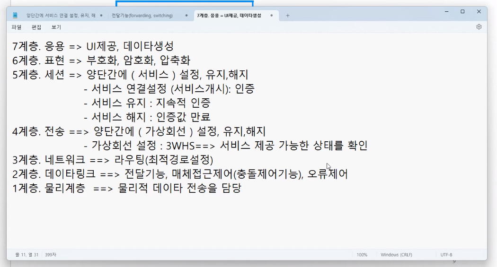

# DAY1 복습

### Broadcast IP/MAC address

* Local: 255.255.255.255 / FF.FF.FF.FF
* Direct: 192.168.1.255 / 

### 멀티캐스트 ip / mac

* IP: 224-239로 시작
* MAC: 0100.5E

### DNS 기능

* 정방향 조회(lookup): 문자주소 -> IP 주소
* 역방향 조회(lookup): IP 주소 -> 문자주소 

### ARP 기능

* IP 주소 -> MAC 주소

### 게이트웨이 기능

* 망과 망을 연결시켜주는 장비
    * 라우터, 멀티레이어 스위치, 게이트웨이 라고 나오는 장비도 있음
    * 방화벽 -> 4계층 이상이 사용

### 빈칸 문제 6번

1. hub 
    * 1계층
    * 경로DB 없음
    * 전송방법: 무조건 플러딩
2. Switch
    * 2계층
    * 경로 DB 있음
        * MAC -> 포트번호 구성
        * 전송방법
            * 경로 DB에 목적지가 있으면 포워딩
            * 없으면 플러딩
3. Router
    * 3계층
    * 경로 DB 있음
        * 라우팅 테이블, IP -> MAC
    * 전송방법: forwarding만 사용

### 빈칸 문제 7번

1. dns 이용하여 수신지 IP 조회
    * dns 캐시조회
    * hosts
    * dns서버 조회
2. 서브넷 마스크 이용하여 내부망 외부망 확인
3. 게이트웨이 맥 주소 조회
    * 망이 바뀌어도 ARP는 계속 사용
4. Media Translation 방법으로 전송

# OSI 7 참조모델

## Open System Interconnection 7
* Open System: 개방형 시스템 -> 원격접속이 가능하게 해 놓은 시스템
    * Lan 카드 꽂고, Cable 꽂고
    * Close System: 폐쇄망 -> 보안을 위해 원격접속을 막아놓음
* Interconnection: Open Sytem 간의 상호 연결을 위한
* 7: 통신할때 필요한 7개의 모델

## 7 모델
* OSI 7 Layer 암기해야 함!
    * 아파서탈났다피
    * Application, Presentation, Session, Transport, Network, Data Link, Physical
### 상위 3계층 (Application, Presentaion, Session)
위에서 밑으로 내려감, 소프트웨어   
* 개발자, DB관리자, 데이터 관리 -> 상위 3계층 담당
    * Session 구간 -> 인증서 구간
### 하위 3계층 (Physical, Data Link, Network)
밑에서 위로 올라감, 하드웨어
* 인프라 담당자가 담당
* 상위 4계층, 하위 4계층도 있음
### 중계 계층 (Transport)
* Middleware 기능
* 서버 개발자는 5,4,3 구간 담당
    * 인증서와 네트워크 둘 다 알아야 함

## Application
UI를 통해 데이터가 생성되는 구간
* User Interface
* HTTP, FTP, 메일서비스 등 우리가 보통 쓰는 건 다 7계층의 것

## Presentation
7계층에서 생성한 데이터를 처리
* Encoding
    * 이진화 시키는 작업
        * 안녕하세요 -> 이진수
    * 대표적인 규약: ASCII, UNICODE, BCD
* Compression
    * 압축 작업, 이미지 파일같이 크기가 큰 경우
* Encryption
    * 암호화 작업, 중요한 데이터인 경우

## 4계층: Transport
END to END 사이에 가상회선 설정, 유지, 해지 해줌
* 받으려는 서비스가 운영되고 있는지 확인하는 작업
* END point -> 스위치 아래의 PC
    * 가상회선 설정 -> 세션 수립(연결 설정 되었다!, TCP 3 way hand shake)
        * 서버가 활성화, 서비스도 활성화
* 대표적인 통신 규약: TCP
    * 3 way hand shaking
        * 서비스를 받을 수 있는 상태인지 확인
* 5계층과 비슷함
    * 대출을 받으려면 은행이 열려있는지 확인
        * Transport 구간
    * 신용조회를 해야하는데 그거는 Session 구간

### Stateless
http의 가장 큰 특징, 전의 정보를 잊어버림
* 계좌이체를 한다고 하면
    * 페이지가 변환 될때마다 id, pw를 요구함 -> 불편함
    * 이것을 5계층인 Session 계층이 이를 해결해줌
        * 3 WHS를 하면 client는 Session 값을 받음
        * client는 페이지가 바뀔 때마다 Session 값으로 인증함
        * Session이 10분이면 10분 후에 로그아웃 됨

## 5계층: Session
양단간의 서비스 연결 설정, 유지 해지  
* 서비스 연결 설정: 인증
* 서비스 유지: 지속적 인증
    * 지속적 인증: 은행에 전화를 할 때 처음에 전화한 사람이 계속 그사람인지 인증
* 서비스 해지: 인증값 만료
* 예: SSL -> 대표적인 5계층 통신 규약

### 4계층 5계층 차이
* 4계층 -> 단순히 서비스를 이용 가능한지 확인 (general)
* 5계층 -> 서비스가 너한테 제공할 수 있는지 확인 (specific)

## 3계층: Network
최적 경로 찾는게 핵심 (Routing)

## 2계층: Data Link
* 전달 기능이 핵심 (forwarding, Switching)
* 매체 접근 제어가 핵심 (mac, media access control)
    * Lan 구간 (허브 스위치만으로 데이터 전송이 가능한 구간)
        * 다수의 피시들이 같은 장비를 이용해서 통신이 가능한 구간
        * 장비 공유가 핵심 -> 같은 구간에 있다는 것
        * 충돌이 일어나게 됨(재전송) -> 전송 지연이 발생
        * 그래서 나온게 (공유) 매체 접근 제어 기술
            * 공유하는 장비의 사용 순서를 정함
        * 한마디로 장비를 공유해서 순서를 제어하는 기능이 필요한 거임
* 오류 제어
    * 수신 데이터의 이상유무 체크, 무결성 점검
* 2계층은 LLC와 MAC으로 나눌 수도 있음 

## 1계층: Physical
전기적, 기계적, 기능적, 절차적인 수단 제공
* 즉 실제로 데이터를 전송하는 층

### 계층 정리

## 계층 간 수직관계
기본적으로 상위 계층은 하위 계층의 기능을 다 가지고 있음
* 라우터는 스위치로 사용하는 경우가 있음
    * 3계층 장비는 2계층 장비로 사용할 수 있음
* 컴퓨터는 7계층 장비
    * 7개의 기능을 다 가지고 있음
* 게이트웨이 장비
    * 라우터(3계층), 게이트웨이(방화벽, 4계층)
        * 게이트웨이(방화벽)는 3계층 기능도 가지고 있는 거임

## Payload & Encapsulation
* 7계층에서 데이터 생성
* 원본데이터를 전송하기 위해 제어정보 부착
    * header -> 원본데이터 앞에 붙는 제어 정보
    * trailer -> 원본데이터 뒤에 붙는 제어 정보
* 캡슐화: 제어정보를 부착하는 행위
    * 역캡슐화: 제어정보를 제거하는 것
* 4계층
    * tcp 헤더
    * 송,수신 port 번호가 부착됨
* 3계층
    * ip 헤더
    * 송 수신 ip가 부착 됨
* 2계층
    * 송수신 mac address와 오류 검출 코드가 들어감
    * CRC 코드는 뒤에 Trailer로 부착됨

## Encapsulation (캡슐화)
* 송신자측
* 제어정보 붙임

## 역캡슐화
* 수신자측
* 하위계층에서 상위계층으로 올라감
* 제어정보를 점검 후 제거
    * 내것이 아니면 폐기 -> 게이트웨이같이

## 스위치와 라우터
* 라우터는 경로를 선택하는 기능
    * 여러 경로가 연결되어 있으면 (갈림길) -> 라우터
* 길이 하나밖에 없으면 -> 스위치

### 중계장비의 계층이 낮은 이유
* 중계정비는 L1 - L3 장비가 많음
    * 7계층 장비는 전송 지연이 있음
    * 이론상으로는 7계층 장비를 중계장비(라우터, 스위치)로 설정 가능 
* 클라이언트에 가까운 쪽은 L4 - L7 장비가 많음!

# TCP/IP 통신 모델

* OSI Model은 말그대로 참조 모델임
    * 현업의 모델은 TCP/IP
* 미 국방성에서 만듬
    * 비 상업적 통신모델 -> 기업들의 독점 방지
* 4개의 계층
    1. Application -> osi 7, 6, 5 계층을 가짐
        * 웹 브라우저가 관리
    2. Transport
        * 운영체제가 관리
    3. Internet -> 3계층인 network 계층
        * 운영체제
    4. Network Access -> 1,2 계층
        * 랜카드가 관리

## TCP/IP Protocol Stack
* Application Layer
    * TCP 계열 서비스
        * FTP, SSH, Telnet, HTTP, HTTPS, DNS
    * UDP 게열 서비스
        * DNS, TFTP, SNMP
* Network Layer
    * 대표적인 프로토콜은 IP
    * ARP
        * TCP/IP 에서는 3계층으로 봄
        * 2계층으로 보는 경우도 있음
            * mac 주소를 다루니깐
    * RARP, ICMP, IGMP

## Wireshark
* 스니핑: 도청
* 스니퍼(Sniffer): 도청프로그램 -> 와이어샤크!
    * 패킷 수집 + 패킷 분석 기능

### 무차별 모드 (Promiscuous Mode)
* L2계층과 L3 계층의 주소 필터링을 해제한 모드
    * 패킷 drop 하는 기능을 해제
* 관제를 하려면 랜카드에서 Promiscuous Mode를 전환해줘야 함
    * 윈도우 winpcap /npcap 설치해야 함
    * 유닉스는 ifconfig eth0 promisc로 설정

### 허브 환경에서 스니핑 방법
허브를 통해 전송되는 트래픽은 flooding으로 전송
    * 연결된 모든 포트를 통과
    * 허브는 관제 창(Visibility Window) 를 넓혀 줌
        * 보안적으로 좋지 않음

### 스위치 환경에서 스니핑 방법
* 스위치를 설치한지 1달이 되었다 가정함
    * Mac Address Table이 꽉 참! 
* 스위치 환경은 관제범위가 좁음

## 패킷 수집, 패킷 분석

* Wireshark으로 수집하면 수집률이 낮아짐
    * 분석용으로만 사용
* 수집은 CUI 방식으로
    * TShark과 TCPdump 사용
* 와이어샤크를 이용한 네트워크 공격 패킷 분석 -> 관제 룰을 만듦 (관제팀)
    * 이를 기준으로 대응 정책을 만듦 (CERT 팀)  

### TCP/IP Protocol Stack

* http 패킷
    * 4가지 헤더가 붙여짐: tcp, ip, ethernet 헤더
* apr 패킷
    * ethernet 헤더가 붙여짐
* 와이어샼에서 해당 패킷을 클릭하면 헤더를 보임

### 암호화 프로토콜

* HTTP
    * WC와 WS사이에서 평문의 웹문서를 송수신해주는 프로토콜
* HTTPS
    * Apache + SSL(인증서)
    * 인증서 기반의 암호화
* SHTTP
    * Apache + SSH
    * 키 기반의 암호화
* FTP
    * 평문의 파일 전송
* FTPS
    * 암호화된 파일 전송 (FTP + SSL)
    * 암호화된 파일 전송 (FTP + SSH)
* TFTP
    * UDP 기반의 파일 전송 

* Telnet
    * 평문 기반의 원격접속
* ssh
    * 암호화 기반의 원격접속 (Telnet + key)
* smtp
    * 메일 송신
* pop3, imap
    * 메일 수신 프로토콜
* sntp
    * 네트워크 관리 프로토콜
* 네트워크 트래픽 분석(동적) -> 와이어샤크
* 로그 분석(정적) -> splunk

## TCP, UDP 특징

* TCP: 연결성, 신뢰성, 느림
    * FTP -> 100메가 중 99메가만 전송 -> 실패
* UDP: 비연결성, 비신뢰성, 빠름
    * TFTP -> 100메가 중 1메가만 전송 -> 성공
* http -> tcp를 사용
    * 정보전달 시 왜곡이 일어나지 않기 위해

## TCP Header
* tcp의 작업
    * 데이터 전송 전
    * 데이터 전송 중
    * 데이터 전송 완료 후
* TCP Header만으로도 전송이 가능함
    * 7계층에서 만든 데이터가 없음
        * payload or Body가 없어도 된다!
* TCP 헤더의 기본은 20바이트
    * Option은 40바이트 추가 가능
    * 이외에도 백그라운드 트래픽들이 더 많음

## IP Header
* 20 바이트 헤더

### 패킷의 정의!
* TCP 패킷 -> 2,3 계층이 다 있어야
* ARP 패킷 -> 1계층이 있어야 함
* DNS 패킷 -> udp, ip, ethernet 패킷이 있어야 함