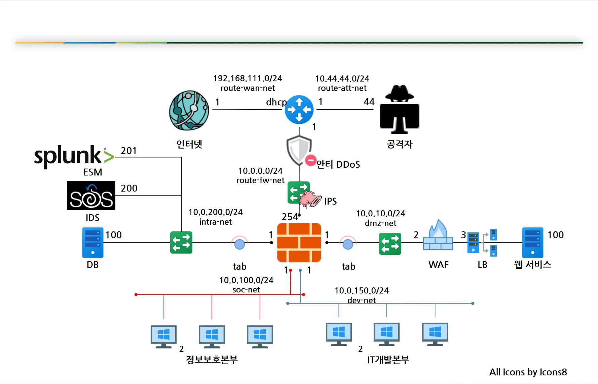
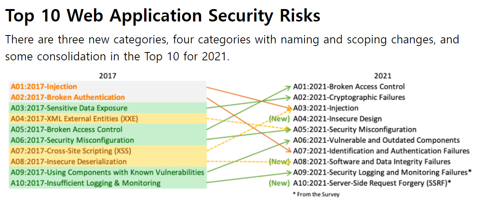

# 모의해킹 업무 이해

1. 웹 해킹
   * 루키즈에서 할 것
   * 블랙박스 -> IP, 도메인 정보 만으로 해킹하는 것
2. 모바일 해킹
3. 시큐어 코딩
   * (Java, C/C++, Python)을 시큐어하게 코딩하는 것
   * 화이트박스 -> 소스코드 안에서의 취약점을 찾는 것
     * 개발자들에게 코드의 취약점을 가이드 하는 것
4. 리버싱 분석
   * 악성코드, 시스템 해킹
   * 역공학분석 -> 갖추어진 시스템을 역으로 분석하는 것
     * 예: 게임 해킹,
5. 자동차, iot 해킹

### 환경세팅

* 공격자: Kali Linux
* 희생자: MSFV2, beebox

## 칼리 리눅스

* 데비안 계열
* 보안 진단 도구 (해킹도구)
  * 리눅스 + 많은 진단 도구 포함된 배포판
  * 도구들 -> 파이썬 기반이 많음
    * 윈도우에서는 파이썬 환경 구성을 해야 하는데
    * 칼리에서는 python, perl, ruby, c++등 환경이 이미 구성되어 있음
* 국내에서 무선 AP를 사용하기 시작하면서 도입되기 시작

## 모의침투

* 모의침투 = Pentest = Penetration Test
  * 검색을 할때는 Pentest로 검색하자!
  * 모의해킹은 한국 자료가 많이 나옴
    * 강사님의 보안 프로젝트가 많이 나옴

## 정보 수집 및 모의해킹 방법론

1. 정보수집단계

   대상들의 정보를 최대한 수집
2. 취약점 분석 단계

   수집 정보 중에서 취약한 것들이 뭐가 있을지 분석

   * 예: 아파치 서버가 설치된 PC -> 아파치 서버의 취약점 조사
3. 웹 애플리케이션 취약점

   Active 공격, OWASP 항목
4. 데이터베이스 진단

   중요 접속정보, 접근제어, 암호화 여부

   * 패스워드 크랙 -> 중요정보 탈취
5. 리버스 엔지니어링
6. Exploit 공격 코드

   https://www.explot-db.com 사이트에서 공격 코드를 참고
7. Sniff & Spoofing
8. Post Exploit

   침투를 하고 난 후에 추가적으로 공격하는 것
9. Forensics

   사이버 수사 시 정보를 수집하기 위함, 공격자 입장에서 쓸 수도 있음

   * 둘이 목적이 다름. 공격자는 공격을 위한 정보를 수집하는 것

### 스니핑 스푸핑 차이

* 스니핑: 허브
  * 허브는 브로드캐스트 방식임
    * 따라서 중간에 통신을 가로쳐서 스니핑을 하기 쉬움
* 스푸핑: 스위치
  * 스위치는 유니캐스트 방식임
    * 따라서 중간에 통신을 가로치기 힘듦
  * MAC 주소를 변조해서 중간에 통신을 가로채야 함
    * GW <--> 공격 <--> 사용자
      * 이런식으로 공격자가 중간에서 통신을 가로챌 수 있음
    * 모바일, IPTV <--> 공유기(무선AP) <--> GW
      * 중간의 공유기 즉, 무선 AP가 탈취되면 스푸핑 공격을 당할 수 있음
        * 무선 AP의 스푸핑을 막기 위해서 Kali Linux가 국내에 도입됨

### 해킹 과정



* 우선 DMZ에 위치한 웹 서비스를 먼저 공격함
  * DB, 업무PC등을 해킹하기 위함

### OWSAP

* Open Web Application Project
* 비영리단체
* 다양한 웹 취약점 방법론, 프로세스, 가이드 제공
* 모바일, IOT, 시큐어코딩 등 가이드 제공

### OSWAP Top 10 웹 보안 위협 (2021기준)



https://owasp.org/www-project-top-ten/

1. Broken Accees Control: 접근 제어 미흡
2. Cryptographic Failures: 암호화 실패
3. Injection: 입력값 검증 미흡

   * CWE: 보안약점
   * CVE: 취약점
4. Insecure Design: 웹 서비스 기획, 설계 단계부터 보안을 고려하는 것
5. Security Misconfiguration: 보안 설정 미흡
6. Vulnerable and Outdated Components:  오래되어 취약한 컴포넌트

   * 제로보드, 온보드 같은 오래된 외부 것을 사용할 때
7. Identification and Authentication Failures: 인가, 인증 실패

   * 실제로 중요한 위험임, 하지만 뒤로 순위가 밀림..
8. Software and Data Integrity Failures: 무결성 검증 실패
9. Security Logging and Monitoring Failures: 로깅, 모니터링 실패

   * ESM 통합 로그에 수집 됨
10. Server Side Request Forgery (SSRP): 서버 측 요청 위조

    * 강사님 의견은 중요도가 낮다고 함

### 국내 보안 가이드

* KISA
  * 지식플랫폼 -> 법령 -> 가이드라인
* krcert
  * 개인정보침해신고
* "주요 정보통신기반시설 기술적 취약점 분석 평가 방법 상세가이드"
  * 주요 정보통신기반시설 -> 국가 중요시설
  * 사실 SK 쉴더스에서 만든 거임
* SK 쉴더스 보안 가이드

### ping

ICMP 프로토콜로 송신지로 통신이 되는지 확인하는 것

* 국내는 ICMP 프로토콜을 막는 편
  * google.com -> ICMP 프로토콜 허용
  * naver.com -> ICMP 프로토콜 허용 안함
    * ICMP Flooding을 막기 위함
      * XXX Flooding은 DDOS 공격을 말하기도 함
        * XXX: ICMP, IP 등

## DNS 네임서버

* nslookup: DNS 네임서버 확인

### DNS 수집 단계

1. pc에 있는 hosts 정보 확인

   * hosts 파일을 조작해서 피싱 사이트로 유도할 수 있음 (파밍 공격)
2. 하위 도메인 서버 (KT 도메인 서버, 구글 도메인 서버)
3. root 도메인 서버

### Fierce

sudo fierce --domain google.com

* 도메인의 하위 디렉토리를 볼 수 있음
* kali에서 확인 가능

# 정보 수집 단계

1. IP 정보, 도메인 정보 수집
2. (대상을 선택 후) 포트 정보 수집
3. 각 프로토콜 버전 정보 수집

## IP 정보, 도메인 정보 수집

* IP 정보
  * 도메인 매칭 여부 확인 목적
* 서브도메인 파악
  * fierce로 서브도메인 찾기
  * https://searchdns.netcraft.com/ 여기서도 찾을 수 있음
  * whois로 도메인 세부정보 파악

### 포트 점검

* sudo nmap 192.168.75.130 -p-
  * -p- 옵션은 전체 대상을 보여줌
  * 안붙이면 conf 파일에 정의된 것만 함
* sudo nmap -sV 192.168.75.130 -p-
  * -sV 옵션은 버전 정보까지 확인시켜줌
  * 버전 정보가 있으면 Expliot Database에서 더 찾기 쉬움
    * ftp -> 무슨 ftp? -> ProFTPD 1.3
      * 공격범위가 좁아짐
* searchsploit ProFTPD 1.3
  * Exploit DB를 콘솔상에서 찾을 수 있음
* locate linux/local/394.c
  * 리눅스에서 파일 찾는 명령어
    * 해당 경로에 포함된 파일을 찾음

## OSINT

* Open Source Intelligence의 약자
  * 공개적으로 사용 가능한 소스에서 수집된 인텔리전스
  * 인텔리전스: 특정 목적을 위해 수집되고, 분석 및 해석된 정보
* 대표적인 정보 수집 출처
  * 크리미널 아이피, 쇼단, 구글, 트위터
    * https://www.criminalip.io/
    * https://www.shodan.io/
* 열려 있는 포트 확인 가능
  * 외부에서 정기적으로 포트스캔을 함
* 버전 정보도 확인 가능
  * 해당 버전 정보의 취약점 확인 가능
* 배너 정보도 확인 가능
  * 포트에 접근 했을때의 인삿말
    * 인삿말에 중요 정보가 있을 수 있음
* 보안관제의 업무를 어느정도 커버함
  * 고객사에 직접 NMAP으로 스캔하는 것보다 OSINT를 이용
    * 포트스캔하는데 너무 오래걸리므로 이것을 이용함
  * 유료서비스를 이용하면?
    * 내 서비스의 보안 취약점을 알려줌
* ICS
  * 특정 산업만의 프로토콜 취약점 조회 가능
    * 자기 회사만의 http 프로토콜이라고 생각하면 됨
    * 물론 http 프로토콜보단 훨씬 간단함

## 구글 해킹 (googledork)

* 구글의 검색 옵션을 악의적인 목적을 이용하는 것

  * 구글 해킹이 가능하다는 것은 접근 제어 + 인증 처리 미흡 떄문
* INTITLE

  * intitle:대시보드
  * 유출된 대시보드 URL들을 볼 수 있음
* INURL

  * site:naver.com inurl:admin
  * url에 admin이 들어간 것을 검색
    * 어드민 사이트가 나올 수도 있음
* FILETYPE

  * inurl:admin filetype:xls
    * 사이트를 특정하지 않으므로 많이 나옴
    * 피싱 사이트일 수도 있으므로 함부러 클릭 X
  * 관리자 페이지에서 xls 파일을 찾을 수 있음
    * 이는 민감한 개인정보일 수 있음
* INTEXT

  * site:naver.com inurl:admin intext:password
    * 관리자 페이지에서 입력된 로그인 정보를 찾고 싶다

### GHDB (Google Hacking Database)

* 구글 해킹 취약점을 확인하는 사이트
  * https://www.exploit-db.com/google-hacking-database
* 취약점을 한 번 찾아보면
  * intitle:index of /etc/ssh
  * 파일 공유 서버가 외부에 공유되어 있는 경우
    * 파일 공유 서버는 index of 로 시작하며 랜더링 됨
    * 이를 방지하기 위해서는 서버 설정을 잘 해야 함
* 고객사에서 구글 해킹 취약점이 나온다?
  * 인증처리, 접근제어 처리
  * robots.txt 에다가 Disallow를 설정
  * 노출된 중요한 자료를 삭제 요청

### robot.txt

* 구글 해킹, 크롤링을 방어하기 위함
* Disallow:

  * 대상을 크롤링에서 제외
* Disallow를 한다 해도 크롤링을 할 수는 있음

  * 접근제어, 인증처리를 해야 함
* 모두 Disallow 하는 경우

  ```
  User-agent:* 
  Disallow: /
  ```

  * 이러면 구글엔진에 검색이 안되는 문제가 있다

### BeeBox robots.txt 취약점 체크

```
 User-agent: *
    Disallow: /admin/
    Disallow: /documents/
    Disallow: /images/
    Disallow: /passwords/
```

* robots.txt에 Disallow를 했지만 인증처리, 접근제어를 하지 않음
  * 따라서 robots.txt에 명시된 url이 노출된 것임. 여기에 접속할 수 있음
* Disallow: /admin/
  * 관리자 페이지 접근제어, 인증처리 미흡
* Disallow: /documents/
  * 서버 설정 미흡으로 버전 정보 노출
    * index of 파일 서버가 노출
      * PDF 파일이 있는데 중요도를 파악할 수 없음
        * 이는 담당자에게 문의
    * 서버 버전정보 유출
      * Apache/2.2.8 (Ubuntu) DAV/2 mod_fastcgi/2.4.6 PHP/5.2.4-2ubuntu5
      * 공격자 입장에서 더 손쉽게 공격 가능
* Disallow: /images/
  * 서버 설정 미흡으로 버전 정보 노출, index of 서버 설정 필요!
    * 아이콘 파일들이 파일 서버로 누출 됨
      * 중요하지 않아 보임 row 정도 수준의 취약점
* Disallow: /passwords/
  * 서버 설정 미흡으로 버전 정보 노출
  * index of 서버 설정 미흡으로 중요한 데이터베이스 연결 정보 노출
    * heroes.xml
      * 로그인 정보 누출
    * wp-config.bak
      * 워드프레스에서 사용하는 DB 접속 정보
        * 파일 이름으로 알 수 있음
    * web.config.bak
      * ASP.NET 서버 설정 파일
        * DB 인증 정보가 있음
          * Password

## Interent Archive

크롤링 사이트

* 특정 사이트의 연도별 아키이빙 기록이 있음
* https://archive.org/
