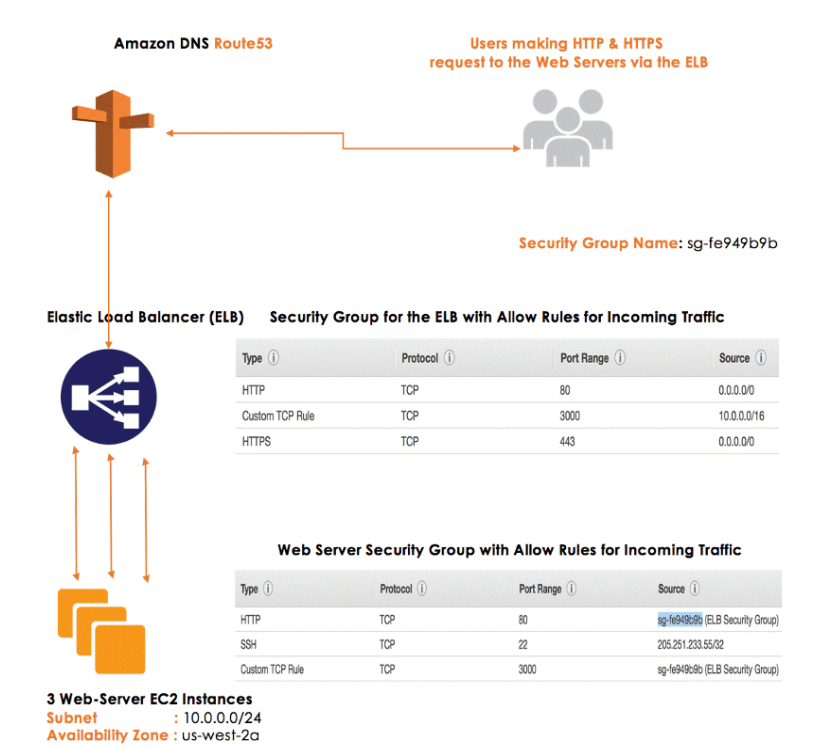
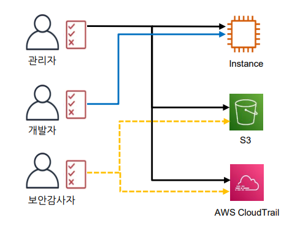
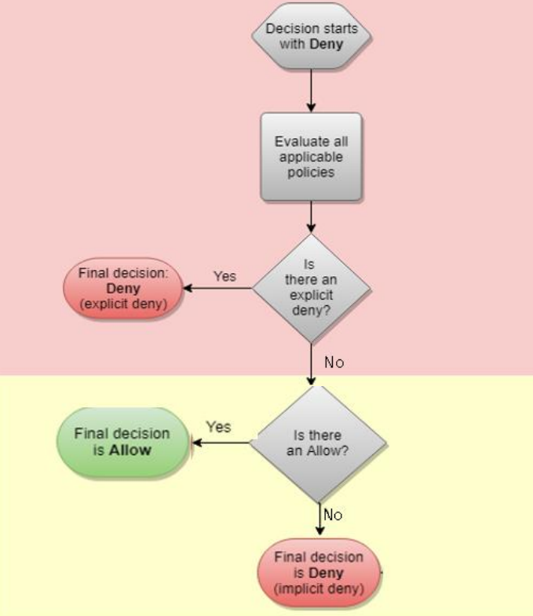

# 복습

### 클라우드 컴퓨팅 vs 온프레미스
* Internet, IT 리소스, On-demand, 종량 요금제
* 유연성
  
### EC2
* AMI: Linux, MacOS, Windows 3가지를 제공
* Instance Type 선정 가능
* User Data -> EC2 실행할 때 딱 한 번 실행되는 스크립트
* Key Pairs -> ssh를 위해
* EBS -> EC2가 사용하는 파일 시스템 볼륨
* 기본적으로 VPC가 제공하는 사설 네트워크에서 EC2를 배포

# VPC
* 사설 네트워크로 보안성을 제공
* 서브넷 -> VPC를 쪼갠 단위

### 퍼블릿 서브넷 경로설정
* 인터넷 게이트웨이 (IGW)
* 라우텡 테이블 (RT)
* RT에 IGW에 대한 항목을 넣고 Public Subnet에 연결
* 그러면 외부 인터넷에 연결 됨 
* Public IP도 있어야 인터넷과 연결 (Dynamic IP or Static IP)
* 그리고 Security Group 설정도 해야 함 (80, 443 포트 설정)
* NACL -> 네트웍 단위로 인바운드 아웃바운드 설정 -> 잘 안쓴다

### 프라이빗 서브넷
* NAT 게이트웨이 -> 외부 패치를 위해 아웃바운드를 열어야 할 때 필요
  * 즉 NAT 게이트웨이는 프라이빗 서브넷의 외부 인터넷 구간을 돕는 역할
* CIDR 주소 한 번 지정하고나면 바꿀수 없음
  * 프라이빗 IP 범위니깐 아끼지 말고 넉넉하게 CIDR를 잡자
  * VPC는 /16정도
  * VPC 안에는 /24 /22 정도

### 보안그룹 체인 다이어그램   

앞 tier의 시큐리티 그룹을 Source로 잡는 것
* 0.0.0.0/0 -> anywhere (누구나 다 받아들이겠다)
* sg-fe949b9b -> aws 3 tier 구조
  * aws 3 tier 구조: Web <--> App <--> DB
* 리소스 ID: 리소스를 구분하는 ID
  * 리소스: AWS 서비스를 만들어진 결과물
  * EC2 만듦 -> 해당 리소스의 ID 확인 가능
* Source에 앞단의 SG의 리소스 ID를 넣어 줌
  * 예: sg-yyy -> 앞단의 시큐리티 그룹인 yyy

### NACL
서브넷 레벨의 방화벽
  * 기본으로 인바운드, 아웃바운드 모두 허락

### 실습8
웹 브라우저를 통한 웹서버 접근
* 이번에는 UserData 생성
    ``` shell
    #!/bin/sh
    
    amazon-linux-extras install -y lamp-mariadb10.2-php7.2 php7.2 # php 서버 설정
    yum -y install httpd php-mbstring # httpd 설치
    echo "My home page Emma[myname]" >> /var/www/html/index.html # apache의 기본 index.html에 추가 
    chkconfig httpd on # 서버시작 시 자동실행
    systemctl start httpd # httpd 실행
    yum -y **update** # os 업데이트
    ```
* Security Group 변경하기
  * 인바운드 80, 443, 22 포트
  
## AMI
* EC2를 백업하기
* 서브넷에서 CIDR의 범위를 늘리려고 하면
  * CIDR를 늘린 서브넷을 새로 만들고
  * 기존의 EC2는 AMI를 떠서
  * 새로 만든 서브넷에 넣는다

### EIP (Elastic IP)
static 한 고정 IP
* EC2나 ENI에 연결

### ENI (Elastic Network Interface)
가상 네트워크 카드
* EC2에 여러 장의 네트워크 카드를 사용하려고
  * EC2에 여러 네트워크 장비 또는 요소들을 물리려고
* 용도
  1. Multi-hand
  2. 전용앱, 물리저장, 보안솔루션

# IAM

인증 및 권한 제어
* User, Group, Policy (권한 제어)
* 정책을 만들어서 User와 Group단위로 부여 가능

## root 사용자
* 이메일로 로그인한 AWS 계정
* 무한 권한 -> 뭐든지 만들고 뭐든지 삭제할 수 있음

## 정책
어떤 서비스 기능에 어떤 조작을 할수 있는지 정의
* JSON 형태로 표시
  ``` json
  {
    "Version": "2012-10-17",
    "Statement": {
    "Effect": ＂Deny",
    "Action": ＂ec2:*",
    "Resource": "*"
  }

  ```
  * Effect: Allow or Deny
  * Action: 서비스 특정 작업
  * Resource: 리소스 이름 (ARN -> 약속된 문법)
* 미리 만들어진 정책 사용도 가능

### 정책 예시
``` json
  {
    "Version": "2012-10-17",
    "Statement": {
    "Effect": "Allow",
    "Action": "s3:ListBucket",
    "Resource":
    "arn:aws:s3:::example_bucket"
  }
```
* s3에서 example_bucket(Resource)에 있는 리스트(Action:ListBucket)를 보는 것을 허용(Effect:Allow)
``` json
{
  "Version": "2012-10-17",
  "Statement": [
    {
      "Sid": "FullAccess",
      "Effect": "Allow",
      "Action": ["s3:*"],
      "Resource": ["*"]
    },
    {
      "Sid": "DenyCustomerBucket",
      "Action": ["s3:*"],
      "Effect": "Deny",
      "Resource": ["arn:aws:s3:::customer", "arn:aws:s3:::customer/*" ]
    }
  ]
}
```
* s3의 customer에 있는 모든 파일에 대해서 Deny를 하겠다

## 예시2 - Condtion
* Condtion -> 조건이 참일때만 정책을 적용하곘다
``` json
{
  "Version": "2012-10-17",
  "Statement": [
    {
      "Action": [
        "ec2:RunInstances",
        "ec2:StartInstances",
        "ec2:StopInstances",
        "ec2:RebootInstances"
      ],
      "Resource": "*",
      "Effect": "Allow",
      "Condition": {
        "StringEquals": {
          "ec2:Region": "us-east-2"
        }
      }
    }
  ]
}
```
* EC2를 Run, Start, Stop, Reboot하는 작업에 대해서
* region이 us-east-2일 때 모든 리소스에 대해 Allow 함

## 정책 충돌 우선순위
한쪽은 Allow 한쪽은 Deny 이면? -> 정책들의 우선순위 필요

1. Explicit Deny    
  명시적으로 effect:deny가 있으면 어떤 곳에 allow가 있어도 deny 함
2. Explict Allow   
  명시적 deny가 없으면 명시적 allow가 우선순위
3. implicit deny   
  명시적 allow도 없으면 암시적 deny가 우선순위

## IAM 실습 1
1. Iam User 생성
2. 원래 유저로 로그인하여, testuser에 정책 부여 (AmazonS3FullAccess)
3. S3 생성
임시 IAM 정보
* 접속 URL: https://538641553011.signin.aws.amazon.com/console
* User: testuserchaehyun01
* Password: abcd1234!!

## IAM 실습 2 - CLI 접근

1. ` aws configure `
2. ` aws s3 ls `
3. ` aws s3 ls s3://bucketname `
4. ` aws s3 cp s3://bucketname/object `
5. ` ls `

### IAM과 접근권한
* 다단계 인증 - MFA 권장
  * Multi Factor Authentication

### AWS CLI
* 참고: https://awscli.amazonaws.com/v2/documentation/api/latest/index.html
* CLI 사용 이유
* 빠르게 작업을 하기위해 사용
  * 스크립트로 작성하여 반복작업을 빠르게 할 수 있음
* 대부분의 작업은 CLI로 가능함

### IAM Role
역할(Role): 임시 권한 부여(위임), 정책을 부여하는 방법 중 하나
* User에게 임시 권한 필요시
* 서비스가 서비스를 액세스 할 때
* 자격 증명 연동

https://538641553011.signin.aws.amazon.com/console
testuserlch02
abcd1234!!