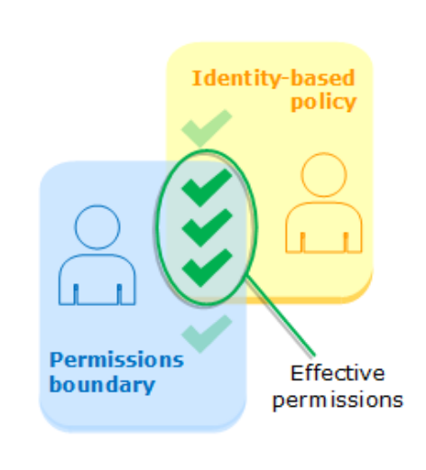
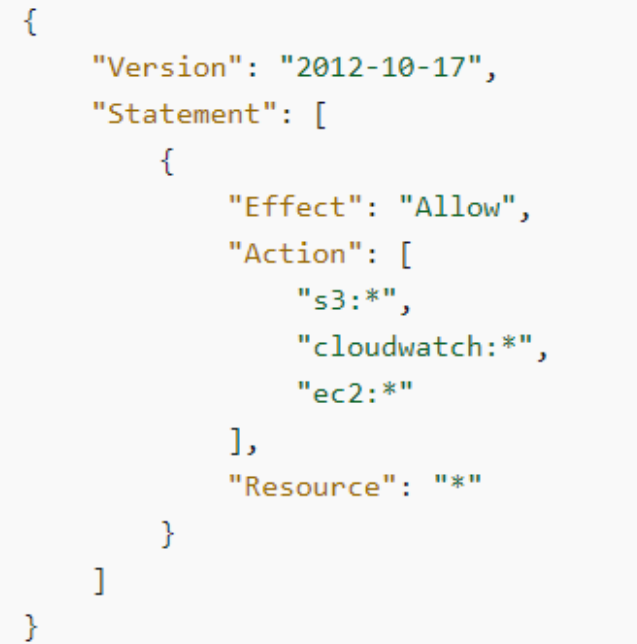
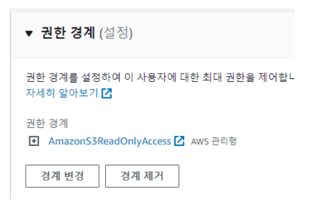
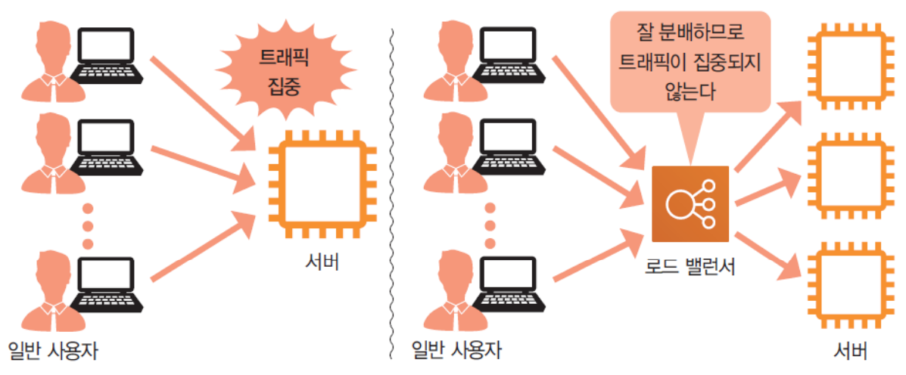
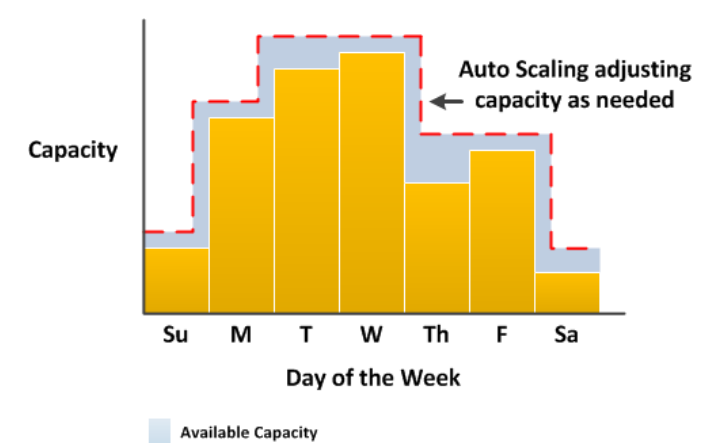
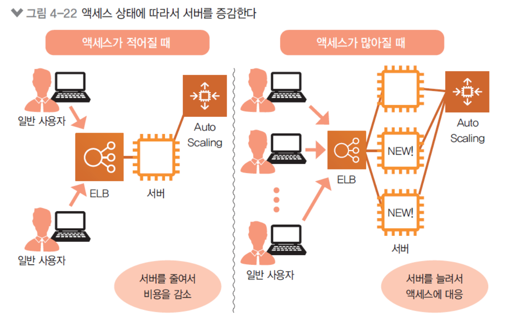
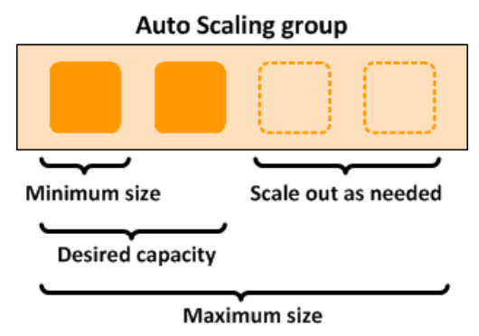
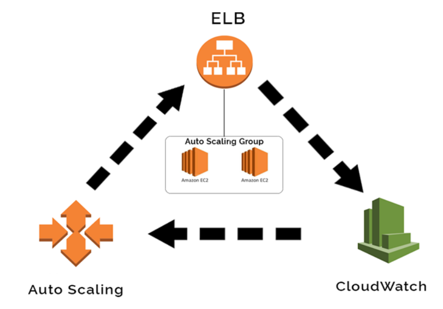

## 복습
* IAM: 인증 & 권한제어
* Root User: email, 무한권한
* User
* Policy: Allow/Deny, Json 형식, 평가 순서, 관리형/인라인, Effect Action Resource
* 정책 평가 순서: 명시적 Deny, 명시적 Allow, 암시적 Allow
* 정책 종류
  * 관리형 정책: 반복 부여 가능 (AWS/고객)
  * 인라인 정책: 1회성 -> 엔터티에 Envolve 되어 있음
* 콘솔 접근: username/password
* CLI/SDK 접근: Access Key ID/Secret Access Key
* 정책 적용 범위: Policy -> User, Role, Group 3가지밖에 없음

## AWS 서비스 접근 방식
* 사용자 중심 기반: IAM 정책
* 리소스 중심 기반: S3, Glacier, KMS, SQS

## Role
임시 권한 행사, TTL이 있음
* 서비스에 직접 정책 부여 할 수 없음 -> 이럴때 Role 사용
* 연동자격 증명에 사용 (Active directory)
* 권한 정책 -> 실제 작업 권한 정책?
* 신뢰 정책 -> 허락하는 정책
  * 누구에게 위임할 것이냐

## AWS IAM 역할
* 계정간의 접근

## AWS IAM 정책 권장 부여 가이드
1. root 사용 지양   
root의 Access Key 및 Secret Key 발급하지 않기
2. 관리형 정책 사용
3. 미사용 user, role, 정책 제거
4. 권한 위임은 Role 사용
5. MFA 설정

## 권한 경계 (Permission Boundary)

유저 혹은 역할에 부여할 수 있는 최대 권한을 설정
* IAM 정책과 권한 경계 모두에서 허용되는 작업만 수행하도록 허용
  * 두 개의 교집합(Effective Permissions)의 작업만 수행
* IAM에서의 권한의 최대 범위를 제한함

## 권한 경계 예시
* IAM 정책
    
* 권한 경계
    
* S3 Read만 가능함

## AWS CloudWatch
모니터링 서비스

## AWS CloudTrail
AWS 모든 이벤트 로그
* 누가 언제 무엇을 했는가 JSON 형태로 남음

## AWS Billing and Cost Management
* 청구서
* AWS Cost Explorer   
    청구 내역
* AWS Budgets   
    예산 설정

## Tagging
관리를 편하게 하기 위해 태그를 달 수 있음
* Tag 별 리소스 쿼리 가능
* Tag 별 권한 제어 가능
* 리소스 그룹 지정
  * Systems Management 할때 유용
  * 만약에 여러 EC2가 있을때 그룹으로 패치를 진행시킬 수 있다
* 비용 관리 용이

### Tag
리소스 구성의 위한 메타데이터 키페어
* 리소스 이름, 별명, 팀 구분 등을 위해 사용

### ELB (Elastic Load Balancing)

클라이언트 요청 트래픽들을 여러 대상들에게 자동 분산
* 한 EC2에 트래픽이 집중되지 않게 분산해줌
* Health Check을 통한 가용성을 높여줌

### ELB 장점
* 상태 확인을 통한 애플리케이션 고가용성
* HTTPS 지원
* 애플리케이션의 크기 자동 조정 지원

### ELB 종류
* ALB (Application Load Balancer)
  * L7 레이어 기반의 애플리케이션 컨텐츠 로드 분산
  * HTTP, HTTPS 기반
* NLB (Network Load Balancer)
  * L4 레이어의 IP, Port 기반 로드 분산
  * TCP, UDP 기반

## 오토 스케일링

수요에 맞춰서 자동으로 확장 또는 축소하는 기능
* ELB와 같이 쓰면 좋음 (ELB와는 별개임)
* 비용 절감 가능

### EC2 오토 스케일링
클라이언트 요청이 없으면 서버를 늘려주고, 많으면 늘려줌


### EC2 오토 스케일링 요소

* ASG(Auto Scaling Group)   
  * min: 최소 개수
  * desired: 처음 시작하는 사이즈
  * max: 최대 개수
* 오토 스케일링 정책
  * 20% 이하로 되면 2개 늘려 이런식의 정책
* 시작 템플릿 (launch template)
  * EC2를 만들때의 구성 요소 - AMI, 인스턴스 유형, 보안그룹, 키페어

### 수직확장 vs 수평확장
* Scale-up, Scale-down
Ec2 1개를 t2 -> t3로 업그레이드
* Scale-in, Scale-out
오토스케일링으로 EC2의 개수를 늘리는 것

## ELB, 오토 스케일링 & CloudWatch

* Auto Scaling: 클라이언트 수요에 맞춰서 Auto Scaling이 EC2를 늘리고 줄임
* cloudwatch: 클라이언트의 수요가 많아지는지 체크
* ELB: Auto

### 오토 스케일링 정책 - 수동   
운영 중에 늘려야 하면 수동으로 늘리는 것

### 오토 스케일링 정책 - 자동
* 예약된 일정에 맞춰서 EC2값 조정
* 초기값 유지 2:2:2 -> 2개로 고정
* 동적 조정정책 (CloudWatch와 같이 사용)
  * 단순 조정정책
    * cpu utilization 60% 1+
  * 단계 조정정책
    * 80% 2+, 60% 1+, 40% 1- 이런식으로
  * 대상추적 조정정책
    * Target을 정함 -> CPU가 60%이하 떨어지면 대상을 죽이기
* 예측기반

### 실습 10 설명

* ALB에서 한 번, Instance에서 한 번 SG를 달 수 있음
  * chain diagram 형식으로 ALB SG를 Instance SG의 Source로 사용
  * 실제로 ALB는 양쪽 Public subnet에 있다고 보면 됨
  * 클라이언트는 ALB의 url에 접속만 하면 알아서 ALB가 알아서 EC2로 분배함
* 앞단에 ALB를 놓으니깐 굳이 instance를 public subnet에 둘 필요 없음 -> private로 이동

### 실습 10
1. 기존 NW 환경 재사용
2. 보안그룹 생성: sgalb, sgweb
3. 대상그릅 생성 (오토스케일링 그룹)
4. 두개의 퍼블릿 서브넷에 ELB(ALB) 생성
5. 런치 템플릿 생성(시작 템플릿) - AMI, t2.micro, 보안그룹(sgweb)
6. autoscaling 그룹 설정 - 초기값 유지(2:2:2), ALB 대상 그룹으로 연동, ELB로 Health Check (ELB 상태 확인 켜기)
7. 대상 그룹 상태 확인 - Healthy 인지 확인
8. 웹서버 접속해보기
9. 확장 확인 - EC2 종료하면 2 -> 1, 초기값유지 정책이므로 다시 1 -> 2
10. 마무리 - ASB & ELB 삭제, 대상 그룹 삭제, AMI 등록 취소 & AMI 스냅샷 삭제, 실행 중 인스턴스 삭제

## 실습 10 다시해보기
* userdata
  ```
  #!/bin/sh
  amazon-linux-extras install -y lamp-mariadb10.2-php7.2 php7.2
  yum -y install httpd php-mbstring
  echo "My home page liam" >> /var/www/html/index.html
  chkconfig httpd on
  systemctl start httpd
  yum -y update
  ```

## S3 (Simple Storage Service)
객체기반 클라우드 스토리지 서비스
* 객체 -> 파일
* 파일 업로드와 다운로드 가능
* 도메인 네임 형태로 주소를 가짐   
` bucketname.s3.regioncode.amazonaws.com/img01.jpg ` 이런식의 주소

## 버킷 정책 예
``` json
{
  "Version": "2012-10-17",
  "Id": "Policy1713767923497",
  "Statement": [
    {
      "Sid": "Stmt1713767920754",
      "Effect": "Allow",
      "Principal": "*",
      "Action": "s3:*",
      "Resource": "arn:aws:s3:::emma0505/*"
    }
  ]
}
```