# PBL2

## 정책 설정
1. EC2의 모든 작업 허용하는 정책 
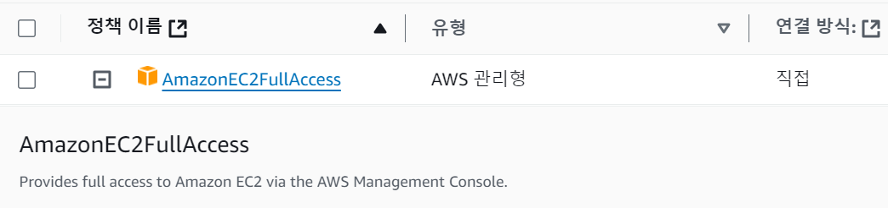
2. 파일 업로드가 가능한 인라인 정책 생성
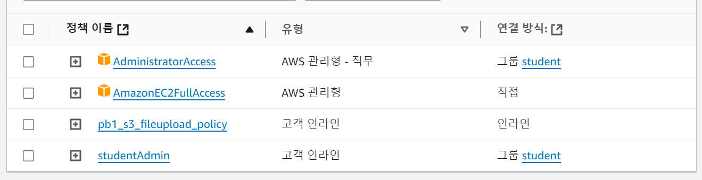
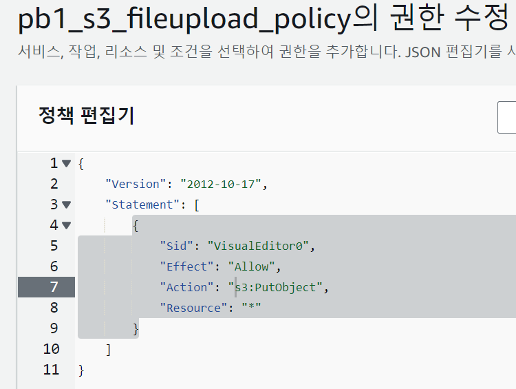

## 특정 인스턴스 생성
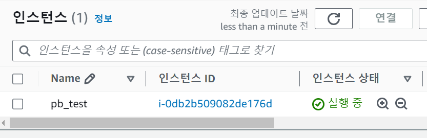

## 권한 경계용 정책 생성
인스턴스 stop, start 작업 허용
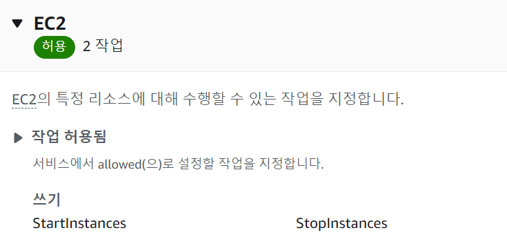

## 권한 경계용 정책 - 대상 리소스 지정   
생성한 인스턴스의 ARN 넣기
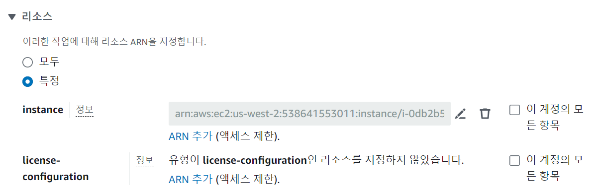

## 생성한 정책 JSON
``` json
{
    "Version": "2012-10-17",
    "Statement": [
        {
            "Sid": "VisualEditor0",
            "Effect": "Allow",
            "Action": [
                "ec2:StartInstances",
                "ec2:StopInstances"
            ],
            "Resource": "arn:aws:ec2:us-west-2:538641553011:instance/i-0db2b509082de176d"
        }
    ]
}
```

## IAM user에 해당 권한 경계 추가
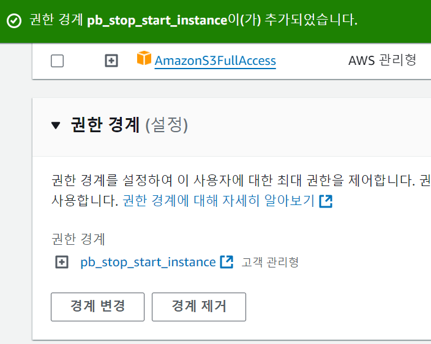

## 해당 IAM으로 로그인 후 인스턴스 목록 확인
인스턴스 목록을 볼 권한이 없음
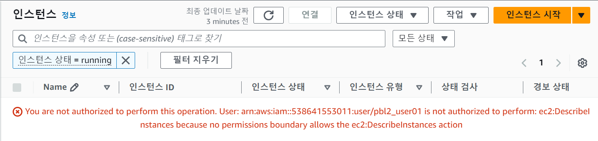

## 권한경계 정책에 ec2:DescribeInstances action 추가
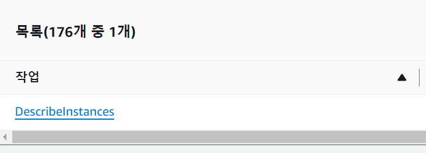
추가 후 인스턴스의 목록을 볼 수 있음
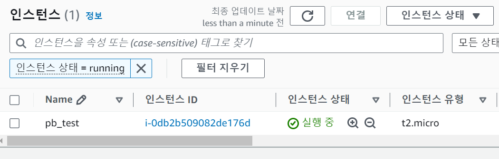

## 해당 인스턴스 중지해보기
중지 성공


## 새로운 인스턴스 pb_test2 생성
새로 만든 IAM에서 본 모습


## pb_test2 인스턴스 중지 실패
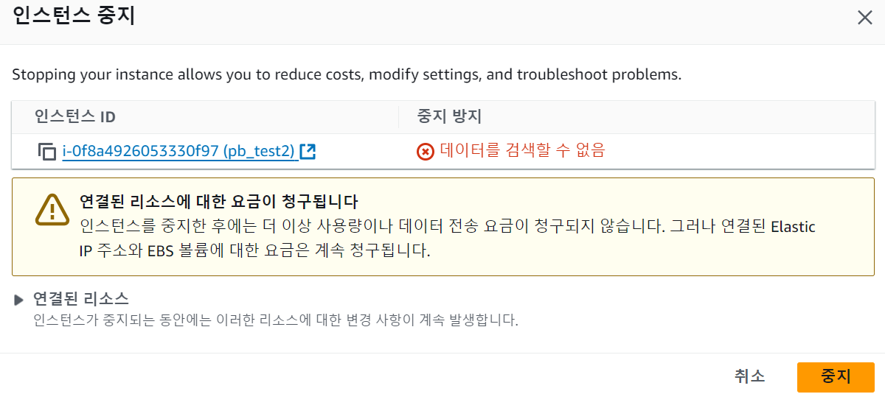
