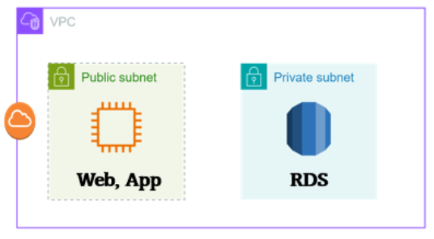

## 아키텍처 결합 해제 및 재설계

우선 Public subnet에 위치한 Web과 App이 1개의 인스턴스에 있을 필요가 없고 두 서비스로 분리하는 것이 좋아 보인다.   
Web이 하는 역할이 정확히 뭔지는 모르겠지만 단순 정적 웹사이트 호스팅을 하고 있자면 S3로 대체가 가능해보인다.
App이 하는 역할도 명확하지가 않는데 EC2를 사용 할 것이라고 판단이 된다.   
따라서 Web (S3), App (EC2), RDS 3가지로 분리가 가능하다. 