# 데이터 3법 이해

## 대한민국 법률체계
* 성문법
  * 헌법: 최상위 법
  * 법률: 국회의 의결을 거침
  * 명령: 시행령 -> 대통령령, 시행규칙 -> 부령, 총리령
  * 조례/규칙: 시도 조례, 시군구 조례
* 불문법
  * 관습법: 사회에서 인정되는 일정한 관습
    * 도덕적 요소 -> 노인에 대한 공경 등 
  * 판례: 법원의 재판을 통해 형성됨
* 특별법 > 일반법
  * 특별법이 더 우선

## 법률 확인
* www.law.go.kr
* 국가법령정보센터 앱

## 정보보호/개인정보 관련 주요 법률체계
* 국가정보원 법
* 전자정부벛 및 하위 규정
* 국가정보화 기본법 및 하위 규정
* 정보통신기반 보호법 및 하위 규정
  * 지침도 있음
    * 과기부 소관 지침, 행안부 기반 지침
  * 주요정보통신기반시설 취약점 분석평가기준
* 항공 보안법
* 정보통신망법 및 하위 규정
* 클라우드 발전 법
* 개인정보 보호법 및 하위 규정
* 전자서명법 및 하위 규정
* 신용정보보호법

## 데이터 관련 법
주무부처가 개인정보보호위원회, 과학기술정보통신부, 행정안전부,
산업통상자원부, 금융위원회로 되어 있는 ‘데이터’ 관련 법이 무엇이 있는지 조사
* 데이터 3법
  * 개인정보 보호법
  * 신용정보의 이용 및 보호에 관한 법률
  * 정보통신망 이용촉진 및 정보보호 등에 관한 법률
  * 데이터 이용 산업 활성화
* 과기부
  * 데이터 산업진흥 및 이용촉진에 관한 기본법
* 행안부
  * 공공데이터 제공 및 이용 활성화 법률
* 산업통상자원부
  * DX 관련 법

## 연도별
* ~2018 공공 데이터 전략 위원회
* 2020 가명정보처리 가이드라인
* 2021
  * 4차위 데이터특위 -> 산학연
  * 마이데이터 데이터 표준화 추진체계
  * EU GDPR 적정성 결정
  * 데이터산업법 제정
* 2022

### 데이터 산업진흥 및 이용 촉진에 관한 기본법 (데이터산업법)
* 데이터에 관하여 다른 법률에 특별한 규정이 있는 경우 제외 이 법으로 따름

### 산업 디저털 전환법
개인정보 관련 사항은 `개인정보 보호법`을 따름

## 데이터 관련 법 제도 변화
1. 데이터 3법 개정
2. 데이터기반행정법 제정
3. 데이터산업법 제정   
법을 보호하는 것이 아닌 산업화를 위해 개방
4. 산업디지털전환법 제정

## 데이터 3법 개정 (개인정보보호법 중심)
1. 법률
2. 시행령
법이 나오고 각부처들이 실질적으로 시행해야 하는 것
3. 고시
국가기관이나 공공 영역은 지켜야 함, 민간영역은 X
1. 가이드
가이드를 중용하면 좋다는 것임, 안해도 처벌 X
* 비식별 조치 -> 가명정보 처리 

## 개인정보보호법 개정 배경
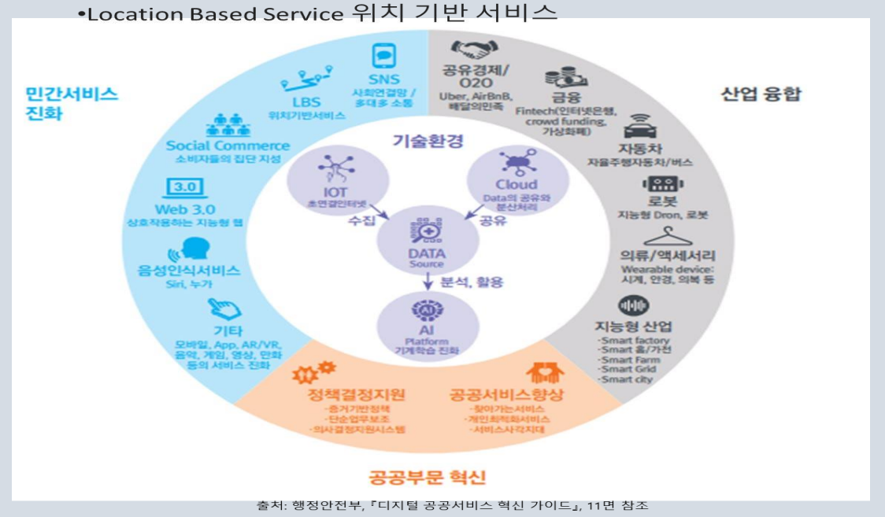
전 세계적인 디지털 대전환 추세에 부합하는 법이 필요!
* 개인정보를 처리 및 관리하는 환경 마련 필요
  * 금융 -> 마이데이터
  * 위치기반 서비스
  * 가상화폐, Web3.0
  * AI 기반 -> 자율주행

## 정부서비스 모델
* 전통적 가치사슬 모델
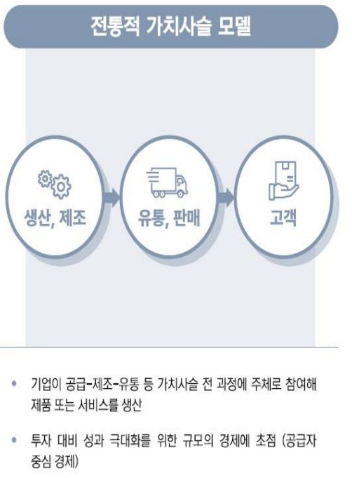
* 디지털 플랫폼 비즈니스 모델
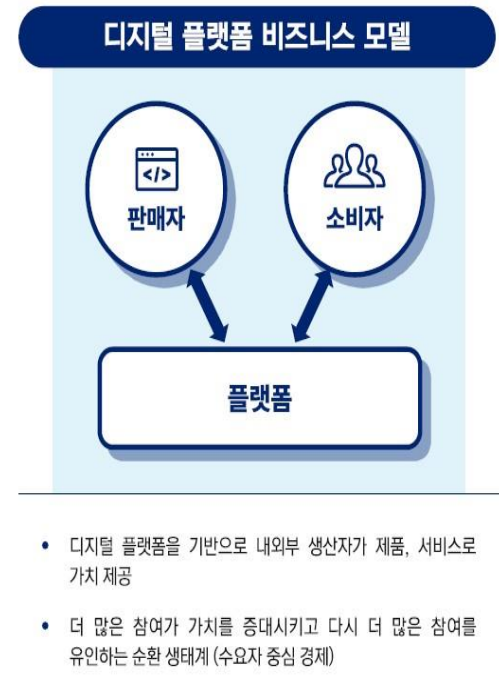

## 개인정보보호법 개정 배경
* 데이터 생태계 조성과 개인정보 보호
* 기본 원칙
  * 민관과 함께 성장하는 혁신생태계 조성
  * 공공 데이터를 네거티브 원칙 하에 디지털 방식으로 전면 개방
    * 네거티브 규제: 법률로 금지된 것이 아니면 모두 허용하겠다
  * 정부는 인공지능, 데이터 기반으로 정책결정을 과학화
  * 마이데이터 -> 데이터와 서비스의 민관 공유를 위한 개방형 표준

## 디지털 대전환과 웹 환경 변화
* Web 1.0: 게시, 관리, 전송
* Web 2.0: 참여, 공유, 개방
  * 개인정보 처리자 중심
* Web 3.0: 정보주체 중심 (가명/익명정보 활용, 마이데이터)

## 데이터 보호
* 데이터 저장: 데이터 저장시 보호/보안 (DB암호화, 접근제어/인증) 법정책 존재
* 데이터 전송: 데이터 전송시 보호/보안 (HTTPS/VPN등 채널 암호화) 관련 법정책 존재
* 데이터 사용/활용 -> 최근에 활성화됨
  * 데이터 분석/공유/결합 및 이용 시 데이터 보호
  * 데이터3법과 같이 데이터를 활용하는 법정책이 생김
    * 이전까지는 보호하는 법들이 많았음

## 개인정보보호법 개정 배경
* 20년도 사회조사 -> 국민 54.7%가 우리사회가 개인정보 유출에 불안하다고 응답
  * n번방 사건 -> 공무원 계정으로 피해자 신상정보 유출
  * 자원봉사자명단 유출, 송파 살인 사건 등

## 개인정보 침해의 개념
**개인정보 처리 전 과정**에서 발생, 법적 근거 없는 **개인정보 수집/이용/제공**, **개인정보 유출/오남용** 등을 모두 포괄

## 개인정보 보호법 목적
**개인정보 처리 및 보호에 관한 사항을 정함**으로써 `개인의 자유와 권리를 보호하고, 나아가 개인의 존업과 가치를 구현`
* 제정 목적: 자연인에 관한 기본권과 자유
* 일반법 -> 짧음, 특별법 -> 제목이 길다 (~~에 관한 법률)
* GDPR: 개인 정보의 처리와 이전에 관한 사항을 규정한 EU 규칙
* 개인정보자기결정권의 제한?

## 정보주체의 실질적 권리 보장 vs 개인정보 활용
* 정보주체와 개인정보를 활용하는 사람 사이의 이견이 있음

## 개인정보보호법 만든 목적
* 데이터 경제 성장 견인
  * 마이데이터
* 개인정보 신뢰사회 구축
* 글로벌 스탠다드 선도
  * 국외이전 요건 다양화

## 개인정보보호법 개정 주요사항
1. 개인정보 보호체계 일원화
2. 데이터 이용 활성화
   * 가명정보 도입
3. 개인정보처리자 책임성 강화

# 개인정보법 개정 주요 사항 (23.03.14)
* 사적 이용 제한

### 신기술 신산업 등 데이터 경제 성장 견인
  * 개인정보 전송요구권 신설
  * 이동형 영상정보처리기기 규정
  * 온오프라인 규제 일원화
    * 오프라인에서 종이로 적는 것도 온라인과 동일하게 규제

### 글로벌 스탠다드에 부합하는 법 제도 정비
* EU의 GDPR을 주로 근거
* 담당자에 대한 형벌 중심에서 경제적인 재재 중심으로 전환
  * 담당자만 처벌하면 됬었음

### 디지털 신대에 적합한 국민의 적극적 권리 강화
* 개인정보 처리요건 정비
* 개인정보 처리방침 평가제도입
  * 처리방침의 적정성 여부, 알기 쉽게 작성했는지 여부
* 자동화된 결정 대응권
* 개인정보 분쟁조정
* 사적 목적 이용 금지

### 개인정보 보호법 개정 사항
* 영상정보처리기기
    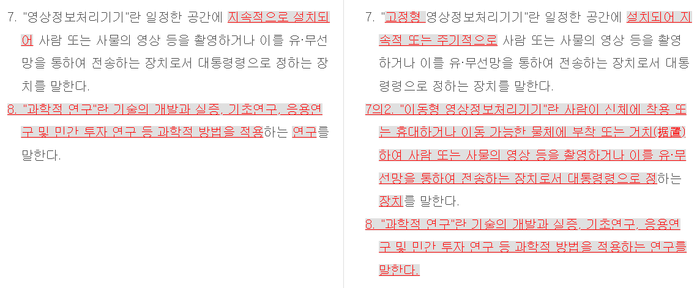
  * 이동형(드론)과 고정형을 분리
* 개인정보의 전송 요구권 (제35조의 2)
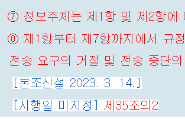
  * 시행 미지정
  * 기반이 잡힌 다음에 시행이 될 거 같음

### 시행일 (2024)
* 자동화된 결정에 대한 정보주체의 권리
* 개인정보관리 전문기관 등

## 개인정보보호위원회 격상
개인 정보 보호 관련 업무를 **개인정보보호위원회**로 통합 및 이관
* 원래는 행정안전부, 방송통신위원회, 개이넝보보호위원회가 분산

### 데이터 이용 활성화
* 개인정보의 이용/제공 범위 확대
* 가명정보의 이용/제공 범위 확대
  * 통계작성, 과학적 연구, 공익적 기록보존에 확대됨
  * 가명정보 결합에 대한 법정 근거 명시
  * 다른 기업간 **가명정보 결합은 전문기관에서 수행**
  * 결합 정보를 반출할 경우 가명 및 익명 조치
* 결합정보 반출 승인 기준
  * 결합 목적과 반출 정보가 관련성이 있을 것
  * 특정 개인이 알아볼 수 없을 것
  * 반출 정보에 대한 안전초치

### GDPR 적정성 결정 전후 비교
* 역외 이전 시 추가적 보호조치 불필요
* 준거 법률: GDPR, 개인정보보호법 -> 개인정보보호법 + 고시
* 감독기구 EU DPA + 개인정보보호위원회 -> 개인정보보호위원회
* 규제 준수 부담 낮아짐

## 가명정보의 정의
* 개인이 식별하 수 없도록 처리된 정보
* 가명처리된 정보는 개인정보처리자가 준수해야 할 요건 절차가 적용 X
* 가명처리된 정보가 다른 정보와 결합하여 특정 개인을 식별할 수 있으면 -> 개인정보로 취급

## 정보 정의
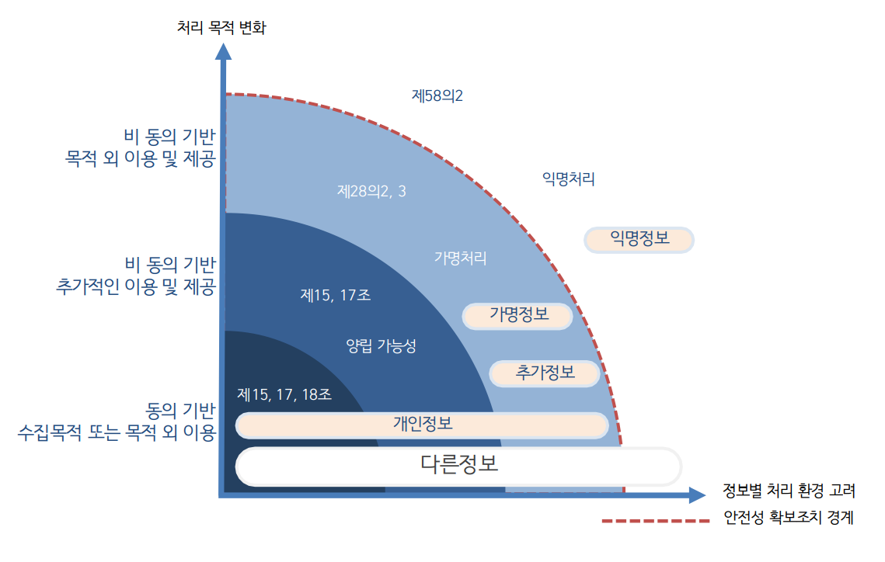
* 동의 기반 수집목적 또는 목적외 이용
  * 개인정보, 다른정보
* 비동의 기반 추가적인 이용 및 제공
  * 가명정보
* 비동의 기반 목적 외 이용 및 메공

## 개인정보 판단 기준
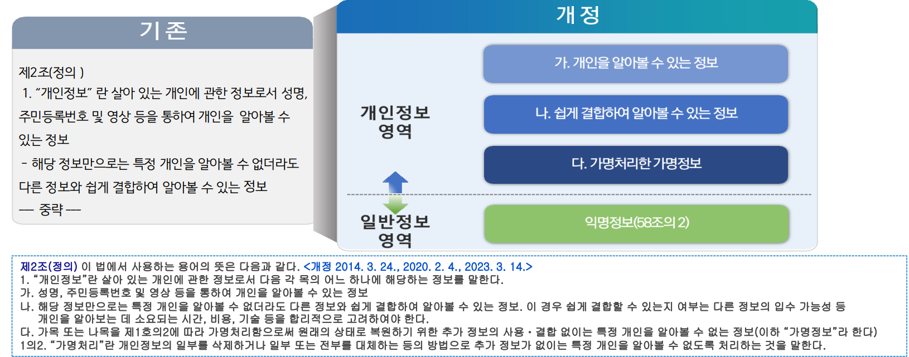
* 개인정보 판단 기준 -> 쉽게 결합하여 알 수 있는지 여부
* 익명정보 -> 일반정보로 분류

## 개인정보 가명정보 익명정보
* 잘못된 가명정보는 식별이 가능하다
  * 마산에 국회의원 -> 식별 가능
    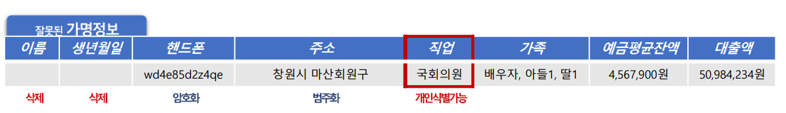
* 제대로된 가명정보 -> 직업 삭제
    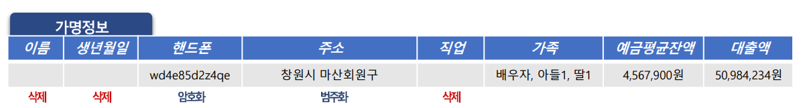
* 익명정보
    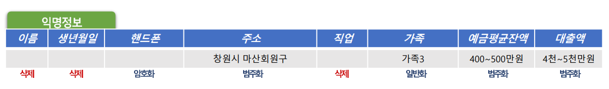
    * 범주화를 많이 한 것 (뭉틍그린 것) -> 금액 400만원으로 범주화
    * 통계 작성시 많이 활용

## 가명정보 vs 익명정보
* 취급자와 다른 정보에 의해 식별 가능성 존재
    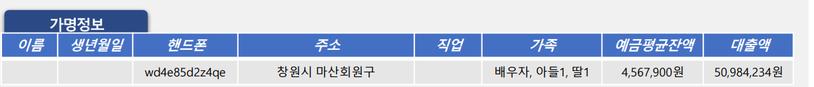
* 어떤  취급자와 다른 정보를 이용하더라도 식별 불가능
    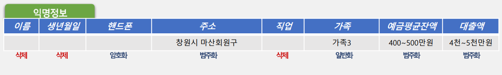

## 익명정보의 식별 가능성
* 통계에 의해서 개인정보가 유출될 수 있음
  * 특정할 수 있으면
* 빅데이터 개인정보 노출 사례
  * 유명인 개인정보 노출
  * 일론 머스크 비행기 경로 공개
* 익명정보도 어떻게 하면 재식별이 가능함

# 가명정보처리
* 가명정보 처리 목적   
통계작성, 과학적 연구 등 **정보주체의 동의 없이 가명 처리** 가능

## 가명정보처리 개정사항
* 가명정보 제공   
제 3자에게 제공하는 경우 **개인을 특정하는 정보**를 포함해서는 안됨
* 가명정보 결합
  * 서로 다른 개인정보처리자 간의 결합시 -> **전문기관을 통해서만** 결합 가능
* 개인정보의 파기 (개정 후 정보)
  * 가명정보의 처리 기간 경과 등 개인정보가 불필요하게 될 때는 파기해야 함
  * 다른 법령이 있을 떄는 파기하지 않음
* 가명정보에 대한 안전조치의무 (개정후)
  * 가명정보의 처리 기간을 별도로 정할 수 있음
  * 가명정보를 파기한 경우 파기한 날부터 3년 이상 보관해야 함
* 가명정보처리기 금지의무 등 (개정후)
  * 가명정보를 처리하는 자는 특정 개인을 알아내기 위해 가명정보를 처리하면 안됨
* 적용범위
  * 제20조의 이용 제공 내역통지, 제34조의 2는 적용범위에서 빠짐
  
## 개인정보 이용 및 활용 원칙 변화
* 전통적 활용
  * 마케팅 부서
    * 구매 이력, 패턴
  * 회계 부서
    * 결제
  * 등등
* 가명정보의 활용
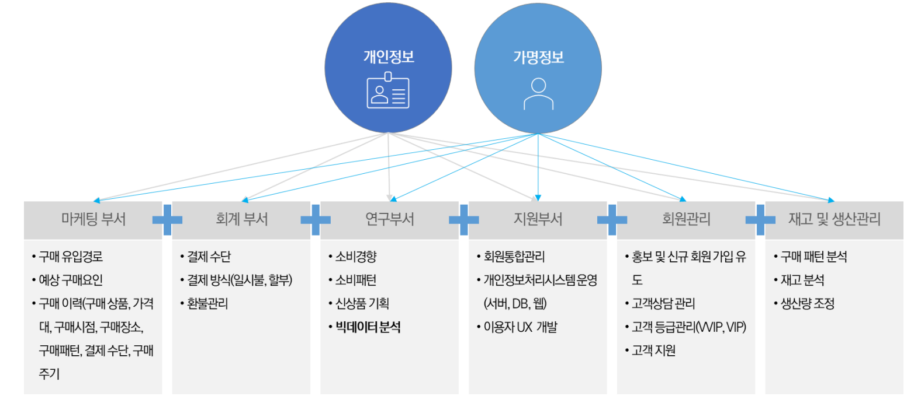
  * 가명처리만 하지 동일함
* 다른 산업군의 가명처리한 가명정보를 결합하여, 새로운 Insight 형성, 서비스 개발에 사용
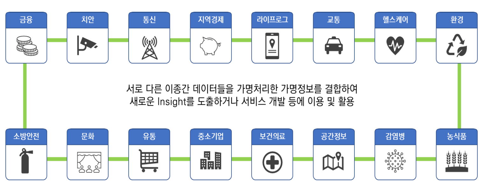

## 가명정보 활용 우수 사례
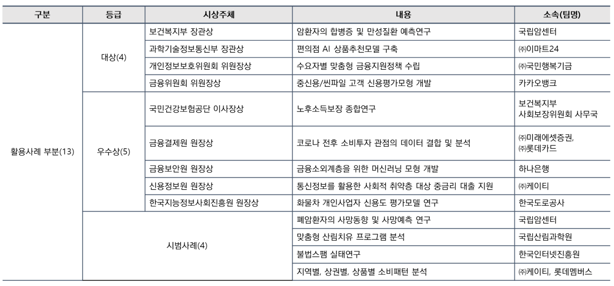

### 사례 - 노후소득보장 종합연구
여러 부처의 데이터를 결합해서   
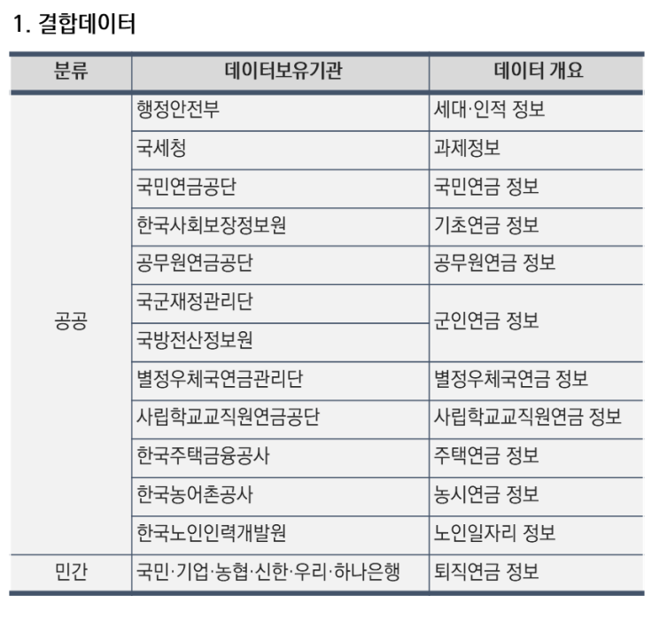
분석결과를 도출함   
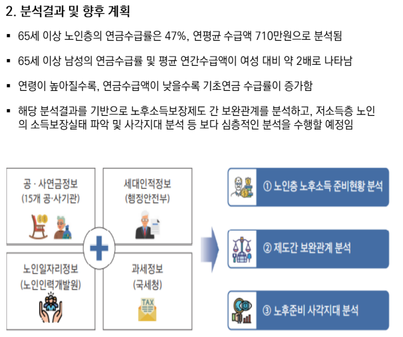

### 사례 - 친환경차 충전 최적입지 선정
성남시 정보 + 티맵모빌리티
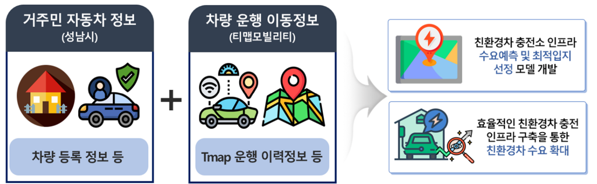

### 사례 - 폐암환자의 사망동향 및 사망예측 연구
접근이 어려운 개인정보 사례
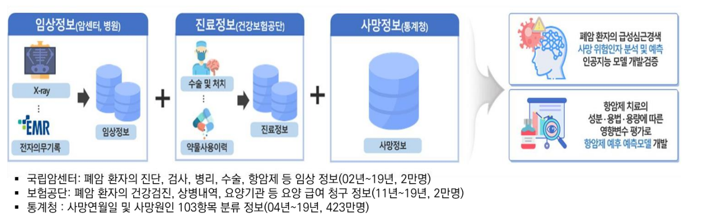

### 사례 - 비금융정보를 활용한 대안신용평가모형 개발
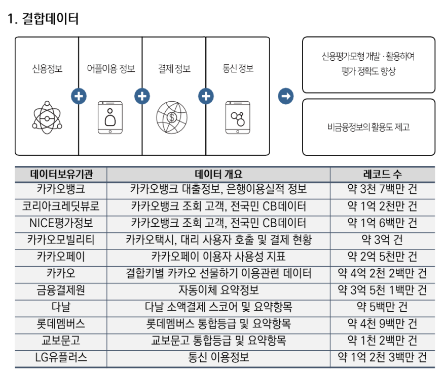

### 사례 - 게임 & 애니메이션 유저의 소비컨텐츠 분석을 통한 비즈니스 인사이트 생성

## 실습 - 자료조사
1. 가명정보 활용 사례 조사
2. 특정 기관의 개인정보 처리방침에서 가명정보 처리 기록 공개 확인
https://privacy.sktelecom.com/view.do?ctg=policy&name=policy
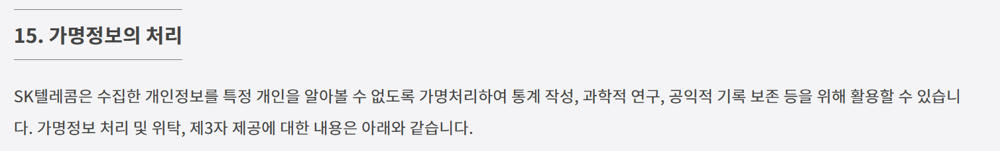
신한 카드가 인증을 하는 전문기관이겠음
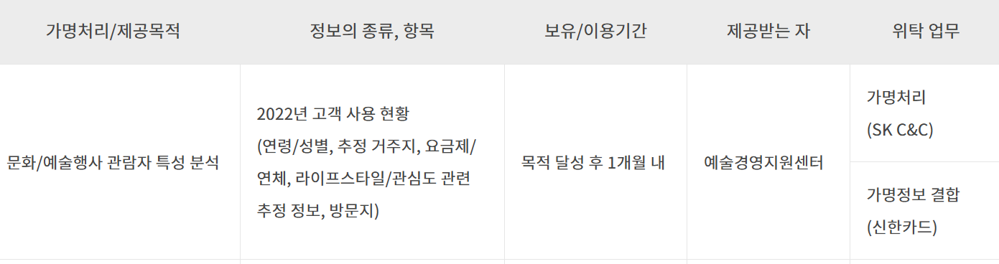
건강보험공단 개인정보처리방침
https://www.nhis.or.kr/nhis/etc/privacy_policy.do
SK와 비교해서 명확하게 적혀있지 않음 그리고 보유기간을 준영구로 함
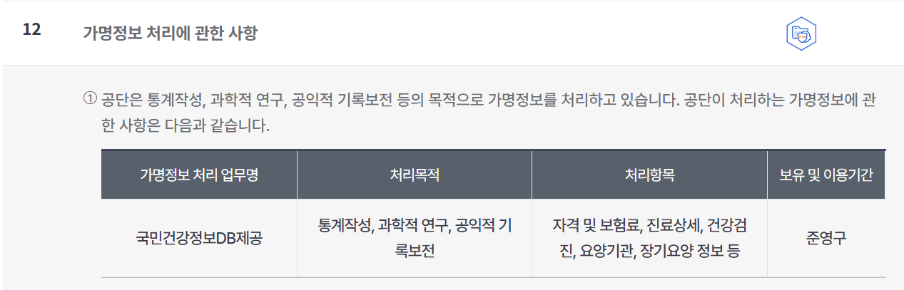
3.  조사된 자료로 아래 항목 구성
아래 요소가 빠지면 법규 위반임
* 가명정보 처리의 목적
* 가명처리한 개인정보의 항목
* 가명정보의 이용내역
* 제3자 제공 시 제공받는 자

## 관련 직무 혼선
데이터 관련 업무는 빅데이터팀에서 수행했으나 데이터 3법 개정으로 혼선
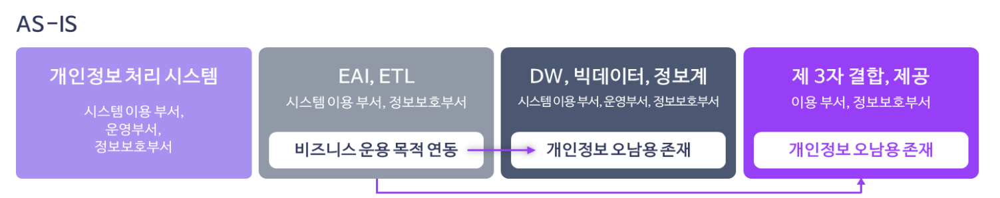
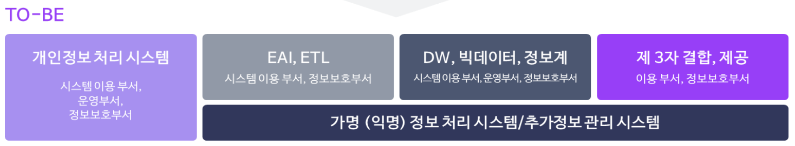

## 가명정보 관리체계 수립 
1. 개인정보 보호지침
2. 절차
3. 메뉴얼 & 양식

## 가명처리 절차
1. 사전준비
2. 윟머성 검토
3. 가명처리 절차
4. 적정성 검토
5. 안전한 관리

## 법정 요구사항 준수를 위한 절차 마련
* 컴플라이언스 요구사항
  * 법령, 지침 및 고시, 가인드라인, 특화 제도

## 가명정보 관련 제도 및 법률
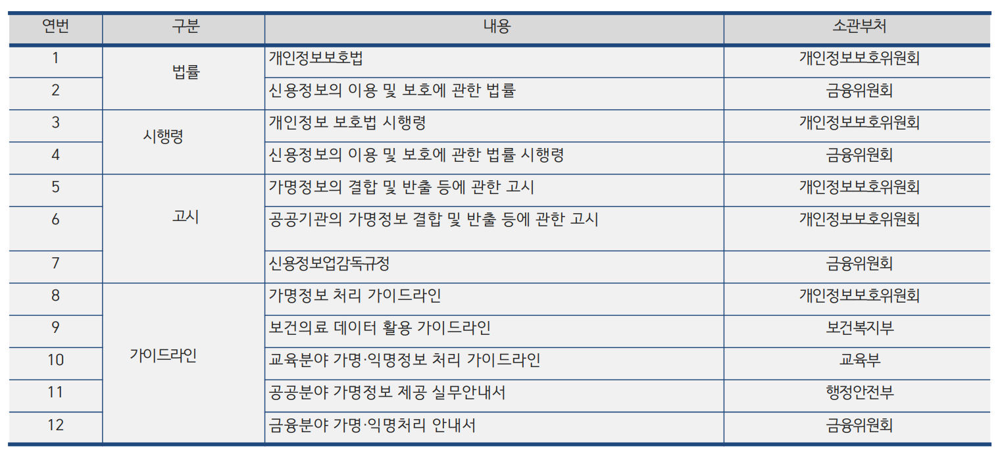
* 가이드라인 -> 현업에서 참고할 만한 것

## 가명처리와 가명정보의 처리 차이점
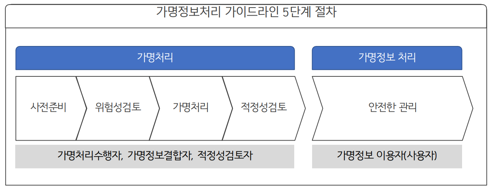
* 가명처리 -> 개인정보의 일부를 삭제하거나 일부 또는 전부를 대체하는 과정
* 가명정보 처리 -> 가명처리를 통해 생성된 가명정보를 활용하는 행위
* 그니깐 가명처리는 개인정보를 비식별화 하는 과정, "가명정보 처리"는 이를 활요한는 것

### 사전준비 단계
* 목적 설정 -> 가명정보를 왜 만들려고 하는지 목적을 명확히 설정
* 가명처리 대상 선정
* 처리 목적 적합성 검토
* 가명정보처리를위한 안전조치 이행
* 필요 서류 작성

### 사전준비 단계 -가명정보 이용 제공 신청서
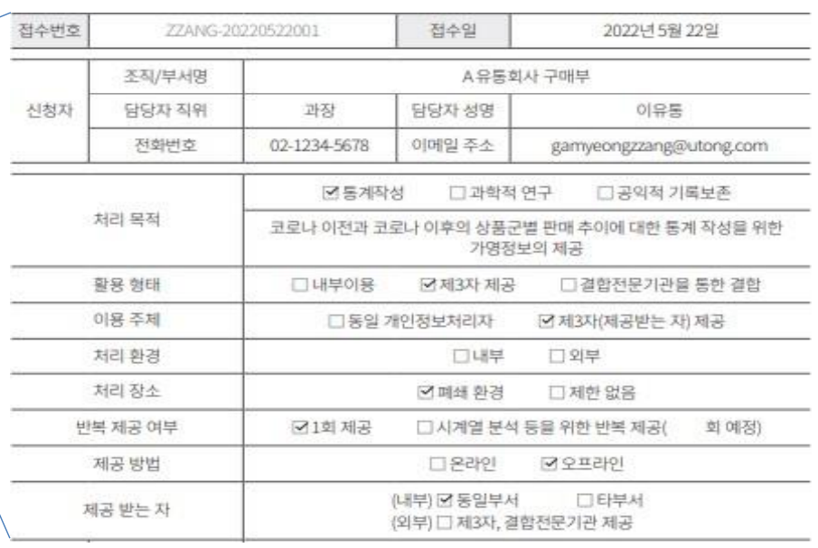
* 목적, 활용 현태, 등등이 적혀짐
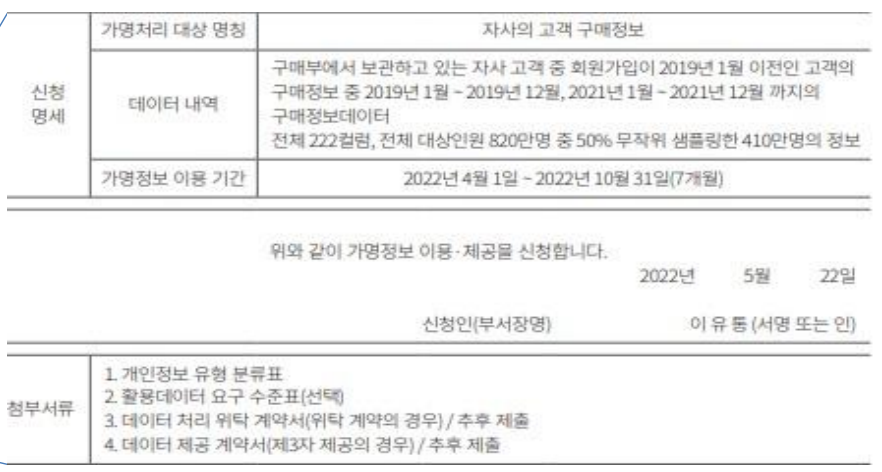
* 신청 명세 -> 비식별 데이터가 있겠음
* 이용기간 -> 이용기간도 특정해야 함

## 위험성검토 단계
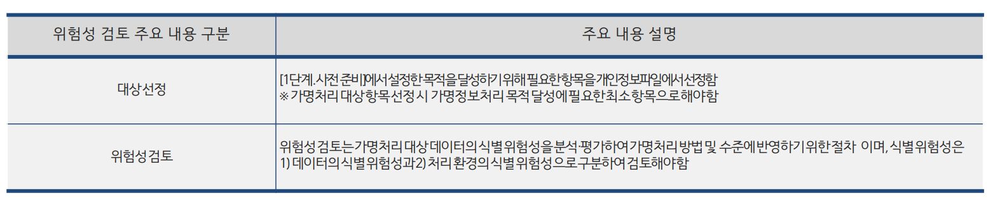
* 대상선정: 불필요한 데이터를 넣지 말아야 겠음
* 위험성검토: 식별 위험성을 분석 및 평가를 함
  * 데이터 자체 식별 위험성 요소: 재식별 시 영향도, 식별정보 등
  * 처리 환경 식별 위험서 요소: 물리적 요소

### 데이터 자체 식별 위험성 검토 내용
1. 식별정보: 특정 개인과 직접적으로 연결되는 정보
2. 식별기능정보: 다른 항목과 결합되는 경우에 식별가능성이 높아지는 항목
3. 특이정보: 전체데이터에 식별가능성을 가지는 고유값
4. 재식별시영향도: 재식별로 불이익이 될 수 이음

### 처리환경 식별 위험성 검토 내용
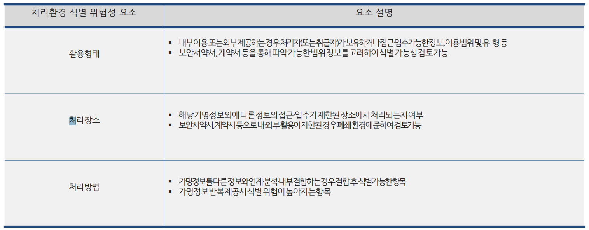
* 활용 형태: 내부이용 또는 외부제공하는 경우 처리자가 보유하거나 이용 범위
* 처리 장소: 제한된 장소에서 처리되는지 여부
* 처리 방법: 가명정보를 반ㅂ고 제공시 식별 위험이 높아지는 항목

### 위험성검토 - 처리환경
* 가명정보를 제공받은 자가 신뢰할 만한 인증을 받았는가?
  * ISMS, ISMS-P, ISO 27000
* 처리목적
  * 가명정보 처리 목적을 선정하고 명확히 하였는가

### 식별 위험성 검토 결과보고서
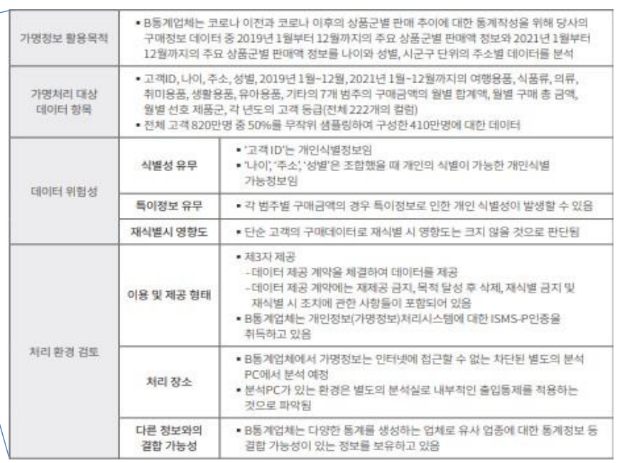
* 사전준비에 있는 것들을 검토를 함
* 데이터 위험성
  * 식별성 유무, 특이정보 유무, 재식별시 영향도
* 처리 환경 검토
  * 이용 및 제공 형태
    * 제3자 제공
  * 처리 장소
    * 차단된 환경 -> 해킹 위협 X
  * 다른 정보와의 결합 가능성
    * 유사 업종에 대한 통계정보가 결합될 위험성이 있음
    * 하지만 처리장소가 차단된 환경이니 갠춘
* 최종 검토의견
  * 처리 장소와 개인정보 보호 수준을 검토할 때 결합에 대한 시도는 거의 없을듯
    * 개인정보 보호 수준 -> ISMS-P니 수준이 높따!
  * 고객 ID는 개인 식별 가능성ㅇ 매우 높으므로 salt값이 포함된 해시처리 기법 적용 필요
  * 주소, 나이, 주소, 구매액, 고객등급 -> 범주화 필요성 보임
    * 성별은 분석 목적으로 그대로 사용

## 가명처리 단계
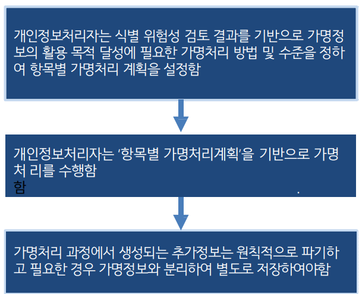
1. 식별 위험성 검토 결과를 기반으로 항목별 가명처리 계획 설정
2. 항목별 가명처리계획을 기반으로 가명처리
3. 가명처리 과정에서 생성되는 추가정보는 원칙적으로 파기 (필요한 경우 가명처리와 분리 보관)

## 항목별 가명처리계획 작성 예시
* 개인식별가능정보 -> 합쳐질때 식별 가능

## 적정성 검토
* 1,2,3 단계의 가명처리에 대한 적정성을 최종 검토
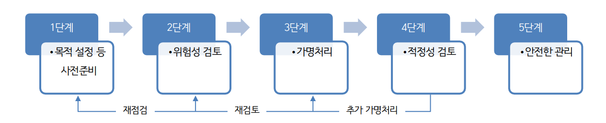
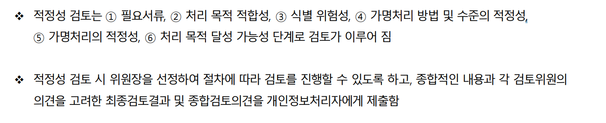

## 적정성 검토 - 예시1 
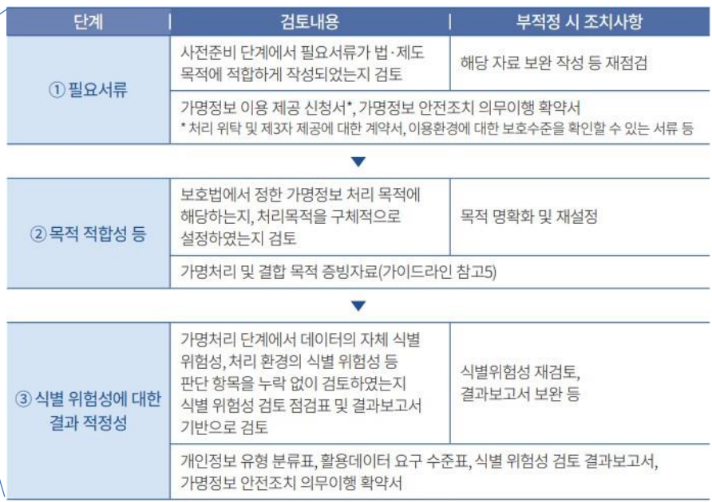
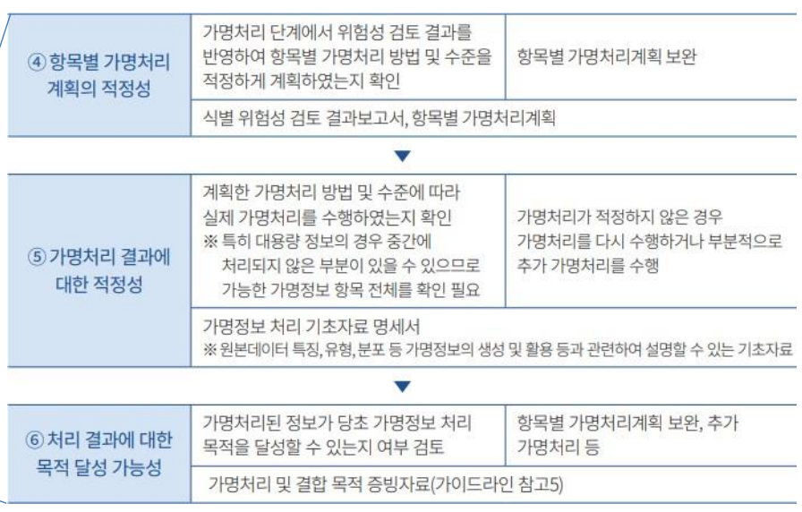

## 안전한 관리
* 재식별 금지 및 재식별 간으성 모니터링
  * 특정 개인을 알아보기 위한 목적으로 가명정보 처리 X
* 안전조치 시행
  * 개인정보처리자는 사전준비 단계에서 수립한 내부 관리계획에 따라 가명정보를 안전하게 처리
* 가명정보 처리 관련 기록 작성 및 보관
  * 개인정보처리자는가명정보의처리목적, 개인정보항목, 이용내역, 제3자제공시제공받는자를작성하여 보관하여야함

## 개인정보 데이터 이해

### 개인정보 속성 분류
1. 고유식별자
2. 준식별자
3. 민감정보
4. 일반정보

## 개인정보 자료 일반적 자료 형태
* 자료
  * 범주속성 -> 자료의 범위를 지정, 요약속성과 결합하여 활용
  * 요약속성 -> 통계수치 자료
* 메타데이터 -> 자료의 생산규칙

### 자료 형태로 데이터 분석
* 범주형 -> 이산형/범주형
  * 명목형 -> 각 범주간 순위가 없음, 성별/인종/혈액형
  * 순위변수/척도 => 순위의 의미를 가짐, 성적/학력/경제수준
* 연속형
  * 구간변수/척도 -> 범주 사이에 등간성이 있음, 덧셈가능 곱셈불가능, 온도
  * 비율변소/척도 -> 범주 사이에 등간성 있음, 덧셈곱셈 둘다가능, 키/몸무게/나이/시간

### 특이정보 관찰 방법
* k-익명성 - 동질 그룹 분석
* Outlier
  * 3 시그마 규칙 -> 정규분포에서 3시그마 벗어난 것
  * 사분위수 분석 -> 박스플록 그래프를 이용
* 도수분포표 -> 빈도분석, 막대 그래프 드을 이용하여 빈도가 적은 데이터 관찰

### 수치형 관찰 방법
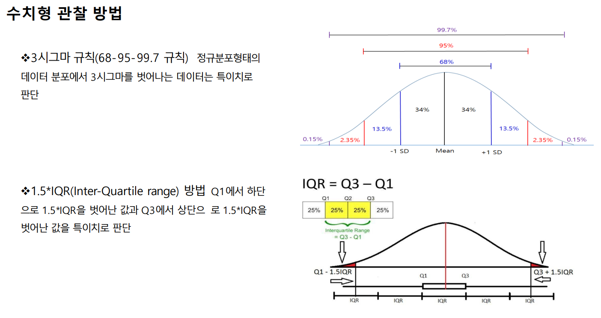

### 범주형 관찰 방법
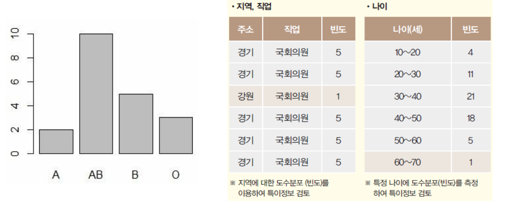

### 가명처리 기수 이슈
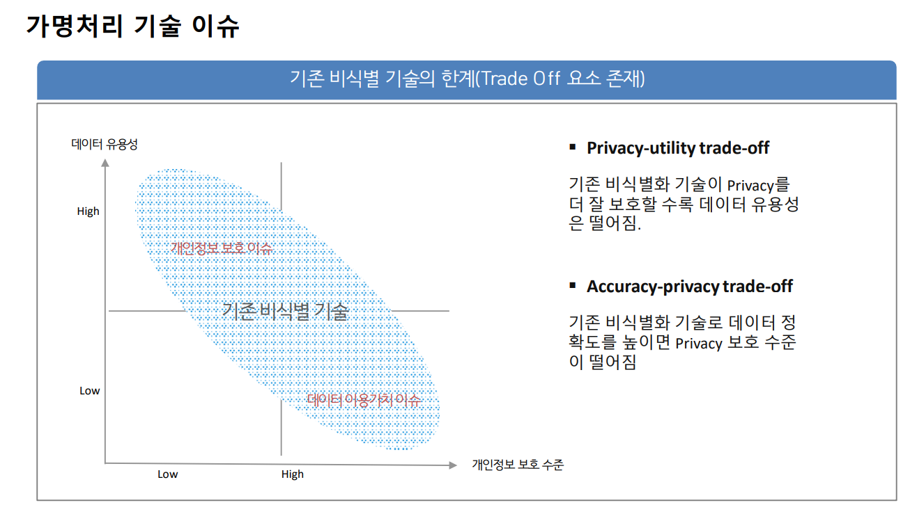
* 개인정보보호 수준을 높이면 -> 데이터 이용가치가 떨어짐
* 수준을 낮추면 -> 개인정보보호이슈

## 가명처리 기법
* 통계 도구 기법 -> 데이터 전체 구조를 변경 (표본 추출, 총계 처리 등의 기법)
* 암호화 도구 -> 암호화 기법을 사용
* 삭제 기술 -> 레코드, 속성값 등 데이터 값을 제거하는 기술
  * 마스킹, 레코드 삭제, 컬럼 삭제 등
* 가명화 기술 -> 원래 식별자를 찾을수 없게 대체식별자를 사용
  * 해시함수, 매핑테이블 등등
* 해부화 -> 기존 테이블을 식별자 테이블과 유용한 속성 테이블로 분할
* 일반화 기술 -> 범주화, 라운딩
  * 1억 4천 2백 50만원 -> 1억 4천만원
* 무작위화 기술 -> 속성의 값을 수정하여 원래의 값과 다르게 변형
  * 잡음추가, 순열, 부분총계
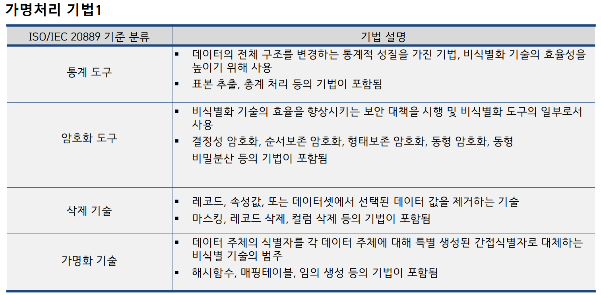
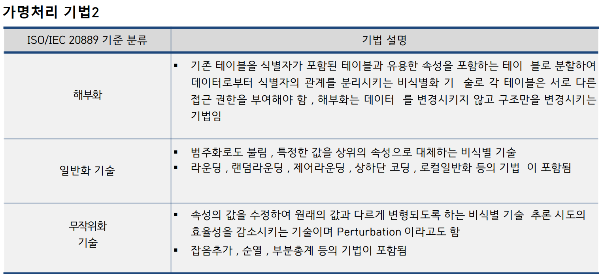
## 액셀을 이용한 가명처리 기법
1. 통계처리
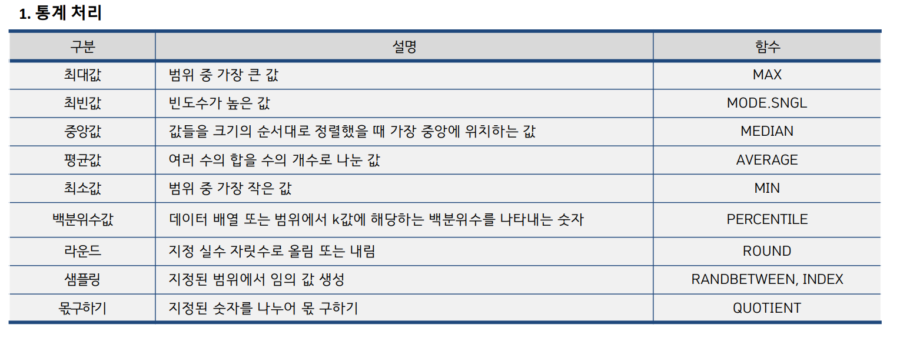
2. 문자 처리
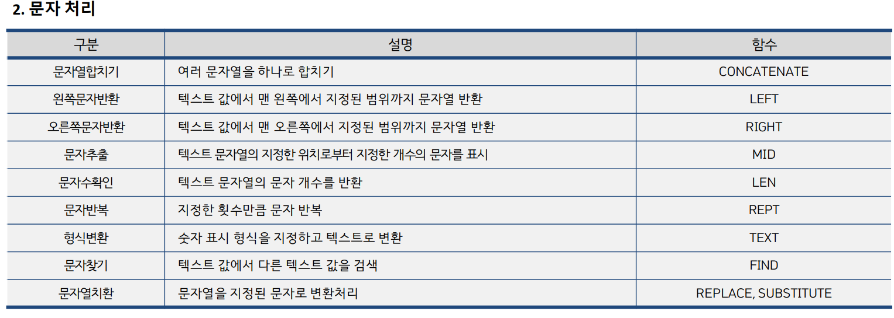
3. 사용자 정의
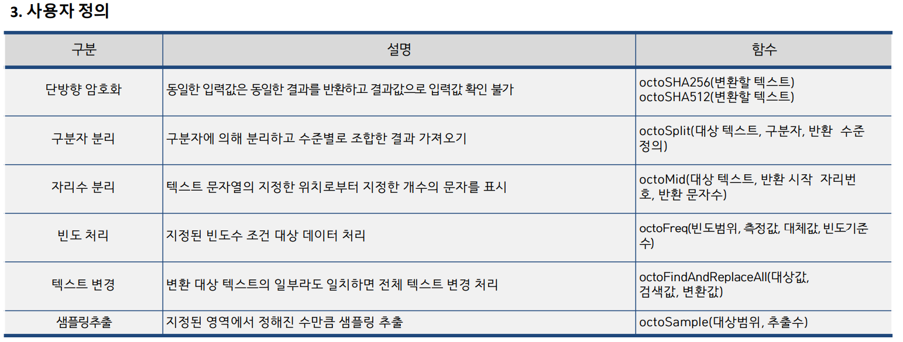
4. 기타
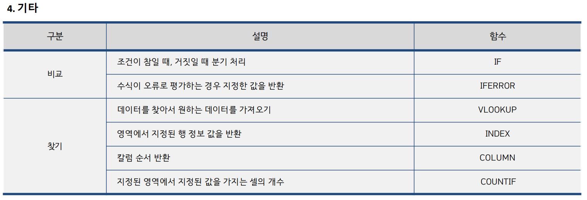

# 가명정보 가이드라인

### 3단계 가명처리
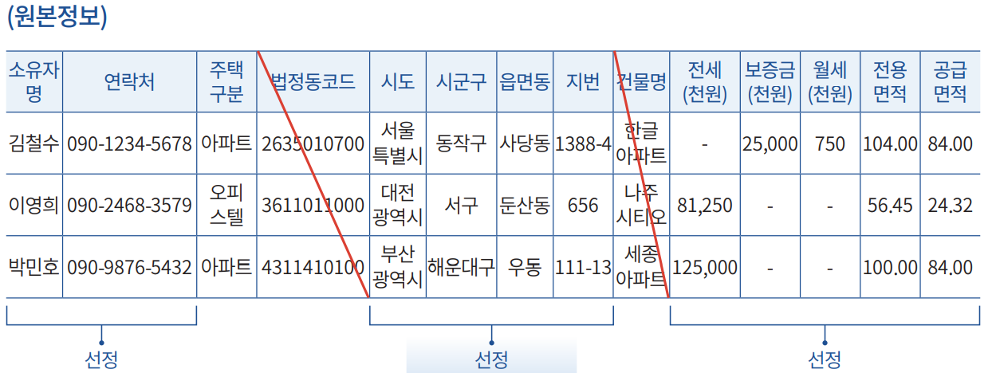
* 대상선정 -> 법정동코드, 건물명 뺌
* 위험성 검토
  * 지번을 삭제 조치 -> 등기부열람 가능
  * 소유자명 연략처는 암호화
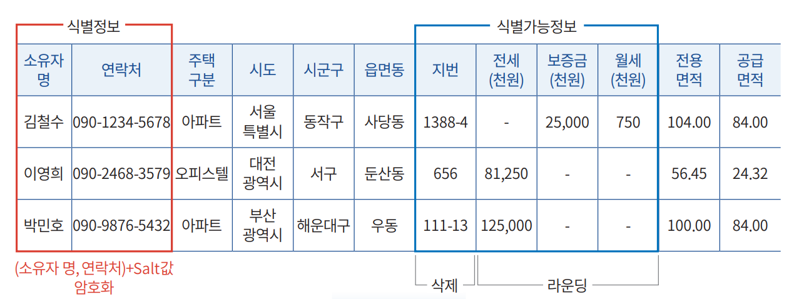
* 식별정보는 salt값 + 암호화
* 식별가능정보 -> 삭제 또는 라운딩
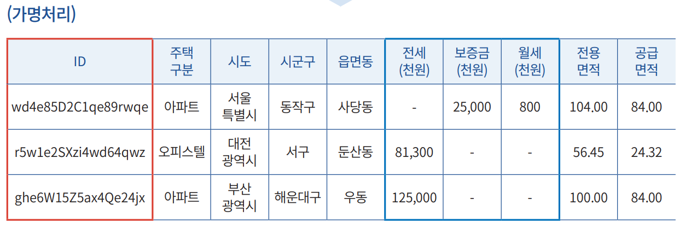

### 안전한 관리
1. 재식별 금지 및 재식별 가능성 모니터링
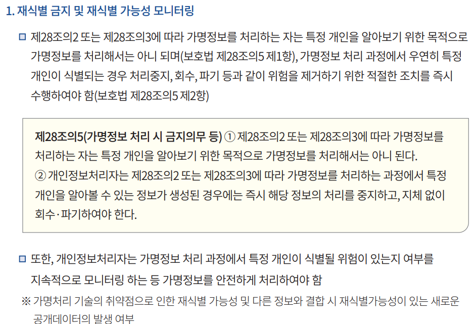
가명처리를 해도 가명정보가 합쳐져서 정보유출이 될 수 있음
2. 비정형데이터 가명처리 기준

# IT 신기술과 개인정보보호

## 생체정보와 개인정보보호
* 생체정보 정의
  * 지문, 얼굴, 홍채, 정맥, 음성 등 개인의 신체적, 생리적, 행동적 특징
  * 특정 개인을 식별 가능
* 생체인식정보
  * 생체정보 중 특정 개인을 인증 식별할 목적으로 처리
  * 생체 인식 원본 정보 -> 개인을 인증 또는 식별할 목적
  * 생체 인식 특징 정보 -> 원본정보로부터 특징점을 추출하는 등 기술적 수단에 의해 생성되는 정보

## 개인정보
생체정보도 개인정보임
* 개인정보보호법 시행령 제18조 (민감정보의 범위)
  * 기술적 수단을 통해 성성한 정보 

## 생체정보 수집단계 유의사항
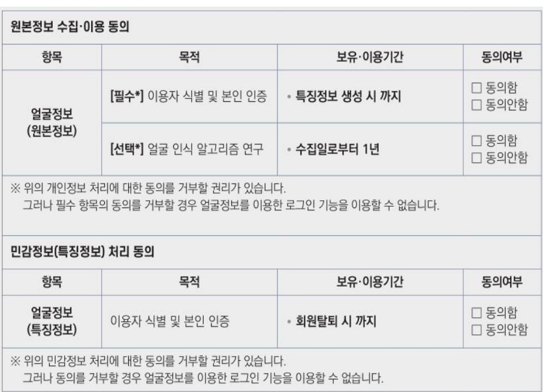
* 생체인식정보 수집시 개인정보 수집 이용 동의서 징구
* 원본정보 보관이 필요한 경우 -> 목적 및 보유기간 구분하여 안내
* 정보통신망을 통해 생체인식정보를 전송하는 경우 암호화 후 전송
  * SSL/TLS, VPN 적용

## 생체정보 이용단계 유의사항
* 생체인식정보는 인사, 연구, 개발 등 다른 목적으로 활용 불가
  * 안면 인식 목적 얼굴사진 -> 인사관리, 신분증 발급에 활용 X
* 이용자가 생체인식 정보 제공과 이용을 결정할 수 있도록 열람, 정정, 삭제 등의 통제수단 제공
* 생체인식 정보 수집, 입력은 단말에서 처리
  * 19.8 -> 인터넷에 노출된 서버에서 암호화되지 않은 이름, 비밀번호, 지문, 안면 정보 발견

## 생체정보 보관/파기 단계 유의사항
* 생체인식 정보 저장 시 암호화 하여 저장
* 암호화에 사용하는 암호키 생성, 이용 보관, 배포, 파기 등에 대한 정차 수립
* 보유기간 경과 또는 처리목적 달성 시 생체인식정보를 지체없이 파기
* 원본정보를 보관해야 하는 경우 다른 개인정보와 분리하여 별도 저장
  * 물리적으로 분리
  * 이용자가 식별되지 않도록 공통 식별자는 임의 값 활용

## 생체인증 FIDO
* 아이디 비번 조합 대신, 지문, 홍채 등을 활용한 새로운 인증 시스템
* 개인정보는 단말에 저장
* 예시
  * 삼성페이 -> 인증방법을 지문으로 사용

## FIDO 유니버셜 인증 프레임워크 아키텍쳐
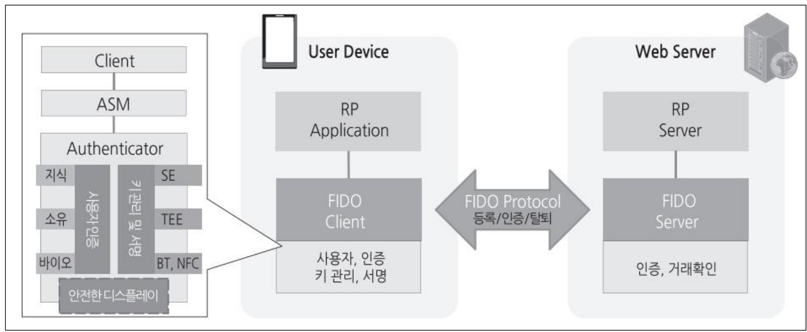
유저 디바이스에서 인증을 함

## 생체인증 유출 및 오남용 사례
실리콘 지문, 지문 유출 등등

# 클라우드 개인정보보호

### 클라우드 서비스 유형
* Iaas
* Saas
* Paas
* Faas

### 클라우드 보안
저비용으로 많이 이용했지만, 개인정보 보호 문제 대두

### 클라우드 종료
* private 클라우드 -> 특정회사 전용, 확장성 떨어짐, 초기투자비용 높음
* public 클라우드 -> 적은 비용, 보안성 낮음, CSP에 대한 의존도
* Hybrid 클라우드 -> 보안성은 private, 나머지는 public

### CSP MSP
* CSP (Cloud Service Provider)
  * AWS, Azure, GCP
  * 국내는 KT, 네이버, NHN 클라우드
* MSP
  * 메가존, 베스핀글로벌, 삼성 SDS, LG CNS 등

### 클라우드 서비스 시장 전망
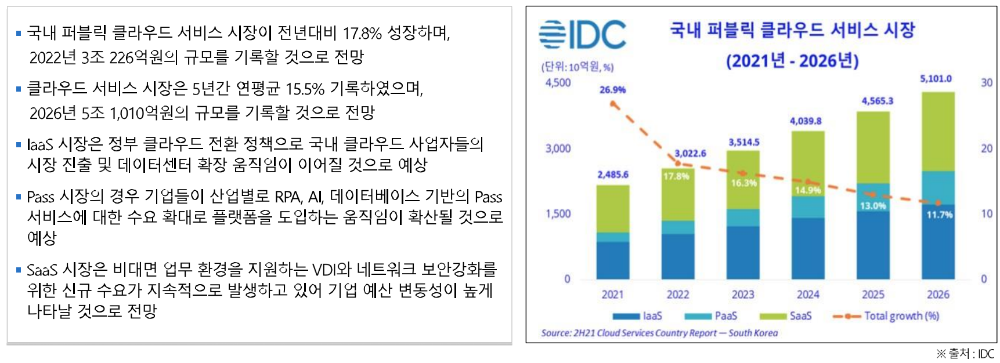
전반적으로 시장이 확대되는 추세

### 클라우드 사례
* NC 소프트 -> VMWARE가 프라이빗 클라우드 구축
* BNK금융그룹 뉴타닉스 위에 그룹사 프라이빗 클라우드 구현
* 국가관세망 -> 클라우드 전환 (유니패스)

### 클라우드 보호조치 - 접근 권한 관리
* 애플리케이션 접근 권한
* DBMS 접근 권한
* 서버 운영체제 접근권한

### 접근 권한 관리 고려사항
* 클라우드 관리콘솔에서 접근권한을 차등 부여하는 기능을 제공하고 있는지 검토
  * AWS IAM
* Paas를 사용하면 서비스 별 접근 권한 부여 최소하
* 외부 스토리지 등 기타 저장 장치에 대한 접근권한 부여 최소화
* 권한 부여, 변경, 말소 처리 이력을 저장하는 기능 있는지 확인
  * cloudwatch

### 접근 통제 고려사항
어떻게 접근을 통제할 것인지

### 클라우드 안정성 확보 방안
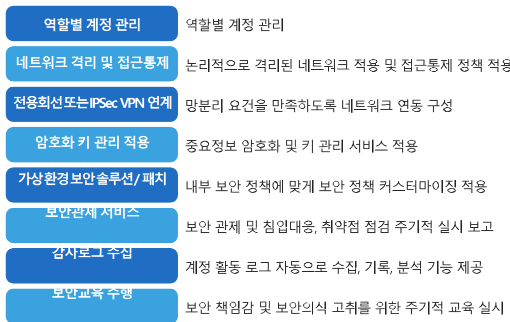
* 전용회선 또는 VPN 사용하는지 -> 클라우드는 원격지이므로

### 클라우드 보안 위협
* 중요 데이터는 암호화 하자
* 계정 관리 미흡 또는 과도한 권한 부여
* 멀티 클라우드 -> 여러 클라우드 사용하면 가시성 확보 여려움
* 사용자 실수와 설정 오류
  * 장기간 동일 비밀번호 사용, 잡속 키 관리 미흡

## 마이데이터
다수 정보시스템에 분산되어 있는 개인의 정보에 대한 권리를 보장, 동의에 따라 본인 데이터를 개방 활용하는것
* 개인정보 이동권
개인정보처리자가 처리하고 있는 개인정보 혹은 개인데이터를 정보주체가 그 사본을 넘겨받아 재사용
* A은행의 계좌정보를 -> C은행에서 볼수 있도록 떙김
* 개인정보 자기결정권
스스로 정보의 유통, 언제 공개할 건지 정하는 권리

### 마이데이터 서비스
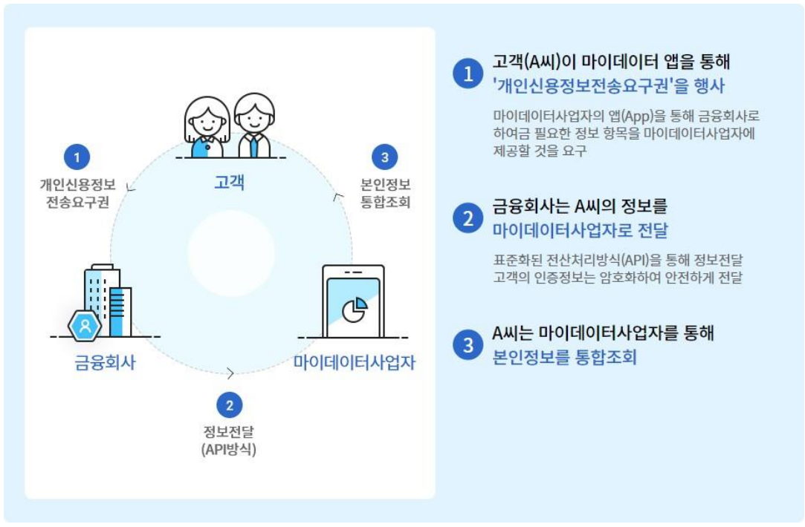
개인이 금융데이터를 금융회사로 전달
* 넘겨주는 규격이 통일된 것임

### 마이데이터의 스크래핑 vs API
* 스크래핑 -> 사업자가 고객의 인증정보로  정보를 자동으로 추출
  * 과도한 수집 문제
* API -> 고객이 원하는 정보만 선택하여 정보 전송 요구 가능

### 마이데이터 사례 국내
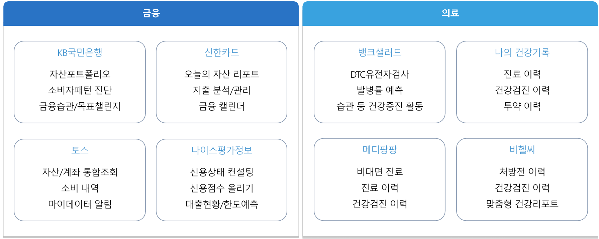

### 마이데이터 해외 사례
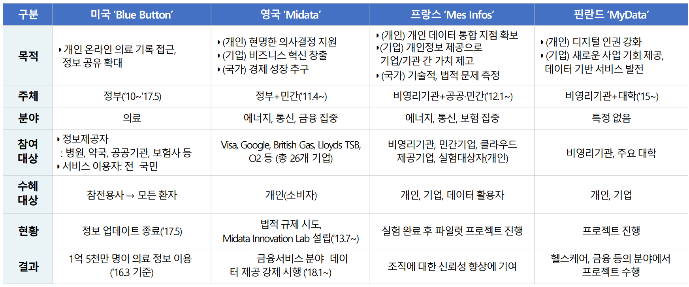

## 마이데이터 보안 위협 및 대책
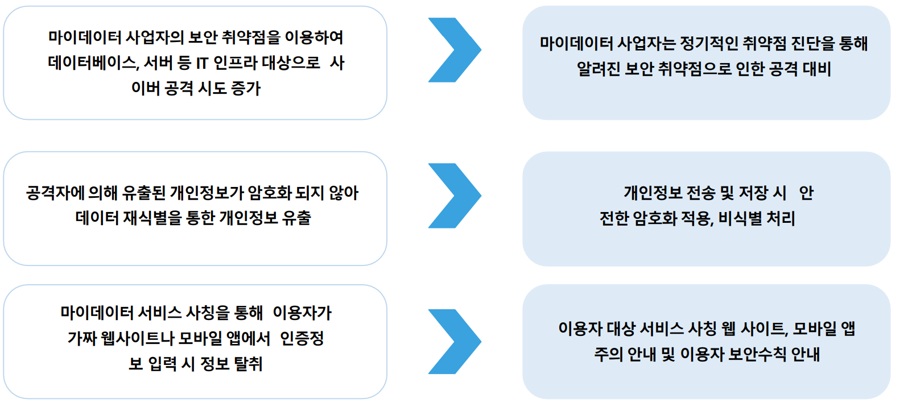
* 마이데이터 사업자의 보안 취약점을 이용하여 사이버 공격 시도 증가
  * 데이터베이스, 서버 등 IT 인프라 대상
* 유출된 개인정보가 암호화 되지 않음 -> 데이터 재식별을 통한 개인정보 유출
* 마이데이터 서비스 사칭을 통한 인증정보 갈취

## 마이데이터 보호조치
* 관리적 보안
  * 관리 감독 철저 -> 금융감독원, 금융보안원등의 감사
  * ISMS-P 인증심사 등 준수, 공공기관은 PIA 법적 준수 추가 고려
  * 각 참여기업 및 기관의 관련 규정, 계획 수립 철저
* 기술적 보안
  * SOAR기반의 모니터링
    * Security Orchestration & Automation Response-> 차세대 보안 시스템 검토
  * 표준화된 Open API 적용
    * 벤더종속이나 업데이터 어려움 API 사용 지향
  * 사용자 SIDE 보안 강화
* 개인정보보호
  * 개인정보 수집 및 제공 제한 -> 최소한의 정보만 수집
  * PPLM, PPDM 기술 활용
    * 인공지능 기술활용
  * 시스템 장애 및 SW오류 최소화

### 마이데이터 보안 사고 사례
* 어떤은행의 개인정보 유출 사고
* CI 정보 오류 -> 본인의 정보가 아닌 타인의 카드 사용내역, 대출내역 등이 노출
* 카드사들의 무리한 마이데이터 사업 추진으로 개인정보유출
* 마이데이터는 주로 데이터 전송 시 사고가 많이 발생함

## 복습 사항
* 개인정보법 개정 사유
  * 가명처리가 무엇인지
  * 가명처리 주의할 점, 강조할 점
* 마이데이터