### 질문
* 과태료: **형법상 형벌이 아니**라 전과가 남지 않음, 행정청에서 벌금을 부과할 수 있음
* 과징금: 형법상 형사처벌과 함꼐 부과 가능, 법률상 의무 위반으로 인한 경제적 이익을 환수하기 위함

# 인공지능과 개인정보보호
* 인공지능의 개념: 컴퓨타가 인간의 문재해결 능력이나 의사결정 능력 등을 모방하도록 하는 것
* 4분론 접근 방식: 합리적 행위 -> 기댓값을 기준으로 최선의 결고 산출을 위한 행동 여부 등을 기준으로 판단
* 인공지능을 사용하면서 사생활 등 보안 문제가 대두되고 있다

## 인공지능의 문제점
* 기술오남용
CEO의 가짜 음성을 만들어 22만 유로 송금
* 데이터 편향성
아마존의 인공지능 기반 채용시스템 -> 남성만을 추천
* 알고리즘 차별
흑인 범죄자의 재범가능성을 백인보다 2배 높게 예측하는 편향
* 프라이버시 침해
알렉사, 시리 등의 인공지능 스피커로 수집된 음성 정보가 제3 외부업체가 청취

## chatgpt 사이버보안
* 보안문제
  * 코드 작성 능력 -> 악성코드 생성, 프로그래밍 언어 변환 등으로 보안업계에 위협
  * 기업 이메일 침해 공격
  * AI를 적극 활용하여 사이버 보안 기술의 고도화 필요

## chatgpt 보안에서 어떻게 사용해야 할까
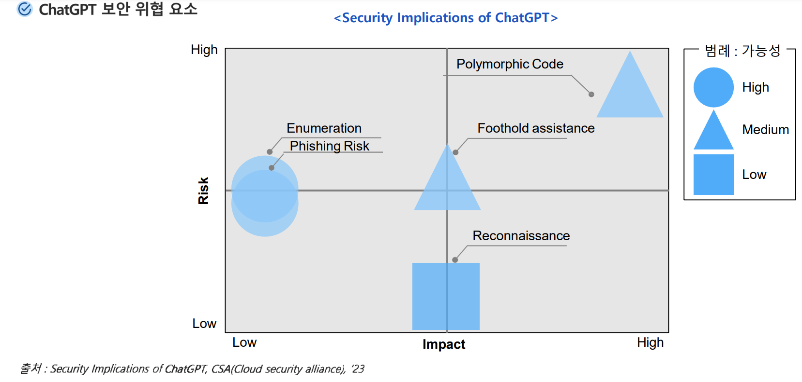
* 부정적
  * 멀웨어 생성 -> chatgpt로 손쉽게 악성코드 생성 가능
  * 피싱과 악성메일 -> 챗봇을 활용하여 성공하는 피싱 수 증가
* 긍정적
  * 멀웨어 분석 -> 소스코드를 빠르게 해석하는 플러그인 개발
  * 취약점 검색 -> 소스코드를 읽고 취약점이 있을 수 있는 위치를 식별
  * 보안 컨설팅 -> 설득력 있는 사이버보안 조언 제공 가능
* 보안쪽에서 다양한 방면으로 활용될 수 있지만 오류 및 논리적 결함이 있을 수 있다
* 기업 정보 유출을 모니터링 하자
* 차단보다는 활용 정책을 수립하자!

## chatgpt 민감정보 유출
chatgpt 약관에 민감정보를 수집한다는 것이 명시되어 있음
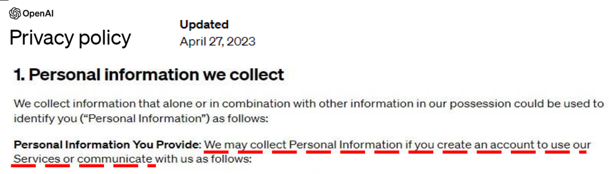
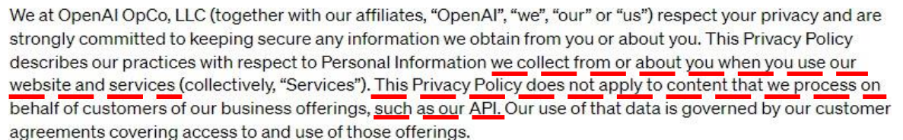
입력하는 데이터도 사용자 컨텐츠로 취급하여 OpenAI에 저장
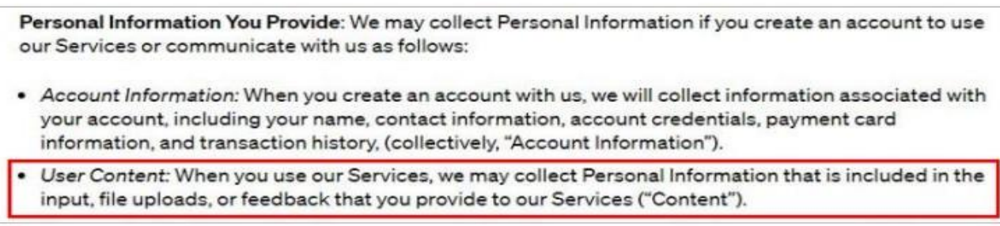
* 사용자가 제공한 데이터는 OpenAI의 서비스나 AI 모델 개선에 활용
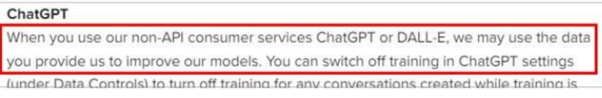

### 인공지능 규제 - 이탈리아
* EU GDPR 위반 사유 - 개인정보 적법 처리 근거 부재
* 요구한 시행 조치
  * 개인정보 처리 방식에 대한 정보주체의 알 권리 강화
  * 미사용자의 데이터 처리 권리 보장
  * 서비스 가입시 연령 확인
* openai는 조치를 시행한후 이탈리아가 chatgpt 접속 차단을 해제

### 인공지능 규제 - EU
AI 학습에 활용한 데이터의 출처화 저작권 공개를 의무화
* 학습 데이터의 위험 수준 공개 - 생체 감시, 잘못된 정보 유포, 차별적 언어

### 인공지능 규제 - 미국, 일본
* 바이든 ->  ai 주요 기업을 초대하여 우려, 활용방안 논의
* 일본 문부과학성 -> chatgpt 관련 가이드라인 개발 착수

### 인공지능 규제 - 중국, 캐나다, 스페인
* 중국 - chatgpt 접속 차단
  * 중국 질의시 비판적인 내용 답변
  * 중국 개인정보보호법 등 법률 위반
* 캐나다
  * 캐나다 개인정보 감독기관(OPC) -> open ai에 대한 조사착수
* 스페인 -> 잠재적 데이터 침해 관련 조사 예정이라 선언

### 인공지능 규제 - 국내
* 과기정통부, 방송통신위, 개인정보보호위원회
  * 개인정보보호위원회 - 인공지능 서비스 개인정보보호 자율점검표
  * 과기정통부 - 인공지능 윤리정책 포럼
* 네이버, 카카오

### 인공지능 규제 - 기업
* 글로벌 금융계 - 기업 정보 유출 우려 Chatgpt 사용 금지 
* 교육계 -> 사용 금지 (표절)

## 인공지능(AI) 서비스 개인정보보호 자율점검표[개발자·운영자용]
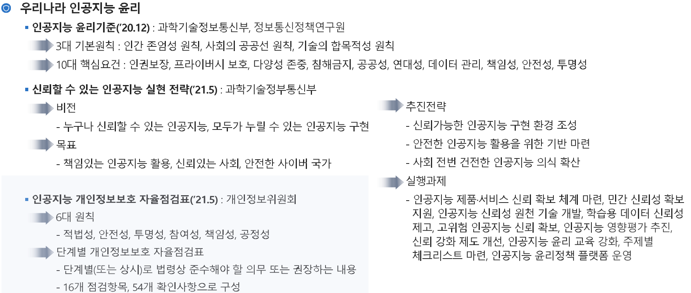
* 과기부
* 3대 기본 원칙: 인간 존엄성 원칙, 사회의 공공선 원칙, 기술의 합목적성원칙
* 10대 핵심요건: 3대 기본 원칙 기반으로 만듦
* 인공지능 실현 전략
  * 비전 - 누구나 신뢰할 수 있는 인공지능 구현
  * 목표 - 첵임있는 인공지능 활용
* 인공지능 개인정보보호 자율점검표
  * 6대 원칙 - 적법성, 안정성, 투명성, 참여성, 책임성, 공정성
  * 단계별 개인정보보호 자율점검표
* 도입 배경 - 개인정보 침해 등 다양한 사회적 문제 발생 우려
* 활용대상 - 개인정보처리자, 개인정보취급자의 지위를 갖는 개발자
* 상시점검표 - 수시로 검사하라
* 교육안내서 - 교육이나 컨설팅 등에 활용 가능한 안내서

### 각종 원칙들
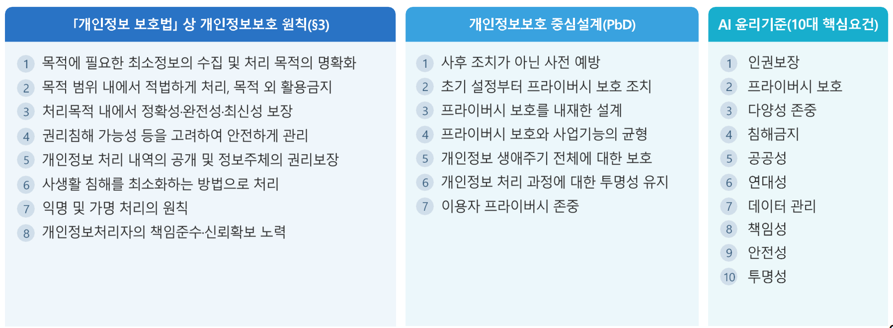

## 자율점검표 - AI 관련 개인정보보호 6대 원칙
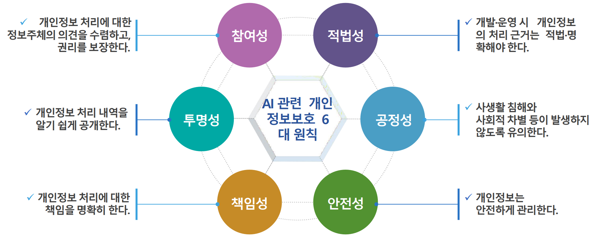
* 참여성: 개인정보 처리에 대한 정보주체의 의견 수렴, 권리보장
* 적법성: 개인정보 처리근거는 법에 근거
* 공정성: 사생활 침해, 사회적 차별 발생하지 않도록
* 안정성: 개인정보는 안전하게 관리
* 투명성: 개인정보 처리 내역 공개
* 책임성: 개인정보 처리에 대한 책임 명확히

## 인공지능 윤리정책 포럼
* 인공지능의 윤리적 개발과 활용을 위한 논의
* 3개 분과로 구성
  * 윤리 분과
  * 기술 분과
  * 교육 분과
* 이루다 개발한 스캐터랩의 챗봇 윤리점검표 제작
  * 과기정통부의 AI 10대 윤리기준을 기반으로 개발

## 개보위 개인정보 보호 활용 기술 R&D 로드맵
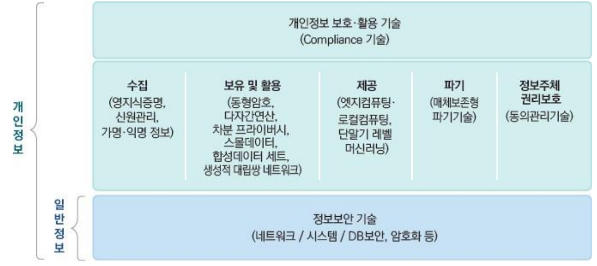
* 정보보안 기술은 개인정보 보호에 필수요소
1. 정보주체 권리보장
2. 유노출 최소하
3. 안전한 활용
* 안전활용 기반기술 -> 양자내성암호 (최신기술)   
* 마이데이터 기반기술 -> MyData API
* 융합 프라이버시 보호
* 인공지능 프라이버시
  * 프라이버시 보존형 인공지능 활용 기술
  * 인공지능 활용 프라이버시 보호 기술
  * 둘이 상호 보안적

### 개보위 개인정보보호 로드맵
* 소분류 3-1
  * 차세대 가명, 익명 처리 및 결합 기술
* 소분류 3-3
  * 마이데이터 처리 및 관리 기술

## 이루다 사례
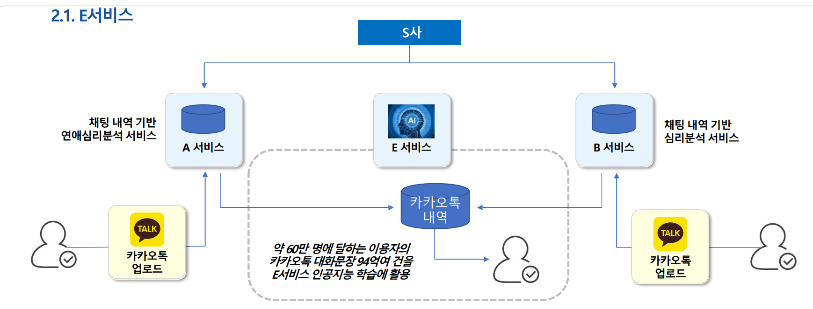
* 60만명이 사용하는 과정에서 문제 발생
* A와 B서비스의 개인정보 처리 위법사항
  * 개인정보를 정보주체에게 명확하게 동의 받지 않고 수집
  * 법정대리인의 동의 없이 14세 미만 아동의 개인정보 수집
  * 성생활 등의 정보를 별도로 동의 받지 않고 수집
  * 회원탈퇴한 자의 개인정보 파기하지 않은 행위
  * 서비스 미사용자의 개인정보 파기 또는 분리보관 하지 않음
* E 서비스 관련 개인정보 처리
  * 법정대리인의 동의 없이 14세 미만 아동의 개인정보 수집
  * 수집 목적 외로 서비스 학습 운영을 위해 카카오톡 대화문장을 이용 - 가명처리 미흡
  * Github에 이용자의 카카오톡 대화문장을 공유한 행위

### E 서비스 주요 쟁점
* 카카오톡 대화가 개인정보에 해당하는지?
  * 위원회 판단 개인정보에 해당
  * 휴대전화, 인간관계 추정을 통하 개인 식별 가능
* 카카오톡 대화가 민감정보에 해당한느지
  * 카카오톡 대화내용 전체가 민감정보에 해당한다고 보기 어려움
    * 성생활 정보 언급해도 이용자 자유로 작성한거여서
    * 서울중앙지법 2013고합577
  * 성적 취향을 알 수 있는 심리테스트 설문 응답 결과를 저장해 놓은 것은 동의 없이 민감정보 수집한 것이라 판단
* 카카오톡 대화 수집 시 대화 상대방의 동의가 필요한지
  * 위원회는 일방 당사자의 동의만으로도 카카오톡 대화를 수집할 수 있다고 판단
  * 다만 수집한 대화를 공개하는 것은 허용하지 않겠음

### 이루다 개선
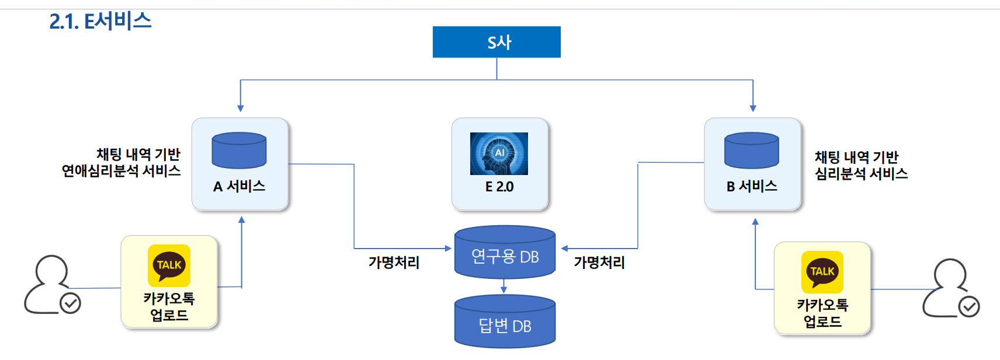
* 연구용 DB와 답변 DB로 분리
* 수집한 카톡이 아닌 기계가 만들어진 문장으로 답변
* 채팅 기록들은 가명처리로 함

## 출입국 관리 인공진으 식별추적시스템
* 인공지능 식별추적 시스템 개발사업
  * 출입국 심사고도화를 위한 인공지능 안면인식
  * CCTV 활용 출입국 심사장 이상행동 추적
  * 개인 생체정보를 허가없이 목적 외에 사용된 사례
  * 알고리즘 학습에 활용된 개인정보는 모두 삭제 조치 함
* 쟁점
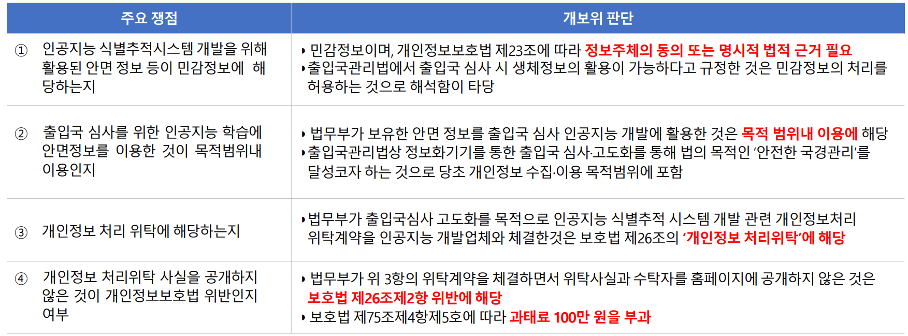

## 개보위 자율점검표

## Pbd 원칙
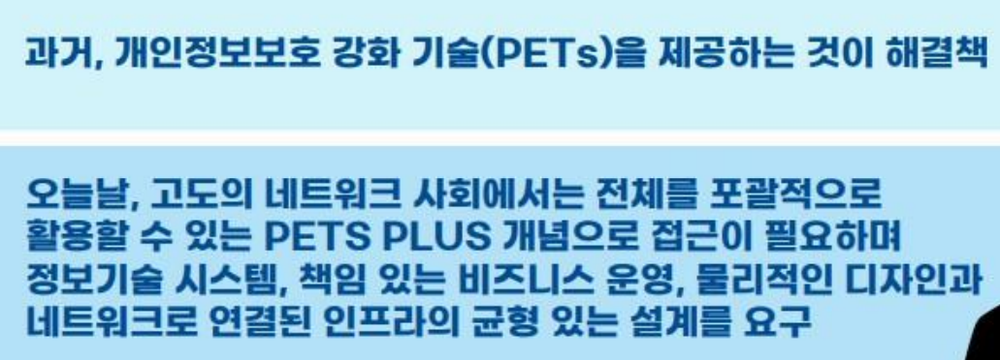
privacy by Design 원칙
* 과거에는 개인정보보호 강화 기술을 제공하는 것이 해결책
* 오늘날은 개인정보를 활용할 수 있도록
  * 고도화된 네트워크 사회니깐
* 개인정보보호법 하나로 민간, 공적 둘다 커버가능
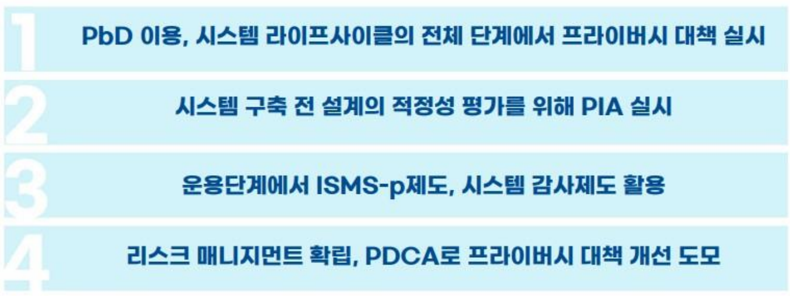

### PbD 7대 원칙
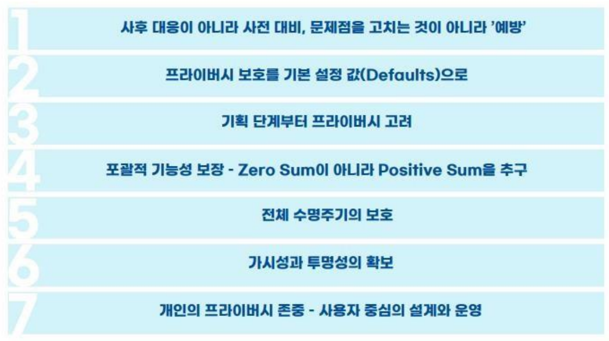
1. 사후 대응이 아니라 사전 대비, 문제점을 고치는 것이 아니라 예방!
2. 프라이버시 보호를 기본 설정 값으로
3. 기획단계부터 프라이버시 고려
4. Zero Sum이 아닌 Positive Sum을 추구
5. 전체 수명주기의 보호
6. 가시성과 투명성의 확보
7. 사용자 중심의 설게와 운영

### 개보위 자율점검표
강의자료 참고, 흐름도 방식

### 스캐터랩 자율점검표
체크리스트

# 스마트시티 보안
스마트시티란?
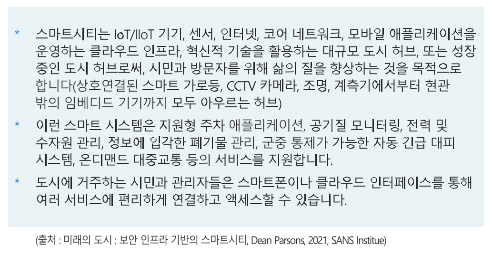

## IOT 디바이스 특성을 고려한 서비스 경량화
* 소비전력으로 경량화 여부 판단
  * 이동형 또는 고정형
* 경량 암호기술 적용
  * 여러 경량 암호알고리즘이 있따! ISO 29192-1 등
  * 암호기술 참조 URL https://cryptolux.org/index.php/Lightweight_Cryptography
* 경량 보안 프로토콜 적용
* 민감 정보 보호를 위해 암호화, 비식별화, 접근관리 등의 방안 제공

## WP29
Working Party 29
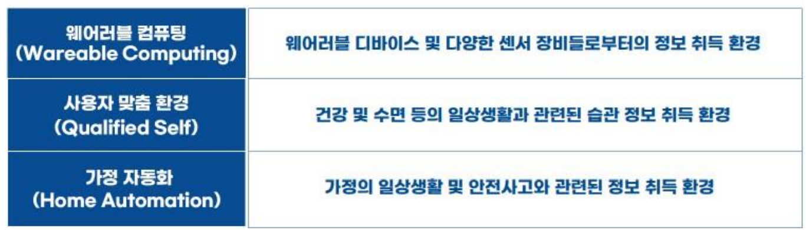
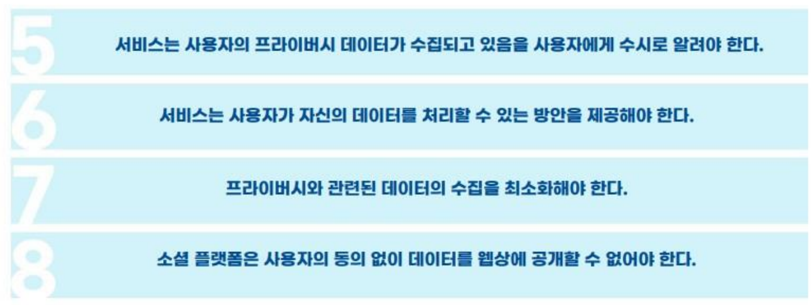
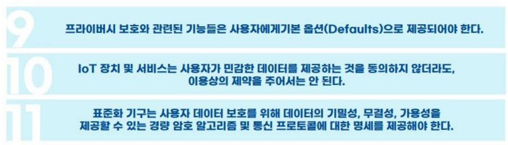
* 국내에서는 비식별화, 익명성을 혼용해서 사용
* 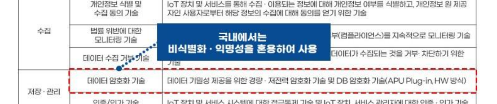
* 개인정보 비식별화 조치 단계
  * 개인정보보호법과 비슷하다
  * 사전검토
  * 비식별조치
  * 적정성 평가: 비식별 조치 적정성 평가단을 통해 평가
  * 사후관리: 재식별 가능성 모니터링
  * 접근관리
  * 인증
  * 기밀성
  * 안전한 저장 방안
* 민간정보 수집목적 및 이용방법에 따른 투명성

### 법 검색 방법
법령정보센터에서 키워드 검색

# 정보보호 및 개인정보보호 관리체계 (ISMS-P)

## 인증제도 법적 근거
정보통신망법 47조, 개인정보 보호법 32조를 내용을 바탕

## 공식명칭
정보보호 및 개인정보보호 관리쳬계임
* 정보보호, 개인정보보호를 한국인터넷진흥원 또는 인증기관이 증명하는 제도
* 정보통신망법을 근거로 정보통신 제공자에 대한 ㅇ니증
  * 전기통신 사업법 제2조
  * 정보통신망법 제 47조

## ISMS와 PIMS의 통합

* ISMS: 정보보호 관리체계 인증
  * 과기부 정보통신망법 기반
* PIMS: 개인정보보호 관리체계 인증
  * 행정안정부, 방송통신위원회 기반
  * 2012년도에 정보통신망법으로 법률적 근거 마련
    * 대상은 정보통신 제공 사업자
  * 2013 PIPL 제도 시행
    * 대상은 공공기관/대기업, 중소기업, 소상인
  * 2016 PIMS, PIPL 인증제도 통합
* 심사항목이 유사한 두개를 인증받아야 하는데 시간이 너무 오래 걸린다..
* 그래서 ISMS-P로 둘을 통합시킴
  * ISMS-P: ISMS와 PIMS를 통합한 것

## ISMS의 인증
* 기업 자율 신청
* ISMS 인증 의무대상자 -> 기업 스스로 의무대상인지 판단
  * ISP -> 서울특별시 또는 광역시에서 정보통신망서비스를 제공하는자
  * IDC -> 집적정보통신시설 사업자
  * 상급종합병원, 재학생 1만명의 학교
  * 정보통신서비스 부문 매출 100억원 이상
  * 정보통신서비스 일일 평균 이용자 수 100만명 이상
* 개인정보를 취급하지 않으면 ISMS만 받아도 됨
  * 개인정보를 취급하면 ISMS-P를 받아야
* 인증 최초 신청시 8월 31까지 인증 취득 받아야 함
  * 8월 될떄쯤 바빠짐

## ISMS 인증 - KISA
* 인증서 발급현황
https://isms.kisa.or.kr/main/ispims/issue/
* 클라우드 인증
https://isms.kisa.or.kr/main/csap/notice/

### 의무인증
* 유효기간은 3년임, 이후에 재갱신
* 갱신 전까지 연 1회 사후심사 진행
* 의무인증 대상 기업이 인증받지 않은 경우 3천만원 이하의 과태료 부과
  * 과징금이 아닌 과태료임

## 정보보호관리체계 (ISMS)
정보보호관리 절차와 과정을 체계적으로 수립 하고 관리하는 종합체계

## 정보보호관리체계 관리 모델 (SPDCA)
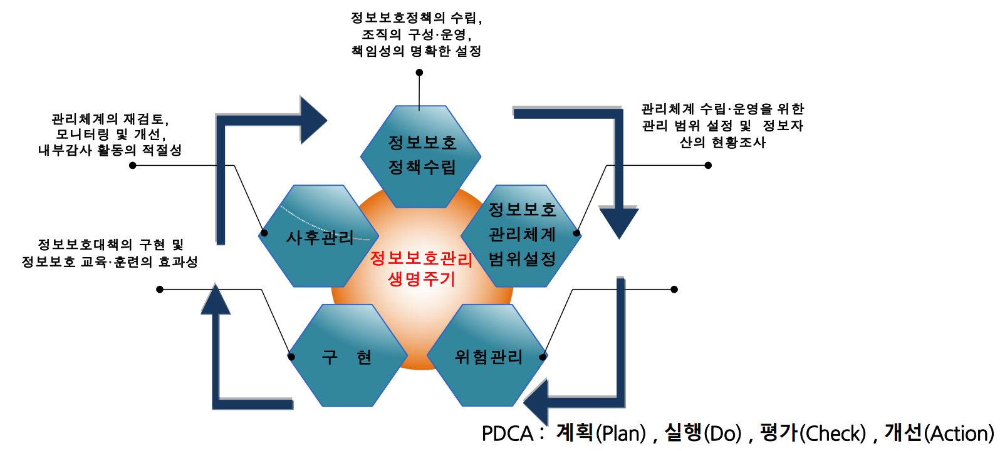

## 프로세스와 단계별 구축 절차
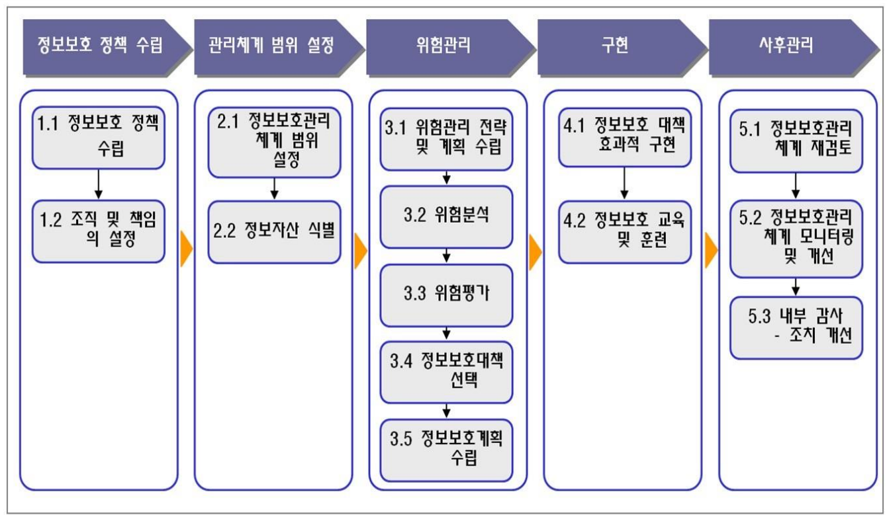
1. 정보보호 정책 수립
2. 관리체계 범위 설정
3. 위험관리
4. 구현
5. 사후관리

## 정보보호관리체계 인증의 경제적 효과
조직 내부 정보보호 인식제고가 약 71%로 높은 개선 효과가 있는 것을 조사
* 인증기준에 따른 관리와 투자를 지속한다면 사이버 침해 확률 및 피해 감소

## 인증체계 구조
* 정책기관: 과기부, 방통위, 행안부
* 인증기관: KISA
* 심사기관: 금보원 -> 금융권, 한국정보통신진흥협회(KAIT), 한국정보통신기술협회(TTA)\

### 심사 방법
* 서면 심사
  * 절차 및 이행의 증적자료 검토, 정보보호 대책 적용여부 확인
* 현장 심사
  * 서면심사의 결과 확인, 기술적 물리적 보호대책 이행여부 확인
* 보완 조치
  * 인증심사에서 발견된 경함사항에 대한 조치 내역 확인
* 심사팀 구성

## 구성요소
* 체크리스트
* 심사기준
1. 관리체계 수립 및 운영
PDCA 사이클로 이루어짐
2. 보호대책 요구사항
64개 통제항목
3. 개인정보 처리단게별 요구사항
22개 통제항목 -> 수시로 변경됨

### 구 ISMS  심사 기준
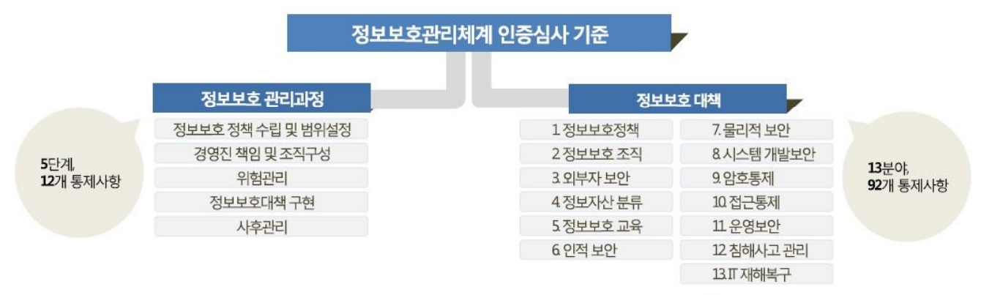
* 정보보호 관리과정 12개
* 정보보호 대책 92개

### 인증 기준의 통합
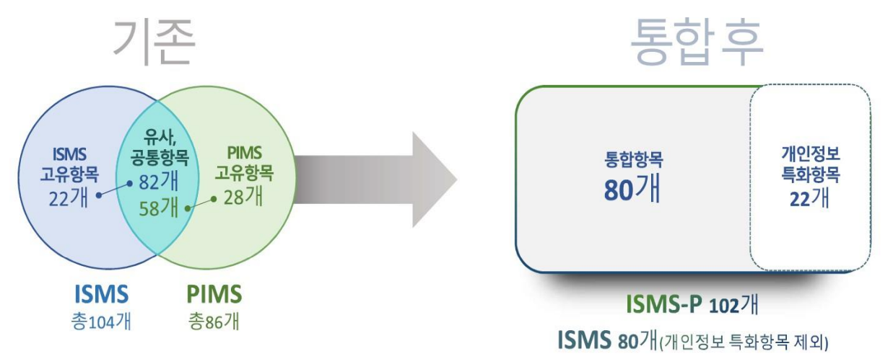
* ISMS 104개와 PIMS 86개가 통합
* ISMS-P -> 102개
* ISMS -> 80개
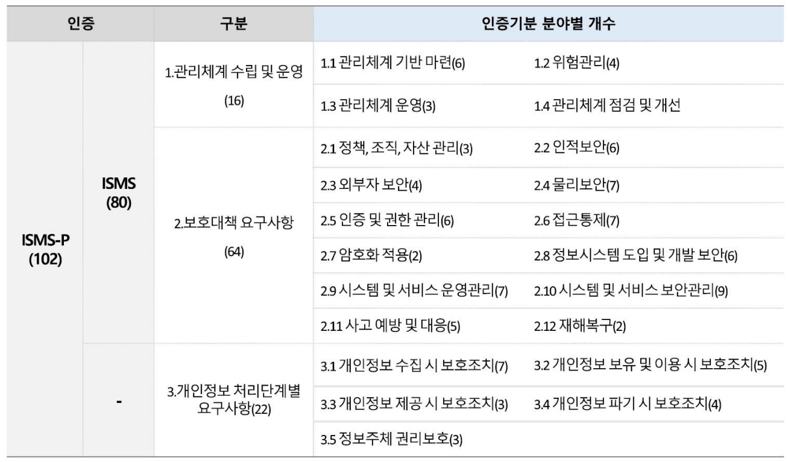
* 신규 추가 항목 3개
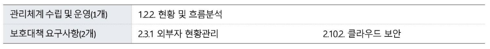

# 보호대책 인증기준
## 정보보호 및 개인정보보호 관리체계 인증기준 구성
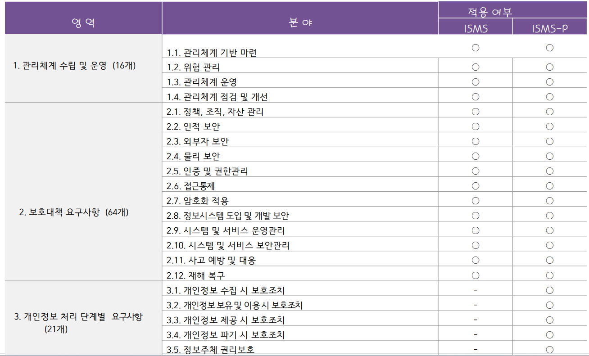
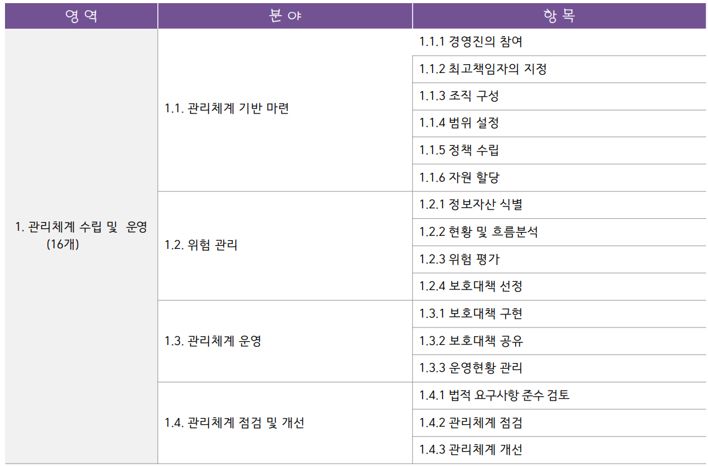

## 개인정보 처리 단게별 요구사항

## PBL 백업

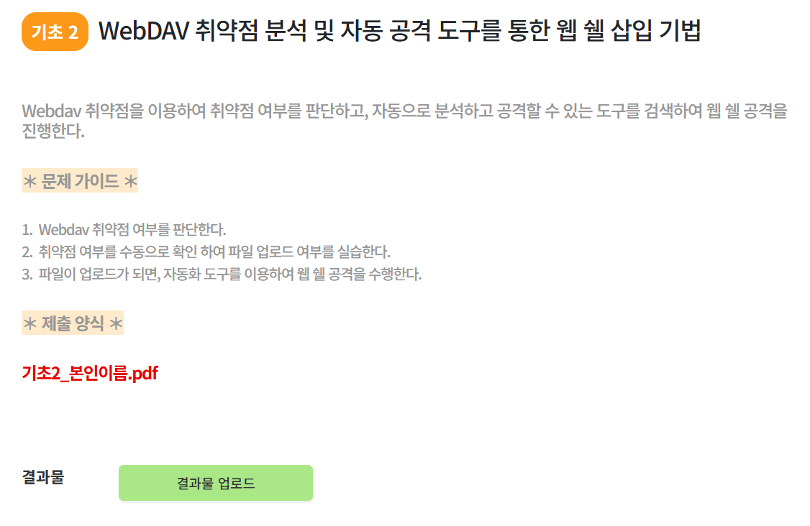
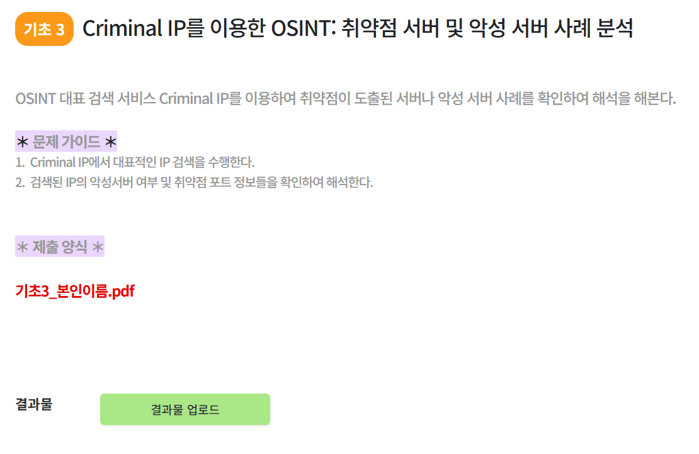
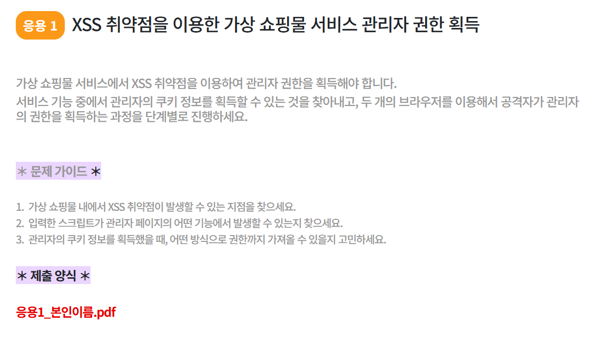

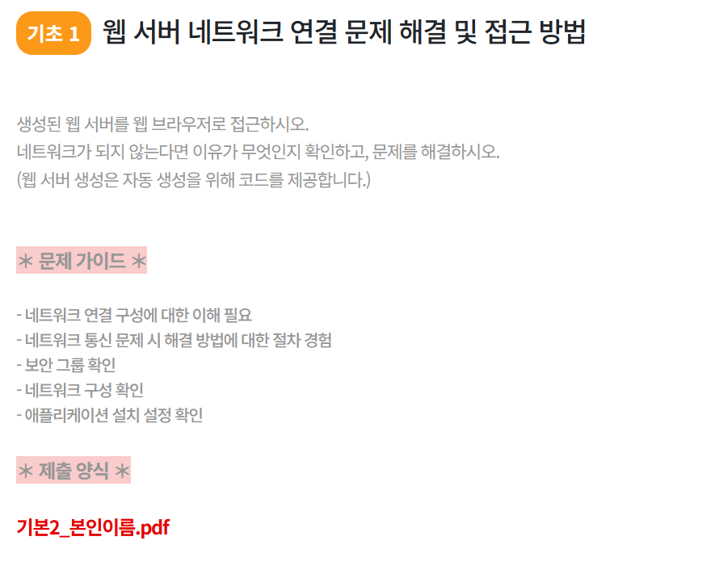
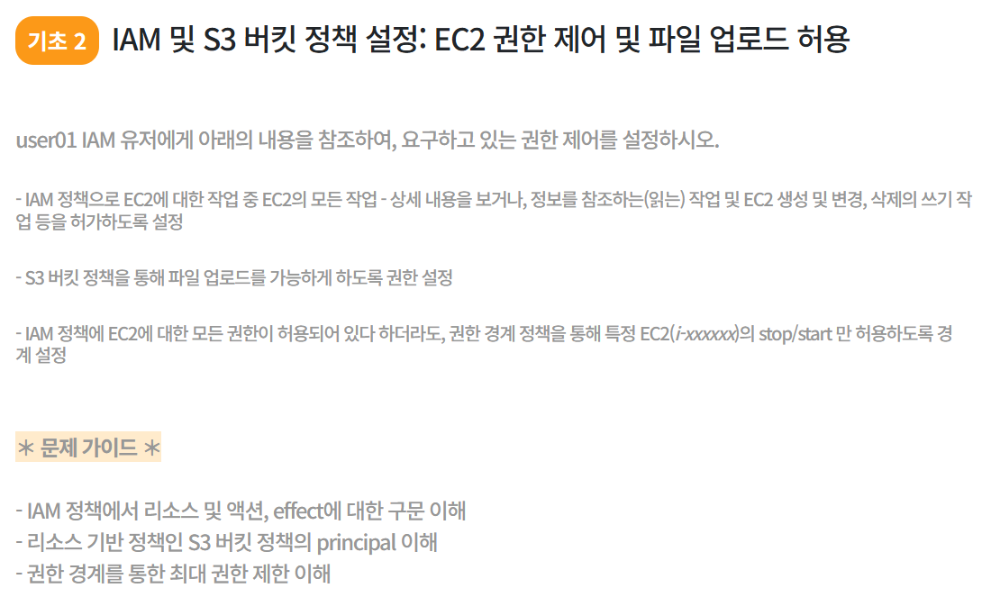
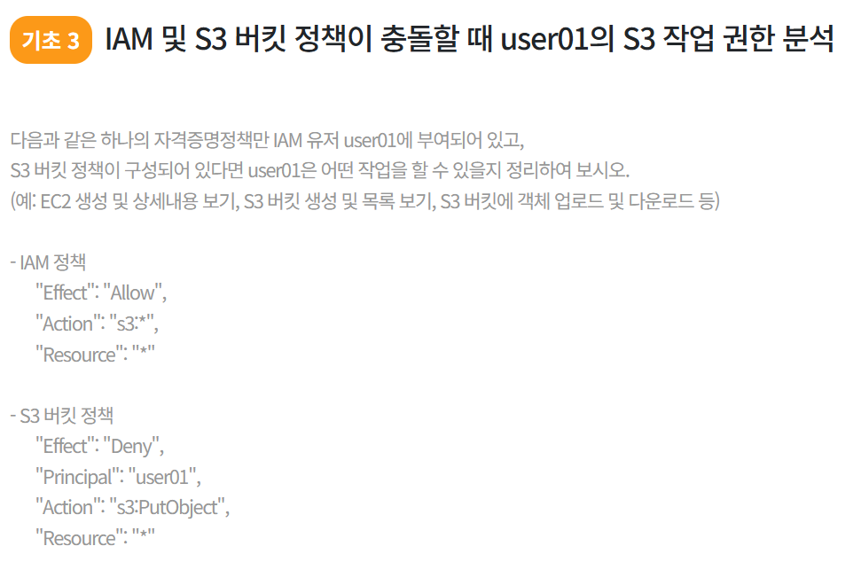
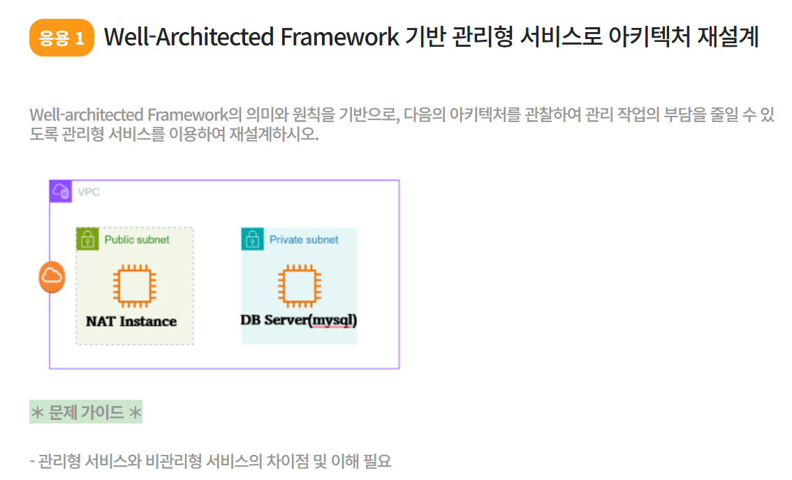
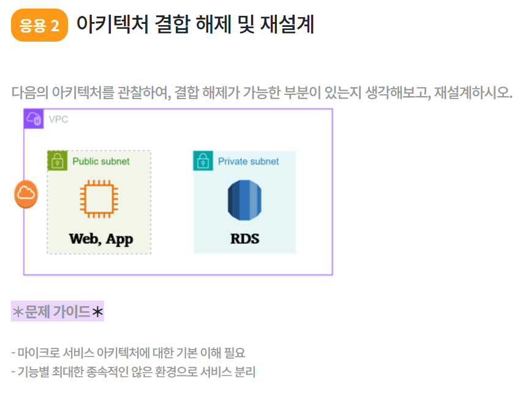
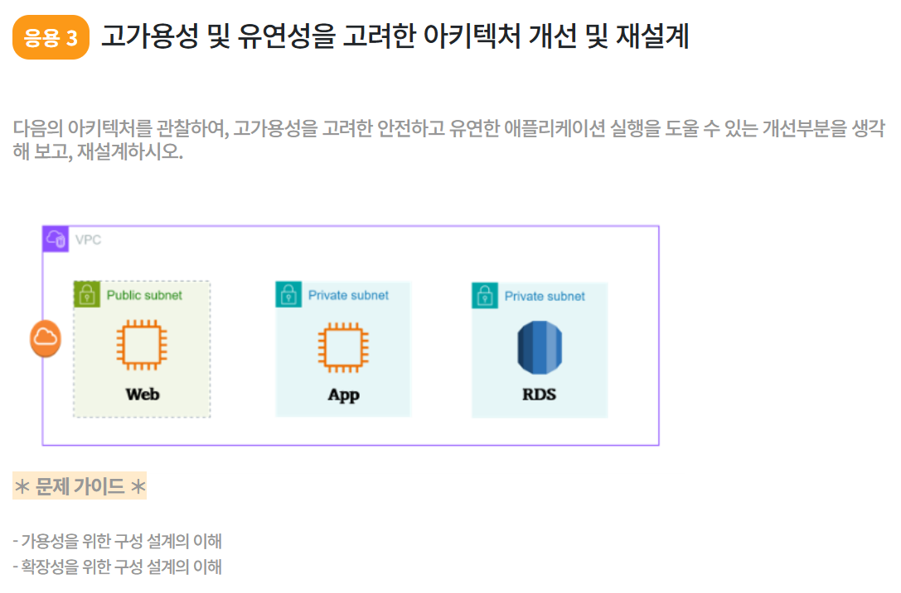