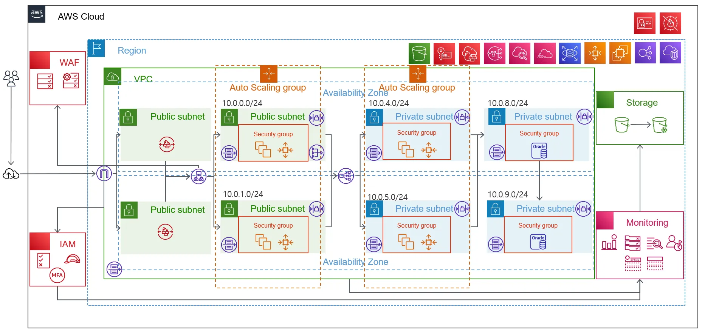

# 모듈 프로젝트
1. VPC 생성
2. EC2, RDS 생성
3. WEB, WAS, DB 구축, Auto Scaling, ELB
4. S3 버킷 생성
5. CloudTrail
6. Cloudwatch
7. WAF, Network Firewall, NAT Gateway   
보고서 작성시는 무력화 하고 작성

## 구축 개요
* 3 tier 웹서버
  * 2티어 -> 서버 <-> 클라이언트
  * 3티어: 서버군 <-> 클라이언트
    * 전통적 서버군: 서버 <-> DB
    * 요즘 서버군: WEB서버 <-> APP서버 <-> DB
    * WEB서버 -> STATIC한 것 HTML, 이미지
    * APP서버 -> process, 데어터를 처리
    * DB -> 데이터 저장
* **모듈프로젝트 구성도를 다시 손으로 그려보자!!**
* Part 4 이후 취약점 진단을 하고 Part5 ~ Part8을 진행하자
  * part4이후 뒤에 방화벽같은데 구동 되면 진단이 어려움
* 3티어로 분리하는 이유
  * web, app, db 각각 최적화 목표가 다름
  * web
    * file만 올리면 됨 -> mem, disk, 네트워크 속도가 중요하겠음
    * CPU 별로 안좋아도 됨, IO속도가 중요하겠음
    * 보안성 중요 -> 가장 앞단이니깐
    * 빠른 접근을 위해 메모리를 사용하는 cache를 사용하는게 좋겠음
  * app
    * io보단 CPU 처리능력이 중요하겠음
  * db
    * Disk 속도 빨라야, CPU도 물론중요
  * ddos 공격 -> 앞단 web만 늘려주면 됨
  * 처리량이 많아짐 -> app 늘려주기

## part8 까지의 구조
화면이 없어도 그릴줄 알아야 함!!   

* AG1 -> web 서버
* AG2 -> APP 서버
* 앞에는 방화벽
* DMZ -> Public subnet 존
* AZ -> a,b,c 하나 죽어도 다른곳에 살아 있음
* HA(High Availiabilty) -> 고가용성
* IGW
* LB -> web, app 앞에
* RDS -> LB 사용 X, replica가 다른 AZ에 있음
* 배경이 없는 마크 -> 주로 리소스
* 아이콘 그리기 -> https://aws.amazon.com/ko/architecture/icons/
* 6대원칙 참고해서 아키텍쳐 작성하기
  * 6가지 다 만족 불가능, trade off
  * 6가지 중 1개를(또는 여러개) 명확히 하라는 뜻
    * 그럼에도 나머지는 최소한 기본은 하자

### 6대 원칙
1. 운영 우수성 원칙
운영시 편리하게 네트웍 및 시스템 구성
2. 성능 효율성 원칙
3. 보안 원칙
보안 원칙 최대화 -> 운영 우수성 감소
4. 비용 최적화
보안 강화, 성능 높일 수 업따..
5. 안정성 원칙
6. 지속 가능성 원칙

## 아키텍쳐 규칙
```
## 아키텍처 참고 사항

1. 화살표는 단방향으로 작성하여 흐름을 표현합니다.
2. 서비스 아이콘은 윗 장의 아키텍처와 같이 가장자리에 서비스 아이콘을 색깔별로 정렬합니다. 리전 서비스의 경우 리전 안쪽 가장자리에 글로벌 서비스의 경우 AWS Cloud 안쪽 가장자리에 정렬 합니다.
3. General Group 아이콘을 사용하여 비슷한 서비스를 묶어줍니다.
4. 서비스에 대한 부분은 꼭 AWS Document에서 확인합니다. (연결 방법, 사용방법 등)
5. 아키텍처를 작성하기 전에 IP List / ACL(Network ACL, Security Group, Network Firewall 규칙)등을 작성하고, AWS 요금 계산기를 통해 예상 금액을 산정합니다.
```
* 빡빡한 아이콘 규칙.. 
  * 크기 정사각형, 뒤집기 X
* 화살표 규칙
  * 대각선 그리지마라, 오픈 에로우
* 아이콘 라벨은 한줄로
* 화살표는 단방향으로 표현
  * <--> 이렇게 하지 말자
* 화살표는 요청을 기준으로 그리기

### TCP/IP
이더넷(MAC) 주소의 한계때문에 사람에게 친숙한 TCP/IP가 나옴
* ARP request -> ip가 누구껀지 브로드캐스트로 던짐

## VPC 생성
* RFC 1918 프라이빗 주소체계 사용 권고
  * 10.0.0.0 - 10.255.255.255 (10.0.0.0/16)
  * 172.16.0.0 - 172.31.255.255
  * 192.168.0.0 - 192.168.255.255
* netmask 255.255.255.0는 ~/24 와 같다
  * 255.255.0.0는 ~/16
  * netmask -> 내가 바라보는 네트워크의 영역
    * 즉 하나의 netmask는 하나의 네트워크
* 5개 예약주소
  * 1 -> 라우터, 2 DNS, 255 broadcast
  * 1번부터 4번까지 못쓰고 255도
* Network ACL은 Subnet에 연결해야 함
* 보안그룹은 인스턴스 레벨
* 라우팅 테이블은 밖에 있는게 아닌 시스템에 집어넣는 개념
* 0.0.0.0/0 -> default gateway 모든 IP

## EC2
* WAS 셋업 후 목업으로 할거니깐 web-sub-1에 