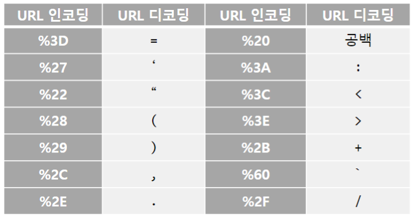
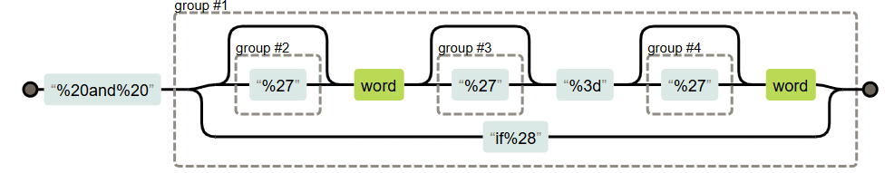
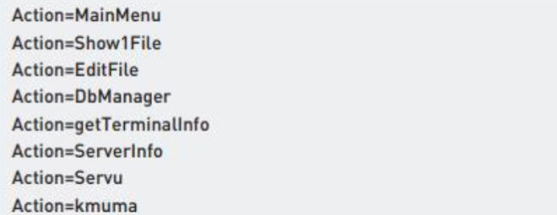
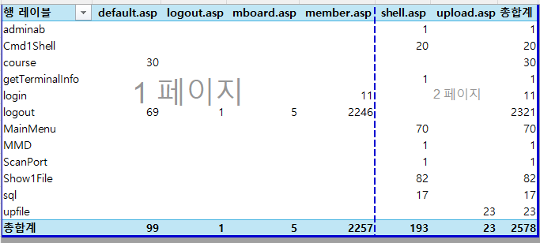
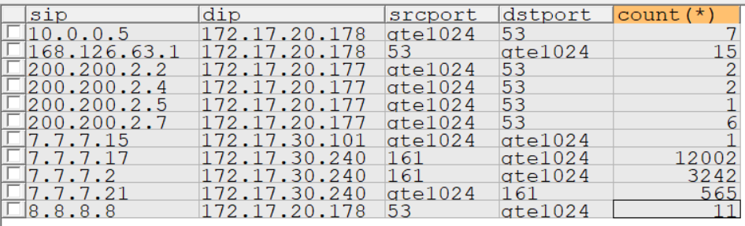
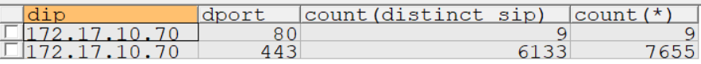

## 룰 최적화
* 임계치 기반 룰
  * 포트 스캔, TCP 플러딩, DDOS
* 패턴 매칭 룰
  * 해킹에 사용된 문자열

## 룰 최적화 - 패턴 매칭 룰 (184p)
` alert tcp any any -> any 80 (msg:”sql-injection-and”; content:”%20and%20”; 
nocase;) `    

#### content: 문자열기반 탐색
* `%20`: SPACE (16진수로 20)
* 결국엔 `빈칸and빈칸` 을 검색하겠다는 뜻
* 웹 요청시 URL의 쿼리파라미터 구분은 `%20`으로 구분함
  * ` GET /www.baidu.com/s?wd=a%20and%20b HTTP/1.1 `

### 인젝션 탐지는 패턴이 왜 저런식이냐?
1. snort 가상머신 실행 후
2. http://192.168.56.101/login.html 접속
3. 로그인 하면 쿼리파라미터 `http://192.168.56.101/login.php?ID=root&PW=no1ids`
4. 서버내 쿼리문 ` SELECT * from users where id='root' AND pw='no1ids' `
5. ` 123'# ` 해커는 먼저 인용부호를 넣어 SQL 문을 완성시킴, 나머지 sql문은 ` # `으로 주석처리 됨
6. 이렇게 넣어보면 ` 123' or '1'='1 `
7. 실행되는 SQL은 ` SELECT * from users where id='root' AND pw='123' or '1'='1' `
8. 즉 `공백and공백` `공백or공백`은 SQL 인젝션 시 주요 패턴임

### SQL Injection Rule SNORT에 적용해보기
1. 윈도우 -> 리눅스 파일전송 `pscp sqli.pcap root@192.168.56.101:/root`
2. `vi /etc/snort/rules/local.rules`로 rule 추가하기
3. vim꿀팁 -> 대문자 A -> 바로 다음줄로 INSERT
4. snort 룰 추가 ` alert tcp any any -> any 80 (msg:"sql-injection-and"; content:"%20    and%20"; nocase; sid:1000001; rev:1;) `
5. `sid-msg.map`파일에 추가된 룰 정보 추가: ` vi /etc/snort/sid-msg.map ` -> `1000001 || sql-injection-and`
6. 반야드 실행 ` barnyard2 -c /etc/snort/barnyard2.conf -d /var/log/snort -f alert.log -w /var/log/snort/barnyard2.waldo `   
-> `-c` 설정파일 `-d` 로그 위치 `-f` 읽어올 로그파일(?) `-w` 결과저장
7. snort 실행 ` snort -r sqli.pcap -c /etc/snort/snort.conf `    
-> `-r` pcap 파일 지정 `-c` 설정파일 위치  
8. SQLyog로 결과 확인 (데이터 부분만)
    ``` sql
    select unhex(replace(d.data_payload, '0D0A', '20'))
    from event a, signature b, iphdr c, data d
    where a.signature = b.sig_id
    and a.sid = c.sid and a.cid = c.cid
    and a.sid = d.sid and a.cid = d.cid
    and b.sig_name = 'sql-injection-and'
    ```
    -> `0D0A` 줄바꿈 문자를 `20` 공백문자로 변경
9.  vim에다가 복사하고 `/%20and%20`을 패턴 검색해보기
10. 버전 정보 이후 부분 선택: ` /http\/.* `
11. 버전 부분 치환 하기: ` %s/// ` (두번째 슬레시 부분 빈칸 -> 삭제)   
-> `%s` 글로벌 옵션
12. 탐지 패턴 부분만 구분해주기 ` %s//ㅋ &ㅋ/ `   
-> `&` 검색 결과 부분, 가장 처음 만난 부분만 치환해줌
13. 같은 줄에 있는 패턴도 구분해주기 ` %s//ㅋ &ㅋ/g `   
-> `/g` 글로벌 옵션, 근데 이러면 뭐 일관성이 없다고 함
14. 엑셀에 3개 필드로 구분해서 넣어주기   
`데이터` -> `텍스트 나누기` -> `구분 기호로 분리` -> `구분 기호 ㅋ`
15. 필드별로 제목 주기 `1번 행 오른쪽 마우스 삽입 클릭`
16. 필드별로 필터 주기 `제목 필드 선택` -> `데이터` -> `필터 클릭`   
-> 필드에 들어가보면 중복된 데이터가 없어진 걸 확인
17. `필터` -> `공격 패턴 선택` -> `중복 데이터 안보임`
18. 바꾸기 `ctrl + H` -> `%20` 을 빈칸으로 변경 -> `%28` 을 소괄호로 변경 -> `%29` 닫히는 소괄호로 변경 -> `%27` 을 작은 따옴표 -> `%3d`를 괄호로 변경 -> `%2c` 콧마로 변경

19. 정규식으로 필터 ` /%20and%20(\d%3\d|if)/gmi `     
괄호부분 `()` -> `1=1` 또는 `if`로 시작하는 패턴 필터
20.  문자를 비교하는 패턴 추가 ` /%20and%20((%27)?\w(%27)?%3d(%27)?\w|if%28)/gmi `   
` if (1=1,BENCHMARK (57200,MD5 (0x41 ) ),0 ) and 'x'='x  ` -> if 뒤에 ` 'x'='x ` 이렇게 문자 비교하는 부분도 있을 수 있음

21.  `local.rule` 파일에 추가 ` alert tcp any any -> any 80 (msg:"sql-injection-and"; content:"%20    and%20"; nocase; pcre:"/((%27)?\w(%27)?%3d(%27)?\w|if%28)/iR"; sid    :1000001; rev:1;)
 `
`i` 대소문자 구분 안함 `R` 이전 검사가 끝난 지점부터 검사 (content 부분이 끝난 부분 지점부터)
23.  snort 다시 실행 (콘솔로 확인)` snort -r sqli.pcap -c /etc/snort/snort.conf -A console `
24.  wirewhark 정규표현식도 확인 ` http matches "%20and%20((%27)?\\w(%27)?%3d(%27)?\\w|if%28)" `    
-> 역슬래시 `\`를 하나 더 추가해야 함
25. AND 양 끝에 +가 있는 패턴: `sqli2.log` vim으로 실행 `/+and+`

### sqli2.log 파일 실습

` /\+and\+((%22)?\w(%22)?%3d(%22)?\w|if%28)/gmi `   

` alert tcp any any -> any 80 (msg:"sql-injection-and"; content:"\+and\+"; nocase; pcre:"/((%22)?\w(%22)?%3d(%22)?\w|if%28)/iR"; sid :1000001; rev:1;) `

### sqli2.log 파일 실습 정답
1. ` /http\/.* `
2. `:%s///`
3. ` /+and+ `
4. ` :%s//ㅋ & ㅋ/ `
5. 복사 붙여넣기 -> 텍스트 마법사 -> `공백기호` 구분 해제
6. 라벨 붙이기 -> 필터 적용
7. `패턴 후` 필드 복제
8. `=` `(` `)` `,` `:` `"` `'` 디코딩
9. `문자=문자` `숫자=숫자` `if함수` 필터
10. 오탐패턴 `node:` `task:`으로 공격 패턴을 만들 수도 있음
11. ` alert tcp any any -> any 80 (msg:"sql-injection"; content:"+and+"; nocase; pcre:"/node:|task:/iR")
 `
12. ` alert tcp any any -> any 80 (msg:"sql-injection"; content:"+and+"; nocase; pcre:!"/node:|task:/iR")
 `   
 => ` pcre:!"/node:|task:/iR" ` -> `node:` 나 `task:` 패턴은 탐지 안하겠다 `!`   
 => 이런식으로 하면 해커의 오탐패턴 공격도 막을 수 있음   
 => 오탐을 피해가는 식임, 근거만 명확하면 사용 (오탐패턴이 2가지만 있음)   
 => 보통은 오탐패턴이 다양해서 이렇게 하기 힘듦, 공격패턴만 골라 주는 것이 일반적

# 웹쉘 PCRE 룰 작성

### ASP 웹쉘의 시그니처

* 무조건 저 패턴이라고 웹쉘 공격이라 하기는 어렵다   
* 최종 탐지 룰   
` alert tcp any any -> any 80 (content:"?Action="; nocase; 
pcre:"/\?Action\=(MainMenu|Show|Course|getTerminalInfo|ServerInfo|Cmd1?Shell|
EditFile|Servu|sql|Search|UpFile|DbManager|proxy|toMdb)/i";) `


## `asp_webshell.log` 탐지 룰 만들기

* ` ?Action ` -> 변수 구간을 탐지하기 위해 `?` 붙임
* `Referer: ` 직전 URI

1. `/http\/.*`
2. ` :%s/// `
3. 이렇게 하니 원하는 결과가 안나옴   
=> `asp?Action=`가 안나옴   
=> `Referer: ` 직전 URI 부분에 원하는게 있음
4. `/\vasp\?action` 로 asp 선택
5. ` g//d ` => 검색된 문자가 포함된 라인을 다 지워버리겠음
6. ` v//d ` => asp가 포함되지 않은 라인 지우기
7. 파일명은 `경로정보/파일명` 의 특징이 있음 -> 파일명에는 슬래시가 들어가지 않는다
8. 슬래시가 아닌 문자만 검색해보기 ` /\v[^/]+\.asp\?action\=\S+ `   
=> `\v` 매직모드 (이스케이프 필요) `[^/]+` 슬래시가 포함되지 않은 문자 하나 `\S+` 빈칸이 아닌문자가 하나 옴
9. `action=logout` 다음에 `&`로 다른 문자가 옴, 이것도 지우고 싶으면 ` /\v[^/]+\.asp\?action\=[^ &]+ `   
=> ` [^ &]+ ` 빈칸도아니고 `&`도 아닌 것이 하나 온다
10. ` [^ &]+ ` -> `\w+` 로 바꿀 수 있음
11. 구분해주기 ` :%s//ㅋ & ㅋ/ `
12. ` /\v^.*ㅋ ` 이러면 ㅋ 두개 모두 적용
13. 최소모드로 1개만 검색하기  ` /\v^.{-0,}ㅋ `
14. 지우기 ` "%s/// `    
=> 또는 엑셀 구분자로 분리해도 됨
15. 엑셀복사 -> 데이터 -> 텍스트 나누기 -> 필터걸기
16. action값 지우기: `ctrl+h`로 `action=`을 빈칸으로 바꾸기
17. 제목고정: 두번째 행 선택 -> 보기, 틀 고정
18. 삽입 -> 피벗 테이블 -> 새 워크시트   
=> 행(X축):file, 열(Y축):param, 값:param
19. `shell.asp` -> 유달리 많은 param을 사용중



### 최종 PCRE 룰
` alert tcp any any -> any 80 (content:“asp?Action="; nocase; http_uri;
pcre:"/asp\?Action\=(MainMenu|Show|Course|getTerminalInfo|ServerInfo|Cmd1?Shell|EditFile
|Servu|sql|Search|UpFile|DbManager|proxy|toMdb)/Ui";)
 `
* 피벗 테이블을 기반으로 만듬
* http_url 부분만 탐지

### 룰을 만드는 두가지 방법
* 블랙리스트 
  * 위험해보이는 문자열 찾기
    * 알려지지 않은 공격 방어 불가능
* 화이트리스트
  * 위험하지 않은 문자열을 회피
  * 알려지지 않은 공격도 방어 가능
    * 하지만 현실적으로 패턴 정의가 어려움
* 패턴매칭 != 공격

## 임계치 기반 룰 최적화
* 대량으로 탐지 로그가 발생한다는 특징 => 그래서 Threshold 사용
  * 일정 시간안에 몇개의 패킷이 발생하면 -> Flooding 공격이다
  * 주로 UDP, TCP Flooding, DDOS 공격

## `notPattern.log` 임계치 룰 실습 (166p)
1. ips 테이블 생성
2. `notPattern.log` 임포트   
=> `Truncate Table` -> 데이터 지우기
3. 갯수 출력 
    ``` sql
    -- 레코드에 모든 필드가 있으면 count
    select count(*)
    from ips
    ```
4.  rule 이름과 갯수 출력
    ``` sql
    -- 같은 rule 끼리만 count
    select rule, count(*)
    from ips
    group by rule
    ```
5.  distinct 사용
    ``` sql
    -- 중복되는 sip 제거
    select distinct sip
    from ips
    where rule = 'ack storm'
    ```
6.  중복제거 후 집계
    ``` sql
    select count(distinct sip)
    from ips
    where rule = 'ack storm'
    ```
7.  rule 별로 중복을 제거하고 집계
    ``` sql
    select rule, count(distinct sip)
    from ips
    group by rule
    ```
8.  sip로 정렬
    ``` sql
    select rule, count(distinct sip)
    from ips
    group by rule
    order by count(distinct sip) desc
    ```
9. udp packet flooding 각 필드 중복없이 집계
    ``` sql
    select count(distinct sip), count(distinct dip),
    count(distinct sport), count(distinct dport)
    from ips
    where rule = 'udp packet flooding'
    ```
10. 4개의 필드가 같으면 갯수를 합침
    ``` sql
    -- sip, dip, sport, dport 전부 다 같은 것끼리 count
    select sip, dip, sport, dport, count(*)
    from ips
    where rule = 'udp packet flooding'
    group by sip, dip, sport, dport
    ```
11. case문으로 추가 가공 -> sport, dport의 범위조건 추가
    ``` sql
    -- port >= 1024 이면 client 포트일 확률이 높음
    -- port >= 1024 -> gte1024로 통일
    select sip, dip,
    case
        when sport >= 1024
        then 'gte1024'
        else sport
    end as srcport,
    case
        when dport >= 1024
        then 'gte1024'
        else dport
    end as dstport, count(*)
    from ips
    where rule = 'udp packet flooding'
    group by sip, dip, srcport, dstport
    ```
12. 결과분석
    
    * dstport 53 -> DNS 서버 트래픽 -> 탐지할 필요 없음
    * srcport 161 -> smtp 트래픽 -> 탐지 할 필요 업ㄳ음
    * 정상 트래픽들은 탐지 안되게 예외처리 필요
13. 보통 클라이언트의 트래픽이 더 많다   
=> src, dst 중 많은 쪽이 클라이언트
14. fingerprint 공격 탐지
    ``` sql
    select count(distinct sip), count(distinct dip),
    count(distinct sport), count(distinct dport), count(*)
    from ips
    where rule = 'fingerprint'
    ```
    * fingerprint: 공격 전에 모든 포트를 스캔해보는 공격
14. dip로 그룹 조건
    ``` sql
    select dip, count(distinct sip), count(*)
    from ips
    where rule = 'fingerprint'
    group by dip
    ```
15. 특정 dip 결과보기
    ``` sql
    select dip, dport, count(distinct sip), count(*)
    from ips
    where rule = 'fingerprint'
    and dip = '172.17.10.70'
    group by dip, dport
    ```
    
    * dport가 80, 443인데 트래픽이 많음 -> 악의적인 트래픽일 수 있음
    * 예외처리를 해야겠음
16. 꿀팁: 처음 시작할떄는 필드별로 집계해보는게 좋음
    ``` sql
    -- 이런식으로
    select dip, count(*)
    from ips
    group by dip
    ```

마크다운 단축키
* =>
* 코드블럭 - sql, shell, python
* `` 감싸기 