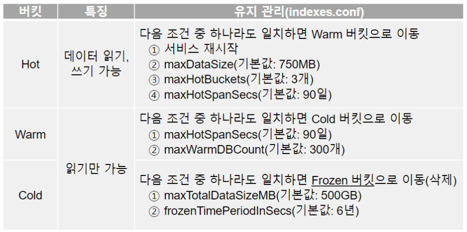
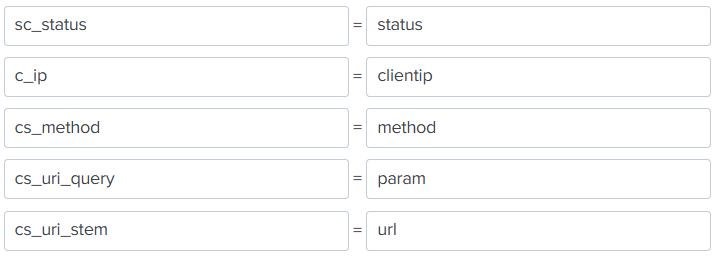
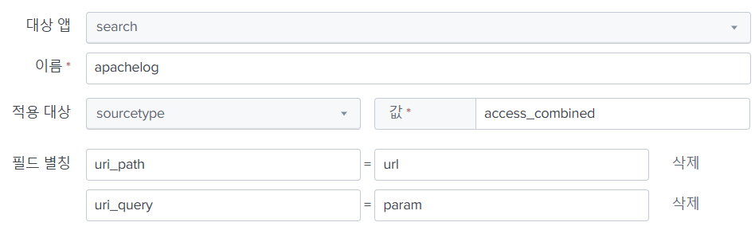
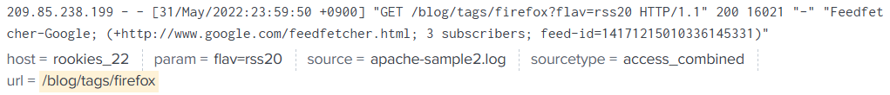
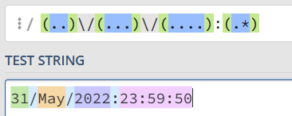

# 이상징후 분석 (Anomaly Detection)
* 통계 분석을 사용
  * 특징: 상태를 세분화할수록 더 잘 알게 된다
  * 데이터베이스 -> 상태(필드)를 분리한 데이터 집합

## 데이터베이스
* 필드 -> 동일 성격의 데이터가 들어가야 함
* 레코드 -> 여러 필드로 구성

## 데이터 분석
* IDS, IPS에서 필터링 된 로그 -> 무의미한 통계
  * 공격이라고 한 번 필터링 된 데이터이므로
  * 룰 정확도 개선 -> 오탐 문제 해결
* 방화벽, 서버 로그 -> 유의미한 통계
  * 필터링 되지 않은 사실 그대로의 데이터임
  * 통계 분석 -> 미탐 문제 해결

# 스플렁크
* 이기종 데이터 분석 플랫폼
  * 여러 기종에서의 데이터 사용 가능
* 두가지 제품이 있음
  * 인덱서: 인덱싱 즉 데이터 저장
    * 인덱서, 포워더, 검색 헤드, 마스터
  * 포워더: 데이터 수집/가공/전송
    * 인덱서에서 포워드 기능만 에이전트로 빼놓은 것   
* 단일노드/클러스터 운영 지원
  * 클러스터 -> 여러 노드로 구성 (가용성)
  * 단일 노드에는 인덱서가 있음
    * 여러 인덱스 필드가 있음
    * HOT, WARM, COLD -> 데이터 파티션 기능

## 인덱스

버킷 종류
* HOT -> WARM -> COLD 순으로
* 조건이 일치하면 데이터 이동
  * frozenTimePeriodInsecs -> 기본값 6년

## SPL
* Search Process Language
* 리눅스 명령어 + SQL 컨셉
  * 검색 -> 가공
* `grep password /var/log/mysqld.log | grep root`
  * 리다이렉션, root가 포함된 것도 검색

### SPL 검색 명령어
`search` 명령어
* 처음 입력시에는 생략

AND, OR, NOT 과 같이 사용 가능
* 대문자로 넣어야 함
* 연산자는 대소문자 구분
* 검색어는 대소문자 구분하지 않음

검색 할때는 값에 큰따음표 안써도 됨 
* `method=post`

다른 명령어는 큰따옴표 필요
* `index=apachelog|where method="POST"`   
post 대소문자도 구분해야 함

원본 데이터에 검색
* `index=apachelog post`   
메소드 필드가 아닌 썡 검색

검색 명령어만 와일드카드(*) 사용 가능
* `index=apachelog referer=*`   
referer 필드에 값이 있는것만 검색해라

### SPL 가공 명령어
`eval` 명령어
* 데이터를 보기 쉽게 변경하고 싶을 때
* 문자열 연산, 숫자 연산
* 다양한 함수 지원 -> `replace`, `split`
* 검색과 달리 값에 큰따옴표 붙여줘야 함

`index=apachelog|eval new="test"`   
=> `new` 라는 필드가 생성

`index=apachelog|eval new=method+status`   
=> `GET200` 이런식으로 문자열이 합쳐짐

`index=apachelog|eval new=method+"_"+status`   
=> `GET_200`

`index=apachelog | eval new="test" | eval new=new+" "+"mode"`   
=> 같은 필드로 여러번 작업, test mode

#### 스플렁크 메뉴얼
* https://docs.splunk.com/Documentation/Splunk/9.3.2/SearchReference/Commandsbycategory
* https://docs.splunk.com/Documentation/Splunk/9.3.2/SearchReference/CommonEvalFunctions

## SPL 통계 명령어
### stats   
SQL 명령어와 비슷   

`index=apachelog | stats count`   
=> 전체 로그 개수 집계   
`index=apachelog | stats count by method`   
=> 메소드별로 집계    
`index=apachelog | stats count by method, status`     
=> 메소드와 응답코드가 같을 때 집계

### chart   
`index=apachelog | chart count by method`    
=> stats와 결과가 같음   
`index=apachelog | chart count by method, status`    
=> 2차원으로 데이터 표시 (엑셀의 피벗테이블같이)

### stats와 chart로 차트 그리기
`index=apachelog | stats count by _time`   
=> 시각화 하면 10000개의 결과만 표시 가능   
`index=apachelog | bin _time | stats count by _time`   
=> 이러면 시간 간격을 자동으로 조절   
`index=apachelog | bin _time span=1h | stats count by _time`   
=> 계산 간격을 1시간 단위로   
`index=apachelog | bin _time | chart count by _time, method`   
=> method 유형별로 차트 표시 (chart -> y축 사용)

### timechart
시계열 차트를 간단히 그리기   

`index=apachelog | bin _time | timechart count by status`   
=> 상태별로, y축도 포함해서 글줌

### 데이터 추가 모드
* `파일 업로드` 모드는 일회성
* `모니터링` 모드는 설정이 저장되어 계속 모니터링 하는 것

### iislog
윈도우 웹 로그

`cs_uri_query` -> 파라미터 `cs_uri_stem` -> uri

윈도우 로그 `index=iislog| timechart count by sc_status` 

아파치 로그 `index=apachelog | timechart count by status` 

`설정 > 필드 > 필드 별칭` 으로 두 로그의 필드 통합 가능

아파치 로그도 필드 별칭 추가

source, sourcetype, host는 기본 필드로 지정하는게 좋음

## Splunk Universal Forwarder
데이터 수집 에이전트
* 웹 UI가 없음
* 컴퓨터 시작시 켜지지 않게 설정
  * 내PC > 오른쪽마우스 > 관리 > 서비스 > SplunkFowarder > 시작유형:수동 변경
  

### 포워더 데이터 연동
* 실시간 모니터 연동    
`splunk add monitor -source 파일경로 –index 인덱스명 –sourcetype 소스타입명`
* 데이터 수신 서버 지정     
`splunk add forward-server 서버IP:9997`
* 수신 서버의 수신 포트 지정    
`splunk enable listen 9997`
* 위 과정들을 인덱서 웹 UI에서도 가능   

### 포워더 디렉터리 구조
* `\bin` 실행파일
* `\etc` 설정파일
* `\var` 로그파일 
* 스플렁크 인덱서도 마찬가지

## 포워더 설정 해보기!
1. 스플렁크에서 인덱스를 만들기     
`C:\Splunk\bin>` -> 데이터 수신 서버, `C:\SplunkUniversalForwarder\bin>` -> 데이터 보내는 서버
2. 수신 포트 설정   
`C:\Splunk\bin>`에서 `splunk enable listen 9997` 실행
3. 스플렁크 인덱서에서  `전달 및 수신 > 데이터 수신` 에서 포트 9997 확인
4. 모니터 설정  
`C:\SplunkUniversalForwarder\bin>` 에서 `splunk add monitor -source "C:\cloud_system\sk\log\elastic\secure-sample.log" -sourcetype linux_secure -index securelog` 실행      
   * `linux_secure`  스플렁크에 미리 설정된 소스타입
   * `-index securelog` securelog 인덱스에 저장
5. 포워더 설정 (데이터 수신 서버 설정)      
`splunk add forward-server localhost:9997`
6. 인덱스에서 securelog 데이터 들어갔는지 확인
7. 검색 `index=securelog` -> `39975개 데이터`
8. `설정 > 인덱스` `설정 > 데이터입력` 에서 기존 인덱스, 데이터 삭제
9. `apachelog` `iislog` 빈껍데기 인덱스 생성
10. `iis_sample.log` 인덱스 생성
`splunk add monitor -source C:\cloud_system\sk\log\elastic\iis_sample.log -sourcetype iis_kr -index iislog`
11. `apache_sample2.log` 인덱스 생성    
`splunk add monitor -source C:\cloud_system\sk\log\elastic\apache_sample2.log -sourcetype access_combined -index apachelog`
12. 엑셀로 `apache_sample2.log` 열기
13. 구분기호 -> 공백 -> 라벨 붙이기
14. `bytes` (전송량) `ctrl + h`로 `-` -> `0` 으로 변경
15. referer `ctrl + h`로 `-` -> `공백문자` 으로 변경    
모든 `-`이 바뀐다는 한계 -> VIM으로 바꾸기
16. 라벨 -> 틀 고정     

17. timestamp 수정  
엑셀의 포맷은 `yyyy-mm-dd hh:mm:ss` -> 이걸로 바꾸줘야 겠음 
18. `ctrl+shift+방향키아래` -> timestamp 필드 데이터만 선택
19. vim에 복사 후 검색 `/[`
20. `:%s///` 로 삭제
21. regex101에서 정규식 뜨기    
`/(..)\/(...)\/(....):(.*)/m`

22. 이를 vim 매직모드로 설정 `\v/(..)\/(...)\/(....):(.*)`
23. `:%s///` ?? 
24. 역참조 기능 사용 순서 변경 `:%s//\3-\2-\1 \4/`
25. `may` -> `05`로 변경 `:%s/may/05`

### 다시해보기
1. vim에서  `/v^(..)\/(..)\/(....):(.*)`    
캡쳐그룹에도 저장 완료
2. `%s//\3-\2-\1 /4/`
3. timestamp 엑셀 형식으로 변경 vim으로
4. 피벗 차트 만들기
5. uri 필드 공백으로 나누기 -> 엑셀에서 잘 안됨 나머지 지워짐
6. uri 필드 선택
7. \s+\S+\s+\S+
8. uri 필드 ㅋ으로 구분
9. 엑셀에 복사
10. uri ? 로 구분 -> 엑셀에서 안됨
11. 엑셀 물음표 
12. 피벗테이블 timestamp는 x축 url y축
13. url 파일 정보도 쪼개기 . 이 있는것만 파일로 하자
14. v/\./d -> 삭제됨..
15. `v/\./s` .이 없는 라인에 대해서만 치환 작업 하겠다
16. v/\./s/// 치환
17. v/\./s///
18. 다시하자 모르겠다
19. 파일정보도 피벗테이블에 넣으니까 255개로 안넣어짐
20. 확장자로 다시 쪼개자.. 