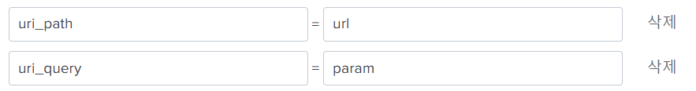
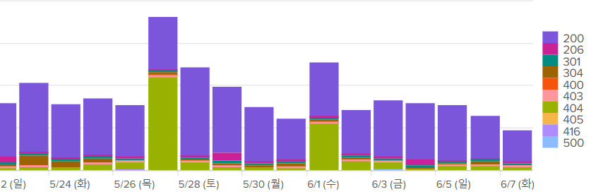
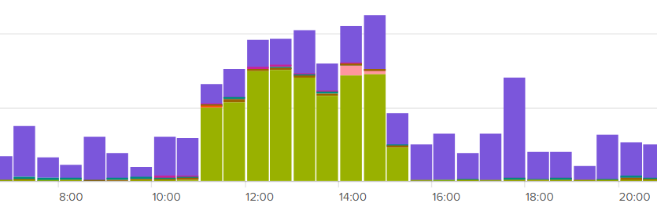
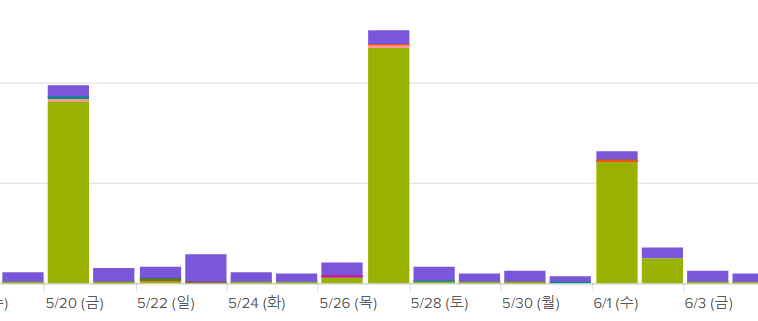
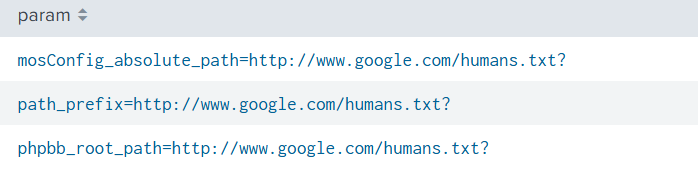
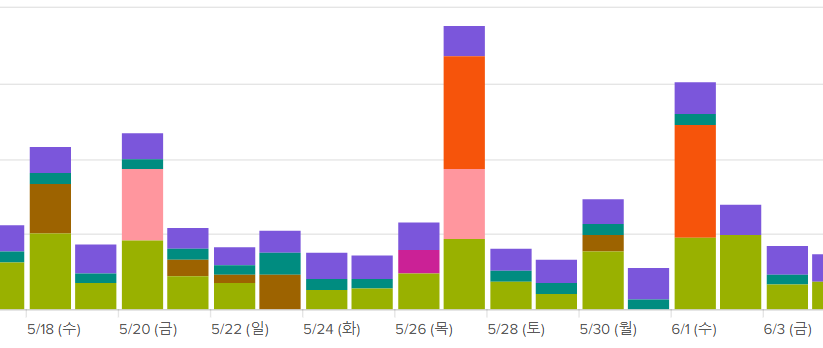
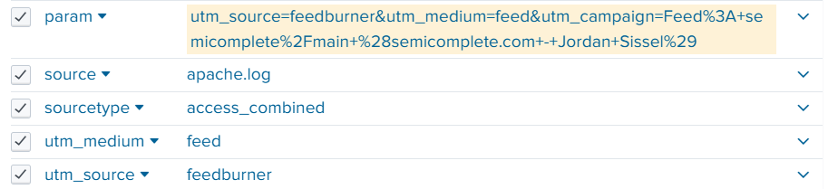

## Splunk DB 연동
1. 추가 앱 찾기 -> Splunk DB Connect -> tar 파일 업로드 -> 다시시작
2. JRE 설정 -> 재시작
3.  `C:\Splunk\etc\apps\splunk_app_db_connect\drivers`에 `mysql-connector-java-8.0.27.jar `넣기
4.  `설정` ->` Databases` -> `Identities` 추가
5.  `Connection` 도 추가    
`jdbc:mysql://192.168.56.101:3306/snort?useSSL=false` SSL 사용 안하기 
6.  `Data Lab` -> `Inputs` -> `connection` 설정     
    ```sql
    -- 이걸로 excute 테스트
    select a.cid, a.timestamp, b.sig_name, inet_ntoa(c.ip_src), inet_ntoa(c.ip_dst), unhex(d.data_payload)
    from event a, signature b, iphdr c, data d
    where a.signature = b.sig_id
    and a.sid = c.sid and a.cid = c.cid
    and a.sid = d.sid and a.cid = d.cid
    ```
    `Batch 옵션` -> 전체 연동, 계속해서 같은데이터를 가져와서 중복이 됨 -> `Rising 옵션` 으로 선택  
    `choose Column` -> `timestamp` 선택
7.  Rising 옵션 추가 설정: `Rising Column` -> `cid` 필드 선택   
    `cid` 필드로 중복이 아닌지를 체크하는 것임
8.  `checkpoint value` 0으로 설정 후 아래 쿼리문 실행
    ``` sql
    -- ? 은 최초로는 0 그 다음에는 이전 설정 값으로 됨
    select a.cid, a.timestamp, b.sig_name, inet_ntoa(c.ip_src), inet_ntoa(c.ip_dst), unhex(d.data_payload)
    from event a, signature b, iphdr c, data d
    where a.signature = b.sig_id
    and a.sid = c.sid and a.cid = c.cid
    and a.sid = d.sid and a.cid = d.cid
    and a.cid > ?
    order by a.cid asc
    ```
9.  `execution frequency` `10`  
`*****` -> 1분마다, 매 시간마다, 매일, 매월, 매요일     
`10` -> 10초 간격으로 
10. `source type` ->  `snortdb`
11. `인덱스` -> `snortdb`
12. `검색` -> `index=snortdb`
13. `datalab` -> `입력 편집` -> `sql alias 추가`, `data_payload 함수 해제`
    ```sql
    select a.cid, a.timestamp, b.sig_name, inet_ntoa(c.ip_src) as ip_src, inet_ntoa(c.ip_dst) as ip_dst, d.data_payload
    from event a, signature b, iphdr c, data d
    where a.signature = b.sig_id
    and a.sid = c.sid and a.cid = c.cid
    and a.sid = d.sid and a.cid = d.cid
    and a.cid > ?
    order by a.cid asc
    ```
14. rule 추가
15. msg.map 파일 설정
16. wget www.google.com 실행 하면
17. db에 로그 저장되고 `index=snortdb`로 확인 가능
18. 페이로드값 파싱하기     
`index=snortdb | eval data_payload=replace(data_payload, "(..)", "%\1") | eval data_payload=urldecode(data_payload)`    
    * `replace(data_payload, "(..)", "%\1")`: 16진수 문자 두개를 캡쳐그룹으로 잡아서 퍼센트 기호 추가
    * `data_payload=urldecode(data_payload)`: 사람이 읽을 수 있는 문자로 디코딩
19. icmp 페이로드값 파싱은 decrypt 함수 사용    
`index=snortdb | decrypt field=data_payload unhex ascii`

## Splunk로 URL 이상징후 탐지
1. `compmgmt.msc` 에서 `SplunkForwader` 중지
2. `데이터 추가` > `apache.log 파일 업로드` > a`pachelog 인덱스 생성`   
3. Splunk는 `읽기 스키마`를 사용하므로 데이터 불러오는 속도가 느림
   * `읽기 스키마`: 검색할 때 테이블을 만들어옴 -> 속도가 느림
   * `쓰기 스키마`: 검색 전에 미리 테이블을 만듦
   * 새로운 필드가 추가된다고 하면 `읽기 스키마`가 유리
4. 필드 별칭 추가   
    
5. 시각화 -> 형식 -> 스택형     
`index=apachelog | timechart count by url` 
6. 탑 20까지 보이게 하기    
`index=apachelog | timechart count by url limit=20`
7. 중복 제거: url 데이터의 고유개수     
`index=apachelog | timechart distinct_count(url)`
8. url 중 status로 분리     
`index=apachelog | timechart distinct_count(url) by status`     
    
27일에 404가 많이 뜨는게 보임
9. 기간을 `22/05/27` 로 설정

10. 기간 `22/05/27` 중 `11:00~15:00` 설정
11. 해당 시간에 404 응답코드가 발생한 url 검색  
`index=apachelog status=404 | stats count by url | sort - count`
12. 파일만 출력하기
`index=apachelog status=404 | stats count by file | sort - count`
13. 파일 확장자만 추출      
`index=apachelog status=404 | eval ext=replace(file, ".*\.(.*)", "\1")`     
    * `(.*)` 확장자 부분 캡쳐그룹 씌워줌
    * `ext` 필드로 확장자 추출 확인
14. `ext`로 집계    
`index=apachelog status=404 | eval ext=replace(file, ".*\.(.*)", "\1") | stats count by ext | sort - count`

## Splunk로 Param 이상징후 탐지
1. param 조회   
`index="apachelog" | timechart distinct_count(param)`
2. 404 에러 확인    
`index="apachelog" | timechart distinct_count(param) by status`

3. `param` `url` `file` `ext` 4가지 필드로 추이 확인
4. `20220527` 기간의 파라미터 확인 (이 때 404 에러가 많음)   
`index="apachelog" status=404 | stats count by param | sort - count`

주로 외부의 링크를 업로드하는 게 많이 보임
   * 웹쉘 공격이 주로 외부 링크를 많이 업로드 함
5. 계산된 필드 추가 -> 평가식 추가 `replace(file, ".*\.(.*)", "\1")`
=> eval 명령어 실행하지 않고도 계산식을 넣을 수 있음
6. 변수 길이 측정 명령어    
param 길이가 늘어날 수록 공격일 가능성이 커짐   
`index="apachelog" | eval param_len=len(param) | timechart avg(param_len) by status`    
    
역시 추이가 같음
7. `eval param_len=len(param)` 계산 필드 추가   
eval 없이 실행 가능 `index="apachelog"| timechart avg(param_len)` 
8. splunk는 param의 변수 필드를 자동으로 생성해줌
    
    * `utm_source` `utm_medium` -> 갖다 쓸 수 있음
    * 변수 필드 단점 -> 속도가 느려짐

### 변수 필드 안만들게 하기  
1. `props.conf` -> 스플렁크 전처리 설정    
   * `https://docs.splunk.com/Documentation/Splunk/9.1.1/Admin/Propsconf` 참고     
   * `KV_MODE`: `key=value` 형태의 데이터들을 필드로 추출해주는 기능   

2.  `KV_MODE` 에 NONE 값 주기    
`"C:\Splunk\etc\system\default\props.conf"` 에서 설정하면 안됨 -> 업데이트시 초기화됨   
`"C:\Splunk\etc\system\local\props.conf"` -> 여기서 설정하자    
    ```
    [acccess_combined]
    KV_MODE = none
    ```
3.  Splunk 재시작: `설정` > `서버 컨트롤` > `다시 시작`
4.  변수 필드가 안만들어짐을 확인

### 대시보드 생성
1. `대시보드` > `새 대시보드 만들기`
2. `대시보드 제목 입력` -> `대시보드 ID도 영어로 입력` > `클래식 대시보드`
3. `입력 추가` > `시간`     
여러개의 차트를 하나의 시간으로 동기화
4. `패널 추가` > `column chart` > `공유된 시간 선택기` > 검색 문자열 입력   
`index=apachelog | timechart dc(url)`   
`index=apachelog | timechart dc(url) by status` 
`index=apachelog | timechart dc(file)`   
`index=apachelog | timechart dc(file) by status`   
5. `ext` `param` 도 차트 생성
6. 300번대 가져오지 않기    
`index=apachelog NOT status=3* | timechart dc(url) by status`
   * 300번대는 보안적으로 의미가 없다고 함