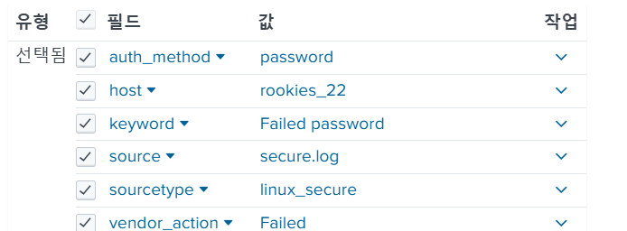

## iislog 분석
1. `iis_kr` 인덱스에 `KV_MODE = none` 추가
2. `.*\/(.*)`로 파일 경로 중 슬래시 제거하고 파일만 가져오기
`index=iislog | eval file=replace(url, ".*\/(.*)", "\1")`
3. 조건문으로 파일 필드만 추출  
`index=iislog | eval file=if(match(url, "\."), replace(url, ".*\/(.*)", "\1"), null()) | stats count by file`
4. 조건문 계산필드로 추가
5. 추출한 파일 필드로 확장자 계산   
`index=iislog | eval ext=replace(file, ".*\.(.*)", "\1") | stats count by file, ext`    
파일 필드가 만들어지고 나서 확장자를 계산할 수 있음 -> 즉 확장자 필드는 url 필드에서 추출하는게 좋음
6. 확장자 계산필드로 추가   
`if(match(url, "\."), replace(url, ".*\/.*\.(.*)", "\1"), null())` -> 다시해보자.. 
7. param 길이 계산  
`index=iislog | eval param_len=len(param)`

## securelog 분석
운영체제 로그임
1. sourcetype: `linux_secure` 추가
2. 프로세스별로 차트 추가   
`index="securelog" | timechart count by process`
3. `transform.conf` 의 `syslog-extractions` 에서    
`\s([^\s\[]+)(?:\[(\d+)\])?:\s` -> process, pid값 추출  

4. 원하는 키워드 직접 추출 -> 공통된 부분 뒤에 두 부분만 추출   
    
`index="securelog"
| eval keyword=replace(_raw, "(\S+\s+){7}(\S+\s+\S+).*", "\2")
| timechart count by keyword`   
   * `(\S+\s+){7}(\S+\s+\S+).*` -> 로그 공통된 부분 제거하고 원하는 부분만 추출     

외부에서 로그인 시도가 많았는데 실패함 -> `sshd`, `Failed password`
5. `pam_` 만 추출 -> `pam_` 이 있으면 따로 조건을 줌
    ```
    index="securelog" 
    | eval keyword=if(
    match(_raw, "pam_"),
    replace(_raw, "(\S+\s+){8}(\S+\s+\S+).*", "\2"),
    replace(_raw, "(\S+\s+){7}(\S+\s+\S+).*", "\2")
    ) 
    | stats count by keyword
    ```
6. 조건 계산필드로 추가후 검색  
`index=securelog | stats count by keyword`
7. 로그인 성공 키워드 확인  
`index=securelog keyword="session opened" | timechart count`
8. ip 만 추출   
    ```
    index=securelog
    | eval clientip=if(match(_raw, "\d+\.\d+\.\d+\.\d+"),
                    replace(_raw, ".*?(\d+\.\d+\.\d+\.\d+).*", "\1"), null()
    )
    | stats count by clientip
    ```
9. 계산필드로 추가 후 재검색    
`index=securelog | stats count by clientip`
1.  vim `sort U` -> 중복제거후 정렬 -> 시간값이 있어서 잘 안됨
2.  `\v^(\S+\s+){7}` -> 시간값 부분 제거
3.  ip 제거 `\v\d+.\d+\.\d+\.\d+`
4.  port 제거 `\vport \d+`
5.  이상태에서 `sort u`
6.  for로 시작 제거 `/\v(for invalid user|for user|for) (\S+)`
7.  splunk에 적용: 사용자만 추출
    ```
    index=securelog 
    | eval user=if(
                match(_raw, "(for invalid user|for user|for) \S+"),
                replace(_raw, ".*(for invalid user|for user|for) (\S+).*", "\2"),
                null()
    )
    | stats count by user
    ```
8. 사용자만 추출 계산 필드로 추가   
`index=securelog process=sshd | timechart count by user`
9. 이중에 session opened된 것도 찾기    
`index=securelog process=sshd keyword="session opened"| timechart count by user`    

10. 원격 접속에 실패한 유저, 사용자 고유개수 변화   
`index=securelog process=sshd keyword="failed password"| timechart dc(clientip)`
11. 로그인 성공 변화 추이   
`	index=securelog process=sshd keyword="session opened" | timechart dc(clientip), dc(user)`
12. `session opened` `accepted password` 검사   
`index=securelog process=sshd keyword IN ("session opened", "accepted password") | transaction pid maxspan=1s`  
1초내에 발생한 데이터중에 `pid` 값이 같으면 하나로 묶음
13. 이 중 둘 다 만족하는 것    
`index=securelog process=sshd keyword IN ("session opened", "accepted password") | transaction pid maxspan=1s | search eventcount=2 keyword="session opened" keyword="accepted password"`
14. 어떤 IP가 둘다 성공했는지 확인  
`index=securelog process=sshd keyword IN ("session opened", "accepted password") | transaction pid maxspan=1s | search eventcount=2 keyword="session opened" keyword="accepted password" | timechart count by clientip`     

하나만 계속 성공하네?

## 리눅스 시큐어 앱 추가
1. `linux-secure-technology-add-on` 이거를 추가하면 securelog 필드가 좀 추가됨  
    
2. `vendor_action` 과 `auth_method` 합치면 `Failed password`      
        
3. `vender_action` 과 `pam_module_type` 합치기   
`index=securelog NOT auth_method=* | eval keyword2=pam_module_type+" "+vender_action`
4. `auth_method`, `vendor_action` 검색     
`index=securelog auth_method=* | stats count by auth_method, vendor_action`

5. 조건문 줘서 필드 나오게 하기
    ```
    -- 세개의 변수가 동시에 나오지 않으므로 조건문을 줌
    index=securelog
    | eval keyword2=if(
                    isnotnull(auth_method),
                    vendor_action + " " + auth_method,
                    pam_module_type + " " + vendor_action
    )
    | stats count by keyword, keyword2
    ```
6. case 구문으로 변경
    ```
    index=securelog
    | eval keyword2=case(
                    isnotnull(auth_method), vendor_action + " " + auth_method,
                    isnull(autho_method), pam_module_type + " " + vendor_action,
                    true(), vendor_action
    )
    | stats count by keyword, keyword2
    ```
7. 안나오는 것도 추가   
    ```
    index=securelog
    | eval keyword2=case(
                    isnotnull(auth_method), vendor_action + " " + auth_method,
                    isnull(autho_method), pam_module_type + " " + vendor_action,
                    true(), vendor_action
    )
    | fillnull
    | stats count by keyword, keyword2
    ```
    * fillnull -> 합칩합을 구할 떄 사용
    * ` stats count by keyword, keyword2 ` 이거는 교집합

### 오늘 강의 사용한 명령어 참고
```
[iis_kr : EVAL-file]
if(match(url, "\."), replace(url, ".*\/(.*)", "\1"), null())

[iis_kr : EVAL-ext]
if(match(url, "\."), replace(url, ".*\.(.*)", "\1"), null())

[linux_secure : EVAL-clientip]
if(match(_raw, "\d+\.\d+\.\d+\.\d+"),replace(_raw, ".*?(\d+\.\d+\.\d+\.\d+).*", "\1"), null())

[linux_secure : EVAL-keyword]
if(match(_raw, "pam_"), replace(_raw, "(\S+\s+){8}(\S+\s+\S+).*", "\2"),replace(_raw, "(\S+\s+){7}(\S+\s+\S+).*", "\2"))

[linux_secure : EVAL-user]
if(match(_raw, "(for invalid user|for user|for) \S+"),replace(_raw, ".*(for invalid user|for user|for) (\S+).*", "\2"),null())
```

# Elastic 데이터 분석 
오픈소스 기반의 풀 텍스트 검색 엔진, 순차적 데이터 처리 구조
* `Kibana` -> 시각화 도구
  * 검색 통계 대시보드
* `Logstash` -> 로그 수집 및 가공
  * input filter output
* `Elasticsearch` -> 데이터 저장 및 인덱싱
  * 데이터 저장 및 인덱싱
  * RDB 형태
  * REST API 제공

## Elastic 구성

* 노드: 실행 단위
* 인덱스: 논리적 데이터 저장 단위
* 샤드: 인덱스에 대한 논리적 디스크 파티셔닝
* 클러스터 모드도 지원 

## 관리형 데이터베이스 vs 엘라스틱서치


## 설치
1. `"C:\elk\elasticsearch-7.13.4\config\jvm.options"` 에서 `-Xms1g` `-Xmx1g` 로 설정    
메모리를 1기가 주는 것
   * https://www.elastic.co/guide/en/elasticsearch/reference/current/important-settings.html#heap-size-settings 참고
1. `"C:\elk\elasticsearch-7.13.4\bin\elasticsearch.bat"` 실행
2. `http://localhost:9200/` 으로 접속
3. 키바나 배치 실행 후 `"C:\elk\kibana-7.13.4-windows-x86_64\bin\kibana.bat"` `http://localhost:5601/` 접속 
4. `"C:\elk\elasticsearch-7.13.4\config\elasticsearch.yml"` 에서 `network.host: 192.168.56.1` 로 수정   
5. cluster master의 ip 지정 `cluster.initial_master_nodes: ["192.168.56.1"]`
6. 이제는 엘라스틱 `http://192.168.56.1:9200/` 로 접속
7. 키바나 설정 `"C:\elk\kibana-7.13.4-windows-x86_64\config\kibana.yml"` 에서   
 `elasticsearch.hosts: ["http://192.168.56.1:9200"]`    
 `server.host: "192.168.56.1` 설정
8. `kibana.bat` 재시작 후 접속 `http://192.168.56.1:5601`
9.  인덱스 생성     
`Management` > `Dev Tools` > `PUT testindex` 실행 > `GET testindex` 실행
10. elastic 인덱스 구조     
    ```json
    {
        "testindex" : {
            "aliases" : { },
            "mappings" : { },
            "settings" : { }
        }
    }
    ```
11. 데이터 입력     
    ```
    PUT testindex/_doc/1
    {
        "key": "value"
    }
    ```
12. 데이터 조회     
    ```
    GET testindex/_search
    {
        "query": {
            "match_all": {}
        }
    }
    ```
13. 삭제 `DELETE testindex`
14. 데이터 업로드

15. 데이터 확인 

16. 인덱스 패턴 등록    

