# Elastic Logstash
## 설정파일
  * `bin\logstash.bat`: 실행파일
  * `logstash.yml`: 로그스태시 프로세스 환경 설정
    * `config.reload.automatic: true`: 파이프라인 설정 시 리로드 자동화
    * `config.reload.interval: 3s`
  * `pipelines.yml`: 데이터 파이프라인 환경 설정
    * `pipeline.id`: 파이프라인 아이디
    * `pipeline.workers`: cpu 개수
    * `path.config`: 파이프라인 위치, 슬래시(`/`)로 경로 구분
  * `Test.conf(임의 작성)`: 데이터 파이프라인(input/filter/output)
  * 문서 참고: https://www.elastic.co/guide/en/logstash/current/introduction.html

## Logstash 세팅
1. `apache_test.conf` 추가  
    ```conf
    input {
        file {
            path => "c:/cloud_system/sk_origin/log/elastic/apache-sample.log"
            start_position => "beginning"
            sincedb_path => "nul"
        }
    }

    filter {

    }

    output {
        stdout {}
    }
    ```
    * `path` 역슬래시간 아닌 슬래시로 구분
    * `sincedb_path` 리눅스 사용시 `/bin/null` 로 사용
    * [input 플러그인 중 file 참고]([https://](https://www.elastic.co/guide/en/logstash/current/plugins-inputs-file.html#plugins-inputs-file-start_position))
2. `logstash-7.13.4\bin` 에서 `logstash.bat -f "C:\elk\apache_test.conf"` 실행  
`Pipelines running` 나오면 잘 실행된거
1. `apache_test.conf`에 grok 플러그인 추가
    ```conf
    filter {
        grok {
            match => {"message" => "%{COMBINEDAPACHELOG}"}
        }
    }
    ```
   * 메시지 필드가 여러 필드로 구분됨
   * [Filter Plugin > grok](https://www.elastic.co/guide/en/logstash/current/plugins-filters-grok.html) : 정규표현식 사용 가능
   * [아파치 로그 패턴 참고](https://github.com/logstash-plugins/logstash-patterns-core/blob/1352/patterns/grok-patterns)   
2. 쓸데없는 필드 지우기     
    * `Common Options`의 `remove_field` 사용
    ```conf
    filter {
        grok {
            match => {"message" => "%{COMBINEDAPACHELOG}"}
            remove_field => ["@timestamp", "@version", "path", "host"]
        }
    }
    ```
    
3. timestamp를 `텍스트 -> date` 유형으로 변경   
    ```conf
    filter {
        grok {
            match => {"message" => "%{COMBINEDAPACHELOG}"}
            remove_field => ["@timestamp", "@version", "path", "host"]
        }

        date {
            match => ["timestamp", "dd/MMM/yyyy:HH:mm:ss Z"]
            target => "@timestamp"
        }
    }
    ```
4. 기존 `timestamp`, `auth`, `ident` 필드 지우기    
    ```
    date {
		match => ["timestamp", "dd/MMM/yyyy:HH:mm:ss Z"]
		target => "@timestamp"
		remove_field => ["timestamp", "auth", "ident"]
	}
    ```
5. elastic search에 저장    
    ```
    output {
        stdout {}
        elasticsearch {
            hosts => "192.168.56.1"
        }
    }
    ```
6. `Kibana` > `Stack Management` > `Index Management`에서 logstash가 왔는지 확인
7.  인덱스 생성     
`create index pattern` > logstash alias 선택 > @timestamp 시간필드 선택
8.  인덱스 탬플릿 보기 Index Management > `Templates`  > `Edit template`

### 참고
* 플러그인 구조
    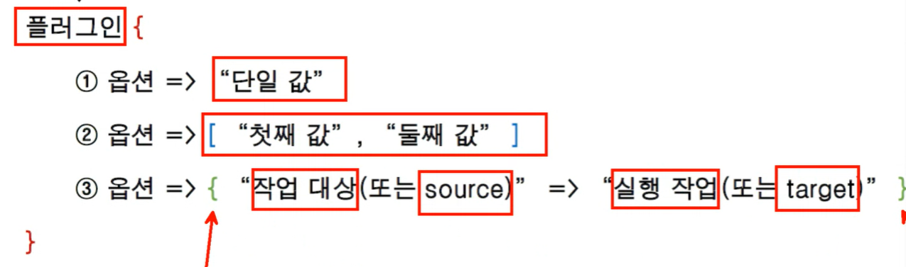
* grok 아파치 로그 패턴
    ```
    # Log formats
    SYSLOGBASE %{SYSLOGTIMESTAMP:timestamp} (?:%{SYSLOGFACILITY} )?%{SYSLOGHOST:logsource} %{SYSLOGPROG}:
    COMMONAPACHELOG %{IPORHOST:clientip} %{USER:ident} %{USER:auth} \[%{HTTPDATE:timestamp}\] "(?:%{WORD:verb} %{NOTSPACE:request}(?: HTTP/%{NUMBER:httpversion})?|%{DATA:rawrequest})" %{NUMBER:response} (?:%{NUMBER:bytes}|-)
    COMBINEDAPACHELOG %{COMMONAPACHELOG} %{QS:referrer} %{QS:agent}
    ```
* [Common Options](https://www.elastic.co/guide/en/logstash/current/plugins-filters-grok.html#plugins-filters-grok-remove_field) : 모든 filter 플러그인이 사용 가능
* [date 필터 포맷 참고](https://www.elastic.co/guide/en/logstash/current/plugins-filters-date.html)

## 원본 apachelog 데이터로 다시해보기
1. 기존 인덱스, 인덱스 패턴 지우기
2. `apache_test.conf` 재설정  
    ```
    input {
        file {
            path => "c:/cloud_system/sk_origin/log/elastic/apache.log"
            start_position => "beginning"
            sincedb_path => "nul"
        }
    }

    ~~중간생략~~

    output {
        #stdout {}
        elasticsearch {
            hosts => "192.168.56.1"
            index => "apachelog-%{+yyyy}"
        }
    }
    ```
    * `path => "c:/cloud_system/sk_origin/log/elastic/apache.log"` 원본 로그로 변경
    * `index => "apachelog-%{+yyyy}"` 인덱스 이름에 날짜정보 추가 
3. kibana에서 `apachelog-2022` 인덱스 생성 확인
4. 인덱스 패턴 생성
5. 인덱스 차트 생성 `aggregation based` > `Vetical bar` 선택
6. X축 설정: `Buckets` > `Date Histogram` > 필드 `@timestamp` 선택
7. 응답코드 확인 설정
   * `split series` > `terms` > `response.keyword`
   * `size 50` -> 더 많은 응답코드
8. 고유개수방식 추가    
`y축 -> Unique Count > request.keyword`
   * 서로 다른 사용자의 request 갯수 측정 가능
1. 검색조건 추가: 300번대 제외하기  
`response > 399 or  response < 300`
1. 차트완성모습
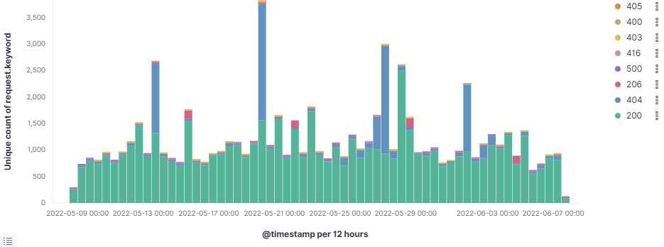
1.  차트 대시보드 없이 저장
2.  대시보드 만들기 `Add from library`

### 참고
* 차트 방식
  * 고유개수방식 -> request의 중복 없앨 수 있음 
  * 개수방식 -> 그냥 로그 Count 한거
* Buckets (X축) 종류
  * `Split Series` : 차트를 쪼개겠다는 것
    * aggregation > Terms 선택
    * x축 막대를 응답 코드별로 나눌 수 있음
    * size 옵션 -> 디폴트로 top 5만 출력함
      * 이거를 넉넉하게 줘야 데이터가 다 보임

## request 필드 분리하기
1. 샘플로그로 변경  
`path => "c:/cloud_system/sk_origin/log/elastic/apache-sample.log"`     
`output {}` 부분 주석처리
2. 조건문으로 uri 분리하기  -> `?` 유무에 따른 분리 
    ```
    filter {
        if "?" in [request] {
            dissect {
                mapping => {"request" => "%{url}?%{param}"}
            }
        } else {
            mutate {
                copy => {"request" => 'url'}
            }
        }
    }
    ```
   * if조건 -> `request` 필드에 `?` 가 있으면
     * `mapping => {"request" => "%{url}?%{param}"}` ?가 있는 애들은 `url`과 `param`으로 분리
   * else조건 -> `?` 가 없으면 그대로 `url`에 카피
3. 변수 길이 필드 만들기 -> `ruby filter` 사용  
    ```
    if "?" in [request] {
        dissect {
                mapping => {"request" => "%{url}?%{param}"}
        }
		ruby {
			code => 'event.set("param_len", event.get("param").length())'
		}
	}
    ```

### 참고
* 에러 메시지 처리
  * 아래와 같은 에러 메시지
      ```
      Failed to execute action {:id=>:main :action_type=>LogStash::ConvergeResult::FailedAction, :message=>"Unable to configure plugins: (ConfigurationError) Something is wrong with your configuration.", :backtrace=>["org.logstash.config.ir.CompiledPipeline.<init>(CompiledPipeline.java:119)", "org.logstash.execution.JavaBasePipelineExt.initialize(JavaBasePipelineExt.java:86)", "C_3a_.elk.logstash_minus_7_dot_13_dot_4.logstash_minus_core.lib.logstash.pipeline_action.reload.RUBY$method$execute$0(C:/elk/logstash-7.13.4/logstash-core/lib/logstash/pipeline_action/reload.rb:53)", "C_3a_.elk.logstash_minus_7_dot_13_dot_4.logstash_minus_core.lib.logstash.agent.RUBY$block$converge_state$2(C:/elk/logstash-7.13.4/logstash-core/lib/logstash/agent.rb:389)", "org.jruby.runtime.CompiledIRBlockBody.callDirect(CompiledIRBlockBody.java:138)", "org.jruby.runtime.IRBlockBody.call(IRBlockBody.java:58)", "org.jruby.runtime.IRBlockBody.call(IRBlockBody.java:52)", "org.jruby.runtime.Block.call(Block.java:139)", "org.jruby.RubyProc.call(RubyProc.java:318)", "org.jruby.internal.runtime.RubyRunnable.run(RubyRunnable.java:105)", "java.base/java.lang.Thread.run(Thread.java:829)"]
      ```
  * vim에서 `,` 단위로 줄바꿈하기 `%s/,/\r/g`
* [ruby 필터의 code 옵션](https://www.elastic.co/guide/en/logstash/current/event-api.html) -> 이벤트 단위로 뭐 설정 가능
  * `event.get(field)`
  * `event.set(field, value)`
  * 루비 스크립트 사용 가능

## disect 필터
* disect 필터는 원본 데이터를 가공에서 분류해주는 역할

1. 테스트 로그 생성 `test.log`  
    ```
    a-b:c
    ```
2. 테스트용 conf 생성 `test.conf`   
    ```
    input {
        file {
            path => "c:/cloud_system/sk/log/elastic/test.log"
            start_position => "beginning"
            sincedb_path => "nul"
        }
    }

    filter {
        dissect {
            mapping => {"message" => "%{field_a}-%{field_b}:%{field_c}"}
        }
    }

    output {
        stdout {}
    }
    ```
    * `mapping => {"message" => "%{field_a}-%{field_b}:%{field_c}"}` : 구분자 `-` `:` 대로 분리됨
3. logstash 옵션 변경하여 재시작 `logstash.bat -f "C:\elk\test.conf"`
4. 잘 분리가 되는 모습  
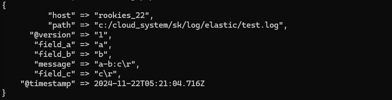

## apache-sample.log 필터 테스트
1. `test.conf` 다시 설정 -> apache-sample.log 로 테스트     
`path => "c:/cloud_system/sk_origin/log/elastic/apache-sample.log"`
2. 삭제할 필드 지정 
    ```
    mutate {
        remove_field => ["@timestamp", "@version", "path", "host"]
    }
    ```
2. message 필드로 분리
    ```
    dissect {
		mapping => {"message" => '%{clientip} %{} %{} [%{timestamp}] "%{method} %{uri} %{}" %{} %{bytes} %{referer} %{agent}'}
	}

	if "?" in [uri]{
		dissect {
			mapping => {"uri" => "%{url}?%{param}"}
		}
	} else {
		mutate {
			copy => {"uri" => "url"}
		}
	}
    ```
    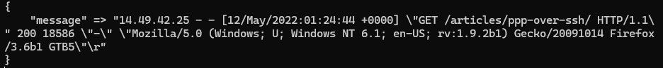
   * 빈칸으로 구분  
   * 중간에 대괄호는 빈칸으로
   * 중간에 큰따옴표가 있으므로 `''` 사용
   * 최종 코드  
    `dissect {mapping => {"message" => '%{clientip} %{} %{} [%{timestamp}] "%{method} %{uri} %{}" %{} %{bytes} %{referer} %{agent}'}}`
3. file 정보만 추출     
    ```
    if "." in [url] {
        grok {
            match => {"url" => ".*\/(?<file>.*)"}	
        }
    }
    ```
4. 최종 설정 파일

    ```
    input {
        file {
            path => "c:/cloud_system/sk_origin/log/elastic/apache-sample.log"
            start_position => "beginning"
            sincedb_path => "nul"
        }
    }

    filter {
        mutate {
            remove_field => ["@timestamp", "@version", "path", "host"]
        }

        dissect {
            mapping => {"message" => '%{clientip} %{} %{} [%{timestamp}] "%{method} %{uri} %{}" %{} %{bytes} %{referer} %{agent}'}
        }

        if "?" in [uri]{
            dissect {
                mapping => {"uri" => "%{url}?%{param}"}
            }
        } else {
            mutate {
                copy => {"uri" => "url"}
            }
        }

        if "." in [url] {
            grok {
                match => {"url" => ".*\/(?<file>.*)"}	
            }
        }
    }

    output {
        stdout {}
    }

    ```

## iislog 테스트
1. cpu 코어 1개만 사용  
`logstash.bat -f "C:\elk\iis.conf" -w 1`
2. message부분 필드 분리    
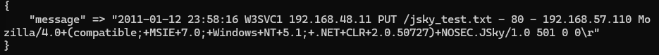
`dissect {
		mapping => {"message" => "%{timestamp} %{+timestamp} %{etc}"}
	}`
    * `{+timestamp}` : 기본 timestamp에 추가
3. 결과 : `message` -> `timestamp`, `etc` 로 분리     
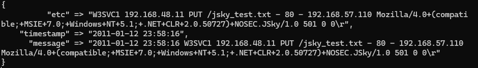
5. 최종 설정파일    
    ```
    input {
        file {
            path => "c:/cloud_system/sk_origin/log/elastic/iis_sample.log"
            start_position => "beginning"
            sincedb_path => "nul"
        }
    }

    filter {
        mutate {
            remove_field => ["@timestamp", "@version", "path", "host"]
        }

        dissect {
            mapping => {"message" => "%{timestamp} %{+timestamp} %{etc}"}
        }
    }

    output {
        stdout {}
    }
    ```

## DB 로그 분리
* 텍스트 데이터가 아닌 것 분리
  * file 플러그인 -> 텍스트 데이터 분리
  * db는 jdbc 플러그인 사용
  * [참고문서](https://www.elastic.co/guide/en/logstash/current/plugins-inputs-jdbc.html)

1. 설정파일 만들기  
    ```
    input {
        jdbc {
            jdbc_driver_library => "C:/cloud_system/sk_origin/tool/elastic/mysql-connector-java-8.0.27/mysql-connector-java-8.0.27.jar"
            jdbc_driver_class => "com.mysql.jdbc.Driver"
            jdbc_connection_string => "jdbc:mysql://192.168.56.101:3306/snort?useSSL=false"
            jdbc_user => "root"
                jdbc_password => "no1ids"
            schedule => "* * * * *"
            statement => "
            select a.cid, a.timestamp, b.sig_name, inet_ntoa(c.ip_src), inet_ntoa(c.ip_dst), unhex(d.data_payload)
            from event a, signature b, iphdr c, data d
            where a.signature = b.sig_id
            and a.sid = c.sid and a.cid = c.cid
            and a.sid = d.sid and a.cid = d.cid
            "
        }
    }
    ```
   * useSSL=false
   * cron -> 기본설정 -> 퀴리문 1분 간격으로 실행
2. 중복 컬럼 가져오지 않기 (컬럼이 아니라 레코드 아닌가?)
   * `and a.timestamp > :sql_last_value` : 마지막 컬럼보다 값이 클때만 데이터 가져오기
3. cid 값으로 비교  
    ```
    use_column_value => true
    tracking_column => "cid
    ```
    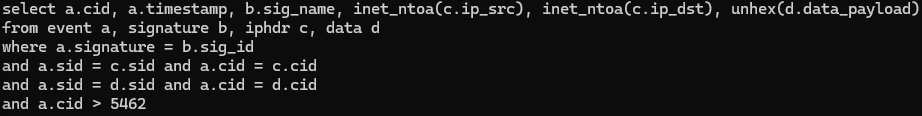
    * cid 값이 클떄만 값을 가져옴
4. elsatic에 저장   
    ```
    output {
        stdout {}
        elasticsearch {
            hosts => "192.168.56.1"
            index => "snortdb-%{+yyyy}"
        }
    }
    ```
5. `Index Management` 에서 확인
6. `barnyard`, `snort` 실행,` wget` 날리기 후 logstash에 뜨는지 확인    
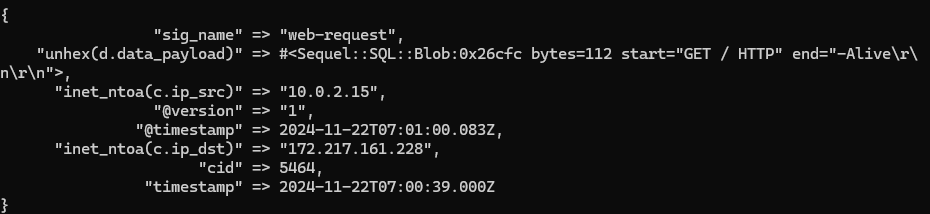
7. 특정 필드에 대한 문자열 인코딩 지정  
`columns_charset => {"unhex(d.data_payload)" => "cp1252"}`
8. 인덱스 패턴 설정     
`Timestamp`, `@Timestamp` 중 `Timestamp` 선택 (snort가 만든거)
9. Discover에서 확인
10. 최종 설정 파일
    ```
    input {
        jdbc {
            jdbc_driver_library => "C:/cloud_system/sk_origin/tool/elastic/mysql-connector-java-8.0.27/mysql-connector-java-8.0.27.jar"
            jdbc_driver_class => "com.mysql.jdbc.Driver"
            jdbc_connection_string => "jdbc:mysql://192.168.56.101:3306/snort?useSSL=false"
            jdbc_user => "root"
                jdbc_password => "no1ids"
            schedule => "* * * * *"
                use_column_value => true
            tracking_column => "cid"
                columns_charset => {"unhex(d.data_payload)" => "cp1252"}
            statement => "
        select a.cid, a.timestamp, b.sig_name, inet_ntoa(c.ip_src), inet_ntoa(c.ip_dst), unhex(d.data_payload)
        from event a, signature b, iphdr c, data d
        where a.signature = b.sig_id
        and a.sid = c.sid and a.cid = c.cid
        and a.sid = d.sid and a.cid = d.cid
        and a.cid > :sql_last_value
        "
        }
    }

    filter {

    }

    output {
        stdout {}
        elasticsearch {
            hosts => "192.168.56.1"
            index => "snortdb-%{+yyyy}"
        }
    }
    ```

## Securelog 연동
1. 설정파일 생성 `secure.conf`
2. dissect 필드로 필드 분리    
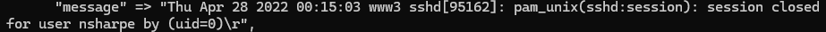
`dissect {
		mapping => {"message" => '%{} %{timestamp} %{+timestamp} %{+timestamp} %{+timestamp} %{host} %{proc} %{etc}'}
	}`
3. 프로세스 필드 pid 있는거 없는거 분류 -> 조건문 사용  
    ```
    if "[" in [proc] {
        dissect {
            mapping => {"proc" => "%{process}[%{pid}]:"}
        }
    } else {
        dissect {
            mapping => {"proc" => "%{process}:"}
        }
    }
    ```
4. pam_unix 있는거 없는거 분류 -> 조건문    
    ```
    if "pam_" in [etc] {
        dissect {
            mapping => {"etc" => "%{} %{keyword} %{+keyword} %{}"}
        }
    } else {
        dissect {
            mapping => {"etc" => "%{keyword} %{+keyword} %{}"}
        }
    }
    ```
5. ip 필드 추출     
    ```
    if [etc] =~ "\d+\.\d+\.\d+\.\d+" {
        grok {
            match => {"etc" => "(?<clientip>\d+\.\d+\.\d+\.\d+)"}
        }
    }
    ```
6. 유저 정보 추출
    ```
    if [etc] =~ "(for invalid user|for user|for) \S+" {
		grok {
			match => {"etc" => "(for invalid user|for user|for) (?<user>\S+)"}
		}
	}
    ```
7. 원본 데이터로 바꾸보기 `secure.log` 그리고 elastic에 저장
8. 인덱스 저장 확인
9. 인덱스 패턴 만들기
10. 최종 설정파일   
    ```
    input {
        file {
            path => "c:/cloud_system/sk_origin/log/elastic/secure.log"
            start_position => "beginning"
            sincedb_path => "nul"
        }
    }

    filter {
        mutate {
            remove_field => ["@timestamp", "@version", "path", "host"]
        }

        dissect {
            mapping => {"message" => '%{} %{timestamp} %{+timestamp} %{+timestamp} %{+timestamp} %{host} %{proc} %{etc}'}
        }

        if "[" in [proc] {
            dissect {
                mapping => {"proc" => "%{process}[%{pid}]:"}
            }
        } else {
            dissect {
                mapping => {"proc" => "%{process}:"}
            }
        }
        
        if "pam_" in [etc] {
            dissect {
                mapping => {"etc" => "%{} %{keyword} %{+keyword} %{}"}
            }
        } else {
            dissect {
                mapping => {"etc" => "%{keyword} %{+keyword} %{}"}
            }
        }

        if [etc] =~ "\d+\.\d+\.\d+\.\d+" {
            grok {
                match => {"etc" => "(?<clientip>\d+\.\d+\.\d+\.\d+)"}
            }
        }

        if [etc] =~ "(for invalid user|for user|for) \S+" {
            grok {
                match => {"etc" => "(for invalid user|for user|for) (?<user>\S+)"}
            }
        }

        date {
            match => ["timestamp", "MMM dd yyyy HH:mm:ss"]
        }
    }

    output {
        stdout {}
        elasticsearch {
            hosts => "192.168.56.1"
        }
    }
    ```

## Elastic 지도 차트 그리기
* splunk는 쉽게 가능
* elastic은 좀 까다로움
    * logstash로 설정하면 `geoip` 필드가 생성됨

1. `geoip` 추가   
    ```
    geoip {
        source => "clientip"
    }
    ```
2. `geoip location` 확인  
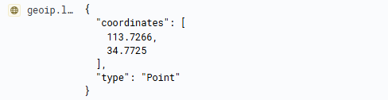
3. `Maps` > `Add layer`
4. 나라, 도시 표시 
* Tooltip -> 추가 필드 > `geoip.city_name`, `geoip.country_name`
5. `Boundaries source` > `world 뭐시기` 
* Join 필드가 일치하면 표시
6. 완성..!  
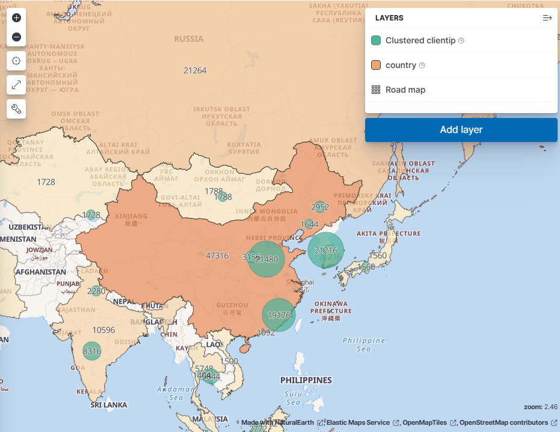