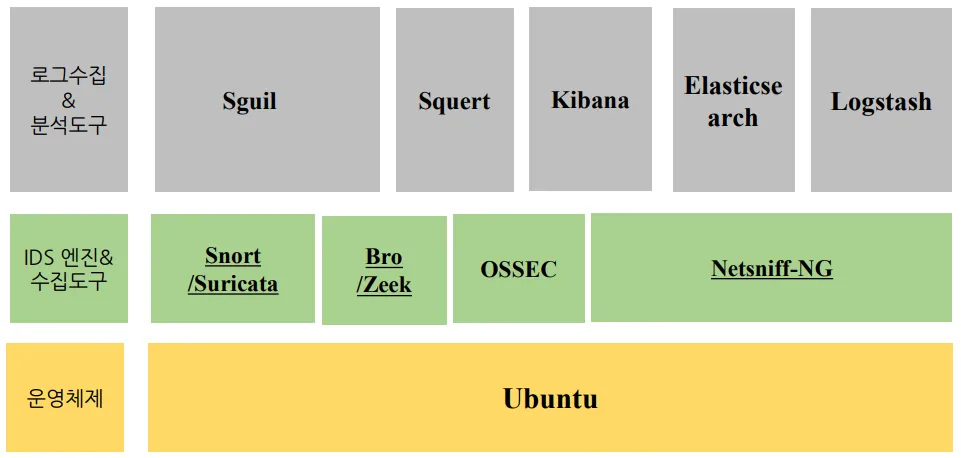
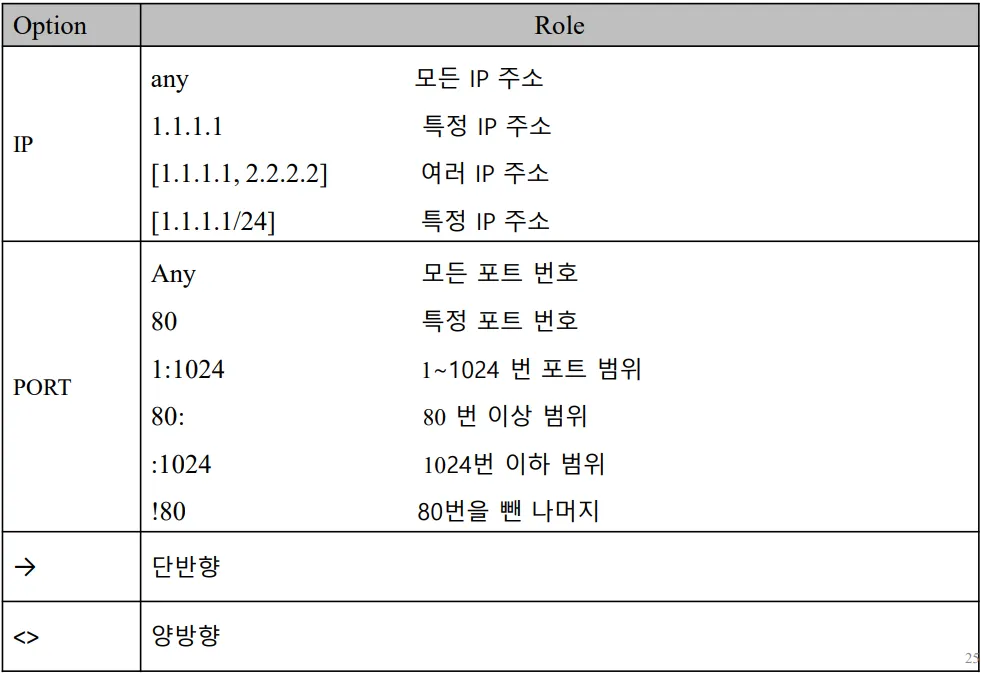
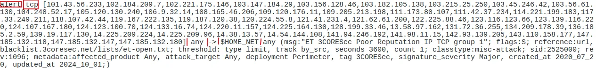
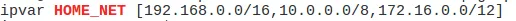
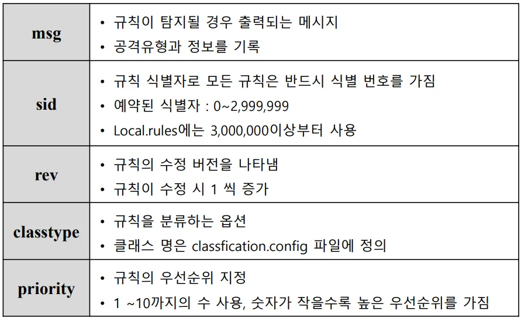
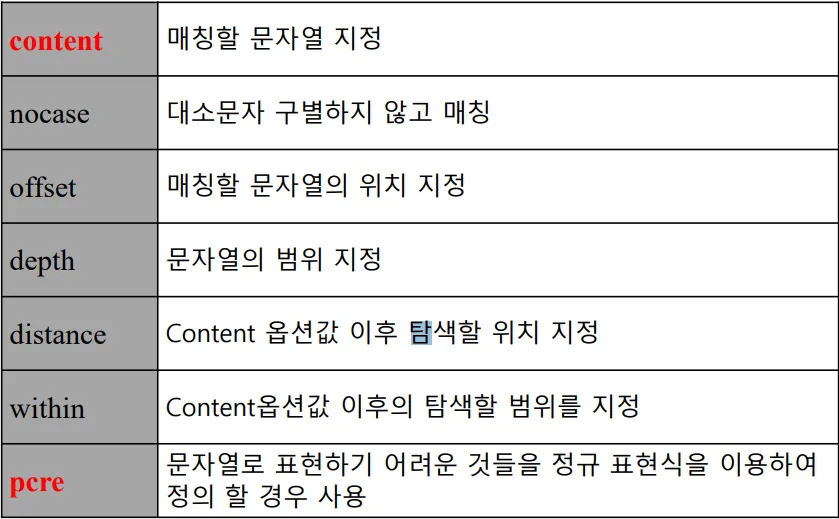
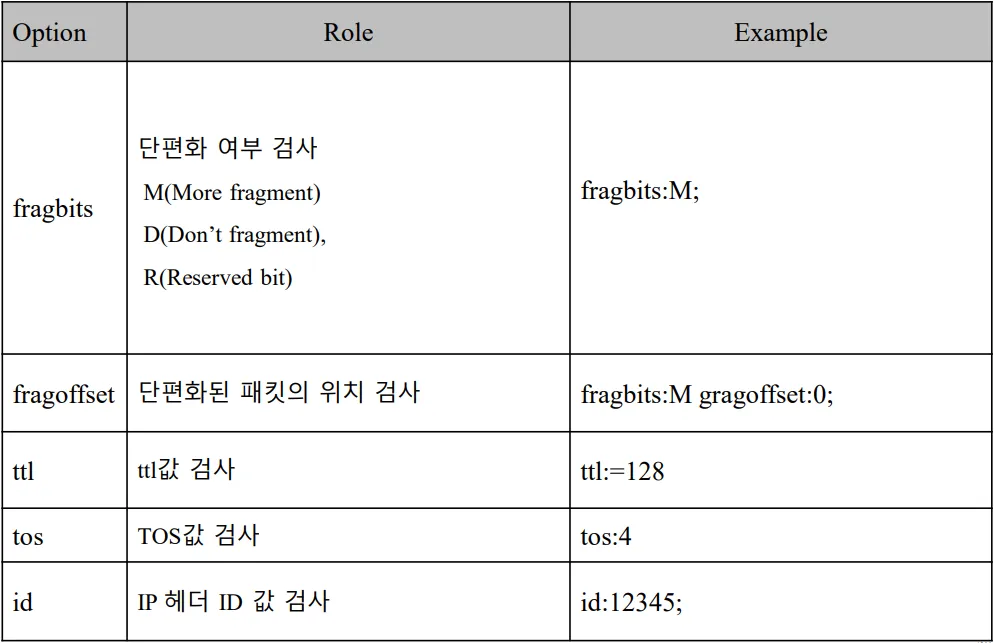
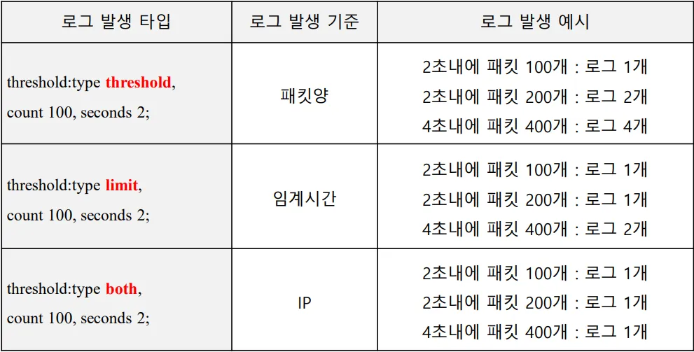
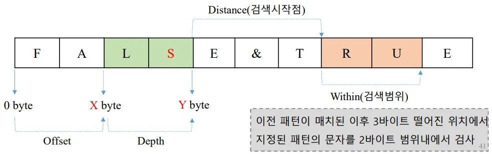

## NSM (Network Security Monitoring)

* 네트워크 보안 모니터링을 위한 다양한 도구와 인프라를 제공
    * 네트워크 상의 이상 징후를 탐지하고 대응하는데 도음을 줌
* IDS 기능 수행뿐 아니라 다른 기능도 수행
    * 수집도구, 분석도구, 침입 탐지 시스템이 함꼐 동작
* 관제장비
    * H/W + OS + 보안관제 S/W 다같이 있음

## 리눅스

* 리눅스 배포판
    * 커널 + 유틸리티 + 애플리케이션 프로그램
* 데비안 -> 프로젝트 팀(기부) -> 보안용 애플리케이션 활성화
    * 데비안, 우분투(캐노니컬)
* 레드햇 -> 레드햇 회사 -> 기업용 애플리케이션이 활성화
    * Fedora(무료) -> RHEL(유료) -> CentOS Stream
    * CentOS(무료, Stable) -> Locky Linux
* 데이터 센터 가서 근무할거다 -> Locky Linux 공부
* 보안쪽 공부할거다 -> Ubuntu 공부
    * 우리가 사용하는 보안 프로그램 거의다 우분투 베이스

## Security Onion

* 보안 모니터링 및 이상 징후 탐지를 위한 오픈 소스 플랫폼
    * OS + 도구
* 베이스 운영체제: Ubuntu
* 보안 모니터링(NSM)과 침입탐지시스템(IDS) 역할 수행
    * 수집도구: Netsniff-NG
    * IDS 엔진: Snort/Suricata, Bro/Zeek, OSSEC
    * 로그수집 & 분석도구: Sguil, Squert, Kibana, Elasticsearch, Logstash

### Security Onion 도구 - IDS 엔진

#### HIDS (호스트기반탐지)
1. OSSEC 
#### NIDS (네트웍기반탐지)
2. Snort   
시그니처 기반의 엔진
    * 오용탐지, 시그니처 룰을 정해서 탐지하는 것
    * 시그니처 기반이란? -> 침입탐지를 **문자열**로 판단하는 것
        * 악성코드의 고유한 공격 패턴이 있음
        * 패킷 데이터에서 악의적인 문자열읠 탐지하여 침입여부를 결정
3. Suricata   
OISF에서 오픈 소스로 개발한 NIDS/IPS
    * 멀티 코어 및 멀티 스레드 지원: 대용량 트래픽 실시간 처리
        * Snort Rule 완벽 호환, 대부분 기능 지원
        * 하드웨어 가속 지원
        * 스크립트 언어 Lua 지원
4. Squil, Kibanafke   
Suricata를 GUI, Web 기반으로 사용할 수 있음 
4. Bro/Zeek   
이상징후 기반 엔진
    * 이상징후탐지
    * 로그 분석 가능
        * IP헤더, TCP 헤더를 분석
        * 응용 프로토콜의 헤더 분석
            * FTP, HTTP, SMTP, X.509
    * 16.04 -> Bro (우리가 쓰는 버전)
    * 16.07 -> Zeek

### Security Onion 도구 - 분석 도구

## PB2 과제

1. 인터넷
    * 인라인 모드 IPS, IDS
        * Out Of Path 모드
            * 한줄이 아니라 경계에서 벗어난 것
    * 라우터
        * 통신사업자와 연결
2. 인트라넷
    * 워커존
    * 인트라넷 서버
        * DB서버
        * 서버가 많으므로 백본스위치를 L4스위치 이상을 써야 로드밸런싱 가능
    * 백본 스위치
        * 게이트웨이 역할
    
3. DMZ
    * 웹서버가 메인
    * DMZ 스위치
        * 게이트웨이 역할?
    * L4 스위치
        * 로드밸런싱 역할
    * 웹방화벽
        * 웹서버가 있으므로 웹 트래픽이 옴

## Security Onion 설치
1. 리눅스(Security Onion) 설치
    * id: boan
    * pw: 1234
2. 도구 설치
    * Standalone 모드 -> 수집과 분석 같이
    * Distribute 모드 -> 분석과 수집을 분리
    * id: boan
    * pw: 123456
    * IDS ruleset
        * 유료와 무료가 있음
    * cd /etc/nsm
        * IDS 엔진(OSSEC, SNURT, SURICATA)이 있음
    * cd /etc/nsm/templates/snort/snort.conf
        * snort 환경설정
    * nmap -sS 192.168.10.20

## Snort
* 시그니처 기반 네트워크 침입탐지 시스템 (NIDS)
    1. Sniffer  
    네트워크 패킷을 수집
    2. Packet Decoder  
    수집된 패킷을 Preprocessor와 Detection Engine이 파싱할 수 있도록 정규화
    3. Preprocessor  
    특정 행위가 발견된 패킷을 탐색 엔진에 전송
    4. Detection Engine  
    해당 패킷이 Snort Rule과 매칭 되는지 확인
    5. Alert/Log  
    Snort Rule과 매칭 된다면 콘솔 창 또는 분석 도구에 경고를 출력하고 기록

## Snort Rule Header
1. Action  
탐지되면 어떻게 처리할까?
* alert: 경고를 발생, 로그를 저장
* log: 패킷을 로그로 저장
* pass: 패킷을 무시
* active: 경고를 발생시킨 다음 다른 동적 규칙 활성화
* dynamic: Active 옵션으로 활성화
2. In-Line 모드로 IDS가 배치된 경우
* drop: 패킷을 차단 한 후 로그로 저장
* reject
    * TCP는 차단 및 로그 저장 후 세션을 리셋(RST 전송)
    * UDP는 차단 및 로그 저장 후 ICMP Port Unreachable 메시지 전송
* sdrop
    * 패킷을 차단하지만 로그는 남기지 않음
3. Protocol   
모니터링할 패킷의 프로토콜 타입 정하기
* tcp, udp, icmp, ip
4. Src IP
5. Src Port

#### IP, Port

* 규칙헤더 예시
* alert tcp any any -> any any
    * 모든 IP Port에서 모든 IP Port로 경고 발생 및 로그 저장

#### downloaded.rules
* 관제 룰 모음
    * 설정할때 다운받아진 파일
* cat /etc/nsm/rules/downloaded.rules | less

    * 하나의 Rule
    * $HOME_NET 변수로 값을 정의 가능
        * cat /etc/nsm/templates/snort/snort.conf
        * 

## Snort Rule Option (규칙옵션)

규칙 헤더에 해당하는 패킷 중 특정 패턴(문자열)을 정의해 놓은 영역
* 일반 옵션
    1. msg
        * 규칙이 탐지될 경우 출력되는 메시지
        * 공격 유형과 정보를 기록
    * sid
        * rule의 식별 번호
        * 예약된 식별자 0~2,999,999
        * Local.rules은 3,000,000이상부터 사용
    * rev
        * 규칙의 수정 버전을 나타냄
            * 수정 시 1 씩 증가
    * classtype
        * 규칙을 분류하는 옵션
        * 클래스 명은 classficartion.config 파일에 정의
    * priority
        * 규칙의 우선순위 지정
        * 1 ~ 10까지의 수 사용
        * 숫자가 작을수록 높은 우선순위를 가짐
* 흐름 옵션
* 페이로드 옵션
    * 악성 패킷을 탐지하는 옵션
    * 문자열 지정
        * content: "adminstrator";
    * 숫자 지정
        * content: "|12121|"
    * 정규표현식 지정
        * pcre: "/^select/";
* 예시
    * alert icmp $EXTERNAL_NET any -> $HOME_NET any (msg:"GPL ICMP_INFO~")

## Payload 옵션

악성 패킷을 탐지하는 옵션 -> 각 옵션의 의미 파악 중요!!  
* content
    * 문자열 지정
        * content: "adminstrator";
        * content "|3C|OBJECT"
            * 3C가 있는 문자열을 알려줘
    * 숫자 지정
        * content: "|12121|"
* nocase -> 대소문자 구별하지 않고 매칭
* offset
* depth
* distance
* within
* pcre -> 문자열로 표현하기 어려운 것을 정규 표현식을 이용하여 정의

#### HTTTP 관련 옵션 등

## 패스워드 크래킹
* Kali에서 Meta로 telnet 로그인 실패하기
* 패스워드 크래킹의 시그니처:
    * Login incorrect

### 패스워드 크래킹 탐지 정책 만들기
1. /etc/nsm/rules/local.rules 파일에 규칙 추가
    * alert tcp 192.168.10.20/32 23 -> 192.168.10.10/32 any (msg: "Telnet Fail"; content:"login incorrect"; nocase; sid:3000001;)
    * 로컬에서 만들었으므로 sid:3000001
    * threshold -> 제한을 두는 것

### Snort 규칙 업데이트

* /etc/nsm/rules/local.rules 에다가 rule을 추가
* rule-update 명령어 입력
    * ok가 4개 뜨면 규칙 업데이트 완료
    * 오타가 있으면 56페이지 참고
        * nsm --sensor --restart --only-snort-alert

### Threshold

* 동일한 특정 패킷이 설정한 시간안에 특정 수가 발견되면 경고 알림을 출력해주는 것
* threshold:type threshold, count 100, seconds 2;
    * 패킷 양 제한
    * 2초에 200개 가면 로그 2개
* threshold:type limit, count 100, seconds 2;
    * 임계시간 설정
    * 2초에 200개 가면 로그 1개
* threshold:type both, count 100, seconds 2;
    * 무슨 조건이든 로그 1개
    * IP

## Detection Rule
* depth: 
    * offset과 묶어서 이해
        * 디폴트는 0
* offset: 0바이트에서 점프하는 거리
* distance: 검색 시작점
    * widthin과 묶어서 이해
* widthin: 검색범위

## Detection Rule Example
Detection Rule 예제 -> 보안기사에 나오는 거 정리함!

* alert tcp $EXTERNAL_NET any ⟶ $HOME_NET any (msg: “ TEST”; content: “S”; offset:2; depth:2; content: “R”; distance:3; within:2; sid:1000001;)
    * offset 다음 부터 depth 길이만큼 에서 content 내용이 있는지 찾는다 패턴이 검색이 된후(content 내용찾은 후) distance 떨어진 위치부터 within:2 범위만큼 content 내용을 찾는다

### 정규표현식
* ^ 가장 앞부분
* $ 가장 뒷부분
* . 모든 문자 하나를 의미
* (a|b) a, b 둘 중 하나는 와야함
* ? 앞에 있는 문자가 0개 또는 1개 임을 의미
* \* 앞에 있는 문자가 0개 또는 1개 이상인 경우
* {x,y} 앞에 있는 문자가 x개 부터 y까지 문자의 수가 나오는 경우
* [A-Z]{3} A 부터 Z 까지 문자가 3개가 있다