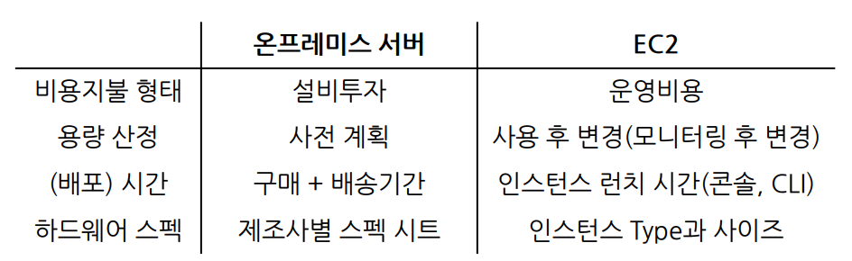

## 클라우드 보안 기술
* 서기옥 강사님
* seokiock@gmail.com

## 참고자료
* AWS 도큐먼트 https://docs.aws.amazon.com
* AWS 자습서 https://aws.amazon.com/ko/getting-started/hands-on
* 주교재: 그림으로 이해하는 AWS 구조와 기술
* 그림과 작동 원리로 쉽게 이해하는 AWS 구조와 서비스

### AWS 클라우드 개요
* 클라우드와 온프레미스 비교
    * on-premise: 기존의 전산실, 기업이 소유하는 서버,
* Well-Archited 클라우드
* AWS 보안, 모니터링, 로그 서비스 이해
* EC2: 컴퓨팅 서비스
* IAM: 인증과 권한 제한
* CloudWatch: 모니터링
* ELB: 클라이언트의 다수 요청에 대한 분산을 시킴
* 오토 스케일링:
* S3: 스토리지 서비스
    * 대표적 기능은 파일 업로드, 다운로드
* CloudFront: S3의 캐싱 서비스
* VPC: Private한 네트워크 Frame을 만드는 서비스
    * 모든 서비스의 네트워크 구성을 도와줌
* RDS: 관계형 데이터베이스 서비스
    * NoSQL: NOT ONLY SQL -> 관계형 DB만이 아니다 라는 뜻! -> DynamoDB
* Route53: DNS 서비스 (name -> ip address)
* AWS Lambda: Serverless
    * 서버가 없는게 아닌, 서버를 생성하거나 관리할 필요가 없는 것
    * EC2 생성 없이도 바로 코드를 올려서 애플리케이션을 실행 가능

### 선수지식
* 네트워크 기본 지식
    * 네트워크 프로토콜
    * IP 주소 체계
    * 게이트웨이
    * 라우팅 테이블
    * 리모트 로그인
* 데이터베이스 기본
    * SQL 명령어 기본
* 스토리지 기초
    * DAS, NAS, SAN

### AWS 소개 및 기초지식
* 클라우드 컴퓨팅 서비스
    * internet (상에서)
    * IT 리소스 (를 제공)
    * On-demand: 요구시 즉시
    * 종량 요금제: 사용한 만큼만 지불
* 온프레미스
    * 용량 산정 필요 -> 추후 3년에 요정도 CPU, 메모리가 필요하겠다 산정

### 아마존 웹 서비스
* 대부분 하이브리드 환경으로 구성
    * 일부의 서비스를 AWS로 이관하고 중요 서비스는 온프레미스로 두는 것
* ISMS, CSA등 국내외 법적 보안, 인증 기준을 준수
* 200개 이상의 많은 서비스를 제공

### 리전과 가용영역
* 가용영역 (AZs)
    * 데이터센터들의 묶음
* 리전 (Region)
    * 가용영역들의 논리적 모임
    * 서비스와 가까운 곳을 선택할 수 있는 장점이 있다
* 엣지 로케이션 (Edge Location)
    * 별도의 캐싱 공간
    * 데이터 센터들의 모임
    * CloudFront가 엣지 로케이션을 기반으로 제공 (CloudFront는 캐싱 서비스)
* 포함관계 DCs < AZs < Region
  * Edge Location은 별개임

### 리전 선택의 기준
* 지연시간
  
  물리적으로 가까우면 서비스를 좀 더 빠르게 제공할 수 있음
* 비용
  
  같은 서비스여도 리전에 따라 다를 수 있음
* 법적인 문제
  
    국가마다 법이 다르니깐 특히 중국
* 가용 서비스
  
    리전마다 가능한 서비스가 다름

### 서비스 레벨(범위)
* AZ 레벨의 서비스

    EC2 -> AZ간의 복제로 가용성 확보 가능
* Region 레벨의 서비스

    S3 -> 여러 Region에 복사본을 뿌려 놓음

### 가용성 
* 장애를 예상한 설계
* 비용이 발생하더라도 서비스를 복제해두는 것이 좋음
* 중단 시간 최소화 -> 1분 1초라도 중지되면 안되는 서비스가 있음

### 확장성
서버의 자원과 수를 설정에서 쉽게 변경   
* AutoScaling, Flexibility
* 사용한 것 만큼 비용을 지불
* 필요할 때만 사용하고 필요없으면 버리면 됨 (On-Demand)
* 강사님 생각에 클라우드에 큰 장점

### 자동화
* 대표적으로 Cloudformation
* 한달에 한 번씩 하는 배치 작업 같은 것

### AWS 비용
* 다양한 고객의 요구사항을 맞추고 비용 절감을 할 수 있음
* 하지만 비용계산이 복잡함
  
  -> 이말은 즉슨 AWS를 잘 알면 비용을 절감할 수 있다는 뜻

### AWS 장점
1. 초기 대규모 투자비용 불필요
2. 유지관리에 드는 비용 및 관리 노력 줄일 수 있음
3. 규모의 경제로 얻는 비용 절감
4. 전세계 원하는 곳 어디에나 (AZ, Region)
5. 빠르게 서비스 배포
6. 유연한 용량 계획 (Autoscaling)

# AWS 클라우드 & 네트워크 구조

### 클라우드 컴퓨팅 배포 모델
* public cloud (개방형 클라우드)

    일반 사용자들이 공개적으로 사용할 수 있음, 벤더가 소유 및 관리

* private cloud (폐쇄형 클라우드)

    조직 내에서 인프라, 인력 소유

* Hybrid Cloud (하이브리드 클라우드)

    public cloud와 private cloud의 혼합

### 가상화
물리적인 서버에 가상화 소프트웨어를 이용해 여러 대의 논리적 서버를 동작시킴 (vmware)

### 분산처리 (로드 밸런서)
* 서버 1개가 장애가 나도 다른 서버로 분배
* 온프레미스에서는 L4, L7 스위치로 로드밸런싱을 함
* AWS에서는 Elastic Load Balancer

### SaaS, PaaS, IaaS
* Saas (Software as a Service)   
    애플리케이션 까지 제공 -> 편리하지만 자유도가 낮다
* Paas    
    플랫폼(OS)까지 제공
* Iaas   
  인프라만 제공 -> 자유도가 높음 그러니깐 세세하게 세팅할 수 있음

#### 서버와 클라이언트
* 서버 -> 서비스를 제공하는 측
* 클라이언트 -> 서비스를 제공받는 측

### 서버와 인스턴스
* 인스턴스: 가상화 기반의 서버 -> EC2

### 운영체제
* 컴퓨터의 리소스를 잘 쓸수있게 해주는 소프트웨어
    * 컴퓨터 리소스 -> CPU, 키보드, HDD 등

### 서버 운영 체제
* Windows
    * **UI가 장점** (많이 익숙하니깐)
    * **비용은 다양**
* Unix
    * **CLI 기반**, **고가**
    * IBM 등 정해진 벤더사가 있음
    * 박스로 컴퓨터랑 Unix랑 같이 팔음
        * 비싼 대신 **안정적** -> **유지보수**를 잘해줌
* Linux
    * **CLI** 기반
    * Unix를 지향하지만 GPL 라이선스로 저렴하게 제공해보자!
    * Copy Left 개념 -> 어 잘만들었네. 내가 가져가서 잘 쓸게 
    * **무료**, 하지만 유지보수가 힘듦
    * **다양한 배포판** 존재

### IPv4 주소체계
* 4개의 블록으로 나누어서 표시한 주소 체계
  * 블록은 10진수 또는 2진수로 표시
  * 한 블록의 숫자는 최대 255
  * 공인 IP, 사설 IP

### 네임서비스
NAME -> IP로 변환해주는 서비스
* DNS (Domain Name Service)
* Name은 FQDN주소
* FQDN -> 프로토콜명://호스트명.도메인명
  * https://www.gilbut.co.kr

### AWS 사용법   
접근 도구
  * 관리 콘솔 (웹 UI)
  * CLI -> 콘솔로 접근
  * SDK -> 프로그래밍 언어로 AWS 접근   
  
root 사용자
  * 계정 생성한 email로 로그인

## AWS 실습 주의사항
* 리소스 삭제시 KMS 삭제 절대 X
* 9시부터 6시까지만 가능
* 나는 오레곤 사용

### AWS CLI 접근
* Ec2 인스턴스 시작   
` aws ec2 start-instances --instance-ids i-12345678 `
* S3 패키지의 목록을 표시   
` aws s3 ls `

### EC2 (Elastic Compute Cloud)
* AWS 컴퓨팅 플랫폼 기본
* 컴퓨팅 리소스를 가진 서버 노드 기능, 인스턴스
  * 리소스: CPU, 메모리 등
 
### 온프레미스와 비교

온프레미스 -> 사전계획 필요   
  * 데이터센터, 서버 하드웨어, OS 설치 등   

EC2 -> 사전계획이 좀 덜함   
  * OS 설정, 확장성 및 가용성 관리, 응용 프로그래밍 관리만 하면 됨
  * 용량산정 -> 모니터링 후 변경 가능

## 인스턴스 주요 요소
1. AMI: 어떤 OS 이미지를 사용할 것인가
2. 인스턴스 유형: 인스턴스 크기와 유형
3. 스토리지: 어떤 용량, 종류의 스토리지를 사용할 것인지
4. 네트워크: 어떤 네트워크에 EC2를 배포할 것인지

### AMI (Amazon Machine Image)
EC2의 운영체제
* Windows, Linux, MacOs 제공   

OS와 더불어 추가로 소프트웨어 제공
* Linux + Mysql 이렇게

### 인스턴스 유형
`t2.micro`   
* t2: 인스턴스 유형   
  버스트 가능한 범용 유형의 2번쨰 세대   
  T, F, M 등등이 있음
* micro: 인스턴스 크기   
  nano, micro, small, medium, large, 등등

### EC2 생성 실습

1. AL2 사용
2. t2.micro
3. Default VPC
4. 자동 공인 IP 할당 활성화
5. 키페어 -> ssh 로그인할 때 사용

### 리뷰 확인 문제

1. 클라우드 컴퓨팅은 무엇인가요?   
   
    온프레미스와는 반대인, 컴퓨팅 리소스를 제공하고 public 인터넷에서 접근이 가능한 것

2. 클라우드가 갖는 특징의 유연성은 무엇을 말하나요?
   
    컴퓨팅 자원, 위치를 서비스의 상황에 맞게 변경할 수 있는 것

3. AWS 글로벌 인프라는 무엇이면, 의미는 무엇인가요?
   
    region 또는 AZ를 지정해서 지연시간을 줄이거나 또는 가용성을 확보할 수 있음. 즉, 여러 나라 중 하나를 선택할 수있음

4. AWS 서비스를 접근할 수 있는 방법은 어떤 것이 있나요?

    웹상의 관리 콘솔을 사용하거나, CLI 기반, SDK 기반으로 접근할 수 있음 
   
5. AMI, 인스턴스 유형이 의미하는 것은 무엇인가요?

    AMI는 Amazon Machine Image로 EC2에서 사용하는 운영체제를 의미   
    인스턴스 유형은 서비스의 특성에 맞는 컴퓨팅 자원의 종류