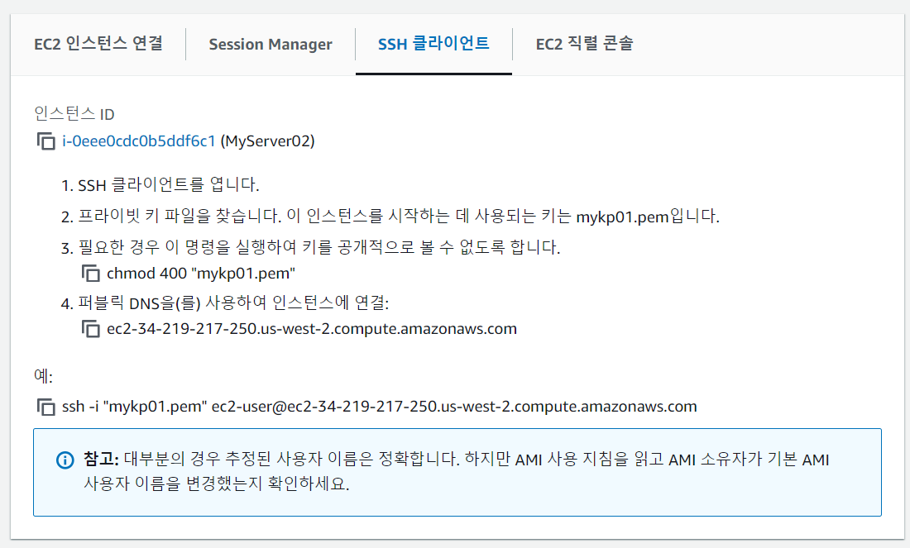
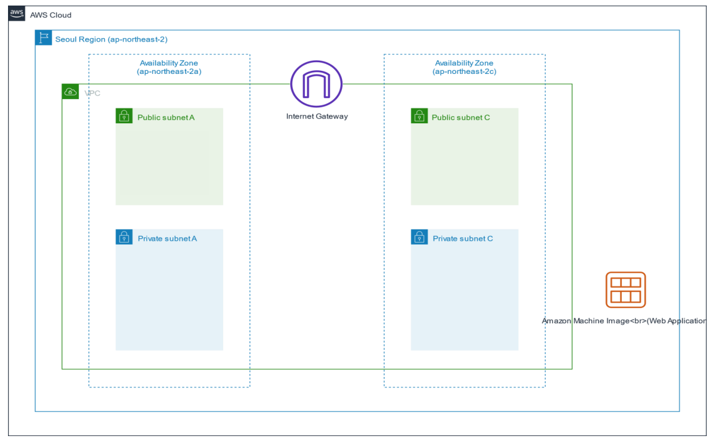

## 복습 문제

1. 클라우드 컴퓨팅   
    인터넷, it 리소스(h/w, s/w), 온디멘드, 종량 요금제
* 비용이 꼭 온프레미스보다 저렴한 것은 아님
* 모니터링을 통해 불필요한 비용이 낭비되는지 확인해야 함
* 온프레미스 -> 용량산정 계획이 필요, 오래걸리고 투자비용 많음
  * 반면 클라우드 컴퓨팅은 빠르게 배포하고, 초기 투자비용이 적음
* 종량 요금제

2. 유연성
    크기를 줄였다 키울 수 있음

3. 글로벌 인프라
DCs < AZs < Region   
DCs < Edge Location

4. AWS 접근 방법
    웹브라우저 콘솔, CLI, SDK

5. AMI, 인스턴스 유형
AMI: 어떤 운영체제를 깔것인가
인스턴스 유형: t2.micro

## AMI
AMI로 같은 설정의 서버를 복제할 수 있음
* 개인이 만든 AMI를 복제와 배포가 가능
  * 소프트웨어를 설치하고 세팅한 것 까지
  * 마켓플레이스에서 개인이 생성한 AMI를 찾아볼 수 있음
    * 마켓플레이스:AWS의 서드파티 어플리케이션을 제공하는 것

## 인스턴스 유형
1. 범용 -> A1, T3, T2 등
2. 컴퓨팅 최적화 -> C5, C5n 등
3. 메모리 최적화 -> R5, R5a 등
4. 가속화된 컴퓨팅 최적화 -> P3, P2 등
5. 스토리지 최적화 -> H1, I3, D2

* 숫자 -> 세대 수
  * 세대수가 크다고 해서 비용이 비싼게 아님

### User Data
인스턴스 생성시 딱 한번 실행시키는 스크립트
* EC2를 여러 개 생성할 시 초기설정에 유용하다
```
#!/bin/bash
yum update -y
service httpd start
chkconfig httpd on
```

### 인스턴스 수명 주기
1. pending
2. running -> 과금이 됨   
    내일 또 쓰고싶으면 Stop을 함
3. Shutting down
4. terminated

#### 보안그룹
EC2의 가상 방화벽
* 포트를 허용할지 안할지 정할 수 있음
* 8080포트를 열고 싶으면

#### 키페어
ssh 로그인을 위해 필요, EC2뿐 아니라 다른 서비스도 마찬가지

## EC2 인스턴스 생성
EC2 인스턴스 Launch시 설정하는 주요 내용
1. AMI   
    AWS 제공 템플릿, MarketPlace(3rd Party), 내가 설정한 AMI
2. Intance Type   
    Type, Size 지정
3. Network   
    VPC, Subnets, Securiy Group, 자동 할당 IP
4. Storage   
    EBS, Instance Store
5. Advanced Setting   
   User Data 사용

## EBS (Elastic Block Store)
EC2에 연결하는 볼륨 디스크 (스토리지 기능)
* EC2에 종속적임
* SSD (IOPS?), HDD (MB/S) 두가지 선택 가능
* gp3, io1 -> SSD의 타입중 하나 

### EBS 스냅샷
EBS를 백업하는 것
* 특정 시점의 서버 상태를 백업 가능
* 10월 1일, 10월 2일

## EC2 연결 방법
1. SSH로 EC2에 연결    
    putty, Tera Term등의 ssh 접속 터미널로 EC2에 접속
2. Elastic IP    
    EC2가 종료될 떄마다 IP가 바뀌지 않는 설정 가능
    * Dynamic Public IP
        공인 IP이지만 그때마다 바뀜

### 실습3 인스턴스 생성 및 연결
1. AL2023
2. t2.micro (t3.micro)
3. Default VPC
4. 자동 공인 IP 할당
5. 보안 그룹: 22
6. 키페어 생성 (Public/Private key Pair)
7. EC2 생성 후 상세 내용 살펴보기

### ssh 접속
* git bash ` ssh -i mykp01.pem ec2-user@34.219.217.250 `

` id `    
` pwd `    
` uname -a `

### 실습4 - EBS 생성 및 연결

` df -k `   

` id `   

` sudo mkfs /dev/sdf `   

` sudo mkdir /appdir `   

` sudo mount /dev/sdf /appdir `   

### EBS 볼륨 종류

* SSD 타입
  * gp2, gp3 -> 16Tib 까지 가능
* HDD 타입

### VPC (Virtual Private Cloud)

* 사설 네트워크 같은 느낌
* server = node = host
* 서브넷 -> VPC 내부에 네트워크를 쪼개는 것
* 주소 대역폭 지정은 CIDR 형식으로 지정

### CIDR 방식
classless inter domain routing 방식
* IP 프로토콜 -> Classful 방식
* A.B.C.D 클래스
  * A 클래스 -> 가장 많은 노드들로 구성할 수 있는 네트워크
  * A 클래스 > B 클래스 > C 클래스
* /16 -> 숫자 만큼의 노트를 부여할거라는 뜻
  * 2^16 만큼의 IP Address를 가질 수 있음
* 10.10.1.0/24
  * 2^8 = 256 만큼의 ip 주소를 가질 수 있음
  * 32 - 24 = 8 -> 2^8개 만큼의 ip 주소를 가질 수 있음
* 10.10.1.0 -> 네트워크 주소
  * 10.10.1.1 -> 게이트웨이 주소
  * 10.10.1.2 -> 네임서버 주소
  * 10.10.1.3 -> Reserved 주소
  * 10.10.1.255 -> 브로드캐스트 주소
* /28로 서브넷을 만들면 바꿀 수 없다
  * 노드가 부족하면 /16으로 새로 만들어야 함
* 넉넉하게 /24 이상으로 노드를 주는게 좋음
  * private IP이므로 아낄 필요가 없다

## 라우팅
패킷을 전달하는 경로를 설정하는 이정표 역할
* 패킷의 네비게이션

## NAT 게이트웨이
* 온프레미스
  * 사설 IP 할당, 보안성을 위해

## VPC와 서브넷
* IGW 항목이 있으면 Public Subnet임
* IGW 항목이 없으면 Private Subnet임
  * 내부에서만 들어갈 수 있음
  * 밖으로 패치 업데이트를 할 때 NAT를 사용
    * 인바운드 아웃바운드 조절

## 권장 가이드
두 개의 가용 영역에 public subnet, private subnet을 각각 두는 것이 좋음

* 가용성을 올려줌
* VPC는 Region 기반
* 서브넷은 AZ 기반

## Security Group
* 인스턴스 레벨의 가상 방화벽
  * default -> 인바운드 허락 X, 아웃바운드는 모두 허락 X

## NACL
서브넷 단위의 네트워크 방화벽
*  default로 인바운드, 아웃바운드 모두 허락
*  Rule Number가 작은게 매칭의 우선순위 
*  NACL과 Security Group을 통과해야 서비스에 접근할 수 있음

### 실습 8
* ` CIDR 10.0.0.0/16 `으로 지정
* 한쪽
  * MyPubSubnet(10.0.1.0/24)
  * MyPriSubnet(10.0.3.0/24)
* 반대쪽
  * MyPubSubnet(10.0.2.0/24)
  * MyPriSubnet(10.0.4.0/24)