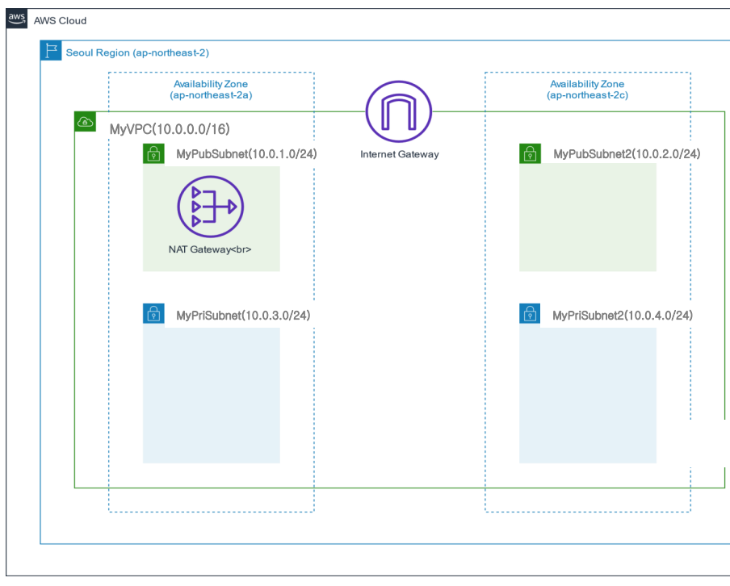
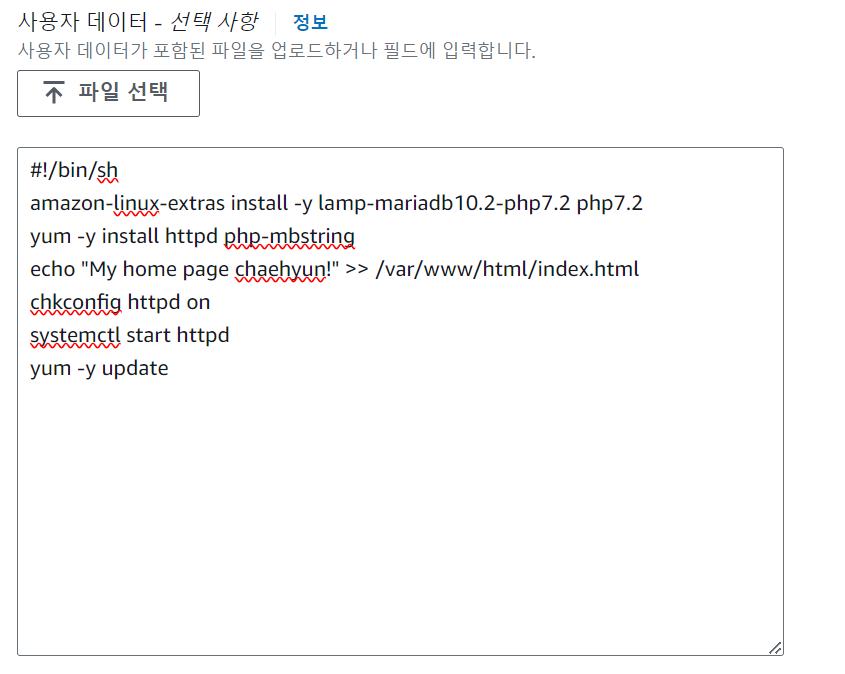
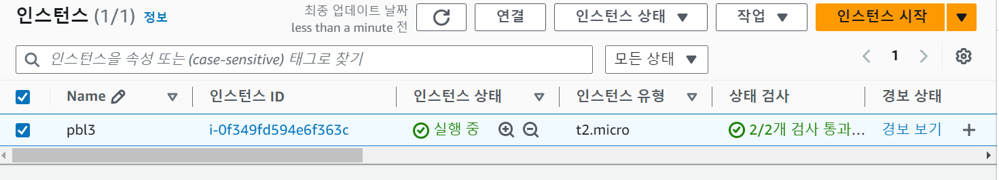
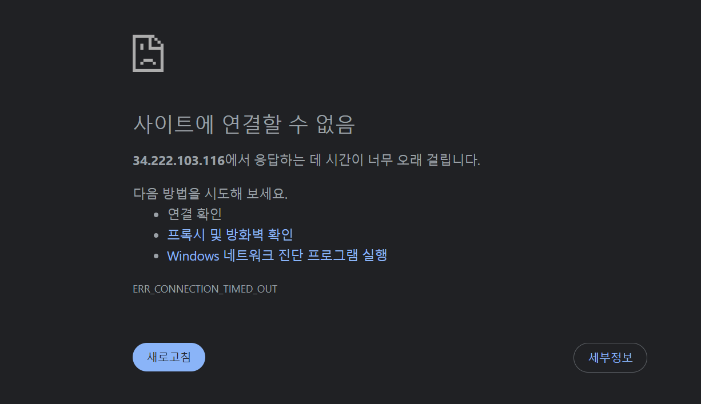
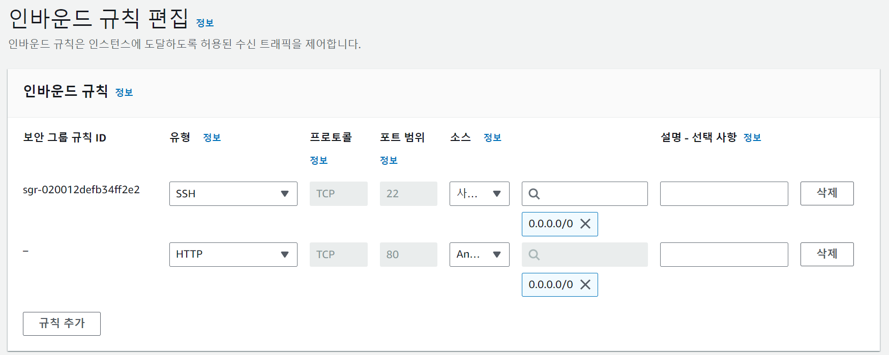
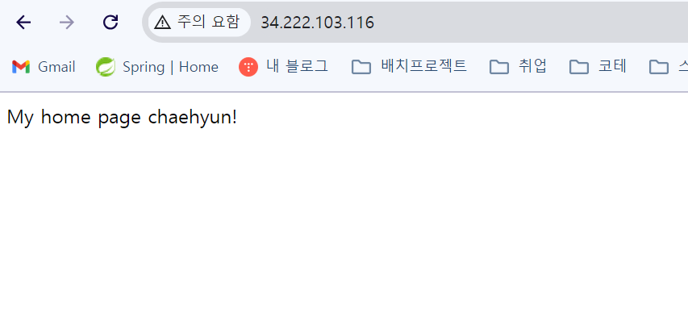

## VPC 구조
NAT Gateway가 있는 MyPubSubnet(10.0.1.0/24)에 EC2를 생성해야 외부 접근이 가능함

## EC2 설정
* MyVPC의 MyPublicSubnet 서브넷에 EC2를 생성
* 자동 공인 IP 할당
* 웹 서버를 만드는 UserData 넣기
    
    
## EC2 생성 완료

## 웹서버 접속 실패
인스턴스의 Public IP인 ` https://34.222.103.116/ `에 접속을 했지만 접속에 실패하였다.

## 보안그룹 인바운드 규칙 수정    
`HTTP` 유형의 소스를 `Anyware-IPv4` 로 설정하여 인바운드 규칙 추가

## 보안그룹 수정 후 웹서버 접속    
웹서버 접속 성공
