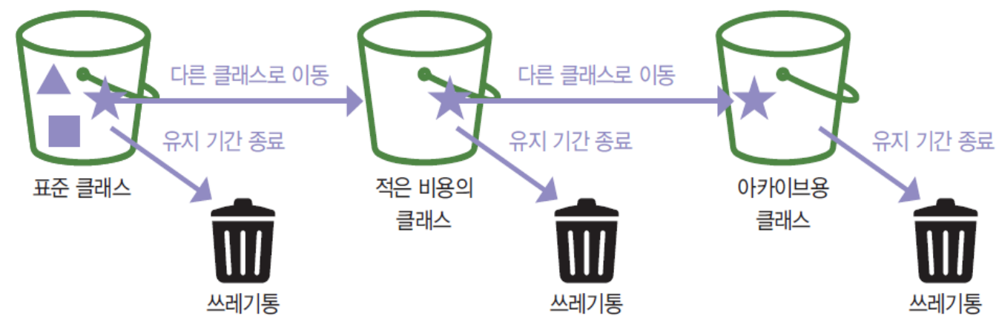
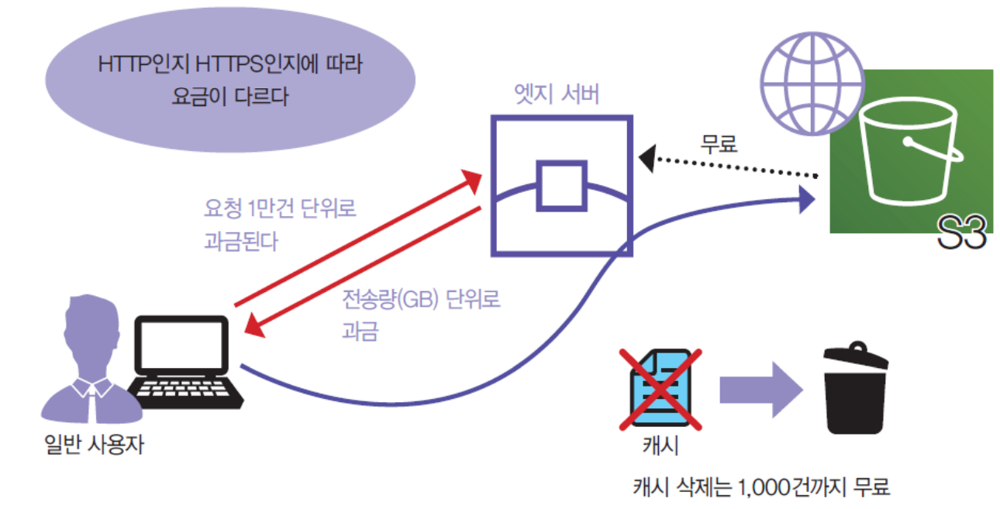
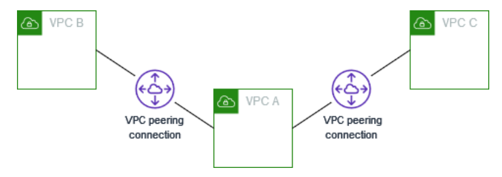
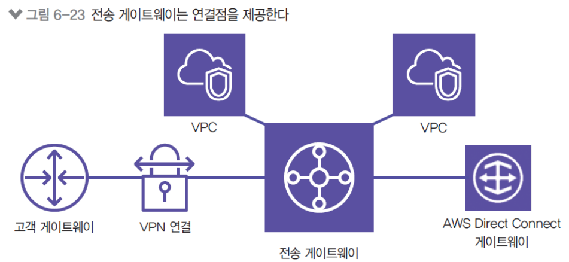
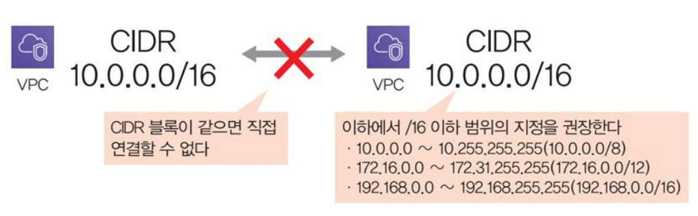
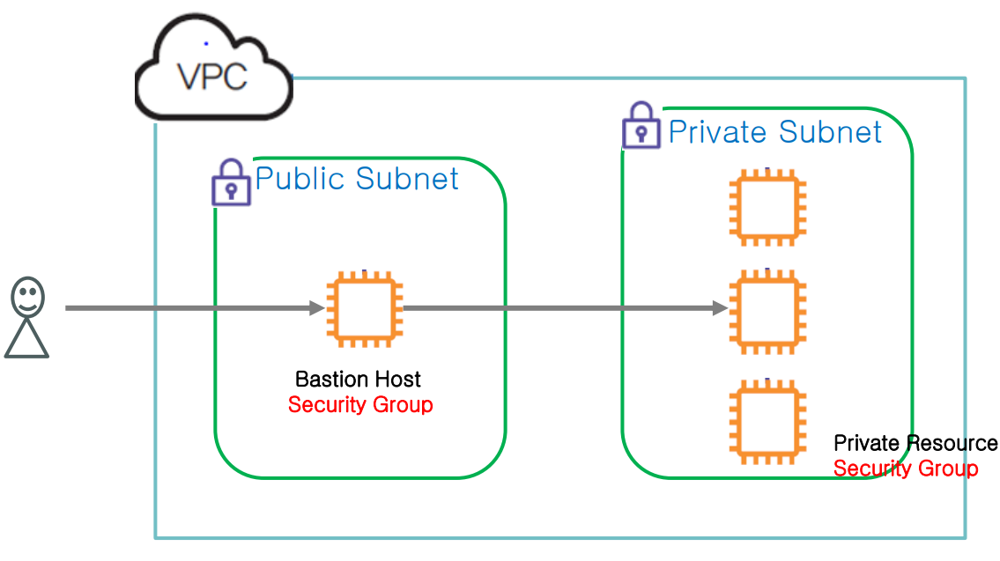
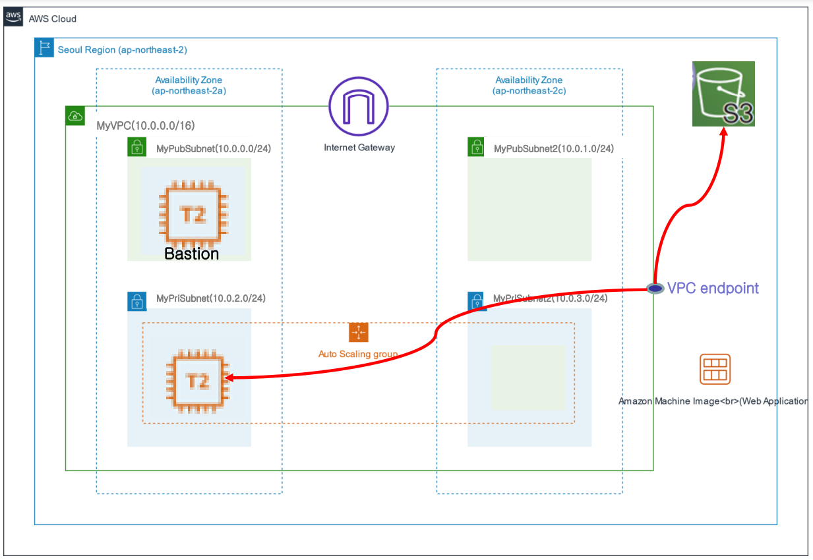
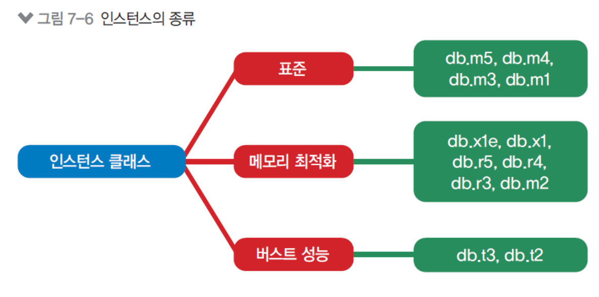

## 복습
* ELB: 클라이언트 요청 트래픽들을 여러 대상들에게 분산
* ALB: L7레이어 -> http, https
* NLB: L4레이어 -> 대용량의 패킷을 로드분산 하는데 사용
* 오토스케일링: 로드 처리를 위해 EC2 개수 자동 조정, ELB 뒷단에 둠
* ALB의 장점: 인스턴스의 엔드포인트를 private하게 가릴 수 있다

## EC2 요금제
* on-demand
* 예약 (saving plans): 장기 약정 할인
* spot instance: aws가 제시하는 요금제
  * 중간에 죽어도 상관없는 인스턴스에 사용

## S3
* 적당히 중복되지 않는 이름으로 명명
* 웹사이트 호스팅 가능
* 버전 관리
* 암호화
* 잠금 -> 해당 기간동안 파일 삭제 불가능 -> 파일의 무결성 보장 가능
* rest api 제공

## S3 버킷 정책
``` json
{
    "Version": "2012-10-17",
    "Id": "Policy1713767923497",
    "Statement": [
        {
            "Sid": "Stmt1713767920754",
            "Effect": "Allow",
            "Principal": "*",
            "Action": "s3:*",
            "Resource": "arn:aws:s3:::emma0505/*"
        }
    ]
}
```
* 버킷 정책에는 반드시 `Principal` 항목이 있음
  * 리소스 기반 정책에만 있는 것
  * IAM 유저, 아스터릭(*)
* `Action`
  * `getOjbect`
  * `putObject`

## S3 특징
1. 확장성    
사이즈 제한이 없음, 빅데이터 서비스의 저장소로 사용
2. 가용성, 내구성    
99.99%의 내구성, 데이터를 여러 군데 흩뿌려 놓음, 교차 region 구성 가능

## 버킷 정책
* 기본 정책은 소유주만 접속 가능
* 권장사항
  * 퍼블릭 권한 제한
  * 최소 권한의 원칙

## S3 웹사이트 호스팅
1. 버킷 안에다 `index.html`을 넣고 
2. 웹 호스팅 활성화, 권한만 주면 됨

## S3 버전 관리
버전을 관리해서 파일 복원 가능
* 버전 관리를 활성화 후 사용 가능

### S3 정적 웹사이트 호스팅
1. index.html 올리기
2. 정적 웹사이트 활성화
3. 퍼블릭 액세스 허용
4. 정책 생성
    ``` json
    {
        "Version": "2012-10-17",
        "Id": "Policy1729646962528",
        "Statement": [
            {
                "Sid": "Stmt1729646946682",
                "Effect": "Allow",
                "Principal": "*",
                "Action": "s3:*",
                "Resource": "arn:aws:s3:::mybktliam0505/*"
            }
        ]
    }
    ```
    `arn:aws:s3:::mybktliam0505/*` 버킷 안에 모든 객체 파일 허용
5. 사이트 접속
6. `index.html` 삭제
7. 버전 표시 -> `index.html` 삭제 마커를 삭제

## S3 비용
* S3 요금 = 저장 용량 + 전송량
* + Operation 비용

## S3 클래스
클래스에 따라 비용 청구가 다름
* Standard
* IT (Infrequent Access)   
간헐적 접근
* IA   
스토리지 비용은 저렴하지만, Operation 비용은 비쌈
* Glacier -> 저렴한 데이터 보관 및 장기 백업

## S3 수명주기

Access 패턴에 따라 S3 클래스 변경
* IT 클래스는 알아서 분석해줌 -> 분석비용 있음

## S3 복제
가용성을 위해 리전 간 복제 가능

## S3 활용 예
분석을 위한 데이터 저장소

## S3 - CloudFront와 연계

AWS CDN 관리형 서비스
* Content Delivery Network
* 데이터 사용량이 많은 서비스들의 웹페이지 로드 속도를 높이기 위한 서버들의 네트워크
* 그니깐 해당 서비스의 캐시임
  * 다른 나라에 CDN을 구성
  * 엣지로케이션에 구성

## Security Group과 NACL
* 보안그룹
  * 인스턴스 레벨의 가상 방화벽
  * 인바운드 모두 허락 X
  * 아웃바운드 모두 허락

## NACL
* rule number 순서로 allow
* 기본값이 인바운드 허락, 아웃바운드 허락

## VPC와 다른 네트워크 연결
* AWS VPN   
AWS 클라우드와 온프레미스 사이에 보안 연결
* AWS Direct Connect   
AWS와 온프레미스 사이에 네트워크 전용선 연결

## VPC 피어링
VPC와 VPC 간에 사설 네트워크 연결
* AWS의 백본을 넘어가지 않음
* 전용의 VPC 피어링 게이트웨이를 사용해서 private하게 통신 가능
* **전이적 피어링**을 지원하지 않음
  
  * VPC B에서 VPC C로 갈때 VPC A를 거쳐갈 수 없음
  * VPC B -> VPC C로 직접 피어링을 설정해야 함
  * 이걸 해결하려고 나온게 **Transit 게이트웨이**
* **Transit 게이트웨이**
  
  * 허브 앤 스포크 형식으로 사설 연결
  * 다수의 VPC들이 통신하기 수월하게 함
  * VPN이나 Direct Connect 등 다른 것도 연결 가능
* 똑같은 CIDR 주소의 VPC는 연결 불가
  

## VPC 엔드포인트
EC2 노드와 특정 서비스간에 private한 통신을 하게 해줌
* 인터페이스 유형   
해당 서비스에 네트워크 카드(ENI)를 하나 더 꽂아서 ec2와 같은 허브에 연결된 것처럼 구성
* 게이트웨이 유형   
ec2 인스턴스와의 전용 게이트웨이를 생성해서 private하게 통신, S3와 DynamoDB만 지원

## Bastion

Bastion Host로 프라이빗 노드 접근
* 굳이 public에 있을 필요가 없는 노드는 private subnet에 위치시킨다
* 각각 다른 키체인을 가져야 함
  * 사용자: Private key -> bastion: Public key
  * bastion: Public key -> Private Resource: public Key

## 실습 11 - VPC endpoint

* VPC밖 region level에 있는 s3와 연결시킬거임
* 원래같으면 NAT를 거쳐서 IGW를 거쳐서 외부와 통신해야 함
* 하지만 VPC endpoint로 private 한 연결을 할 수 있음
  * 모든 외부 서비스가 vpc endpoint를 지원하는 것은 아님
* 실습에서는 bastion과 private resource가 같은 key를 갖도록 함

## 실습 11 - VPC endpoint
1. 퍼블릭 노드와 프라이빗 노드 생성
2. 퍼블릭 노드(Bastion)로 ssh 연결
   1. s3로 ssh 키 파일 업로드 하고 bastion으로 다운로드
   2. 퍼블릭 노드에서 프라이빗 노드로 ssh 연결
    ```
      − aws configure
      − aws s3 ls
      − aws s3 ls s3://bunketname
      − aws s3 cp
      s3://bunketname/PriKeyFileName .
      − ls
      − chmod 400 PriKeyFileName
      − ssh -i PriKeyFileName ec2-
      user@PriNodeIP
    ```
3. 프라이빗 노드에서 S3에 접근   
NAT가 없으므로 연결이 안 됨    
  ```
    aws configure
    aws s3 ls
  ```
4. VPC 엔드포인트 생성
* 서비스:S3
* 유형:Gateway
* 라우팅 테이블: 기존 private 라우팅 테이블 연결
1. VPC 엔드포인트를 이용한 프라이빗 접근
EC2에서 S3로 접근 ` aws s3 ls `
1. 마무리 - VPC 엔드포인트 삭제, 

## 실습 10

` aws s3 ls s3://mybktliam0505 `

` aws s3 cp s3://mybktliam0505/mykp03.pem . `

` chmod 400 my* `

` ssh -i mykp03.pem ec2-user@10.0.3.135 `

` uname -a `

```
[ec2-user@ip-10-0-3-135 ~]$ aws configure
AWS Access Key ID [None]: 
AWS Secret Access Key [None]:
Default region name [None]: us-west-2
Default output format [None]:
```

## AWS RDS
AWS 관계형 데이터베이스 서비스
* 관계형 데이터베이스: RDS
* 비관계형 데이터베이스: DynamoDB
* RDS 지원 DB: Amazon Aurora, Mysql, MariaDB 등
* 비관리형 DB -> EC2를 생성하고 여러 관리작업 필요
  
## Amazon RDS 인스턴스 클래스
