# AWS 서비스 접근 방식
* 사용자 중심 기반: IAM 정책
  * IAM User들을 다 부여해야 함
* 리소스 중심 기반: S3, Glacier, KMS, SQS
  * `Principal` 키워드가 들어감
  * `Principal`은 주체임
  * 특정 리소스에만 적용하고 싶을때 사용
  * 아스터릭(*)으로 여러 유저에게 한꺼번에 부여 가능

# 복습
* s3기능 -> 파일저장소, 버전관리, 정적 웹사이트 호스팅, 암호화
* AWS 내부 서비스에만 접근할 때는 Private Subnet에 서비스를 넣어도 된다
* NAT 기능 -> private subnet에 있는 노드들에 외부에 있는 패치 업데이트분을 가져올 때 사용
* Direct Connect: 온프레미스와 AWS간의 안정된 데이터 전송 가능
* Transit Gateway: 다수의 VPC를 Peering 하기 좋게 만듦
* VPC Endpoint: NAT와 IGW를 거치지 않고 private node가 region 서비스에 통신하게 해줌
  * Interface 유형: 네트워크 카드를 꼽아서 같은 허브단 즉, 같은 세그먼트에 위치시켜서 연결 
  * G/W 유형: 전용 게이트를 만들어서 연결
* Bastion: 점퍼 서버, public subnet에 위치해서 private node들을 연결해줌

## 관리형 서비스
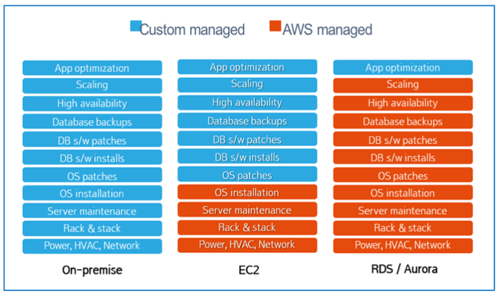
* RDS는 AWS가 관리하는 것이 더 많다
* EC2는 고객이 결정하는 요소가 더 많음

## RDS 인스턴스 크기
* RDS 인스턴스의 종류
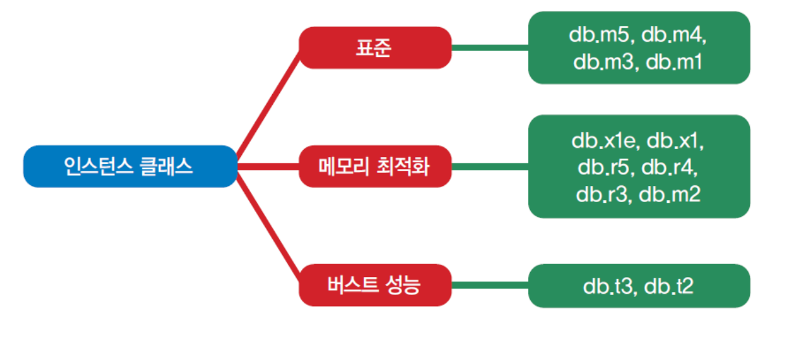
* 유연한 수직확장 가능

## Multi-AZ
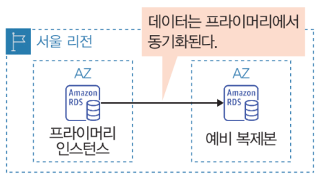
다른 AZ에다가 Stanby하는 Secondary DB를 만드는 것
* 장애가 발생하면 Secondary DB가 자동을 Master로 승격

## Read Replica
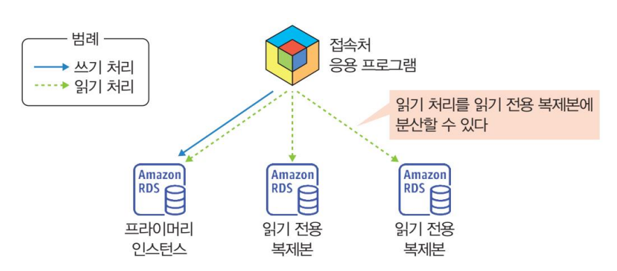
프라이머리 인스턴스에서 복제된 읽기 전용 인스턴스

## RDS 접근제어
NACL과 SG를 이용한 접근제어

## Amazon RDS
* 자동 백업
* 수동 백업

## Amazon RDS 생성 및 사용
1. DB 인스턴스 생성 - 엔진, 템플릿, DB 사양 저장, 상세 설정
2. RDS 접속
3. 데이터 입력

## 실습12 - RDS 생성 연결
이 사이트를 기반으로 함
https://aws.amazon.com/ko/getting-started/hands-on/create-mysql-db/
* Public access 허용 -> 클라이언트 접속은 밖에서 할거임
* 실습을 간편하게 하기 위해 DB를 public subnet에 위치시킬 거임
1. 보안 그룹 생성: sgdb(3306)
2. DB 서브넷 그룹 생성 -> 두개의 PublicSubnet을 그룹으로 묶을거임
  * mydbsubnetgrp01 -> MypubSubnet, MyPubSubnet02
3. DB 인스턴스 생성
* 아이디 비번: dbadmin/abcd1234
4. SQL 클라이언트 설치 및 연결

## Dynamo DB
키-값 데이터 유형의 NoSQL 데이터베이스
* 단순 데이터 구조: 복잡한 검색보다 고속 데이터 검색
* 스키마 유연성이 높음
* 완전 관리형 서비스
* 서버리스

## DynamoDB 기능 및 특징
* 일관된 성능 00 ms 미만의 성능
* 무제한 처리량
* 서버관리 불필요
  * 테이블과 ** 기본 키(파티션 키, 정렬키)** 생성 후 즉시 사용
  * 샤딩, 파티셔닝 -> 데이터를 쪼개서 저장해서 부하를 분산시키는 것
  * DynamoDB는 고객이 지정한 파티션 키를 기반으로 자동으로 샤딩을 해줌
  * 키 값이 중복되는 것이 많으면 중복이 될 가능성이 높음 -> 핫 파티션
  * 되도록이면 중복되지 않는 키값을 지정하자
* 사례
  * 수백 만 사용자 및 추당 수백만 컨의 요청 처리
  * 실시간 모바일 게임 순위표, 장바구니 및 고객 프로필
* 가용성 -> 3개의 AZ에 데이터 복제

## 그 외의 AWS 데이터베이스
* Neptune
  * 그래프 데이터베이스, 소셜 네트워크에 사용
* ElasticCache
  * 인메모리 DB

## Route53
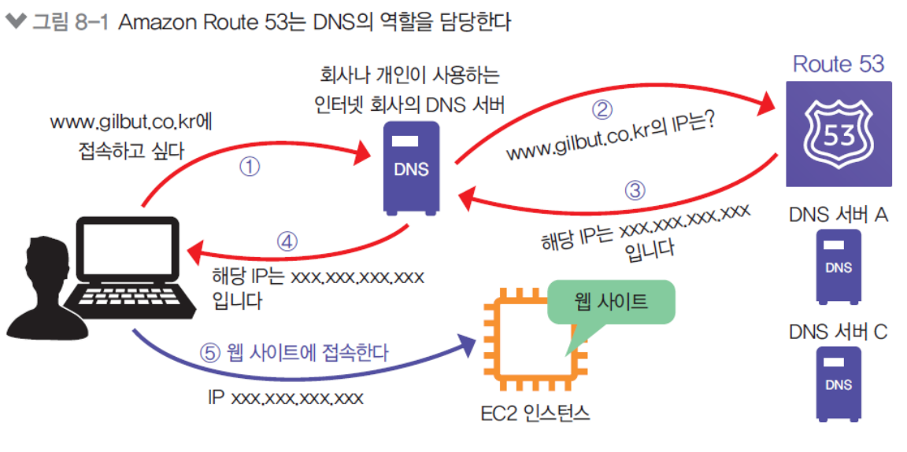
* Amazon Route53: 가용성, 확장성이 뛰어난 DNS 서비스
  * Name -> IP 변경
  * AWS가 다 알아서 해줌
  * Secondary DNS 서버를 만들어 주는 것
* 전세계 아무대나 만들어줌 -> Edge Location 기반

## Route53 라우팅 정책
* 매핑되는 여러 IP에 대한 우선순위를 정할 수 있음
* 기본적으로 라운드 로빈 방식
  * 공평하게 돌아가면서
* 가중치 기반 라우팅 방식
* 지연시간 라우팅
  * 지연시간 테이블이 있는데 지연시간이 짧은 것을 선택
* 지리 위치 라우팅
* 다중 응답 라우팅: 다중으로 응답하는 라우팅

### 장애 조치 라우팅
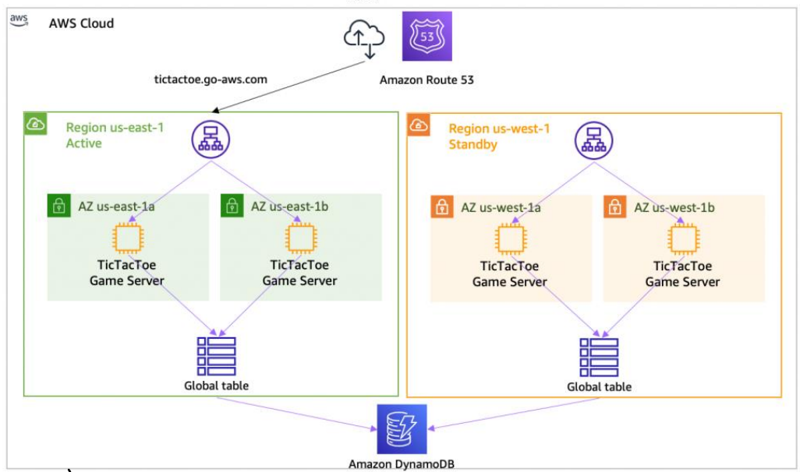
* 하나는 primary 하나는 Secondary 로 둬서 장애를 감지하면 Secondary IP로 Resolving
* 리소스를 더블로 사용하고, secondary 리소스에 대해서 동기화를 시켜줘야 함

## AWS Lambda
AWS 서버리스 애플리케이션
* ec2의 가용성, 백업 등을 신경쓸 필요가 없음
* 애플리케이션 실행을 위한 서버 인프라를 생성 실행
* 지원 SDK: Python, Java, .NET, Node.js, Go, Ruby
* CPU를 지정하지 않고 메모리만 지정함

### AWS Lamda 요소
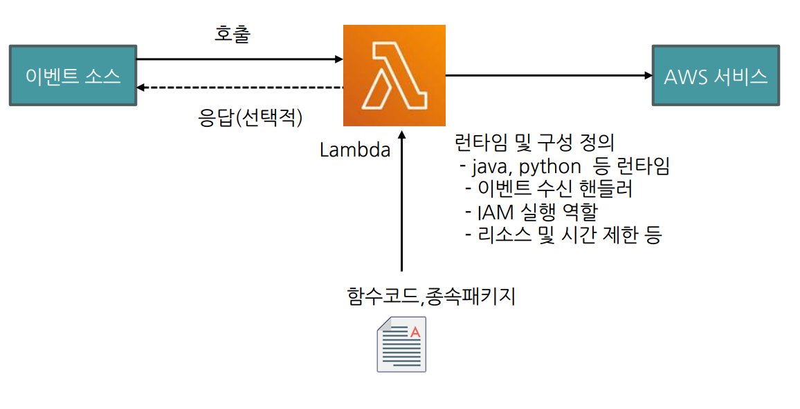
* 이벤트 핸들러
  * 특정 서비스 이벤트가 있을 떄 코드를 실행
  * 예약도 가능
* 리소스, 시간 제한 선택 가능
* IAM 실행 역할이 있어야 외부 서비스를 사용 가능

### 특징
* 메모리 구성: 128~10240M
* 시간 제한: 1초 ~ 15분 
* 실행 시에만 요금 부과
  * 간헐적이 아닌 계속 클라이언트 요청이 들어오면 ec2가 나음

## Lambda 활용 예시 1
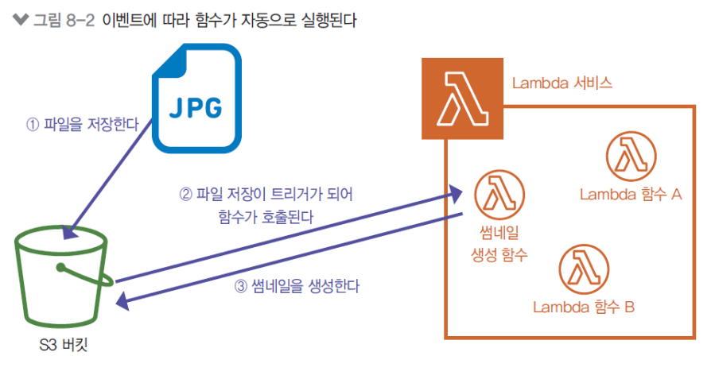
* s3에 파일을 저장하면 람다 함수가 트리거 됨
  * s3에서 설정 또는 람다에서 설정 가능

## Lambda 활용 예시 2
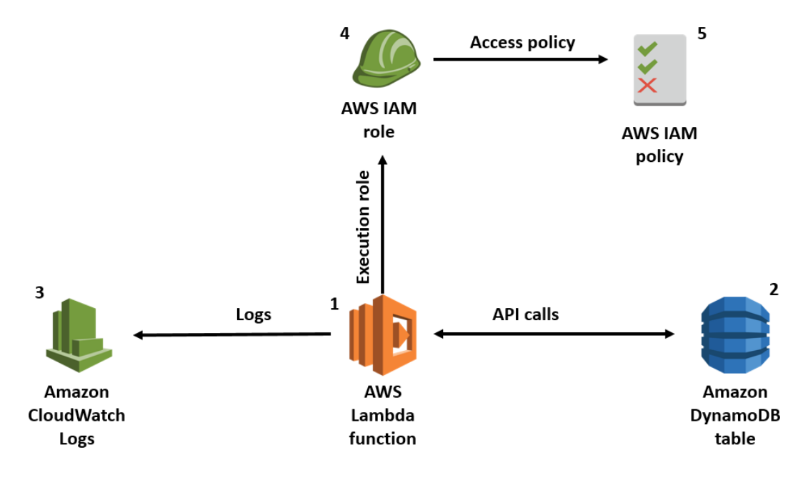
* Lambda는 DynamoDB에 접근할 수 있는 IAM role이 있어야 할 것
* 람다가 실행되기만 하면 Cloudwatch Logs에 등록 됨
  * 람다는 기본적으로 CloudWatch의 권한을 가지오 있는 IAM role을 가지고 있음

## 실습14 - Lambda 실행
https://docs.aws.amazon.com/ko_kr/lambda/latest/dg/with-s3-tutorial.html 참고
• Lambda : 썸네일 이미지 생성
– S3 버킷 생성(원본:mybucket#### 및 대상본:mybucket####-resized)
– IAM 역할 및 정책 확인 : CloudWatch logs와 S3 접근 권한을 가진 역할
• LambdaS3Role / LambdaS3Policy
– 함수 배포 패키지 생성 : lambda_function.zip (생성 혹은 템플릿 다운로드)
– Lambda 함수 생성(이미지 크기 조정 함수) : 콘솔 > 람다 > 함수>>
CreateThumbnail
– Lambda 트리거 구성
• 원본 버킷(mybucket#### )에 이미지 업로드시 함수 호출
– 함수 테스트 : 원본 버킷에 이미지파일 업로드 후, 대상 버킷
(mybucket#### -resized)에 썸네일이미지 및 싸이즈 확인

## 실습14

* Role 생성 - 신뢰 관계
  * 람다에게 위임하겠다는 내용이 적혀있음
    ``` json
    {
        "Version": "2012-10-17",
        "Statement": [
            {
                "Effect": "Allow",
                "Principal": {
                    "Service": "lambda.amazonaws.com"
                },
                "Action": "sts:AssumeRole"
            }
        ]
    }
    ```
* 재귀호출
  * 소스버킷과 목적지 버킷이 동일할 때 발생
  * 목적지 버킷에 업로드 -> 소스 버킷 트리거 발생 -> 다시 업로드 -> 무한반복

## AWS 컨테이너 서비스
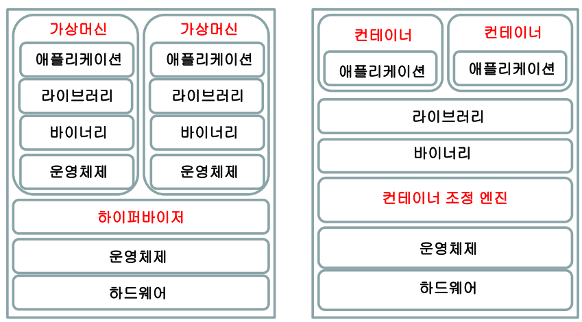
애플리케이션을 패키징 하는 기술 -> 즉 프로세스를 격리하는 방법
* 가상화 기술과 달리 운영체제를 공유해서 사용 (OS Hooking)
* 무겁고 느린 가상화 방식과 달리 빠름
* 가상머신은 각각 운영체제를 가지고 있는데 메인컴퓨터가 느려진다

## 컨테이너 오케스트레이션
컨테이너 배포, 크기 조정, 모니터링, 장애 등 관리를 자동화

## AWS 컨테이너 서비스
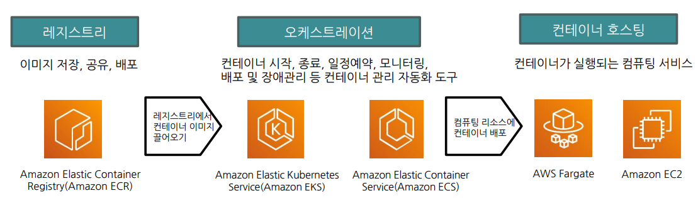
* ECS (Elastic Container Service)
  * AWS의 컨테이너 오케스트레이션 서비스
* ECR (Elastic Containerr Registry)
  * 컨테이너 이미지 저장 서비스 -> ECS는 ECR에 있는 이미지를 가져옴?
* EKS
  * AWS에서 지원하는 쿠버네티스 서비스, 즉 오케스트레이션 서비스

## 보안 3 요소 (CIA)
1. 기밀성 (Confidentiality)   
인가된 사용자에게만 허가, 비밀스럽게 유지되고 특정 인물만 볼 수 있게
2. 무결성 (Integrity)
부적절한 정보 변경이나 삭제로부터 보호
3. 가용성 (Availability)

## AWS 보안 혜택
* 안전한 데이터 유지
* 공동 책임 모델
* cloudformation
  * 소스코드를 작성하면 요구사항에 맞춰 알아서 클라우드를 생성해줌
  * IAC서비스라고 함
* 검증 활동 수행 -> 이게 제일 중요