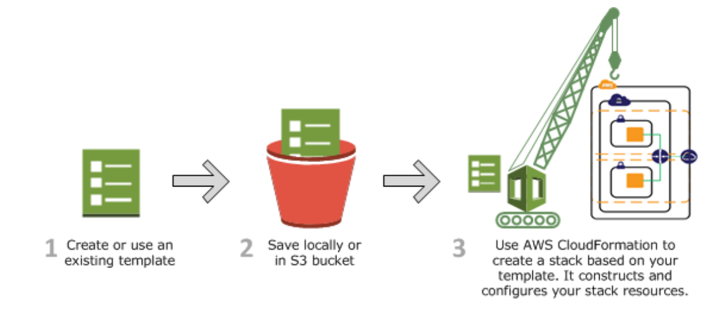
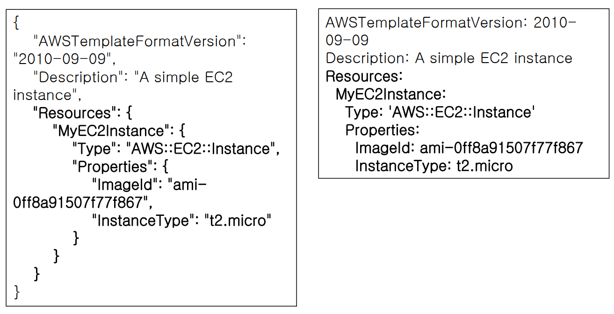
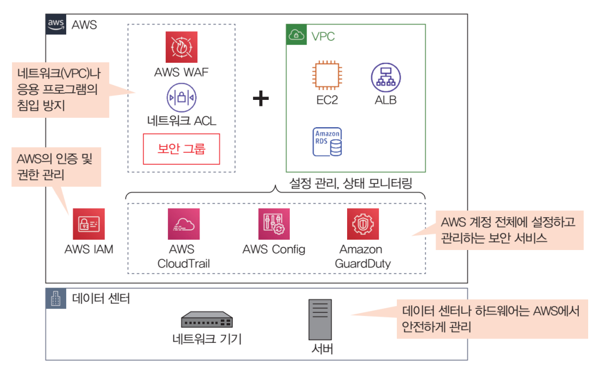
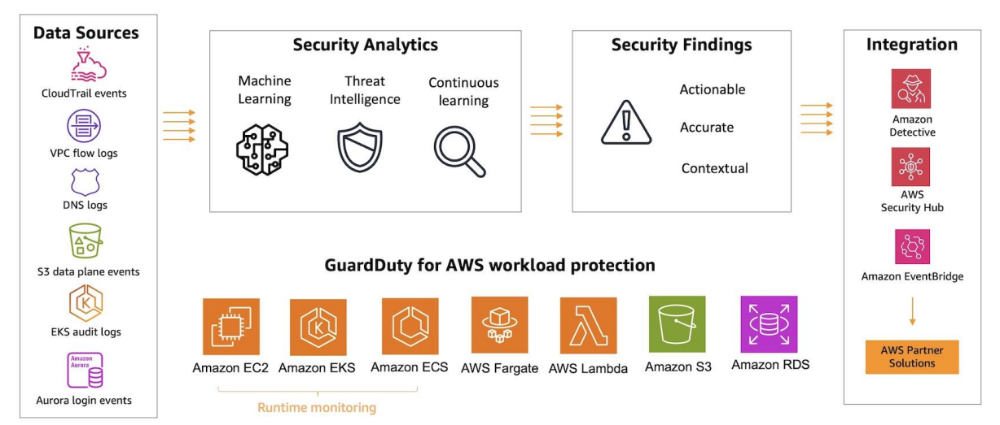
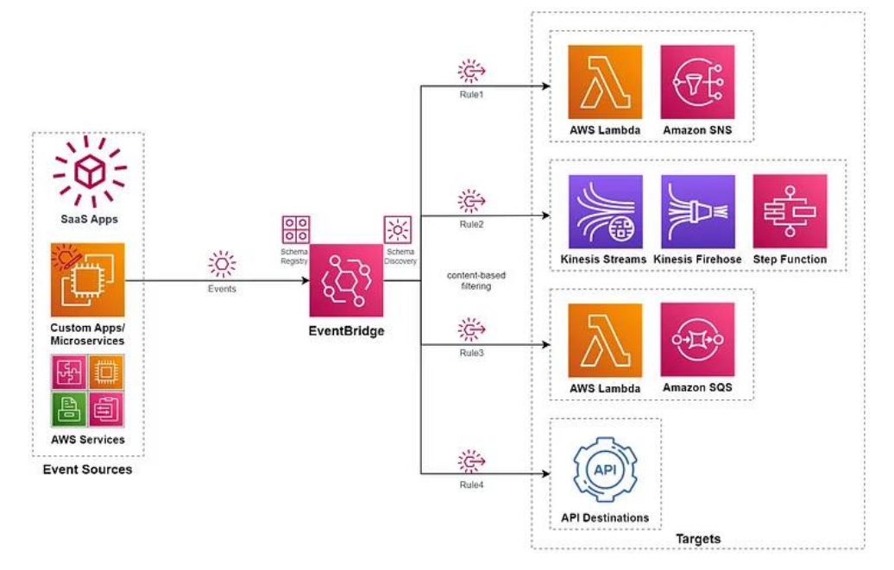
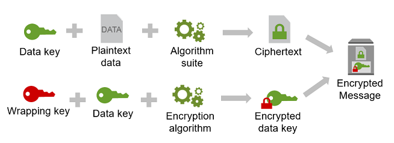

# 복습
* Route53
  * 라운드로빈라우팅
  * 장애조치라우팅
    * Primary와 Secondary로 나뉨
    * 리전 장애에 대해서도 대비가능
* Lambda
  * role을 줘야 해당 서비스를 조정 가능
  * cloudwatch에 대한 기본 role이 있음

## 클라우드 보안
* 요구사항에 맞춰 안전한 환경 구성
  * 예: S3 객체 데이터 암호화, IAM 권한 설정, 보안그룹 설정
* 템플릿 사용 강제 적용

## 보안 향상 고려사항

1. 정확한 유저 정보 기입
2. 다중 인증 사용 
3. 코드 내에서 키값 직접 넣지 말기
4. 보안그룹 확인
5. 데이터 정책
6. CloudTrail 로그 관리
7. Roles 사용, 최소 권한을 사용해서, 필요없는거 제거
8. 취약점 탐지 도구 GuardDuty 사용
9. secret key 주기적 변경
10. dev cycle에 포함 시켜라

## 백업
가용성 높은 환경을 만들기 위해서는 백업이 필요
* 가용성은 보안의 3 요소(CIA) 중 하나
* AWS 공동의 책임 모델
* EC2 -> AMI 또는 EBS 스냅샷
* S3 -> 리전 간 복사
* Database는 자동 백업
  * RDS -> 자동 백업 저장 (0~35일)
  * Aurora -> 보존 기간 내 신속 복원 가능 (1~35일)
  * DynamoDB -> 특정시점 복구를 위한 자동 백업 (~35일)
* AWS Backup -> Cloud Backup 솔루션

## AWS 주요 보안 서비스
* 접근 및 권한 제어: IAM, 보안 그룹, NACL
* 모니터링 및 로그 수집: CloudWatch, CloudTrail
* AMI: AMI Backing
  * Full Baking -> 싹다 Baking 하는 것
  * Half Baking -> 
  * Raw Baking -> AWS AMI에다가 UserData 추가하는 것

## AWS 로그 수집
* 로그 수집의 기본 원칙
  * 최대한 오래, 많이 로그 수집이 기본
* 다양한 로그 활성화
  * VPC 흐름 로그
  * CloudWatch Logs
  * S3 액세스 로그
  * ELB 액세스 로그

## VPC 흐름 로그
VPC 내 로그를 수집하여 장애느 문제 발생시 원인 파악, 분석 등의 용도
* 로그 게시를 S3나 CloudWatch log로 가능

## CloudWatch Logs
* 로그 수집 및 모니터링, 저장
  * 기존 시스템, 애플리케이션 및 사용자 지정 로그
  * 실시간 모니터링 가능 -> S3는 실시간으로 분석할 수 없음
* 예: EC2 애플리케이션 로그, VPC 흐름 로그, CloudTrail 등

## S3 액세스 로그
* S3 버킷에 수행된 요청에 대한 상세 내용 저장
* 활성화 필요
* 로그 필드
  * 버킷, 버킷 소유자, 요청시간, 원격 IP, 요청자, 작업, 객체키, 총시간 등

## ELB 액세스 로그
로드밸런서에 전송된 요청에 대한 자세한 정보저장
* 로그 필드: 요청 받은 시간, 클라이언트 IP, 지연시간, 요청 경로 등

# AWS 주요 보안 서비스
* AWS SSM
* CloudFormation: 인프라를 자동으로 구성
* AWS Shield
* 등등

## AWS SSM (Systems Manager)
다수의 EC2 운영 및 애플리케이션, 보안 관리
* 다수의 Ec2를 똑같이 패치하고, 명령어 내리고 할 수 있음
* 인벤토리, 패치관리자, 세션관리자, 명령어실행 등
  * 패치관리자 -> 이것 떄문에 SSM이 보안 서비스라고 할 수 있음
  * 보안 권장 사항 중 패치를 유지하라 라는 내용이 있는데 SSM을 이용하면 좋음
  * 세션관리자 -> EC2에 리모트 로그인을 할 수 있음
    * Systems Manager -> Session Manager로 연결 가능
    * KP 만들기, SG 22번 Open 안해도 됨 
    * 대신 관리 대상 노드들에 대해 Agent가 깔려 있어야 함

## 실습3 - 인스턴스 생성 및 연결 (SSM)
1. SSM 세션 연결 역할 및 정책 확인: SSMInstancexxxxRole / AmazonEC2RoleforSSM
2. EC2 생성 -> 키페어 무시, 인바운드 룰(ssh) 항목 삭제, 역할 설정 -> 고급세부정보 IAM 인스턴스 프로파일

## CloudFormation

코드를 기반으로 AWS 인프라 자동생성
* 일관된 AWS 인프라를 신속하게 반복 생성 가능
* JSON 또는 YAML 템플릿 사용
  

## Inspector
애플리케이션 취약점을 리포트하는 취약점
* instant에 agent를 설치해야 함
* CVE (Common Vulnerabilities and Exposures)
  * 취약점 https://www.cve.org/ 에서 확인

## AWS 보안 관련 서비스

* WAF
* GuardDuty

### AWS Config
* 리소스 구성 변경을 모니터링해서 규정 준소, 미준수 하는지 점검
* Rule 기반으로 점검 -> 규정 미준수: NonCompliant
  * restricted Common ports: 특정 포트 인바운드 막겠다
  * cloud-trail-enabled: cloudtrail enable
  * eip-attached: eip 과금 안되게 취소
  * required-tags: 비용을 확인하기 좋게 태그 달기
* https://docs.aws.amazon.com/config/ 여기서 다른 rule들을 볼 수 있음

## AWS GuardDuty

* 머신러닝 기반 위협 탐지 서비스
* 탐지 분야
  * 공격자의 정찰 활동 - 포트 스캐닝, 로그인 시도 
  * 인스턴스 침해 - 코인 채굴, 백도어
  * 계정 침해 - 특정한 지리적 위치에서 접근, cloudtrail 로깅 사용 중지
  * 버킷 침해 - 무단 S3 액세스
* 뭘로 탐지하느냐?
  * cloudtrail 로그, vpc 흐름 로그, dns 쿼리 로그 등으로 이벤트 분석

## EventBridge

Cloudwatch의 Event기능에서 생겨난 것임
* 규칙(rule): 이벤트 정의, 특정 대상 지정
* 대상(target): EC2, Lambda, SNS
* Lambda를 통해 GuardDuty와 Config를 연동 가능
  * 무슨 조치사항이 발생하면 람다로 실행하게 
  * 이 모든건 EventBridge를 통해 가능 

### DDOS 공격 (Distributed Denial of Service)
요청을 폭주시켜서 대량의 트래픽을 줘서 서비스를 중단시키는 공격
* 서비스의 정상적인 기능을 이용해서 공격하는 것임
* 그래서 DDOS는 공격을 막는다 표현 안하고, 공격을 완화한다 표현
  * 3계층: UDP ReFlection
  * 4계층: TCP SYN Flood -> AWS Shield 사용
  * 7계층: HTTP GET, DNS query floods -> AWS WAF 사용

## AWS Shield
* AWS Shield Standard
  * AWS 서비스의 3/4 레이어를 막을 수 있음
* AWS Shield Advanced
  * 3/4/7 공격으로부터 보호
  * 추가 비용 없이 WAF 사용 가능
  * 24X7 DRT 팀 지원 (DDOS Response Team)

## AWS WAF (Web Application Firewall)
AWS 웹 애플리케이션 방화벽
* SQL Injection, CSS 공격 막을 수 있음
* 다양한 rule들이 많음
* webACL 구성해서 뒷단의 리소스 (ALB, Cloudfront등)에 연결할 수 있음
* OWASP Top10 -> application level의 공격

## DDOS 공격 완화를 위한 대응 가이드

* Route 53
* AWS Shield -> 기본 3,4 공격을 막아주고 WAF 사용하면 7레이어
* cloudfront -> 서비스에 CDN을 제공 (분산 캐싱 서비스)
  * 캐시버스팅: cloudfront를 우회 공격하는 것
  * 버킷 정책에 cloudfront를 principal로 지정하면 캐시버스팅 공격을 막을 수 있음
    * 접근 제어를 반드시 cloudfront를 거치는 것
* SG의 Source를 cloudfront로 해서 chain model 구성 (ELB?)
* 그리고 API G/W 까지 달면 ASG에 있는 인스턴스에 3단계로 접근 못하게 할 수 있음

## Network Firewall
최근에 나온 서비스
* 이전에는 AWS Firewall 사용
* NACL -> IP 포트 기반밖에 안 됨
* 특정 도메인에 대한 IDS, IPS가 필요해서 고객의 요청!
  * 그래서 Network Firewall이 나옴
* 즉 IP, Port 기반의 통제 뿐 아니라
* 도메인 기반 통제가 가능
* 온프레미스이 Suricata도 지원함 
  * Suricata에 호환되는 규칙 지원

## KMS
Key 관리 - 다수의 키 관리, 키 관리 권한 및 사용 권한 제어
* 데이터 저장 중 암호화
* 클라이언트 측 암호화 -> 암호화 파일을 S3에 올리는 것
* 서버 측 암호화 -> 파일을 올리면 S3가 암호화 하는 것
* 암호화 키 방식
  * 대칭 키: 암복호화 키가 같음 -> 속도가 빠름
  * 비대칭 키: 암복호화 키가 다름 -> 속도가 느리지만 보안성 좋음
* 파일마다 암호화 키가 있으면 관리가 힘듦 -> 그래서 다수의 키 관리 기능이 있음
* 정책을 기반으로 키를 보호 -> 키 사용 감사 가능 (CloudTrail)
* 키 종류
  * AWS 관리형 키 -> 자동 로테이션 가능
  * 고객 생성 마스터 키 -> 내가 로테이션 가능
  * 가져온 키 -> 자동 로테이션 불가능
* 봉투 암호화 -> (암호화 된 데이터 + 암호화 키)를 같이 암호화 -> Master 키 생성
* 2계층 키 -> Master키가 데이터 키를 발급한다는 것
  * 이걸로 다수의 키를 소수의 키를 관리 가능

### 봉투 암호화 과정

## 실습16 - CloudFormation
* 스택 생성
  * lab-network: 네트워크 환경 자동 생성 (VPC, subnet, IGW, RT)
  * lab-application: Application 자동 생성 (EC2, 보안그룹)
* 드리프트 감지
  * 좀 뭐가 다르면 Drifted 라고 뜸
  * Not checked -> IN Sync -> Drifted 
    * 에시로 ec2의 시큐리티 그룹을 바꾸면 드리프트에서 감지함
      * IN SYNC -> Drifted
      * 뭐가 바뀌었는지 드리프트 세부 정보에서 확인 가능
  * 검증 test는 Config, Drift로 가능 -> 역시 CloudTrail이 수행