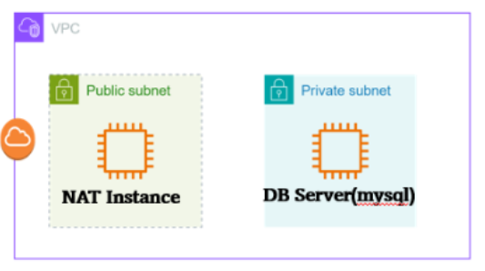

## 재설계 전 아키텍쳐

VPC안에 Public Subnet과 Private Subnet이 있다.   
 Public Subnet에는 NAT 역할을 하는 인스턴스가 있고, Private Subnet에는 DB Server 역할을 하는 인스턴스가 있다.

## 아키텍쳐 재설계
NAT Instance와 DB Server Instance는 비교적 비관리형 서비스인 EC2를 사용중이다.   
관리 작업의 부담을 줄이기 위해서는 NAT Instance를 관리형 서비스인 NAT 게이트웨이로 변경하고,    
DB Server를 EC2가 아닌 RDS로 변경할 수 있다.