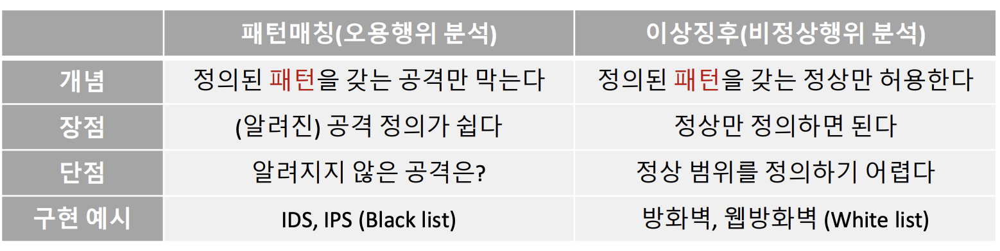
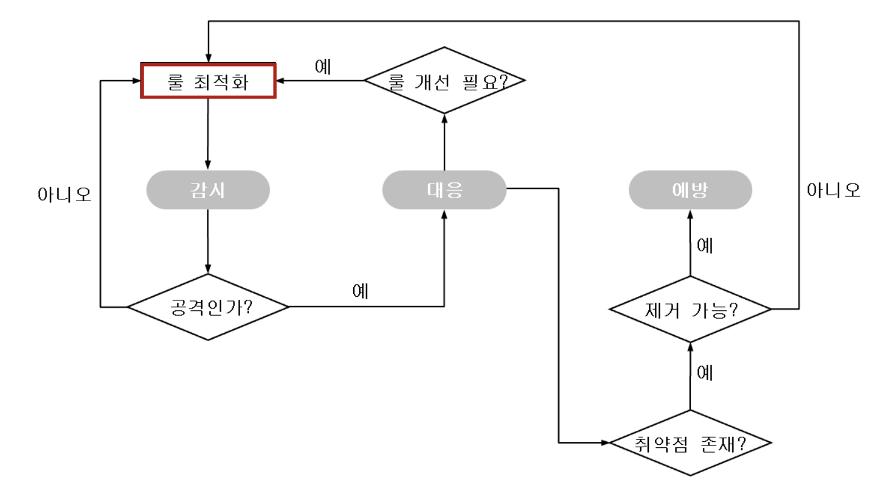
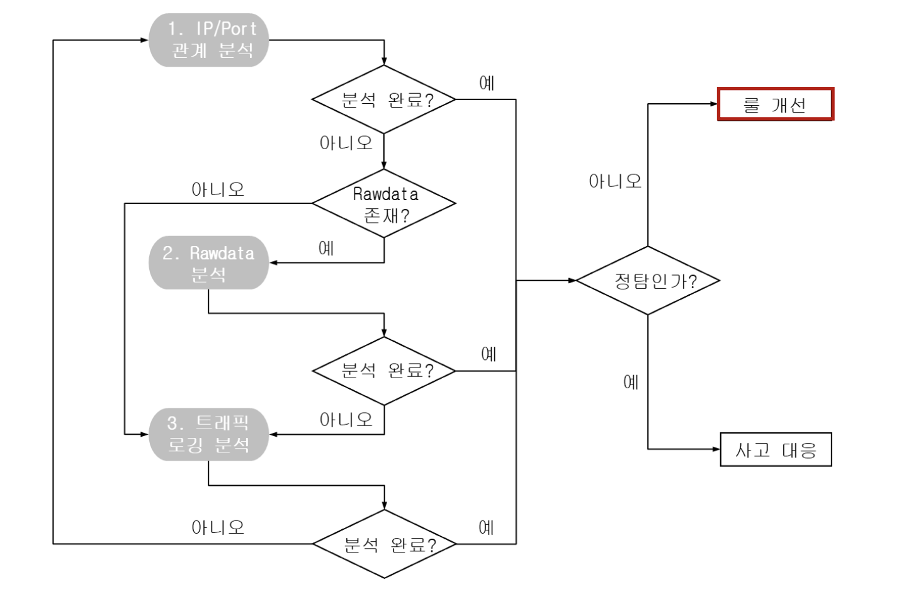
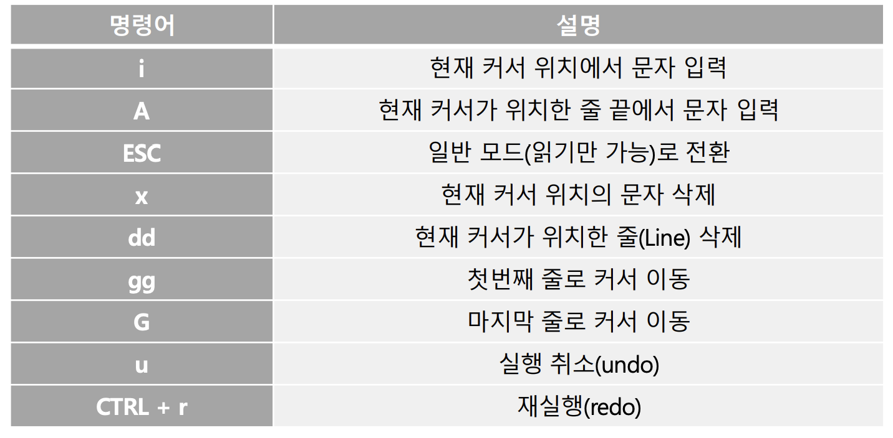
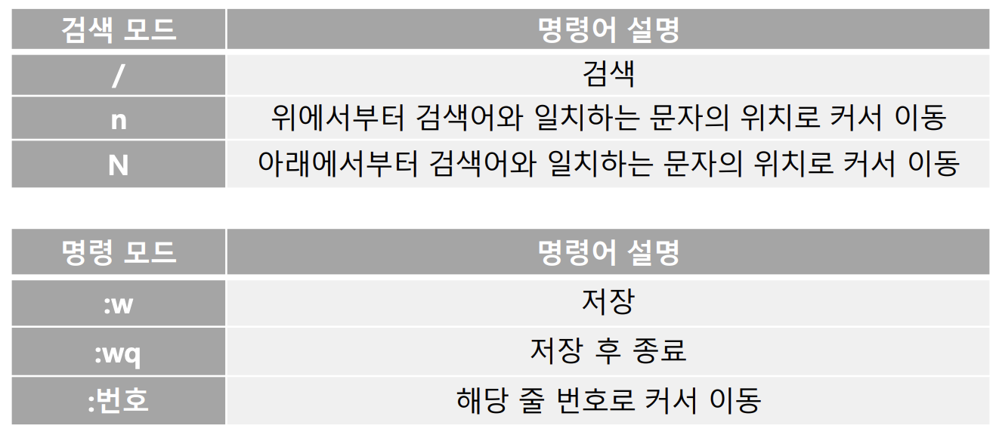

## 선수학습
* vim 학습: https://kangmyounghun.blogspot.com/2016/07/vim.html
* sql 학습: https://latter2005.tistory.com/category/%EC%8A%A4%ED%84%B0%EB%94%94/SQL
* 윈도우 어드민 활성화: https://wikidocs.net/228225
* 리눅스 기초: https://www.youtube.com/watch?v=6DTjiS1zVOM

# 네트워크 보안
* 방법론
  * 패턴매칭
  * 이상징후 분석
* 두가지 방법론으로 데이터 분석

### 파리미터
* URL: 경로 + 파일 까지
  * Uniform Resource Locator
* URI: 쿼리 파라미터까지 포함
  * Uniform Resource Identifier
* 해커들은 예상치 못한 파라미터를 전달해서 원하는 결과를 얻어냄

## 방화벽
* 체크포인트 Firewall-1 -> 1994년에 최초로 만들어짐
* ip와 port 기반으로 동작
  * 허용 정책에 포함되지 않은 모든 ip,port 차단

## IDS
* ip port 상위 개념의 접근제어 필요성 대두
  * 80포트는 열고 있어야 하니깐..
* 대표적으로 snort
  * 어플리케이션 레이어의 데이터 패턴을 검사

## 패턴매칭
* 사람 -> 주고 받는 패턴으로 상호관계 파악 가능
  * 컴퓨터도 마찬가지

## 침입탐지 모델 (IDS)

* 원조: An Intrusion Detection Model(1986년, Dorothy Denning)
* 패턴 매칭 (오용행위 분석)
  * 정해진 패턴을 갖는 공격만 막음
  * black list -> IDS, IPS
* 이상 징후 (비정상행위 분석)
  * 정상 패턴만 허용한다 -> whitelist
    * 정상 범위를 정의하기 어려움
  * whitelist -> 우리꺼 말고는 deny all
  * 방화벽, 웹 방화벽
* 즉, 패턴매칭 -> 비정상만 제어 -> black list
  * 이상 징후 분석 -> 정상만 허용 -> white list
* 오용탐지인 패턴매칭 중심으로 발전
  * 이상징후는 패턴매칭을 보조하는 수단으로 주로 사용

## 패턴매칭 장점
* 쉬움 -> 개발 용이, 패턴 찾는 것도 쉬움
* 검사 범위 좁힐 수 있음

## 패턴매칭 기술 발전
* IDS -> 탐지만
* IPS -> 차단 기술 추가
* WAF -> 웹 특화

## 오탐 문제 대두
* 가트너 -> IDS 못쓰겠다
  * false positive, false negative가 문제라 함
  * false positive 오탐
  * false negative 미탐
* 로그도 너무 많이 발생함
  * 24시간 보안관제 해야함.. 넘모 힘듦..

## 오탐 로그가 왜이리 많이 발생?
* 타겟을 제대로 정하지 않아서
* 트래픽에 문자열 패턴이 너무 많아서..
  * 낚시성 기사 제목 문자열 -> 기사를 들어가봐서 직접 확인해봐야 -> 수고가 너무많음
  * 우연히 문자열 패턴만 일치하는 것들이 너무 많다
* 네트워크 보안 실무(2004년, 미국)
  * 잘 만들어지지 않은 IDS 시그니처 때문에 대량 경보가 발생해서 오탐이 발생

## 오탐 해법
* rule 업데이트 열심히 해라
* rule을 네트워크 환경과 트래픽에 커스터마이징해라
  * 처음에는 rule을 러프하게 설정하는 경향이 있음 -> 웬만한 것들은 다 잡힘
  * 탐지가 안잡히면 고객이 클레임 거니까 러프하게 잡음 ㅎㅎ

## 보안관제 업무 프로세스
* 룰로 시작해서 룰로 끝나는 보안관제
  
* 보안장비 관점 (IDPS)
  
  * 1단계: 아이피 포트
  * 2단계: 단방향 데이터 분석 (rawdata 분석?)
  * 3단계: 양방향 데이터 분석 -> 트래픽 로깅 분석

### virtualbox
* root
* no1ids

### snort
* 스노트 설정 가이드: https://snort.org/#documents
* 실행파일: /usr/sbin/snort
* 설정파일: /etc/snort/snort.conf
* 룰파일: /etc/snort/rules/local.rules

## vim 사용설명
* `uu` -> 실행취소
* `ctrl + r` -> 재실행
* `/` -> 검색
* `:` -> 줄 이동
* `gg` -> 처음으로 커서 이동
* `GG` -> 끝으로 커서 이동



### snort.conf
1. checksum_node   
   `none`(145)   
오류 검증 체크섬(CRC) 값 체크 안함 -> 오류나도 패킷 버리지 않음
2. dynamicrule 주석처리
3. preprocessor에 `whitelist`, `blacklist` 주석 처리   
`\` -> 줄바꿈 무효처리, whitelist는 앞에 `,`부터 주석처리해야 먹힘
4. `unified2` 옵션 변경   
  탐지로그랑 패킷데이터를 하나로 합치는 것   
  저장 파일 이름 변경 -> `output unified2: filename alert.log, limit 128`
5. 룰 설정   
  `$RULE_PATH/local.rules` 빼고 다 주석처리    
  `548,651norm i#` -> 548에서 651라인 주석처리
6. 룰과 sid 파일

### snort 실행 유형
* `whereis snort`   
snort 설정 파일, 스노트 파일 위치 알려줌   
* `-i` 옵션   
snort 타겟 네트워크    

경고/패킷 데이터 분리   
  1. IP 헤더 수준 기록   
  `snort -i eth0 -c /etc/snort/snort.conf -A fast`
  1. 프로토콜 헤더 수준 기록   
  `snort -i eth0 -c /etc/snort/snort.conf -A full`
  1. 출발지별 프로토콜 헤더 수준 기록   
  `snort -i eth0 -c /etc/snort/snort.conf -K ascii`   

경고/패킷 데이터 통합      
1. unified2 설정   
`snort -i eth0 -c /etc/snort/snort.conf`

## snort rule 샘플
* 거의 대부분의 ids, ips 제품은 snort rule은 지원함
  ```
  alert icmp any any -> any any (msg:"ping-request"; itype:8; sid:1000000; rev:1;)
  alert icmp any any -> any any (msg:"ping-response"; itype:0; sid:1000001; rev:1;)
  alert tcp any any -> any 80 (msg:"web-request"; content:"GET /"; sid:1000002; rev:1;)
  alert tcp any any -> any any (msg:"web-response"; content:"HTTP/"; sid:1000003; rev:1;)
  ```
* vim의 입력모드 상태에서 복붙하기
* `rev` -> rule의 버전정보
* `sid` -> rule의 시리얼 넘버

## snort 실행하기
* `snort -i eth1 -c /etc/snort/snort.conf`   
  -c 뒤에는 설정파일
* win -> linux 핑 때리기   
  `ping 192.168.56.100`
* `ls /var/log/snort`   
  * `alert` -> 탐지 로그
  * `snort.log.번호` -> 패킷 데이터
  * 리눅스 로그 -> 보통 `/var/log`에 위치

## mysql 설치
1. yum 저장소 확인   
  `ls/etc/yum.repos.d` 
2. mysql 실행 상태 확인   
   `service mysqld status` 
3. 정책 바꾸기 전 mysql 실행   
 `service mysqld start`
4. mysql 패스워드 정책 변경
    ``` shell
      echo >> /etc/my.cnf
      echo "default_password_lifetime=0" >> /etc/my.cnf
      echo "validate_password.policy=LOW" >> /etc/my.cnf
      echo "validate_password.length=6" >> /etc/my.cnf
      echo "validate_password.special_char_count=0" >> /etc/my.cnf
      echo "validate_password.mixed_case_count=0" >> /etc/my.cnf
      echo "validate_password.number_count=0" >> /etc/my.cnf
      echo "skip_external_locking" >> /etc/my.cnf
      echo "skip_name_resolve " >> /etc/my.cnf
    ```
5. mysql 로그 확인   
  `vi var/log/mysqld.log` 
6. 패스워드 로그 확인   
  `grep password /var/log/mysqld.log`
7. 패스워드 정보만 떠오기   
  `grep "temporary password is generated" /var/log/mysqld.log | grep -oP "\S+$"` 
8. 임시 패스워드를 `no1ids`로 변경   
  `mysql --connect-expired-password -uroot -p -e "alter user 'root'@'localhost' identified with mysql_native_password by 'no1ids';"`   
   -> putty 에서는 드래그로 블럭만 만들면 복사됨
9.  원격 접속 아이디 만들기   
  `mysql -uroot -p -e "create user 'root'@'%' identified by 'no1ids';"`
10. 비번 주기   
  `mysql -uroot -p -e "alter user 'root'@'%' identified with mysql_native_password by 'no1ids';"`
11. 권한 주기   
  `mysql -uroot -p -e "grant all privileges on *.* to 'root'@'%' with grant option;"`