## barnyard2 설치
barnyard2 -> snort가 로그를 만들면 mysql에 로그를 입력해주는 툴

barnyard2 다운로드 `wget https://github.com/firnsy/barnyard2/archive/master.tar.gz -O barnyard2.tar.gz`

압축 풀기 `tar xvzf barnyard2.tar.gz`

`cd barnyard2-master`

`sed -i 's/my_bool/bool/' src/output-plugins/spo_database.h`   
* 모든 my_bool 문자열을 bool로 변경
* sed는 파일 스트림으로 텍스트 파일을 수정하는 명령어

설정 명령어 실행 `./autogen.sh`
* `echo $PATH` 에 지정되어 있지 않아서 `./` 을 추가해줘야 실행 가능

소스 컴파일 `./configure --with-mysql --with-mysql-libraries=/usr/lib64/mysql && make && make install`

`mkdir /var/log/barnyard2`

`touch /var/log/snort/barnyard2.waldo`

`cp /usr/local/etc/barnyard2.conf /etc/snort/`

`mysql -u root -p -e "create database snort";`

`mysql -u root -p -D snort < schemas/create_mysql`


### barnyard2 설정 관계도
* 실행파일 -> barnyard2 설정파일 가리킴
* barnyard2 설정파일 -> sid 설정파일 <-> 룰 설정파일
* `/etc/snort/sid-msg.map` 이게 있어야 rule sid를 제대로 읽어감
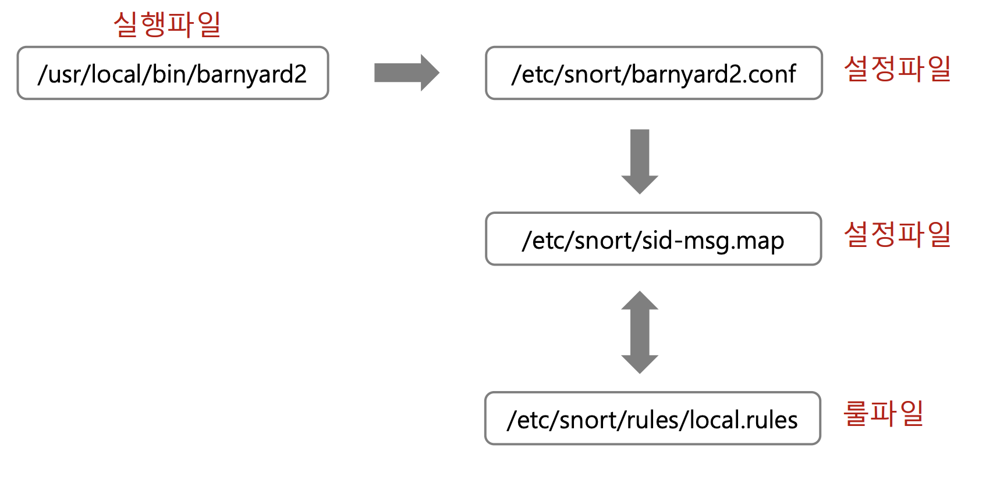

### snort 주요 경로
* `etc/snort` snort 주요 설정파일
* `etc/snort/rules` snort 룰 파일 경로
* `/var/log/snort` snort 로그 경로
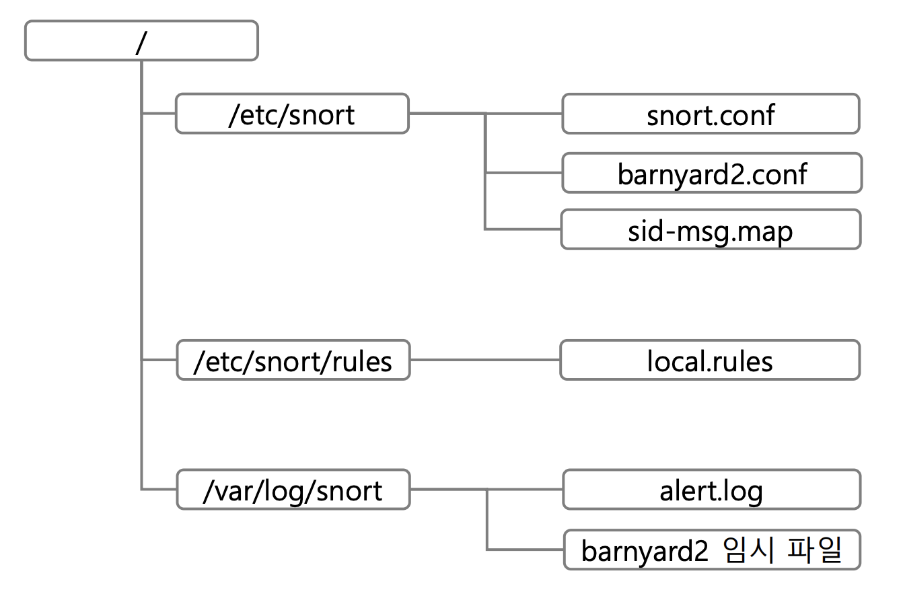

### SNORT 스택
* 전처리기: 분석을 편하게 해주는 작업
* 병렬 패턴매칭
  * rule들을 기반으로 일종의 패턴 그물을 만들어서 트래픽을 한 번 훑어서 거기에 걸리는 애들만 룰 패턴매칭
  * Aho-Corasick 알고리즘을 이용, 룰 패턴매칭과 함께 2차 검증 가능
* 룰 패턴매칭: 병렬 패턴매칭에서 걸려진 애들만 패턴매칭
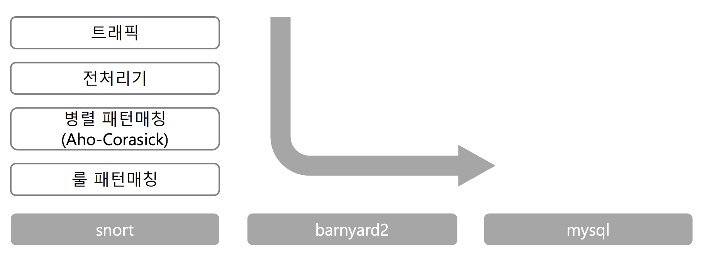

## barnyard 실행
* rule파일과 map파일이 매칭되어야 실행 가능
* `barnyard2 –c 설정파일 –d snort 로그 경로 –f snort 로그 파일 –w 임시파일`
  * `-c` 설정 파일
  * `-d` 로그 경로
  * `-f` 로그 파일
  * `-w` 임시 파일
* snort 실행
  * `snort -i eth1 -c /etc/snort/snort.conf`
  * `-i`
  * `-r` 읽기모드

## barnyard2 설정

`vi /etc/snort/barnyard2.conf`에서 password, dbname 변경

## SNORT 스키마
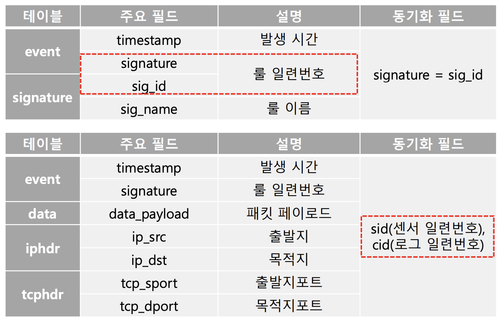
`event`
  * 로그 발생 시간
  * 주요필드: timestamp, signature(룰 일련번호)   

`signature`
  * 룰 이름
  * 주요필드: sig_id, sig_name

`data`
  * 패킷 데이터

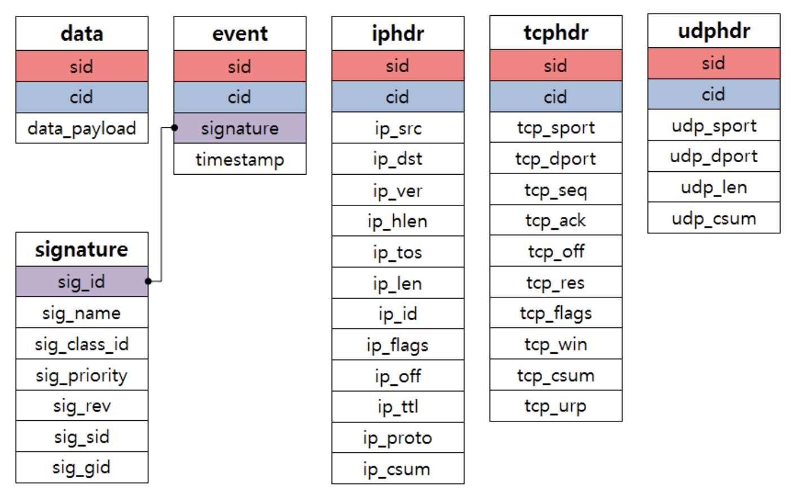
* 각 테이블의 sid, cid로 각 테이블을 동기화 할 수 있음
    ``` sql
      select a.timestamp, b.sig_name
      from event a, signature b
      where a.signature = b.sig_id
    ```
    * 두 테이블의 sig 필드로 조인해서 event 로그 출력

## snort 테이블 살펴보기
``` sql
    -- ip 테이블 정보 시간대별로 출력
    select inet_ntoa(ap.ip_dst), b.timestamp
    from iphdr a, event b
    where a.sid = b.sid = a.cid = b.cid
```
* `inet_ntoa(ip_src)`: 2진수 ip주소를 10진수로 변경해줌

``` sql
    -- 3개의 테이블을 조인해서 정보 출력
    select a.cid, a.timestamp, b.sig_name, inet_ntoa(c.ip_src), inet_ntoa(c.ip_dst), unhex(d.data_payload)
    from event a, signature b, iphdr c, data d
    where a.signature = b.sig_id
    and a.sid = c.sid and a.cid = c.cid
    and a.sid = d.sid and a.cid = d.cid
```
* `unhex()` 함수: 8진수 데이터를 보기좋게 출력

## snort rule

* `헤더`: 트래픽 발생 주체 및 방향 정의
* `옵션`: 트래픽 세부 특징 정의   
  
##### 룰 옵션
  1. 패킷 헤더를 검사하는 옵션
  2. 패킷 데이터(패이로드, 문자열 데이터)를 검사하는 옵션

## 패킷 헤더 검사 옵션
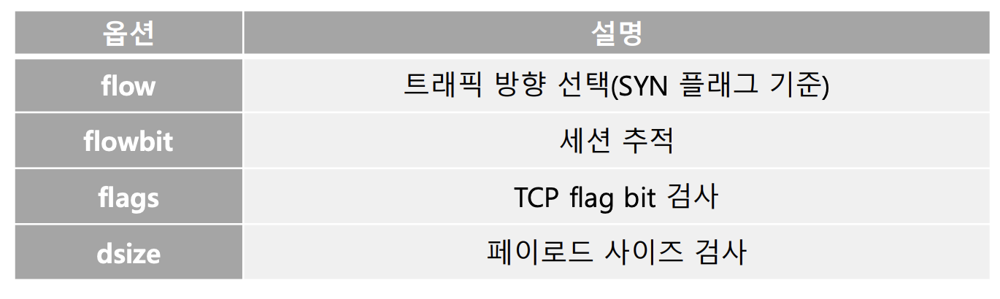
* 요즘에는 패킷 헤더 검사 옵션은 잘 안쓰임
  * 패킷 헤더가 이상하면 운영체제 단에서 걸러내버림
  * 헤더를 통한 공격은 옜날에 유행함
* payload 옵션과 같이 쓸 때에는 헤더 옵션을 먼저 쓰는게 성능에 유리

#### flow 옵션
* 트래픽 방향 구문
  * TCP SYN 플래그로 방향 구분
  * 클라이언트 -> 서버로 가는지 서버 -> 클라이언트로 가는지
* 예시: 나는 서버로 가는 트래픽만 보겠다
  * `alert tcp any any -> any any (flow:to_server;)`
  * 네트워크 구조가 단순할때만 가능
  * 서버가 복잡하면 서버가 내부에도 외부에도 있으니 안통함
    * 그래서 요즘 같은 환경에는 안통하는 옵션임

#### flowbit 옵션
* 세션을 추적하는 옵션
  * rule을 두개를 만들어야 사용 가능


#### flowbit예시: 두 트래픽에 각각 세션 이름 부여하기
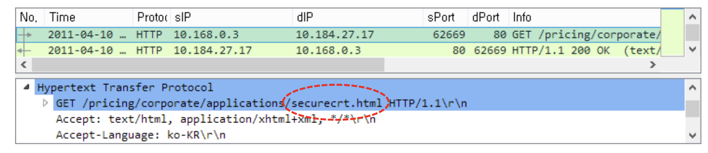
* `content:”securecrt.html”; flowbits:set,‘세션 이름’; flowbits:noalert;`
  * `securecrt.html`이 포함된 트래픽에 세션 이름을 부여하겠다는 것

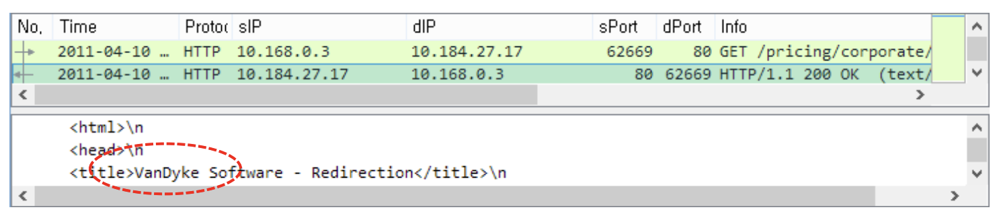
* `content:”VanDyke”; flowbits:isset, ‘세션 이름’;`
  * VanDyke가 포함된 것의 세션 이름 추가

#### flags 옵션
* tcp 패킷에 있는 플래그가 세트되었는지 검사
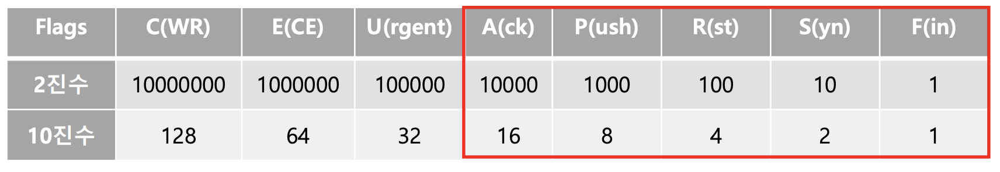
* 플래그 옵션을 앞에 두어 먼저 검사하는게 좋음
  * 좋은 예시 `flags:S; content:”aaa”;`
  * 나쁜 예시 `content:”aaa”; flags:S;`


#### PA 플래그를 설정하면 나쁘다?
* PUSH, ACK가 같이 설정되어 있는 것
* `tcp.flags==24` -> PA 설정된 플래그만 필터
  * 주로 데이터가 포함되어 있음
  * **즉 PA 플래그는 데이터가 발생할 때 나타나는 플래그**
* **데이터가 발생할 때를 굳이 snort 옵션으로 줄 필요 없다!!**

### dsize
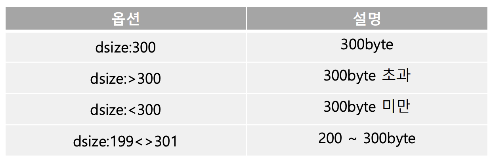
* payload(데이터 사이즈) 검사 옵션

### threshold
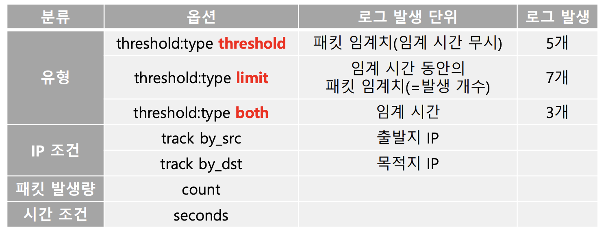
* 패킷 발생량 측정
  * 패킷 임계치를 설정
* alert icmp any any -> any any (msg:“threshold-test"; itype:8; threshold:type
threshold, track by_dst, count 2, seconds 3; sid:1000005; rev:1;)
* `track by_dst, count 2, seconds 3;`
  * 3초동안에 패킷이 2개가 발생하면 로그를 기록하겠다

### threshold 옵션 종류
1. threshold
5개 나옴 -> 패킷 단위로 로그를 찍어줌, 패킷 발생량이 가장 정확
2. limit
7개 나옴 -> 패킷 갯수만큼
1. both
3개 나옴 -> 임계치 무시하고 시간 간격으로만, 적게 발생시키는 경향

### threshold 테스트해보기
`etc/snort/rules/local.rules`에 추가   

`alert icmp any any -> any any (msg:“threshold-test"; itype:8; threshold:type
threshold, track by_dst, count 2, seconds 3; sid:1000005; rev:1;)`

snort 실행: 콘솔에 로그 출력 `snort -i eth1 -A console -c /etc/snort/snort.conf`

`ping -n 10 192.168.56.101`


## payload 검사 옵션
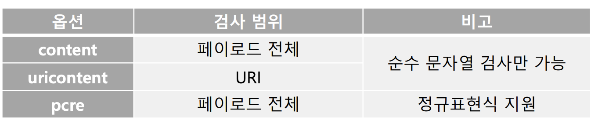
* 페이로드 전체 다 검사
  * content 옵션
    * 순수 문자만 검사
  * pcre 옵션
    * 정규 표현식 사용
* URI 구간만 검사
  * uricontent
    * 순수 문자만 검사
    * 웹 해킹시 사용
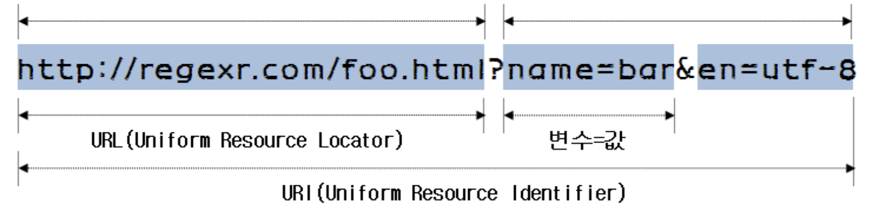

### Modifer (수정자)
content/uricontent 검사 방식, 범위 수정
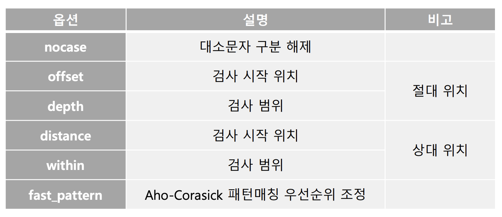
* nocase: 대소문자 구분 해제
* 절대경로
  * offset, depth
* 상대경로
  * distance
  * within

### 추가 수정자
웹 트래픽을 검사하는 옵션
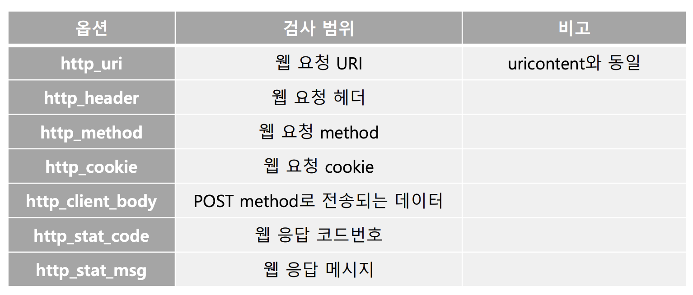

### payload 검사 룰 옵션
`content:“GET"; offset:0; depth:3; content:”rawdata”; distance:2; within:7;`
* 수정자 옵션이 없다고 하면
  * content는 데이터가 시작하는 위치부터 검사
  * GET 검사 -> 47 45 54 검사
  * rawdata 검사 -> 다시 처음으로 돌아감 47로
* 수정자 옵션
  * content: "GET"
    * offset:0 -> 처음 시작하는 위치에서 검사하라 (47)
    * depth:3 -> 처음 시작 위치에서 3바이트까지만 검사해라 (54 까지)
  * content: "rawdata"
    * distance:2 -> 현 위치 54에서 2바이트 건너 뛰어라 (72)
      * 상대경로 -> 이전 검사가 끝난 지점
    * within:7 -> 72에서 7바이트 건너 뛴 부분까지 검사해라

### PCRE 옵션
* perl compatible regular expressiong -> 정규표현식 사용 가능!
* 한 글자 알파벳 이름을 갖는 exe 파일 검사
  * 26개의 룰 필요
  * pcre사용하면 1개의 룰만 필요
    * pcre:”/[a-z]\.exe/”;

### PCRE 수정자
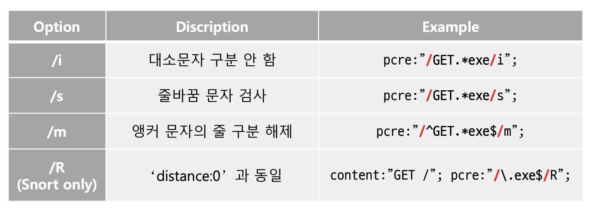
* /R -> snort에서만 사용

## 정규표현식
* 무한 조합의 문자열을 일정한 규칙을 표현
* transform.conf -> rule을 테이블로 모아둔 설정 파일
* 메타문자: 정규표현식의 자음과 모음
* 분류
  * 문자열 검사
    * 고정된 문자열 범위 검사
    * 가변범위 검사
    * 위치 기반 검사
  * 검사 방식 조절
    * 수정자
    * 수량자
* regex101 -> 정규표현식 테스트 사이트
  * https://regex101.com/
* regexper -> 정규표현식을 도식화 해줌
  * 

### 고정 문자열 범위 검사 메타문자
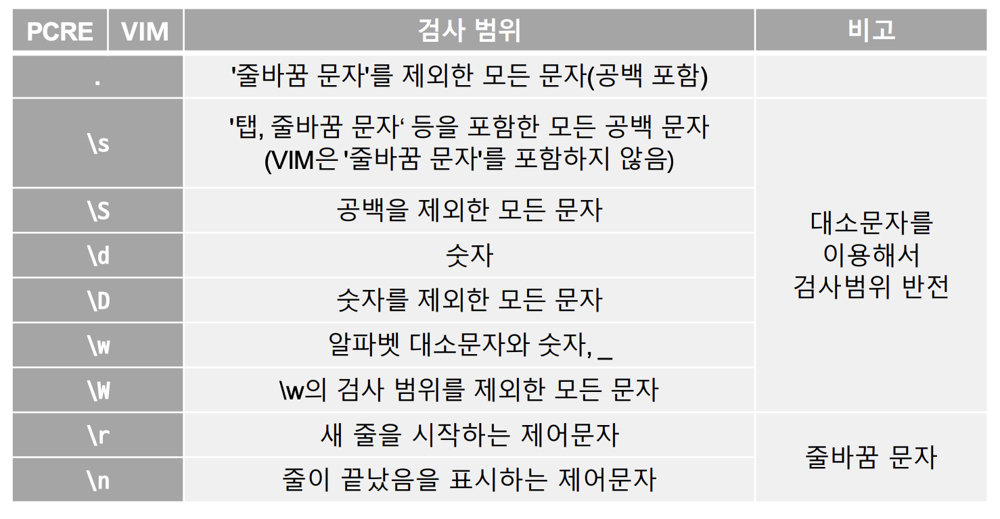
* https://regex101.com/r/c7B3tk/1 여기서 테스트해보기
* .
  * 모든 문자 검사 가능 (줄바꿈 문자 빼고)
    * 줄바꿈 문자: \r \n
    * 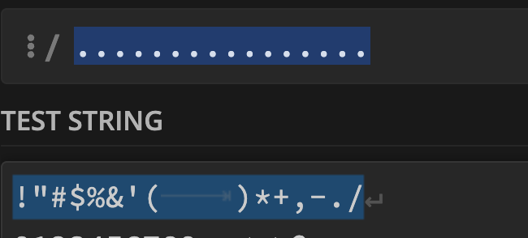
    * 이런식으로 고정 범위로 검사 가능
      * .을 더 치면 줄바꿈 문자 검사 못함
* \s
  * 모든 빈칸 문자 (탭, 줄바꿈 문자)를 검사 가능
  * /g 수정자 -> 검사 범위를 전체로 늘려줌
* \S
  * **\s 의 반대**
  * 공백을 제외한 모든 문자
* \w
  * 알파뱃 대소문자
  * \W -> \w를 제외한 전체
* \d
  * 숫자
  * \D -> \d를 제외한 전체

#### 줄바꿈 문자
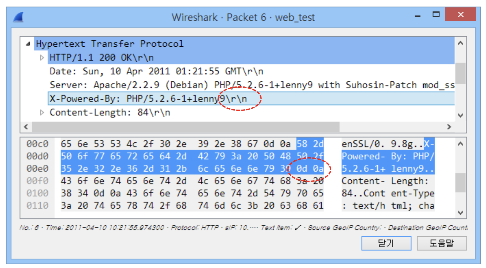
* LF -> 10 -> 0A
* CR -> 13 -> 0D
* 거의 모든 데이터에는 줄바꿈 문자 포함

## 가변적 문자열 범위 검사 메타문자
문자열 범위 지정 가능
#### 문자 클래스
  * []
    * [] 안에 나열된 문자 중 하나를 검사
  * [^]
    * [] 안에 나열된 문자를 제외한 모든 문자 검사
#### 캡쳐 그룹
* ()
  * 묶어서 검사
  * (abc) 하면 abc 다 검사됨
    * [] 하고 \g 쓴것과 같이
  * (abc)\1
    * abc 그룹을 한 번 더 검사하겠다
      * 첫번째 abc -> 캡처 그룹으로 저장
      * 두번째 abc -> 그룹을 불러와서 검사
      * 정규식의 역참조 기능
* (?:)
  * (?:abc)
  * 캡처 그룹으로 저장 안하겠다
  * 복잡해서 웬만해선 안씀.. 성능 문제가 있을때만 사용
* (?<이름>)
  * 캡처 그룹 번호 대신에 이름을 주겠다
  * 불러올때는 \k 사용
  * (?<test_name>abc)\k<test_name>
    * abc 그룹 저장 후 또 검사

#### |
or 연산자 (alternation)


## 검사 위치를 결정짓는 메타문자
#### anchor 문자
* ^
  * 시작 위치를 고정 -> 첫 번째 문자부터 검사
    * 첫 번째 줄에서만 동작
  * /^a.*/mg
    * /mg 모든 라인에대해서
    * /^a.* a로 시작하는 문자를 검사
* $
  * 끝나는 위치를 고정 -> 마지막 문자까지 검사
    * 마지막 줄에서만 동작
  * /.*a$/mg
    * a로 끝나는 모든 문자 검사
* 앵커문자는 많이 쓸 것이다

#### 전방탐색
검사 종료 위치 지정 (오른쪽)
* 긍정형
  * /z(?={)/gi
  * z로 끝나는 것을 찾고 싶음 근데 뒤에 {를 포함하기 싫다
* 부정형
  * /z(?!{)/gi
    * {를 포함하고 싶다

#### 후방탐색
검사 시작 위치 지정 (왼쪽)
* (?<=@)a
  * a로 시작하는걸 찾고싶다
  * 앞에 @를 제외하고
* /(?<!@)a/gi
  * 앞에 @를 포함한 a로 시작하는거 찾고 싶음

## 수량자 (Qualifier)
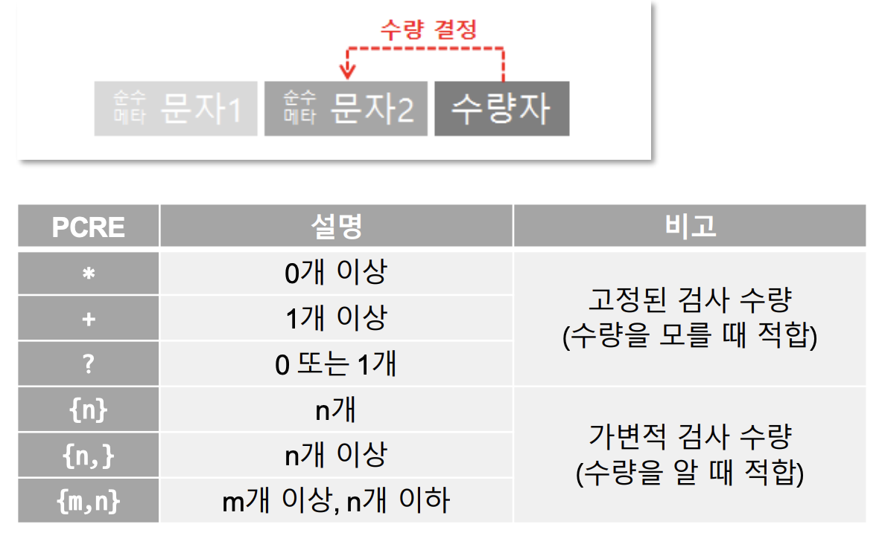
검사 수량을 결정하는 수량자, 여러개를 검사하고 싶을 때

### 고정된 검사 수량자
* \*
  * 0 개 이상
  * /.*/
    * 모든 문자 *를 최대검사 범위로(0개이상) 검사
    * 줄바꿈문자까지
  * /.*/s
    * /s 줄바꿈문자까지 포함 -> 모든 문자가 선택됨
* +
* ?

### 가변적 검사 수량자
* {n}
* {n,}
* {m,n}
  * .{0,1}
    * 모든문자(.) 0개이상 1개 이하
    * ?와 비슷

#### 검사 범위 최소로 제한하기
? 를 붙이면 검사 범위를 최소로 제한
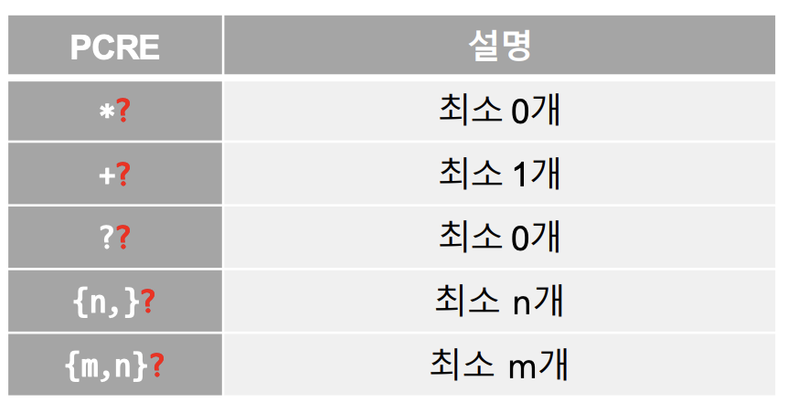
* /.+?/
  * +는 검사범위 1~여러개
  * ?를 붙이면 1개로 만들어줌
* /w.*?com/
* 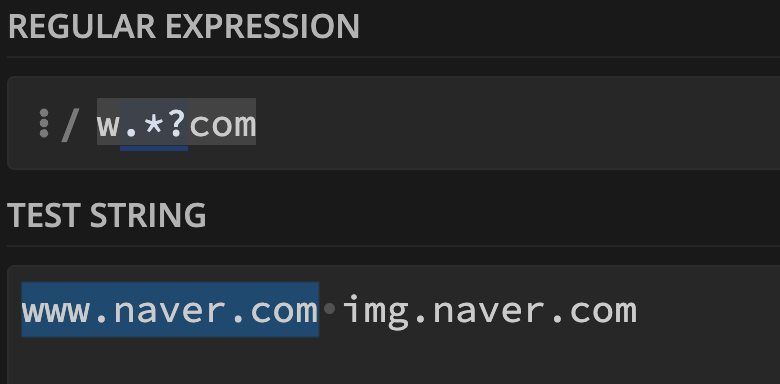
  * www.naver.com 만 검사하고 싶을 때 최소 수량자를 사용

## VIM 정규표현식
vim은 텍스트 우선
  * PCRE와 조금 다를 수도 있다
  * /.+
    * +를 수량자가 아닌 순수 문자열로 침
    * /.\+ 로 이스케이프를 해줘야 함
  * 매직 모드
    * \v
    * PCRE와 유사한 정규표현식 사용 가능
* 강력한 성능 제공
  * 일반 regex에서는 300000만 줄의 로그에 검색하면 timeout 에러가 남
  * vim 에서는 검색 가능
  
#### vim 매직모드 - 문자열 범위
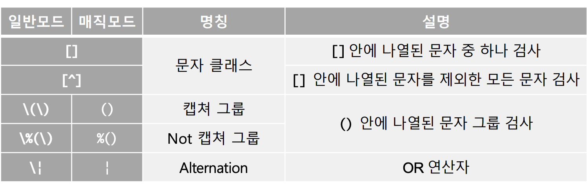
* 캡쳐 그룹은 조금 달라짐

#### vim 매직모드 - 검사 위치 지정
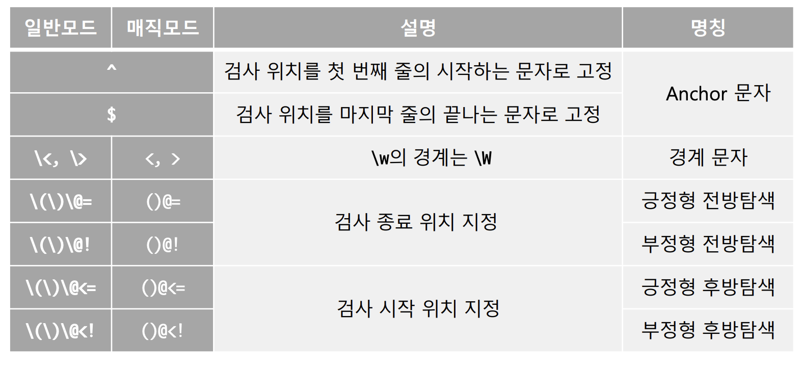

### 경계 문자
* PCRE
  * \b
    * 나와 성격이 다른 것을 경계로 만들어줌
    * 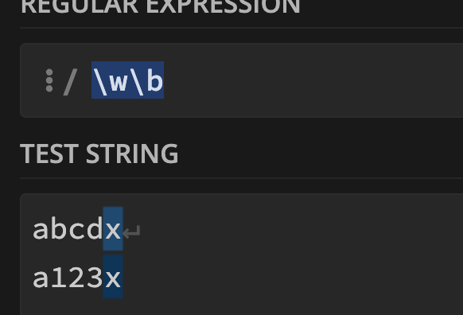
  * \B
    * 나와 성격이 같은 것을 경계로 삼아줌
    * 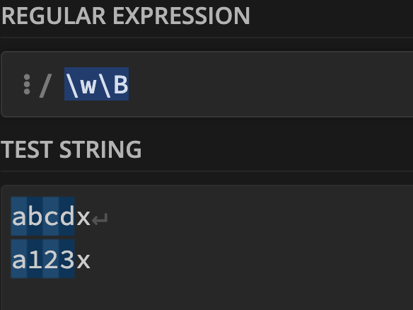
* VIM 매직 모드
  * <, > 이런식으로 함

#### vim 매직모드 - 수량자
최대 검사 모드
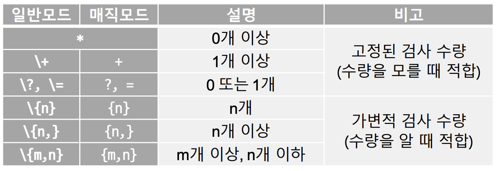
최소 검사 모드
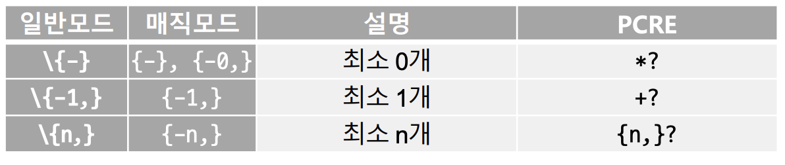
* 최소 모드를 - 만 입력해도 됨
* `/\v.*{-1,}`

#### vim 매직모드 - 수정자
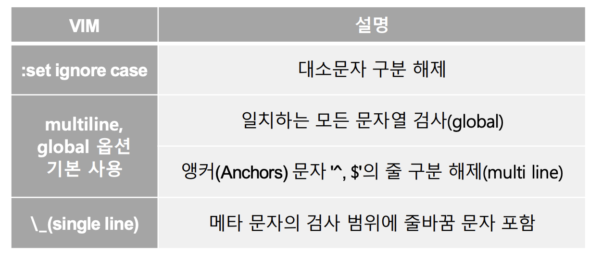
* :set ignore case
  * 설정파일로 대소문자 구분 해제 가능
* \_
  * 검사 범위에 줄바꿈 문자 포함

#### vim 예제
* `sk/log/elastic` 로그파일 vim으로 실행   
* `/\[\d+]` -> 대괄호 안에 문자를 검색, 선택   
* `g/sshd/d` ssh가 포함된 라인을 지워버리겠다, g -> 글로벌, d -> 지운다   
* `v/sshd/d` ssh가 포함되지 않은 라인을 지워라   

### vim 치환 기능
* `%s/치환 전 문자열/치환 후 문자열/`
  * %s -> 전체 라인에 대해 작업하곘다
* 치환 명령어 작업 순서
  1. 치환을 원하는 문자열 검사
  2. 검사 성공
  3. 치환 명령어 작성 및 실행

### vim 치환 예제

##### ssh를 TTT로 치환 
* `%s/sshd/TTT`   
   
##### 시간정보를 다른 정보와 구분하기
1. 시간정보 알아내기 `\v^.{24}`
* 공통된 길이값을 가짐 -> `{24}`
* 앞에 위치함 -> `^`
2. 치환 하기
* `:%s/\v^.{24}/ㅋ/`
  * 이렇게 하면 시간정보가 모두 ㅋ 으로 됨
* `:%s/\v^.{24}/&ㅋ/`
  *  이러면 시간 정보를 유지 하면서 ㅋ 이 뒤로 추가됨
* `:%s//&ㅋ/`
  * 이렇게 해도 실행됨
  * vim이 직전 사용했던 검색어 자동 반영 해주기 때문
  * 색이 있는 부분

## PCRE 검사 룰 옵션

* /i
  * 대소문자 구문 X
* /R
  * distance:0 과 동일
  * 시작 부분 정하는 것
* /s 
  * 줄바꿈 문자
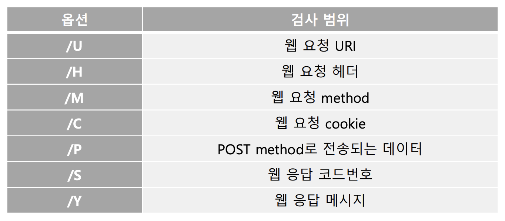
* web 트래픽을 위한 추가 수정자

## PCRE 검사 룰 옵션 예제
* 대소문자 구분 안함 `get.*/i`   
* 줄바꿈 문자 포함`get.*zip/is`   
* 앵커문자 포함 `get.*zip$/ism`   

### wireshark pcre
* wireshark에서도 pcre 검사 가능
* contains 옵션
  * 순수 문자열 검색
  * ` http contains "get" `
* matches 옵션
  * 정규표현식 사용 가능, 대소문자 구분 안함
  * ` http matches "(?s)get.*zip" `
    * `?s` 는 싱글라인 수정자 -> 줄 바꿈이 풀려서 결과가 더 많이 출력
  * ` http matches "(?sm)get.*zip$" `
    * `$` -> p로 끝나는 것 찾기
    * `?sm` -> 멀티 라인 수정자 추가
* fast_pattern 옵션
  * 패턴매칭 우선 순위 조정
  * `content:”bb”; fast_pattern; content:”aaa”;`
    * bb를 우선순위로 패턴매칭
      * bb로 aho_corasick 패턴 매칭 후, bb와 aaa를 순서대로 룰 패턴매칭 검사
* file_data 옵션
  * 문자열이 아닌 바이너리 파일로도 검사하게 해줌
    * 이진 파일 및 BASE64 인코딩
  * `http.file_data contains "MSIE 6.0"`
  * snort 룰로 만들면
    * alert tcp any any -> any any (msg:"file_data-test"; file_data; content:"MSIE
6.0"; sid:1000007; rev:1;)
* byte_test
  * 
  * 특정 위치의 바이트 크기 검사
  * 헤더가 아닌 데이터 부분 검사
  * alert tcp any any -> any any (msg:"byte_test-test"; content:"IDAT"; byte_test:4,>,400,-8,relative; sid:1000008; rev:1;)
    * 복잡함..
    * 악성코드를 탐지할 때 사용
      * 악성 코드의 특정 바이트를 고를 수 있다
* byte_jump
  * 특정 위치의 바이트를 건너 뛰겠다
  * 이거 역시 악성코드 검사할때 사용


#### byte_test 예제
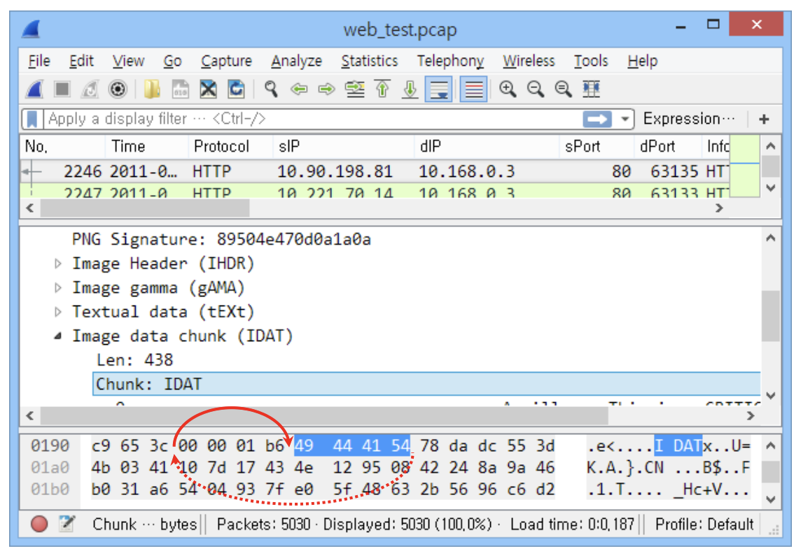
`content:”IDAT”; byte_test:4,>,400,-8,relative;`
1. IDAT 문자열 검사
2. relative -> 이전 검사가 끝난 지점 (54)
3. offset -> 8 -> 뒤로 8 바이트 이동
4. 거기서 4 바이트 이동해라 -> 49

### byte_jump
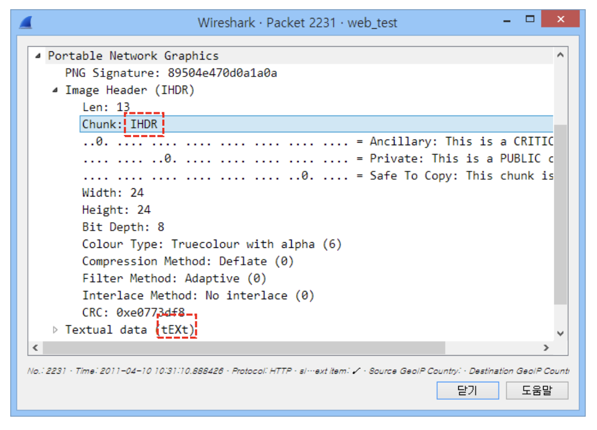
* content:”IHDR”; byte_jump:4,-8,relative; content:”tEXt”; distance:0;
  * `Chunk: IHDR` 이부분을 건너 뛰고 싶음 
  * relative: 이전 검사가 끝난 지점
  * -8 -> 8바이트 뒤로 가자
  * 거기서 4바이트 점프
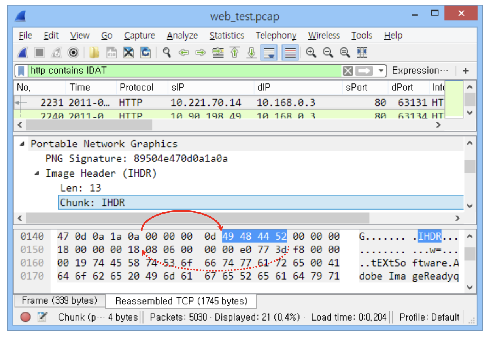
* `LEN: 13` 을 건너 뛰고 싶을 떄

### matches 안되던거 다시
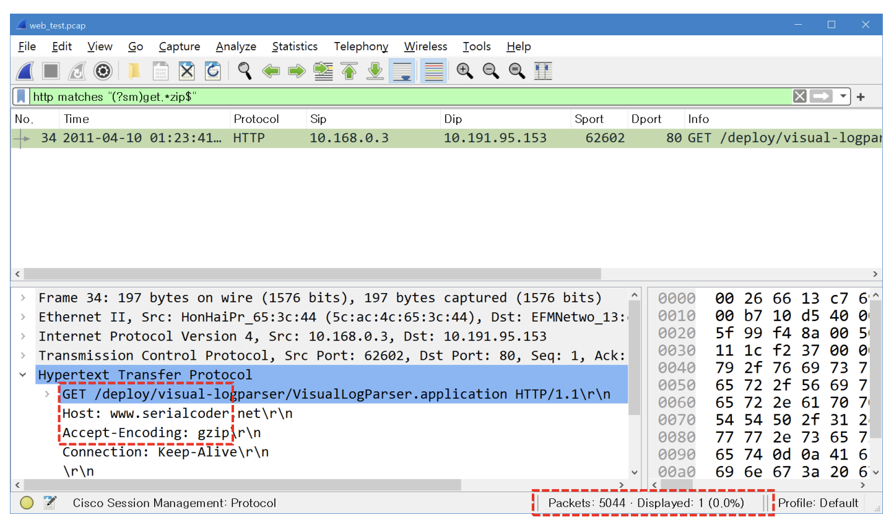
* m 멀티라인
`http matches "(?s)get.*zip$"`
* $ 마지막 라인
  * m 멀티라인 수정자를 추가해주면 검사가 됨!
* s 싱글라인
* 이렇게 구버전은 된다..
  * snort는 신버전이 아닌 이런 구버전의 기준으로 적용!!
* snort wireshark하고 다른점
  * 멀티라인
  * file_data

### 로그 엑셀로 옮기기
* vim -> 엑셀로 로그 복사
* ㅋ로 분리하기 가능

### 결론
* snort에선 content와 pcre 옵션이 많이 쓰인다
* 기본적으로 snort는 wireshark와 같이 트래픽을 수집하는 장치다
  * 둘이 유사한 기능들이 많다!
  * 그래서 급할때는 snort 말고 wireshark를 사용하도 됨
    * content -> contains 옵션
    * pcre -> matches 옵션